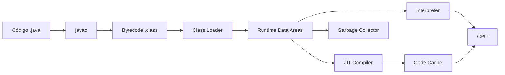
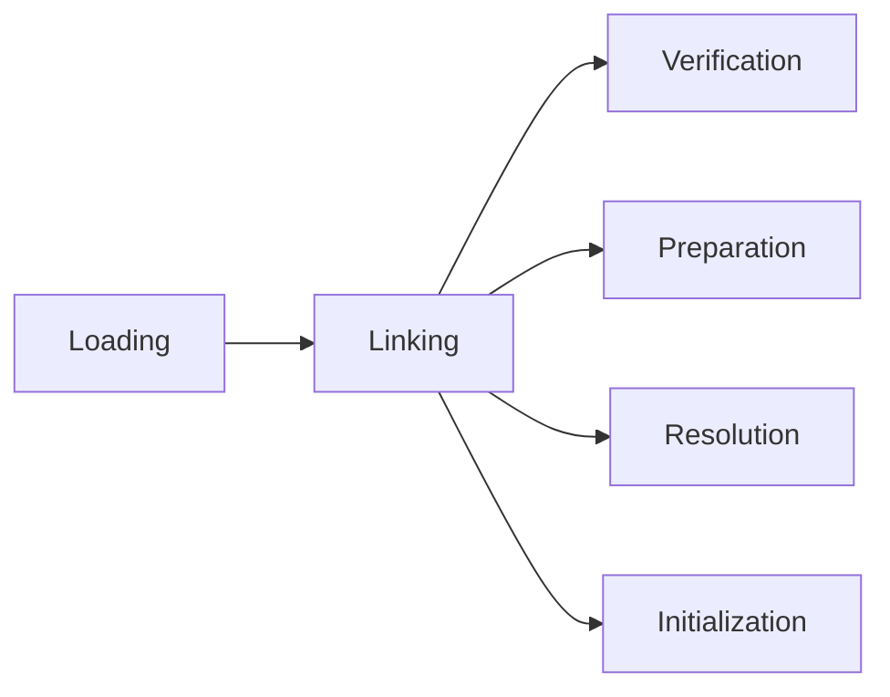
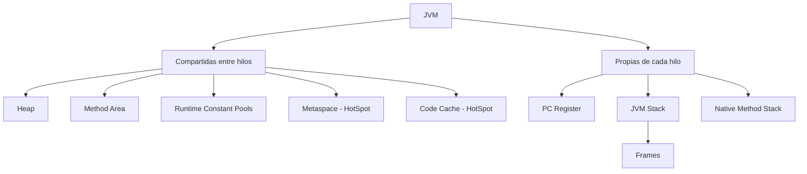

# Guía avanzada de Java

> **JVM, administración de memoria, referencias, Garbage Collection, lambdas, Streams, concurrencia, Project Loom, herencia y polimorfismo**

Esta guía reúne y organiza los temas desarrollados durante la conversación en un solo material de estudio. Está orientada a un desarrollador Java junior que busca comprender el lenguaje a profundidad, trabajar con Java moderno y prepararse para certificaciones de Oracle.

La intención no es memorizar APIs aisladas, sino construir un modelo mental que permita responder tres preguntas:

1. **¿Qué hace Java en compilación?**
2. **¿Qué hace la JVM durante la ejecución?**
3. **¿Qué abstracción conviene utilizar para cada problema?**

---

## Contenido

1. [Ruta de estudio recomendada](#1-ruta-de-estudio-recomendada)
2. [Arquitectura de la JVM](#2-arquitectura-de-la-jvm)
3. [Fundamentos del lenguaje](#3-fundamentos-del-lenguaje)
4. [Programación Orientada a Objetos](#4-programación-orientada-a-objetos)
5. [Clases, clases abstractas e interfaces](#5-clases-clases-abstractas-e-interfaces)
6. [Sobrecarga, sobrescritura y despacho dinámico](#6-sobrecarga-sobrescritura-y-despacho-dinámico)
7. [Inicialización, constructores y herencia](#7-inicialización-constructores-y-herencia)
8. [Principios y patrones de diseño](#8-principios-y-patrones-de-diseño)
9. [Tipos de referencias y `java.lang.ref`](#9-tipos-de-referencias-y-javalangref)
10. [Garbage Collection](#10-garbage-collection)
11. [Lambdas e interfaces funcionales](#11-lambdas-e-interfaces-funcionales)
12. [Streams](#12-streams)
13. [Java 21–26 y Project Loom](#13-java-2126-y-project-loom)
14. [Concurrencia y paralelismo](#14-concurrencia-y-paralelismo)
15. [Preguntas difíciles de certificación](#15-preguntas-difíciles-de-certificación)
16. [Herramientas de diagnóstico y práctica](#16-herramientas-de-diagnóstico-y-práctica)
17. [Fuentes oficiales](#17-fuentes-oficiales)

---

# 1. Ruta de estudio recomendada

Una secuencia útil para estudiar estos temas es:

```text
1. Fundamentos del lenguaje: tipos, variables y buenas prácticas
2. Programación orientada a objetos: pilares y encapsulamiento
3. Clases, objetos y referencias
4. Herencia, interfaces y polimorfismo
5. Sobrecarga, sobrescritura y resolución de métodos
6. Principios y patrones de diseño
7. Bytecode y arquitectura de la JVM
8. Heap, stack, frames y Garbage Collection
9. Lambdas e interfaces funcionales
10. Streams y Collectors
11. Java Memory Model
12. Hilos, sincronización y java.util.concurrent
13. Virtual threads, Scoped Values y Structured Concurrency
14. Diagnóstico con javap, jcmd, JFR y heap dumps
15. Preguntas de certificación y ejercicios prácticos
```

La idea central que conecta toda la guía es esta:

```text
Código fuente
    ↓ javac
Bytecode
    ↓ Class Loader
Clases cargadas
    ↓ Execution Engine
Código interpretado/JIT
    ↓
CPU + memoria + hilos + GC
```

---

# 2. Arquitectura de la JVM

## 2.1 JVM, JRE y JDK

| Concepto | Contiene | Propósito |
|---|---|---|
| **JVM** | Motor de ejecución, áreas de memoria, GC, JIT | Ejecutar bytecode Java |
| **JRE** | JVM + bibliotecas de ejecución | Ejecutar aplicaciones Java |
| **JDK** | JRE + compilador y herramientas | Desarrollar, compilar, diagnosticar y ejecutar |

En distribuciones modernas no siempre se entrega un JRE separado, pero la separación conceptual sigue siendo útil.

## 2.2 Flujo de compilación y ejecución



`javac` transforma el código fuente en **bytecode**, un conjunto de instrucciones independientes de una CPU concreta. La JVM correspondiente a cada plataforma interpreta o compila esas instrucciones a código nativo.

## 2.3 Especificación frente a implementación

Es importante distinguir:

- La **Java Virtual Machine Specification** define el comportamiento requerido.
- **HotSpot** es una implementación concreta de la JVM utilizada por OpenJDK.
- Otras implementaciones pueden organizar internamente la memoria de manera diferente mientras respeten la especificación.

Conceptos como **heap**, **JVM stacks**, **frames**, **PC registers**, **method area** y **runtime constant pools** pertenecen al modelo de la especificación. Conceptos como **Metaspace**, **Code Cache**, **TLAB**, C1/C2 y los detalles de G1 o ZGC corresponden principalmente a HotSpot.

---

## 2.4 Subsistema de carga de clases

El Class Loader Subsystem localiza, valida, enlaza e inicializa clases.



### Loading

La JVM:

- localiza el archivo `.class`;
- valida su estructura básica;
- crea la representación interna de la clase;
- crea el objeto `java.lang.Class` correspondiente.

```java
Class<?> type = Class.forName("com.example.User");
```

### Verification

Comprueba que el bytecode:

- use instrucciones válidas;
- mantenga tipos compatibles;
- no corrompa el operand stack;
- respete accesos y jerarquías;
- no realice saltos ilegales;
- inicialice correctamente los objetos.

La verificación es una razón clave por la que la JVM puede ejecutar bytecode generado por compiladores, proxies o frameworks sin confiar ciegamente en él.

### Preparation

Reserva memoria para campos estáticos y asigna sus valores predeterminados.

```java
class Configuration {
    static int port = 8080;
}
```

Durante preparation, conceptualmente `port` comienza en `0`. La asignación `8080` se ejecuta en initialization.

### Resolution

Convierte referencias simbólicas del constant pool en referencias utilizables por la JVM.

```text
java/io/PrintStream.println:(Ljava/lang/String;)V
```

La JVM debe determinar la clase, firma, accesibilidad y destino real de la invocación.

### Initialization

Ejecuta el inicializador de clase, representado internamente como `<clinit>`.

```java
class Configuration {
    static int port = loadPort();

    static {
        System.out.println("Inicializando Configuration");
    }

    private static int loadPort() {
        return 8080;
    }
}
```

---

## 2.5 Jerarquía de Class Loaders

### Bootstrap Class Loader

Carga clases fundamentales como:

```text
java.lang.Object
java.lang.String
java.lang.Thread
java.util.List
```

```java
System.out.println(String.class.getClassLoader()); // null
```

`null` representa al Bootstrap Class Loader en esta API.

### Platform Class Loader

Carga módulos y clases de la plataforma que no pertenecen al conjunto mínimo del bootstrap.

### Application Class Loader

Carga las clases de la aplicación desde classpath, módulos, directorios y JAR.

```java
System.out.println(MyApplication.class.getClassLoader());
```

### Class Loaders personalizados

Se utilizan en:

- sistemas de plugins;
- servidores de aplicaciones;
- IDE;
- hot reload;
- agentes e instrumentación;
- lenguajes sobre la JVM.

Una clase se identifica conceptualmente por:

```text
nombre binario + ClassLoader que la definió
```

Dos cargadores diferentes pueden cargar dos clases con el mismo nombre y la JVM las considerará tipos distintos.

---

## 2.6 Áreas de datos en tiempo de ejecución



---

## 2.7 Heap

El heap almacena normalmente:

- instancias de objetos;
- arreglos;
- campos de instancia como parte de sus objetos;
- objetos `String`;
- colecciones;
- objetos generados por frameworks.

```java
User user = new User("Ana");
int[] numbers = new int[1_000];
```

Modelo conceptual:

```text
Stack del hilo                 Heap
┌──────────────┐              ┌────────────────────┐
│ user ────────┼─────────────►│ User("Ana")        │
│ numbers ─────┼─────────────►│ int[1000]          │
└──────────────┘              └────────────────────┘
```

La variable local contiene una referencia; el objeto reside normalmente en el heap.

### Importancia

El heap influye en:

- consumo de memoria;
- frecuencia y duración del GC;
- throughput;
- latencia;
- riesgo de `OutOfMemoryError`;
- escalabilidad.

---

## 2.8 Generaciones del heap

La división generacional es una estrategia de GC, no una obligación universal de la especificación.

Se basa en la hipótesis:

> La mayoría de los objetos muere poco después de crearse.

```text
Young Generation
├── Eden
├── Survivor S0
└── Survivor S1

Old/Tenured Generation
```

### Eden

Lugar donde se asignan la mayoría de los objetos nuevos.

### Survivor spaces

Conservan objetos que sobrevivieron a una colección joven. En recolectores clásicos, los objetos pueden copiarse alternadamente entre S0 y S1.

### Old Generation

Contiene objetos con vida prolongada, objetos promovidos y estructuras que permanecen alcanzables durante mucho tiempo.

Ejemplos:

- cachés;
- singletons;
- sesiones largas;
- objetos retenidos por campos estáticos;
- grafos persistentes en memoria.

---

## 2.9 TLAB

HotSpot utiliza **Thread-Local Allocation Buffers** para acelerar asignaciones.

```text
Eden
├── TLAB hilo 1
├── TLAB hilo 2
├── TLAB hilo 3
└── espacio restante
```

Cada hilo puede asignar objetos pequeños avanzando un puntero en su TLAB, sin competir continuamente con otros hilos.

Conclusión práctica:

> Crear un objeto pequeño en Java suele ser una operación muy barata. El coste aparece cuando se generan demasiados objetos vivos, existe una tasa de asignación extrema o el GC debe trabajar constantemente.

---

## 2.10 String Pool

El pool mantiene cadenas internadas.

```java
String a = "Java";
String b = "Java";

System.out.println(a == b);      // true normalmente
System.out.println(a.equals(b)); // true
```

```java
String c = new String("Java");

System.out.println(a == c);      // false
System.out.println(a.equals(c)); // true
System.out.println(a == c.intern()); // true
```

En HotSpot moderno, los objetos del pool son administrados dentro del heap. No debe imaginarse necesariamente como una memoria física independiente.

### Regla de certificación

```text
== compara referencias
.equals() compara contenido según la implementación
```

---

## 2.11 JVM Stack y frames

Cada hilo tiene su propio stack. Cada llamada a un método crea un frame.

```java
public static void main(String[] args) {
    calculate();
}

static void calculate() {
    int result = add(2, 3);
}

static int add(int a, int b) {
    return a + b;
}
```

```text
Stack
┌──────────────────────────┐
│ frame add                │
│ a = 2, b = 3             │
├──────────────────────────┤
│ frame calculate          │
│ result                   │
├──────────────────────────┤
│ frame main               │
│ args                     │
└──────────────────────────┘
```

Un frame contiene principalmente:

1. **Local Variable Array**
2. **Operand Stack**
3. Referencia al **Runtime Constant Pool**
4. Información de retorno y manejo de excepciones

### Local Variable Array

Almacena:

- parámetros;
- variables locales primitivas;
- referencias;
- `this` en métodos de instancia.

### Operand Stack

La JVM es principalmente una máquina basada en una pila de operandos.

Para:

```java
int result = a + b;
```

el bytecode conceptual es:

```text
load a
load b
iadd
store result
```

### StackOverflowError

```java
static void recurse() {
    recurse();
}
```

Produce `StackOverflowError` porque crea frames hasta agotar el stack.

El tamaño de stack de platform threads puede configurarse:

```bash
java -Xss1m MyApplication
```

---

## 2.12 PC Register

Cada hilo posee un Program Counter lógico que identifica la instrucción actual o la posición necesaria para continuar.

```text
Hilo A → instrucción 145
Hilo B → instrucción 720
```

Es fundamental para el cambio de contexto entre hilos.

---

## 2.13 Native Method Stack

Da soporte a código nativo utilizado mediante JNI u otros mecanismos internos.

```java
public native void nativeOperation();
```

El código nativo puede provocar problemas que Java puro normalmente evita:

- accesos inválidos a memoria;
- crash del proceso;
- fugas nativas;
- incompatibilidad de plataforma.

---

## 2.14 Method Area y Metaspace

El **Method Area** es un concepto de la especificación que contiene información por clase:

- estructura de tipos;
- métodos;
- campos;
- bytecode;
- runtime constant pools;
- información necesaria para invocaciones.

HotSpot implementa gran parte de este almacenamiento mediante **Metaspace**, ubicado en memoria nativa.

Metaspace almacena principalmente metadatos, no instancias:

```text
Metaspace                         Heap
User.class metadata              new User(...)
Order.class metadata             new Order(...)
Métodos, campos, jerarquía       Colecciones e instancias
```

Error asociado:

```text
java.lang.OutOfMemoryError: Metaspace
```

Causas habituales:

- generación descontrolada de clases/proxies;
- class loader leaks;
- múltiples redespliegues;
- plugins que no se descargan;
- bytecode dinámico sin límites.

---

## 2.15 Class Loader leaks

Una clase se descarga cuando su ClassLoader y las clases que definió dejan de ser alcanzables.

```text
static cache
    ↓
objeto de plugin
    ↓
Class
    ↓
PluginClassLoader
```

Una referencia estática puede conservar el loader, sus clases y el Metaspace asociado.

---

## 2.16 Constant Pool y Runtime Constant Pool

Cada `.class` contiene una tabla con:

- nombres de clases;
- nombres y descriptores de métodos;
- referencias a campos;
- literales;
- method handles;
- `invokedynamic`;
- constantes dinámicas.

Puedes inspeccionarla:

```bash
javap -c -v MyClass.class
```

Al cargar la clase, la JVM crea su representación de ejecución: el **Runtime Constant Pool**.

---

## 2.17 Code Cache

HotSpot almacena en memoria nativa el código máquina generado por el JIT.

```text
Bytecode
   ↓ JIT
Código nativo x86-64 / ARM64
   ↓
Code Cache
```

Diagnóstico:

```bash
jcmd <pid> Compiler.codecache
```

---

## 2.18 Execution Engine

Incluye:

- intérprete;
- compiladores JIT;
- profiler;
- deoptimizer;
- runtime nativo;
- Garbage Collector.

### Intérprete

Ejecuta bytecode instrucción por instrucción. Permite inicio rápido y recopila perfiles reales.

### JIT Compiler

Compila métodos frecuentes a código nativo.

```text
Primera ejecución → Interpreter
Método se calienta → JIT
Ejecuciones futuras → código nativo optimizado
```

#### C1

Prioriza compilación rápida y buen startup.

#### C2

Realiza optimizaciones más agresivas:

- inlining;
- escape analysis;
- scalar replacement;
- eliminación de código muerto;
- propagación de constantes;
- desvirtualización especulativa;
- optimización de loops;
- vectorización.

#### Tiered Compilation

```text
Interpretado
   ↓
C1 con profiling
   ↓
C1 optimizado
   ↓
C2 altamente optimizado
```

### Inlining

```java
static int doubleValue(int value) {
    return value * 2;
}
```

Puede transformarse conceptualmente en el cuerpo insertado en el llamador, eliminando el coste de invocación y habilitando optimizaciones adicionales.

### Escape analysis

```java
static int calculate() {
    Point p = new Point(10, 20);
    return p.x() + p.y();
}
```

Si el objeto no escapa, el JIT puede eliminar la asignación o reemplazarla por valores escalares. No debe asumirse que todo objeto pasa literalmente al stack.

### Deoptimization

La JVM puede optimizar con suposiciones basadas en perfiles. Si una suposición deja de cumplirse, invalida código compilado, reconstruye el estado y regresa temporalmente al intérprete antes de recompilar.

---

## 2.19 Memoria nativa y off-heap

El consumo total del proceso no es solo `-Xmx`.

```text
Proceso JVM
├── Heap
├── Metaspace
├── Code Cache
├── stacks de platform threads
├── estructuras del GC
├── direct buffers
├── JIT
├── bibliotecas nativas
└── otros recursos
```

```java
ByteBuffer buffer = ByteBuffer.allocateDirect(1024 * 1024);
```

Los direct buffers almacenan contenido fuera del heap y son útiles para NIO, pero pueden producir agotamiento de memoria nativa aunque el heap parezca saludable.

```bash
-XX:MaxDirectMemorySize=1g
```

---

# 3. Fundamentos del lenguaje

## 3.1 Tipos primitivos

Java distingue entre **tipos primitivos** y **tipos de referencia**. Los primitivos almacenan directamente su valor, no un objeto.

| Tipo | Tamaño | Rango / valores | Valor por defecto |
|---|---|---|---|
| `byte` | 8 bits | -128 a 127 | `0` |
| `short` | 16 bits | -32 768 a 32 767 | `0` |
| `int` | 32 bits | -2 147 483 648 a 2 147 483 647 | `0` |
| `long` | 64 bits | -9 223 372 036 854 775 808 a 9 223 372 036 854 775 807 | `0L` |
| `float` | 32 bits (IEEE 754) | ~±3.4×10³⁸, 6-7 dígitos decimales de precisión | `0.0f` |
| `double` | 64 bits (IEEE 754) | ~±1.8×10³⁰⁸, 15-16 dígitos decimales de precisión | `0.0d` |
| `char` | 16 bits | `0` a `65535` (una unidad UTF-16) | `'\u0000'` |
| `boolean` | no definido por la JVM | `true` / `false` | `false` |

```java
int million = 1_000_000;
long bigNumber = 3_000_000_000L;
double price = 19.99;
char letter = 'A';
```

Los valores por defecto de la tabla solo aplican a **campos** (de instancia o estáticos). Una variable local debe asignarse explícitamente antes de usarse; el compilador rechaza el uso de una variable local no inicializada.

### Overflow silencioso

```java
int maximum = Integer.MAX_VALUE;
int overflowed = maximum + 1; // -2147483648, sin excepción
```

La aritmética con tipos primitivos no lanza excepción al desbordarse; simplemente da la vuelta (complemento a dos). Para detectar overflow explícitamente:

```java
int safe = Math.addExact(maximum, 1); // lanza ArithmeticException
```

---

## 3.2 Tipos de referencia y autoboxing

Todo lo que no es un primitivo es un tipo de referencia: clases, interfaces, arrays y las clases envolventes (*wrapper*) de cada primitivo.

| Primitivo | Wrapper |
|---|---|
| `byte` | `Byte` |
| `short` | `Short` |
| `int` | `Integer` |
| `long` | `Long` |
| `float` | `Float` |
| `double` | `Double` |
| `char` | `Character` |
| `boolean` | `Boolean` |

El compilador convierte automáticamente entre primitivo y wrapper (*autoboxing* / *unboxing*):

```java
Integer boxed = 10;       // autoboxing: Integer.valueOf(10)
int primitive = boxed;    // unboxing: boxed.intValue()
```

### El caché de Integer

```java
Integer a = 127;
Integer b = 127;
System.out.println(a == b); // true: ambos provienen del caché

Integer c = 200;
Integer d = 200;
System.out.println(c == d); // false: fuera del rango cacheado (-128 a 127)
```

`Integer.valueOf` reutiliza instancias para el rango -128 a 127. Comparar wrappers con `==` fuera de ese rango compara referencias, no valores. Usa siempre `.equals()` para comparar el valor de dos wrappers.

---

## 3.3 Variables, ámbito y convenciones de nombramiento

| Elemento | Convención | Ejemplo |
|---|---|---|
| Clase / interfaz / record / enum | `PascalCase` | `OrderService`, `Comparable` |
| Método / variable / parámetro | `camelCase` | `calculateTotal`, `orderCount` |
| Constante (`static final`) | `UPPER_SNAKE_CASE` | `MAX_RETRIES` |
| Paquete | minúsculas, dominio invertido | `com.example.orders` |
| Parámetro de tipo genérico | una letra mayúscula | `T`, `E`, `K`, `V`, `R` |

Recomendaciones:

- nombres descriptivos en vez de abreviaturas (`customer` mejor que `cust`);
- métodos que devuelven `boolean` como preguntas: `isValid()`, `hasPermission()`;
- evita nombres de una sola letra salvo en bucles cortos o genéricos;
- una variable local vive solo dentro de su bloque; una variable declarada en un bloque interno puede ocultar (*shadow*) un campo con el mismo nombre, lo que suele ser confuso y conviene evitar.

```java
public class OrderService {
    private static final int MAX_RETRIES = 3;

    public boolean isEligibleForDiscount(int orderCount) {
        return orderCount >= MAX_RETRIES;
    }
}
```

---

## 3.4 Constantes y números mágicos

```java
// Evitar
if (status == 3) {
    // ...
}

// Preferir
private static final int STATUS_SHIPPED = 3;

if (status == STATUS_SHIPPED) {
    // ...
}
```

Un número o cadena repetido sin nombre (*número mágico*) obliga a quien lee el código a recordar su significado. Una constante con nombre documenta la intención y centraliza el cambio si el valor varía.

---

## 3.5 Operadores

| Categoría | Operadores |
|---|---|
| Aritméticos | `+ - * / %` |
| Relacionales | `== != > < >= <=` |
| Lógicos (cortocircuito) | `&& \|\|` |
| Lógicos (sin cortocircuito) | `& \|` |
| Bit a bit | `& \| ^ ~ << >> >>>` |
| Ternario | `condición ? a : b` |
| Asignación compuesta | `+= -= *= /= %=` |

`&&` y `||` evalúan el segundo operando solo si es necesario; `&` y `|` aplicados a `boolean` siempre evalúan ambos lados, lo que puede usarse deliberadamente para forzar la evaluación de un efecto secundario, aunque suele ser más claro evitarlo.

```java
boolean result = isValid(user) && hasPermission(user);
```

Si `isValid(user)` es `false`, `hasPermission(user)` no se evalúa.

---

## 3.6 Estructuras de control

```java
if (age >= 18) {
    // ...
} else if (age >= 13) {
    // ...
} else {
    // ...
}
```

### switch clásico

```java
switch (day) {
    case MONDAY:
    case TUESDAY:
        System.out.println("Inicio de semana");
        break;
    default:
        System.out.println("Otro día");
}
```

Sin `break`, la ejecución continúa al siguiente `case` (*fall-through*), una fuente habitual de errores.

### switch como expresión

```java
String category = switch (day) {
    case MONDAY, TUESDAY, WEDNESDAY, THURSDAY, FRIDAY -> "Laboral";
    case SATURDAY, SUNDAY -> "Fin de semana";
};
```

La forma con `->` no tiene fall-through y puede usarse como expresión que produce un valor.

### Bucles

```java
for (int i = 0; i < 10; i++) { /* ... */ }

for (Person person : people) { /* ... */ }

while (hasNext()) { /* ... */ }

do {
    // se ejecuta al menos una vez
} while (condition);
```

`break` y `continue` aceptan una etiqueta para afectar un bucle externo:

```java
outer:
for (int i = 0; i < rows; i++) {
    for (int j = 0; j < columns; j++) {
        if (matrix[i][j] == target) {
            break outer;
        }
    }
}
```

---

## 3.7 Arrays

```java
int[] numbers = new int[5];
int[] initialized = { 1, 2, 3 };
int[][] matrix = new int[3][3];
```

Un array tiene longitud fija desde su creación y se indexa desde `0`. Un array de referencias se inicializa con `null` en cada posición; un array de primitivos se inicializa con el valor por defecto del tipo (`0`, `false`, etc.).

```java
Arrays.sort(numbers);
Arrays.fill(numbers, 0);
boolean equal = Arrays.equals(a, b);
String text = Arrays.toString(numbers);
```

Un array multidimensional en Java es, en realidad, un array de arrays: cada fila puede tener una longitud distinta (*jagged array*).

---

## 3.8 Cadenas de texto

```java
String name = "Java";
```

`String` es inmutable: cualquier operación que "modifica" una cadena en realidad crea una nueva.

```java
String greeting = "Hola";
greeting.concat(" mundo"); // no modifica greeting
greeting = greeting.concat(" mundo"); // reasigna la referencia
```

Concatenar muchas cadenas en un bucle con `+` crea objetos intermedios innecesarios:

```java
StringBuilder builder = new StringBuilder();

for (String word : words) {
    builder.append(word).append(" ");
}

String sentence = builder.toString();
```

Desde Java 15, los *text blocks* permiten literales multilínea:

```java
String json = """
        {
          "name": "Java"
        }
        """;
```

La sección [Tipos de referencias y `java.lang.ref`](#9-tipos-de-referencias-y-javalangref) profundiza en cómo se gestiona el pool de cadenas internadas.

---

## 3.9 Inferencia de tipos con `var`

```java
var name = "Java";           // String
var count = 10;              // int
var people = new ArrayList<Person>(); // ArrayList<Person>
```

Reglas:

- solo aplica a variables locales, nunca a campos, parámetros o tipos de retorno;
- exige un inicializador en la misma sentencia;
- no puede usarse con `null` sin un cast, porque no habría tipo que inferir;
- no elimina el tipado estático: el tipo se fija en compilación, igual que si se hubiera escrito explícitamente.

`var` no puede inferir un tipo cuando el lado derecho no tiene uno propio, como ocurre con una lambda:

```java
var lambda = x -> x * 2; // no compila: no hay tipo objetivo
```

Usa `var` cuando el tipo ya es evidente por el lado derecho de la asignación; evítalo cuando oscurece qué tipo se está manejando.

---

## 3.10 Buenas prácticas básicas de estilo

- un método debe hacer una sola cosa y su nombre debe describirla con un verbo;
- prefiere métodos cortos: si no cabe en una pantalla, es candidato a dividirse;
- encapsula el estado: evita campos públicos mutables, expón comportamiento en vez de datos crudos;
- evita banderas booleanas negadas (`isNotValid`); es más fácil de leer `isValid` y negar en el punto de uso si hace falta;
- mantén un único nivel de abstracción por método: no mezcles detalles de bajo nivel con orquestación de alto nivel;
- un comentario debe explicar **por qué**, no **qué**; el código ya dice qué hace si los nombres son claros;
- indentación y formato consistentes en todo el proyecto (la convención más común en Java es 4 espacios).

```java
// Evitar
public class Order {
    public double total;
    public boolean f;
}

// Preferir
public class Order {
    private final double total;
    private final boolean fulfilled;

    public Order(double total, boolean fulfilled) {
        this.total = total;
        this.fulfilled = fulfilled;
    }

    public boolean isFulfilled() {
        return fulfilled;
    }
}
```

---

# 4. Programación Orientada a Objetos

## 4.1 Los cuatro pilares

Un objeto combina **estado** (campos) y **comportamiento** (métodos). La Programación Orientada a Objetos organiza un sistema alrededor de esa combinación mediante cuatro ideas centrales:

| Pilar | Idea | Dónde se profundiza en esta guía |
|---|---|---|
| Abstracción | Exponer solo lo esencial de un concepto y ocultar el detalle interno de cómo se resuelve | [Clases, clases abstractas e interfaces](#5-clases-clases-abstractas-e-interfaces) |
| Encapsulamiento | Proteger el estado interno detrás de una interfaz controlada | Esta misma sección |
| Herencia | Reutilizar y especializar comportamiento a partir de un tipo más general | [Inicialización, constructores y herencia](#7-inicialización-constructores-y-herencia) |
| Polimorfismo | Un mismo mensaje produce comportamiento distinto según el objeto real que lo recibe | [Sobrecarga, sobrescritura y despacho dinámico](#6-sobrecarga-sobrescritura-y-despacho-dinámico) |

Los cuatro pilares trabajando juntos, con el ejemplo de `Animal`/`Dog` que reaparece en el resto de la guía:

```java
abstract class Animal {                  // Abstracción: contrato común
    private final String name;           // Encapsulamiento: estado privado

    protected Animal(String name) {
        this.name = name;
    }

    public String getName() {            // acceso controlado al estado
        return name;
    }

    public abstract String makeSound();  // cada subtipo decide el detalle
}

class Dog extends Animal {               // Herencia: reutiliza Animal
    Dog(String name) {
        super(name);
    }

    @Override
    public String makeSound() {          // Polimorfismo: comportamiento propio
        return "Woof";
    }
}
```

```java
Animal animal = new Dog("Rex");
System.out.println(animal.makeSound()); // "Woof", decidido en ejecución
```

Ninguno de los cuatro pilares es exclusivo de Java: son conceptos de diseño que el lenguaje soporta con `class`, `abstract`, `extends`, `implements` y el despacho dinámico de métodos.

---

## 4.2 Encapsulamiento y modificadores de acceso

Encapsular significa que el estado de un objeto solo cambia a través de una interfaz controlada, nunca por acceso directo desde fuera.

| Modificador | Visible desde |
|---|---|
| `private` | Solo la propia clase |
| *(sin modificador)* — package-private | El mismo paquete |
| `protected` | El mismo paquete y las subclases en otros paquetes |
| `public` | Cualquier lugar |

```text
private < package-private < protected < public
```

```java
// Sin encapsulamiento: cualquier código puede dejar el saldo en un estado inválido
public class BankAccount {
    public double balance;
}

account.balance = -1_000_000; // nada lo impide
```

```java
// Con encapsulamiento: el único camino para modificar el saldo valida la operación
public class BankAccount {
    private double balance;

    public double getBalance() {
        return balance;
    }

    public void deposit(double amount) {
        if (amount <= 0) {
            throw new IllegalArgumentException("El monto debe ser positivo");
        }
        balance += amount;
    }
}
```

El valor del encapsulamiento no está en escribir `private` y generar getters/setters automáticamente para cada campo, sino en decidir qué operaciones son válidas y validarlas en un único punto de entrada. Un getter/setter que solo copia el valor sin ninguna regla no aporta más protección que un campo público; simplemente añade indirección.

Esta misma jerarquía de visibilidad (`private < package-private < protected < public`) reaparece como restricción formal al sobrescribir métodos en la sección de [sobrecarga y sobrescritura](#6-sobrecarga-sobrescritura-y-despacho-dinámico).

---

## 4.3 El contrato `equals` y `hashCode`

Por defecto, `Object.equals` compara referencias (equivalente a `==`) y `Object.hashCode` deriva del identity hash del objeto. Para que dos objetos distintos puedan considerarse "iguales" por su contenido, ambos métodos deben sobrescribirse **juntos** y de forma coherente.

### Reglas del contrato de `equals`

```text
Reflexivo:   x.equals(x) es true
Simétrico:   x.equals(y) == y.equals(x)
Transitivo:  si x.equals(y) y y.equals(z), entonces x.equals(z)
Consistente: llamadas repetidas devuelven el mismo resultado si nada cambió
x.equals(null) siempre es false
```

### Regla de `hashCode`

> Si dos objetos son iguales según `equals`, deben devolver el mismo `hashCode`. Lo inverso no es obligatorio: objetos distintos pueden compartir `hashCode` (colisión).

```java
public final class Point {
    private final int x;
    private final int y;

    public Point(int x, int y) {
        this.x = x;
        this.y = y;
    }

    @Override
    public boolean equals(Object other) {
        if (this == other) return true;
        if (!(other instanceof Point point)) return false;
        return x == point.x && y == point.y;
    }

    @Override
    public int hashCode() {
        return Objects.hash(x, y);
    }
}
```

Romper esta coherencia no es un error de compilación, pero corrompe silenciosamente cualquier `HashMap`, `HashSet` o operación de Stream que dependa de ella, como `distinct()`, que ya se mencionó que "usa `equals` y `hashCode`" al describirse en la sección de Streams.

### Una trampa clásica: sobrecargar en vez de sobrescribir

```java
public final class Point {
    // ...
    public boolean equals(Point other) { // sobrecarga, NO sobrescribe Object.equals
        return this.x == other.x && this.y == other.y;
    }
}
```

Esta firma no tiene `@Override` válido porque no coincide con `equals(Object)`. El compilador la trata como una sobrecarga adicional, no como una redefinición del método heredado de `Object`; una colección que invoque `equals(Object)` seguirá usando la comparación por referencia por defecto. Anotar siempre `@Override` sobre `equals(Object other)` hace que el compilador detecte este error.

Los [records](#5-clases-clases-abstractas-e-interfaces) generan automáticamente una implementación de `equals`/`hashCode` que sigue este mismo contrato a partir de sus componentes.

---

## 4.4 `toString`

```java
@Override
public String toString() {
    return "Point[x=" + x + ", y=" + y + "]";
}
```

Por defecto, `Object.toString()` devuelve `NombreDeClase@hash` en hexadecimal, poco útil para depuración o logs. Sobrescribirlo con una representación legible facilita el diagnóstico, algo especialmente valioso al inspeccionar objetos en logs, `System.out.println` o un depurador.

Evita incluir en `toString()` datos sensibles (contraseñas, tokens, números de tarjeta): cualquier framework de logging que serialice el objeto los expondría en texto plano.

---

# 5. Clases, clases abstractas e interfaces

## 5.1 Clase concreta

Puede:

- instanciarse;
- tener campos de instancia y estáticos;
- tener constructores;
- implementar comportamiento completo;
- extender una clase;
- implementar múltiples interfaces.

```java
public class Dog {
    private final String name;

    public Dog(String name) {
        this.name = name;
    }

    public void bark() {
        System.out.println(name + " is barking");
    }
}
```

```text
Clase concreta = estado + comportamiento + instanciación
```

---

## 5.2 Clase abstracta

No se instancia directamente y puede representar una implementación parcial.

```java
public abstract class Animal {
    private final String name;

    protected Animal(String name) {
        this.name = name;
    }

    public final String getName() {
        return name;
    }

    public void sleep() {
        System.out.println(name + " is sleeping");
    }

    public abstract void makeSound();
}
```

Una clase abstracta puede tener:

- constructores;
- estado por objeto;
- métodos concretos;
- métodos abstractos;
- métodos privados/protected/public;
- métodos estáticos;
- métodos finales;
- bloques de inicialización.

No está obligada a declarar métodos abstractos.

```java
abstract class Base {
    void execute() {
        System.out.println("Implementación completa");
    }
}
```

---

## 5.3 Interfaz

Representa un contrato o capacidad.

```java
public interface Flyable {
    void fly();
}
```

```java
public final class Bird implements Flyable {
    @Override
    public void fly() {
        System.out.println("Flying");
    }
}
```

Una interfaz moderna puede declarar:

- métodos abstractos;
- métodos `default`;
- métodos `static`;
- métodos `private`;
- campos constantes `public static final`;
- interfaces y tipos anidados.

No tiene constructores ni estado mutable por instancia.

---

## 5.4 Comparación

| Característica | Clase concreta | Clase abstracta | Interfaz |
|---|---:|---:|---:|
| Instanciable | Sí | No | No |
| Constructor | Sí | Sí | No |
| Estado de instancia | Sí | Sí | No |
| Métodos concretos | Sí | Sí | `default/static/private` |
| Métodos abstractos | Solo si se vuelve abstracta | Sí | Sí |
| Extiende clase | Una | Una | No |
| Implementa interfaces | Varias | Varias | Extiende varias interfaces |
| Campos | Cualquier campo válido | Cualquier campo válido | `public static final` |
| Uso | Objeto completo | Base común | Contrato/capacidad |

### Nemotecnia CACI

```text
C — Clase concreta: completa
A — Abstracta: implementación parcial
C — Contrato: interfaz
I — Interfaces: herencia múltiple de capacidades
```

---

## 5.5 Cómo elegir

Usa clase abstracta cuando:

- necesitas estado común;
- necesitas constructor común;
- compartes invariantes;
- requieres métodos `protected`;
- existe una jerarquía estrecha.

Usa interfaz cuando:

- defines una capacidad;
- las implementaciones pueden ser no relacionadas;
- necesitas múltiples contratos;
- buscas desacoplamiento;
- quieres una interfaz funcional.

```text
“es un tipo base con estado” → clase abstracta
“puede hacer algo”           → interfaz
“tiene un componente”        → composición
```

---

## 5.6 Métodos abstractos

```java
public abstract void execute();
```

No pueden ser:

- `private`: la subclase no podría implementarlo;
- `final`: exige y prohíbe overriding a la vez;
- `static`: no participa en despacho dinámico.

Una clase concreta debe implementar todos los métodos abstractos heredados o declararse abstracta.

---

## 5.7 Métodos de interfaz: ASPD

```text
A — Abstract: contrato público
S — Static: utilidad de la interfaz
P — Private: implementación interna
D — Default: implementación heredable
```

### Abstract

```java
interface Worker {
    void work(); // public abstract implícito
}
```

La implementación debe ser `public`:

```java
class Employee implements Worker {
    @Override
    public void work() {}
}
```

### Default

```java
interface Logger {
    default void log(String message) {
        System.out.println(message);
    }
}
```

Permite evolucionar una interfaz sin romper todas sus implementaciones.

### Static

```java
interface Validator {
    static boolean isValid(String value) {
        return value != null && !value.isBlank();
    }
}
```

Se invoca:

```java
Validator.isValid("Java");
```

No se hereda como método de instancia.

### Private

```java
interface Auditable {
    default void created() {
        log("created");
    }

    private void log(String event) {
        System.out.println(event);
    }
}
```

Reutiliza lógica interna entre `default`.

---

## 5.8 Campos de interfaz

```java
interface Configuration {
    int MAX_USERS = 100;
}
```

Equivale a:

```java
public static final int MAX_USERS = 100;
```

Deben inicializarse y pertenecen a la interfaz, no a cada objeto.

---

## 5.9 Herencia simple y múltiples interfaces

```java
class Dog extends Animal implements Runnable, Comparable<Dog> {
}
```

Una clase solo extiende una clase, pero implementa varias interfaces.

```java
interface SmartDevice
        extends Connectable, Rechargeable, Updatable {
}
```

Una interfaz puede extender varias interfaces.

---

## 5.10 Conflictos default

```java
interface A {
    default void execute() {
        System.out.println("A");
    }
}

interface B {
    default void execute() {
        System.out.println("B");
    }
}

class C implements A, B {
    @Override
    public void execute() {
        A.super.execute();
        B.super.execute();
    }
}
```

Reglas:

```text
1. Gana un método heredado de clase.
2. Gana la interfaz más específica.
3. Si persiste la ambigüedad, la clase resuelve.
```

Nemotecnia:

```text
Clase > Interfaz específica > Resolución manual
```

---

## 5.11 La clase gana

```java
class Parent {
    public void execute() {
        System.out.println("Parent");
    }
}

interface Worker {
    default void execute() {
        System.out.println("Worker");
    }
}

class Child extends Parent implements Worker {}
```

`new Child().execute()` imprime `Parent`.

---

## 5.12 Interfaz más específica

```java
interface A {
    default void execute() {
        System.out.println("A");
    }
}

interface B extends A {
    @Override
    default void execute() {
        System.out.println("B");
    }
}

class C implements A, B {}
```

Imprime `B`.

---

## 5.13 Composición frente a herencia

Herencia incorrecta:

```java
class Car extends Engine {}
```

Afirma que un automóvil **es** un motor.

Composición:

```java
class Car {
    private final Engine engine;

    Car(Engine engine) {
        this.engine = engine;
    }
}
```

Afirma que un automóvil **tiene** un motor.

Preferir composición permite:

- sustituir componentes;
- probar con mocks/fakes;
- evitar jerarquías frágiles;
- reducir acoplamiento.

---

## 5.14 Sealed classes

```java
public sealed interface Result
        permits Success, Failure {
}

public record Success(String value) implements Result {}
public record Failure(String message) implements Result {}
```

Una subclase permitida debe ser:

```text
final | sealed | non-sealed
```

Permiten jerarquías controladas y `switch` exhaustivo.

```java
static String describe(Result result) {
    return switch (result) {
        case Success success -> success.value();
        case Failure failure -> failure.message();
    };
}
```

---

## 5.15 Records

Un record:

- es final;
- extiende `java.lang.Record`;
- no puede extender otra clase;
- puede implementar interfaces;
- genera accessors, constructor, `equals`, `hashCode` y `toString`.

```java
record User(long id, String name)
        implements Comparable<User> {

    @Override
    public int compareTo(User other) {
        return name.compareTo(other.name);
    }
}
```

---

## 5.16 Clases anidadas

### Inner class

```java
class Outer {
    private int value = 10;

    class Inner {
        void print() {
            System.out.println(value);
        }
    }
}
```

```java
Outer outer = new Outer();
Outer.Inner inner = outer.new Inner();
```

Conserva referencia a la instancia externa.

### Static nested class

```java
class Outer {
    static class Nested {}
}
```

```java
Outer.Nested nested = new Outer.Nested();
```

No requiere instancia de `Outer`.

### Clase local

Declarada dentro de un método.

### Clase anónima

```java
Runnable task = new Runnable() {
    @Override
    public void run() {
        System.out.println("Running");
    }
};
```

Tiene su propio `this`, a diferencia de la lambda.

---

# 6. Sobrecarga, sobrescritura y despacho dinámico

## 6.1 Tipo de referencia y tipo real

```java
Animal animal = new Dog();
```

```text
Tipo declarado/referencia = Animal
Tipo real del objeto       = Dog
```

Regla central:

> El tipo de referencia determina qué miembros son accesibles en compilación. El tipo real determina qué implementación de un método de instancia sobrescrito se ejecuta.

---

## 6.2 Overriding

```java
class Animal {
    public void makeSound() {
        System.out.println("Generic");
    }
}

class Dog extends Animal {
    @Override
    public void makeSound() {
        System.out.println("Woof");
    }
}
```

```java
Animal animal = new Dog();
animal.makeSound(); // Woof
```

### Reglas

- mismo nombre;
- mismos parámetros;
- retorno igual o covariante;
- visibilidad igual o mayor;
- checked exceptions iguales o más específicas;
- no puede sobrescribir `private`, `static` o `final`.

---

## 6.3 Retorno covariante

```java
class AnimalFactory {
    Animal create() {
        return new Animal();
    }
}

class DogFactory extends AnimalFactory {
    @Override
    Dog create() {
        return new Dog();
    }
}
```

No aplica a cambiar `int` por `long`.

---

## 6.4 Visibilidad

Orden:

```text
private < package-private < protected < public
```

Al sobrescribir, puede mantenerse o ampliarse, nunca reducirse.

---

## 6.5 Excepciones

```java
class Parent {
    void execute() throws IOException {}
}
```

Válidos:

```java
void execute() {}
void execute() throws IOException {}
void execute() throws FileNotFoundException {}
```

Inválido:

```java
void execute() throws Exception {}
```

Las unchecked exceptions no tienen esta limitación.

---

## 6.6 Overloading

Mismo nombre, lista de parámetros diferente.

```java
void print(int value) {}
void print(long value) {}
void print(String value) {}
void print(int value, String label) {}
```

Se resuelve en compilación.

El retorno por sí solo no permite sobrecargar.

---

## 6.7 Preferencia de sobrecarga

Orden simplificado:

```text
1. Coincidencia exacta
2. Widening primitivo/referencia
3. Boxing/unboxing
4. Varargs
```

Nemotecnia:

```text
Exacto → Ensanchar → Empaquetar → Varargs
```

Ejemplo:

```java
void execute(long value) { System.out.println("long"); }
void execute(Integer value) { System.out.println("Integer"); }
void execute(int... value) { System.out.println("varargs"); }

execute(10); // long
```

`int → long` se prefiere a `int → Integer`.

---

## 6.8 Ambigüedad con null

```java
void process(String value) {}
void process(Integer value) {}

process(null); // ambiguo
```

Pero:

```java
void process(Object value) {}
void process(String value) {}

process(null); // String
```

Gana el tipo más específico si existe una relación jerárquica.

---

## 6.9 Dynamic dispatch

```java
Animal animal = new Dog();
animal.move();
```

Dos fases:

1. Compilación verifica que `Animal` tenga `move()`.
2. Ejecución selecciona `Dog.move()` si está sobrescrito.

Solo aplica a métodos de instancia sobrescribibles.

---

## 6.10 Campos no son polimórficos

```java
class Parent {
    String value = "Parent field";

    String value() {
        return "Parent method";
    }
}

class Child extends Parent {
    String value = "Child field";

    @Override
    String value() {
        return "Child method";
    }
}
```

```java
Parent reference = new Child();

System.out.println(reference.value);   // Parent field
System.out.println(reference.value()); // Child method
```

Nemotecnia:

```text
Variables miran la referencia.
Métodos sobrescritos miran el objeto.
```

Los campos se **ocultan**, no se sobrescriben.

---

## 6.11 Métodos estáticos

```java
class Parent {
    static void execute() {
        System.out.println("Parent");
    }
}

class Child extends Parent {
    static void execute() {
        System.out.println("Child");
    }
}
```

```java
Parent value = new Child();
value.execute(); // Parent
```

Es method hiding. Se resuelve por el tipo de referencia/clase.

Mejor escribir:

```java
Parent.execute();
Child.execute();
```

---

## 6.12 Métodos privados

No se heredan ni se sobrescriben.

```java
class Parent {
    private void execute() {
        System.out.println("Parent");
    }

    void run() {
        execute();
    }
}

class Child extends Parent {
    void execute() {
        System.out.println("Child");
    }
}
```

`new Child().run()` imprime `Parent`.

---

## 6.13 Métodos final

Un método `final` no puede sobrescribirse. Una clase `final` no puede extenderse.

Se utiliza para proteger invariantes y evitar modificación de comportamiento.

---

## 6.14 Overload primero, override después

```java
class Parent {
    void process(Animal animal) {
        System.out.println("Parent Animal");
    }
}

class Child extends Parent {
    @Override
    void process(Animal animal) {
        System.out.println("Child Animal");
    }

    void process(Dog dog) {
        System.out.println("Child Dog");
    }
}
```

```java
Parent processor = new Child();
Animal animal = new Dog();
processor.process(animal);
```

Resultado:

```text
Child Animal
```

Proceso:

1. El tipo `Parent` determina la firma visible `process(Animal)`.
2. El tipo del argumento es `Animal`.
3. En ejecución, el objeto `Child` sobrescribe esa firma.
4. `process(Dog)` nunca fue candidato en la resolución de overload.

Nemotecnia:

```text
Primero overload en compilación.
Después override en ejecución.
```

---

## 6.15 Tabla maestra de resolución

| Miembro | Selección | Momento |
|---|---|---|
| Método de instancia sobrescrito | Tipo real | Ejecución |
| Método sobrecargado | Tipos declarados | Compilación |
| Campo | Tipo de referencia | Compilación |
| Método static | Tipo de referencia/clase | Compilación |
| Método private | Clase declarante | Compilación |
| Constructor | Clase y firma | Compilación |
| `super.method()` | Padre inmediato | Compilación |
| Método default | Reglas de herencia | Compilación |

### ROMEO

```text
R — Referencia decide campos y static
O — Objeto decide métodos sobrescritos
M — Métodos overload se eligen en compilación
E — Exacto gana antes que conversiones
O — Override ocurre después del overload
```

---

# 7. Inicialización, constructores y herencia

## 7.1 Constructores

- no se heredan;
- no se sobrescriben;
- pueden sobrecargarse;
- llaman a `this(...)` o `super(...)` como primera instrucción.

```java
class Parent {
    Parent(int value) {}
}

class Child extends Parent {
    Child() {
        super(10);
    }
}
```

Si no se escribe, el compilador intenta insertar `super()`.

---

## 7.2 Orden de inicialización

```text
1. Campos/bloques static del padre
2. Campos/bloques static del hijo
3. Campos/bloques de instancia del padre
4. Constructor del padre
5. Campos/bloques de instancia del hijo
6. Constructor del hijo
```

La inicialización estática ocurre una vez por clase. La de instancia ocurre por objeto.

Nemotecnia:

```text
Estático padre → Estático hijo → Instancia padre → Constructor padre → Instancia hijo → Constructor hijo
```

---

## 7.3 Ejemplo

```java
class Parent {
    static { System.out.print("PS "); }
    { System.out.print("PI "); }
    Parent() { System.out.print("PC "); }
}

class Child extends Parent {
    static { System.out.print("CS "); }
    { System.out.print("CI "); }
    Child() { System.out.print("CC "); }
}
```

```java
new Child();
```

Resultado:

```text
PS CS PI PC CI CC
```

---

## 7.4 Peligro: método sobrescribible en constructor

```java
class Parent {
    Parent() {
        print();
    }

    void print() {
        System.out.println("Parent");
    }
}

class Child extends Parent {
    int value = 10;

    @Override
    void print() {
        System.out.println(value);
    }
}
```

`new Child()` imprime `0`, porque:

1. entra al constructor padre;
2. ocurre despacho dinámico hacia `Child.print()`;
3. el campo del hijo todavía no se inicializó;
4. conserva el valor predeterminado `0`.

Regla:

> No llames métodos sobrescribibles desde constructores.

---

## 7.5 this y super

`this` se refiere al objeto actual.

`super` selecciona explícitamente la parte del padre inmediato.

```java
@Override
void execute() {
    super.execute();
}
```

`super` no utiliza despacho polimórfico para elegir otra implementación.

---

## 7.6 Upcasting

```java
Dog dog = new Dog();
Animal animal = dog;
```

Es implícito y seguro. El objeto no cambia; cambia la visión estática.

---

## 7.7 Downcasting

```java
Animal animal = new Dog();
Dog dog = (Dog) animal;
```

Puede lanzar `ClassCastException` si el tipo real no es compatible.

```java
if (animal instanceof Dog dog) {
    dog.bark();
}
```

Pattern matching evita repetir el cast.

---

## 7.8 Arrays covariantes y genéricos invariantes

```java
Dog[] dogs = new Dog[10];
Animal[] animals = dogs;
animals[0] = new Cat(); // ArrayStoreException
```

Arrays son covariantes y el error puede llegar en ejecución.

```java
List<Dog> dogs = new ArrayList<>();
// List<Animal> animals = dogs; // no compila
```

Los genéricos son invariantes y evitan el problema en compilación.

---

## 7.9 PECS

```text
Producer Extends
Consumer Super
```

```java
List<? extends Animal> producer;
Animal animal = producer.get(0);
```

No se agregan `Dog` de forma segura porque la lista real podría ser `List<Cat>`.

```java
List<? super Dog> consumer = new ArrayList<Animal>();
consumer.add(new Dog());
```

Al leer de `? super Dog`, solo puede asumirse `Object`.

---

# 8. Principios y patrones de diseño

## 8.1 KISS

**Keep It Simple, Stupid.** Prefiere la solución más simple que resuelva el problema real.

```java
// Sobrediseñado para dos casos fijos
interface DiscountStrategy {
    double apply(double price);
}

class NoDiscount implements DiscountStrategy {
    public double apply(double price) { return price; }
}

class HalfDiscount implements DiscountStrategy {
    public double apply(double price) { return price / 2; }
}
```

```java
// Simple y suficiente si solo existen estos dos casos
double applyDiscount(double price, boolean isMember) {
    return isMember ? price / 2 : price;
}
```

Introduce una abstracción cuando el problema la justifica, no de forma anticipada. La sección [7.6](#86-patrones-creacionales) muestra cuándo `DiscountStrategy` sí se vuelve razonable: cuando aparecen varias variantes intercambiables.

---

## 8.2 YAGNI

**You Aren't Gonna Need It.** No implementes flexibilidad para un requisito hipotético que nadie ha pedido todavía.

```java
// No pedido: sistema de plugins configurable para un único algoritmo de envío
class ShippingCalculator {
    private final List<ShippingRule> rules;
    private final RuleLoader loader;
    // ...
}
```

Si hoy solo existe una forma de calcular el envío, un método simple es preferible. La extensibilidad genérica tiene un costo de mantenimiento inmediato a cambio de un beneficio incierto.

---

## 8.3 DRY

**Don't Repeat Yourself.** La misma regla de negocio no debería aparecer duplicada en varios lugares.

```java
// Duplicado
boolean isAdultInOrder(Order order) { return order.customerAge() >= 18; }
boolean isAdultInReport(Report report) { return report.customerAge() >= 18; }
```

```java
// Centralizado
boolean isAdult(int age) {
    return age >= 18;
}
```

La duplicación de código no es solo repetición visual: dos copias que deberían cambiar juntas eventualmente divergen porque alguien actualiza una y olvida la otra. DRY no significa eliminar toda similitud superficial; dos fragmentos que se parecen mientras representan reglas distintas están bien separados.

---

## 8.4 Principios SOLID

| Principio | Idea central |
|---|---|
| **S** — Single Responsibility | Una clase debe tener una única razón para cambiar |
| **O** — Open/Closed | Abierta a extensión, cerrada a modificación |
| **L** — Liskov Substitution | Una subclase debe poder sustituir a su clase base sin romper el contrato |
| **I** — Interface Segregation | Varias interfaces específicas son mejores que una interfaz general obligatoria |
| **D** — Dependency Inversion | Depende de abstracciones, no de implementaciones concretas |

### Single Responsibility

```java
// Mezcla persistencia, validación y envío de correo
class OrderService {
    void save(Order order) { /* ... */ }
    boolean validate(Order order) { /* ... */ }
    void sendConfirmationEmail(Order order) { /* ... */ }
}
```

```java
class OrderRepository { void save(Order order) { /* ... */ } }
class OrderValidator { boolean validate(Order order) { /* ... */ } }
class OrderNotifier { void sendConfirmation(Order order) { /* ... */ } }
```

### Liskov Substitution

Ya apareció en esta guía sin nombrarlo: las reglas de [retorno covariante](#6-sobrecarga-sobrescritura-y-despacho-dinámico) y de no reducir la visibilidad al sobrescribir existen precisamente para que una subclase siga cumpliendo el contrato de su padre.

### Dependency Inversion

```java
interface PaymentGateway {
    void charge(BigDecimal amount);
}

class OrderService {
    private final PaymentGateway gateway;

    OrderService(PaymentGateway gateway) {
        this.gateway = gateway;
    }
}
```

`OrderService` depende de la abstracción `PaymentGateway`, no de una pasarela de pago concreta. Esto conecta directamente con la preferencia por [composición sobre herencia](#5-clases-clases-abstractas-e-interfaces) vista antes: inyectar una interfaz permite sustituir la implementación real por un doble de prueba.

---

## 8.5 ACID

ACID no es una característica del lenguaje Java, sino un conjunto de garantías que debe ofrecer un sistema transaccional (por ejemplo, una base de datos relacional accedida vía JDBC o JPA).

| Letra | Propiedad | Significado |
|---|---|---|
| A | Atomicity | Una transacción se aplica por completo o no se aplica |
| C | Consistency | La transacción lleva los datos de un estado válido a otro estado válido |
| I | Isolation | Transacciones concurrentes no interfieren entre sí como si fueran secuenciales |
| D | Durability | Una vez confirmada (`commit`), la transacción persiste ante fallos posteriores |

```java
connection.setAutoCommit(false);

try {
    debit(connection, sourceAccount, amount);
    credit(connection, targetAccount, amount);
    connection.commit();
} catch (SQLException exception) {
    connection.rollback();
    throw exception;
} finally {
    connection.setAutoCommit(true);
}
```

Si `credit` falla después de que `debit` tuvo éxito, el `rollback` deshace ambas operaciones: la transferencia se aplica completa o no se aplica (atomicidad). Frameworks como Spring exponen esto declarativamente con `@Transactional`, pero la garantía subyacente la ofrece el motor de base de datos, no la JVM.

---

## 8.6 Patrones creacionales

### Singleton

```java
public final class ConfigurationLoader {
    private static final ConfigurationLoader INSTANCE = new ConfigurationLoader();

    private ConfigurationLoader() {}

    public static ConfigurationLoader getInstance() {
        return INSTANCE;
    }
}
```

Inicializar el campo `static final` directamente aprovecha que la inicialización de clase ([sección 2.4](#24-subsistema-de-carga-de-clases)) ya es segura frente a hilos concurrentes, sin necesitar sincronización manual. Un `enum` con un único valor es otra forma habitual y segura de expresar un singleton en Java.

Usa Singleton con moderación: introduce estado global implícito y dificulta las pruebas unitarias, ya que no puede sustituirse fácilmente por un doble de prueba.

### Factory Method

```java
interface NotificationFactory {
    Notification create(String type);
}

class DefaultNotificationFactory implements NotificationFactory {
    @Override
    public Notification create(String type) {
        return switch (type) {
            case "EMAIL" -> new EmailNotification();
            case "SMS" -> new SmsNotification();
            default -> throw new IllegalArgumentException("Tipo desconocido: " + type);
        };
    }
}
```

Delega la creación de objetos a un método dedicado en vez de esparcir `new EmailNotification()` por todo el código que consume `Notification`.

### Builder

```java
public final class HttpRequest {
    private final String url;
    private final String method;
    private final Map<String, String> headers;

    private HttpRequest(Builder builder) {
        this.url = builder.url;
        this.method = builder.method;
        this.headers = Map.copyOf(builder.headers);
    }

    public static final class Builder {
        private final String url;
        private String method = "GET";
        private final Map<String, String> headers = new HashMap<>();

        public Builder(String url) {
            this.url = url;
        }

        public Builder method(String method) {
            this.method = method;
            return this;
        }

        public Builder header(String name, String value) {
            headers.put(name, value);
            return this;
        }

        public HttpRequest build() {
            return new HttpRequest(this);
        }
    }
}
```

```java
HttpRequest request = new HttpRequest.Builder("https://example.com")
        .method("POST")
        .header("Content-Type", "application/json")
        .build();
```

Builder resuelve el problema de un constructor con muchos parámetros opcionales. Para datos inmutables simples sin necesidad de configuración incremental, un [record](#5-clases-clases-abstractas-e-interfaces) con constructor compacto suele ser más directo que un Builder completo.

---

## 8.7 Patrones estructurales

### Adapter

```java
interface ModernLogger {
    void log(String message);
}

class LegacyLoggerAdapter implements ModernLogger {
    private final LegacyLogger legacyLogger;

    LegacyLoggerAdapter(LegacyLogger legacyLogger) {
        this.legacyLogger = legacyLogger;
    }

    @Override
    public void log(String message) {
        legacyLogger.writeToLog(message);
    }
}
```

Adapta una interfaz existente (`LegacyLogger`) a la interfaz que el código cliente espera (`ModernLogger`), sin modificar la clase original.

### Decorator

```java
BufferedReader reader = new BufferedReader(new FileReader("data.txt"));
```

`BufferedReader` añade buffering sobre cualquier `Reader` sin alterar la clase decorada. Es el ejemplo más citado de Decorator porque forma parte de la biblioteca estándar de I/O de Java.

### Facade

```java
class VideoConverterFacade {
    Video convert(String fileName, String targetFormat) {
        Codec sourceCodec = CodecFactory.extract(fileName);
        BitrateReader.read(fileName, sourceCodec);
        AudioMixer.fix(fileName);
        return new Video(fileName, targetFormat);
    }
}
```

Ofrece una operación simple (`convert`) sobre un subsistema con varias piezas internas (`CodecFactory`, `BitrateReader`, `AudioMixer`), sin exponer esa complejidad al llamador.

---

## 8.8 Patrones de comportamiento

### Strategy

```java
interface PricingStrategy {
    BigDecimal price(Order order);
}

class OrderProcessor {
    private final PricingStrategy strategy;

    OrderProcessor(PricingStrategy strategy) {
        this.strategy = strategy;
    }

    BigDecimal processedPrice(Order order) {
        return strategy.price(order);
    }
}
```

En Java moderno, una `PricingStrategy` suele ser una [interfaz funcional](#11-lambdas-e-interfaces-funcionales), por lo que cada estrategia puede escribirse como una lambda en vez de una clase separada:

```java
OrderProcessor withTax = new OrderProcessor(order -> order.subtotal().multiply(TAX_RATE));
```

### Observer

```java
interface OrderListener {
    void onOrderCompleted(Order order);
}

class OrderService {
    private final List<OrderListener> listeners = new ArrayList<>();

    void addListener(OrderListener listener) {
        listeners.add(listener);
    }

    private void completeOrder(Order order) {
        listeners.forEach(listener -> listener.onOrderCompleted(order));
    }
}
```

Las clases `java.util.Observer`/`Observable` están deprecadas desde Java 9; en código nuevo se prefiere una interfaz propia como la de arriba, `PropertyChangeListener`, o un bus de eventos de una biblioteca externa.

### Template Method

```java
abstract class ReportGenerator {
    final void generate() {
        fetchData();
        format();
        export();
    }

    abstract void fetchData();
    abstract void format();

    void export() {
        System.out.println("Exportando a PDF");
    }
}
```

`generate()` es `final` para fijar el orden de los pasos; las subclases solo personalizan `fetchData()` y `format()`. Es el mismo mecanismo de métodos abstractos combinados con métodos concretos visto en [clases abstractas](#5-clases-clases-abstractas-e-interfaces), aplicado a un algoritmo con pasos fijos.

---

## 8.9 Cuándo no usar un patrón

Un patrón resuelve un problema de diseño recurrente; aplicarlo donde no existe ese problema añade indirección sin beneficio.

Señales de que un patrón sobra:

- solo existe una implementación y no hay indicio de que vaya a existir una segunda (viola YAGNI);
- el patrón se eligió antes de entender el problema, no después;
- la "solución" tiene más líneas de infraestructura que de lógica de negocio;
- nadie en el equipo puede explicar qué problema concreto resuelve esa abstracción.

```text
¿Hay más de una variante real hoy, o se espera con certeza razonable?
    No  → función simple (KISS/YAGNI)
    Sí  → patrón correspondiente (Strategy, Factory, etc.)
```

---

# 9. Tipos de referencias y `java.lang.ref`

## 9.1 Referencias y alcanzabilidad

```java
Person person = new Person();
```

`person` no es el objeto; es una referencia al objeto.

```text
Stack                       Heap
person ───────────────────► Person
```

El GC parte de **GC Roots** y recorre el grafo de objetos. Si un objeto no puede alcanzarse desde ninguna raíz mediante una cadena relevante de referencias, puede ser recolectado.

Jerarquía aproximada:

```text
Strong > Soft > Weak > Phantom
```

---

## 9.2 Strong reference

Es la referencia normal de Java.

```java
Person person = new Person();
```

Mientras exista una referencia fuerte alcanzable, el GC no puede eliminar el objeto.

La elegibilidad aparece cuando:

- la variable sale de alcance;
- se asigna `null`;
- se reemplaza la referencia;
- desaparece el grafo que la conservaba.

Uso: prácticamente todo el código de negocio.

---

## 9.3 SoftReference

Indica que el objeto puede conservarse mientras la JVM considere que existe memoria suficiente.

```java
SoftReference<Image> reference =
        new SoftReference<>(loadImage());

Image image = reference.get();

if (image == null) {
    image = loadImage();
    reference = new SoftReference<>(image);
}
```

### Uso histórico

Cachés sensibles a memoria.

### Trade-off

La política depende del GC y de la presión de memoria, por lo que resulta impredecible como política de caché de negocio. En aplicaciones modernas suelen preferirse cachés con límites explícitos, TTL y políticas de expulsión, como Caffeine.

---

## 9.4 WeakReference

No mantiene vivo el objeto. Cuando solo quedan referencias débiles, el GC puede limpiarlo.

```java
WeakReference<Person> reference =
        new WeakReference<>(new Person());

Person person = reference.get();

if (person != null) {
    person.use();
}
```

Usos:

- metadatos asociados a objetos externos;
- listeners que no deben retener al propietario;
- mapas sensibles al ciclo de vida de la clave;
- registros auxiliares.

### WeakHashMap

```java
Map<Object, Metadata> metadata = new WeakHashMap<>();
```

Cuando una clave deja de tener referencias fuertes fuera del mapa, su entrada puede desaparecer.

No es una caché general: la vida de la entrada depende de la vida de la clave, no de tamaño, tiempo o valor.

---

## 9.5 PhantomReference

Una `PhantomReference` nunca permite recuperar el objeto:

```java
reference.get(); // siempre null
```

Se utiliza junto con `ReferenceQueue` para recibir una notificación cuando el objeto alcanzó una fase en la que puede realizarse limpieza asociada.

```java
ReferenceQueue<ResourceOwner> queue = new ReferenceQueue<>();

PhantomReference<ResourceOwner> phantom =
        new PhantomReference<>(owner, queue);
```

Usos avanzados:

- coordinar liberación de memoria nativa;
- implementar mecanismos de limpieza;
- rastrear el ciclo de vida sin resucitar objetos;
- base conceptual de `Cleaner`.

### Precaución

La `PhantomReference` no contiene por sí sola la información necesaria para liberar el recurso, porque `get()` siempre devuelve `null`. El estado de limpieza debe guardarse separadamente y no debe referenciar fuertemente al objeto observado.

---

## 9.6 ReferenceQueue

Una cola recibe referencias procesadas por el GC.

```java
ReferenceQueue<MyObject> queue = new ReferenceQueue<>();
WeakReference<MyObject> ref = new WeakReference<>(object, queue);

Reference<? extends MyObject> cleared = queue.remove();
```

En una implementación real debe mantenerse viva la propia instancia `Reference`; de lo contrario también podría desaparecer antes de que el programa procese la cola.

---

## 9.7 Cleaner

`Cleaner` ofrece una API de limpieza basada en phantom references.

```java
public final class NativeResource implements AutoCloseable {

    private static final Cleaner CLEANER = Cleaner.create();

    private static final class State implements Runnable {
        private long nativeHandle;

        State(long nativeHandle) {
            this.nativeHandle = nativeHandle;
        }

        @Override
        public void run() {
            if (nativeHandle != 0) {
                releaseNative(nativeHandle);
                nativeHandle = 0;
            }
        }
    }

    private final State state;
    private final Cleaner.Cleanable cleanable;

    public NativeResource(long handle) {
        this.state = new State(handle);
        this.cleanable = CLEANER.register(this, state);
    }

    @Override
    public void close() {
        cleanable.clean();
    }

    private static void releaseNative(long handle) {
        // liberar recurso nativo
    }
}
```

La limpieza explícita mediante `AutoCloseable` sigue siendo la estrategia primaria. `Cleaner` es una red de seguridad, no un sustituto de `close()`.

---

## 9.8 Comparación

| Referencia | ¿Mantiene vivo el objeto? | `get()` | Uso típico |
|---|---:|---:|---|
| Strong | Sí | Objeto | Código normal |
| Soft | Temporalmente | Objeto o `null` | Cachés especiales, poco recomendadas como única política |
| Weak | No | Objeto o `null` | Metadatos, listeners, `WeakHashMap` |
| Phantom | No | Siempre `null` | Limpieza y seguimiento post-mortem |

### Nemotecnia

```text
Strong  = conservar
Soft    = conservar si hay memoria
Weak    = no impedir recolección
Phantom = avisar después, no recuperar
```

---

# 10. Garbage Collection

## 10.1 Objetivo

El GC libera memoria ocupada por objetos que ya no son alcanzables desde los GC Roots.

GC Roots habituales:

- variables locales y parámetros de hilos activos;
- campos estáticos;
- referencias JNI;
- hilos activos;
- Class Loaders alcanzables;
- estructuras internas de la JVM.

```text
GC Roots
├── Stack → User
├── static cache → Map → Order
└── JNI reference → NativeWrapper
```

Dos objetos que se referencian mutuamente pueden recolectarse si no existe conexión desde una raíz:

```text
A ──► B
▲     │
└─────┘

Sin conexión desde GC Roots → ambos son recolectables
```

Java no utiliza conteo simple de referencias como criterio general.

---

## 10.2 Técnicas fundamentales

### Mark

Marca objetos alcanzables.

### Sweep

Libera objetos no marcados, pero puede dejar fragmentación.

```text
[vivo][libre][vivo][libre][vivo]
```

### Compact

Mueve objetos vivos para crear espacio contiguo.

```text
Antes:   [A][ ][B][ ][C][ ]
Después: [A][B][C][       ]
```

### Copy

Copia objetos vivos a otra región. Resulta eficiente cuando la mayoría de los objetos está muerta, como suele ocurrir en áreas jóvenes.

---

## 10.3 Stop-the-world y trabajo concurrente

### Stop-the-world

Los hilos de aplicación se detienen durante una fase.

```text
Aplicación → pausa GC → aplicación
```

### Concurrente

El GC realiza gran parte del trabajo mientras la aplicación sigue ejecutándose.

Los recolectores concurrentes todavía pueden requerir pausas breves para transiciones, raíces, remark o coordinación.

---

## 10.4 Métricas que importan

| Métrica | Pregunta |
|---|---|
| Throughput | ¿Qué porcentaje del tiempo se ejecuta la aplicación? |
| Latencia | ¿Cuánto duran las pausas? |
| p99 / p99.9 | ¿Cómo se comportan los peores casos? |
| Allocation rate | ¿Cuánta memoria se asigna por segundo? |
| Live set | ¿Cuánta memoria permanece viva después del GC? |
| Footprint | ¿Cuánta memoria total consume el proceso? |
| CPU del GC | ¿Cuánta capacidad usa la recolección? |

No existe un GC universalmente mejor. Cada recolector optimiza objetivos diferentes.

---

## 10.5 Serial GC

```bash
-XX:+UseSerialGC
```

Características:

- uno de los recolectores más simples;
- utiliza principalmente un hilo de GC;
- generacional;
- stop-the-world;
- baja huella adicional.

Adecuado para:

- heaps pequeños;
- herramientas CLI;
- procesos cortos;
- entornos muy limitados.

Desventaja principal: las pausas aumentan con el heap y el conjunto vivo.

---

## 10.6 Parallel GC

```bash
-XX:+UseParallelGC
```

También conocido como Throughput Collector.

Características:

- generacional;
- múltiples hilos de GC;
- stop-the-world;
- prioriza throughput.

Adecuado para:

- ETL;
- batch;
- cálculos científicos;
- compilaciones;
- cargas donde una pausa larga es aceptable.

No es ideal para APIs con SLA estricto de latencia.

---

## 10.7 G1 GC

```bash
-XX:+UseG1GC
```

Divide el heap en regiones:

```text
┌────┬────┬────┬────┬────┐
│Eden│Old │Free│Surv│Old │
├────┼────┼────┼────┼────┤
│Free│Old │Eden│Free│Old │
└────┴────┴────┴────┴────┘
```

Young y Old son conjuntos lógicos de regiones, no necesariamente bloques físicos contiguos.

### Garbage First

En colecciones mixtas prioriza regiones que ofrecen mayor beneficio estimado:

```text
mucho garbage recuperable / coste razonable
```

### Fases generales

- young collections;
- concurrent marking;
- remark;
- cleanup;
- mixed collections;
- evacuación y compactación regional.

### Configuración común

```bash
-XX:MaxGCPauseMillis=200
```

Es un objetivo heurístico, no una garantía.

### Ventajas

- equilibrio entre throughput y latencia;
- compactación mediante evacuación;
- buena opción general para servidores;
- adaptación dinámica del tamaño joven.

### Desventajas

- remembered sets y barreras consumen memoria/CPU;
- puede sufrir evacuation failure bajo presión;
- no busca pausas ultrabajas como objetivo principal.

> Nota de actualidad: se discutió hacer G1 el GC predeterminado en todos los entornos mediante JEP 523. A la fecha de esta guía, el JEP seguía en estado **Candidate**, por lo que no debe presentarse como una característica ya entregada de JDK 26. G1 sí continúa siendo el valor predeterminado habitual de HotSpot en entornos server.

---

## 10.8 ZGC

```bash
-XX:+UseZGC
```

Está diseñado para baja latencia y heaps grandes.

Características:

- trabajo mayormente concurrente;
- compactación concurrente;
- regiones;
- colored pointers;
- barreras de carga y almacenamiento;
- pausas que buscan no crecer significativamente con el heap.

### Generational ZGC

Java 21 introdujo el modo generacional:

```text
Young generation → objetos recientes
Old generation   → objetos de vida larga
```

En versiones posteriores el modo generacional se volvió el modo estándar y el modo no generacional fue eliminado.

### Ventajas

- pausas muy pequeñas;
- comportamiento estable en heaps grandes;
- apropiado para p99 y p99.9 sensibles;
- movimiento concurrente de objetos.

### Costes

- barreras más sofisticadas;
- CPU adicional para trabajo concurrente;
- puede sacrificar throughput frente a collectors orientados a batch;
- necesita capacidad de CPU disponible.

Adecuado para:

- APIs de muy baja latencia;
- sistemas financieros;
- cachés grandes;
- servicios con heaps grandes;
- aplicaciones donde las pausas largas son inaceptables.

---

## 10.9 Shenandoah

```bash
-XX:+UseShenandoahGC
```

Su disponibilidad depende de la distribución y plataforma del JDK.

Busca baja latencia mediante:

- marcado concurrente;
- evacuación concurrente;
- actualización concurrente de referencias;
- compactación sin pausas proporcionales al tamaño total del heap.

Comparación conceptual:

```text
ZGC
├── colored pointers
├── load barriers
└── diseño de relocalización propio

Shenandoah
├── barreras y forwarding propios
├── evacuación concurrente
└── actualización concurrente de referencias
```

La elección entre ambos debe basarse en benchmarks y telemetría de la carga real.

---

## 10.10 Epsilon GC

```bash
-XX:+UnlockExperimentalVMOptions
-XX:+UseEpsilonGC
```

Asigna memoria, pero no recolecta.

```text
allocate → allocate → allocate → OOM
```

Usos:

- benchmarks;
- medir allocation rate;
- aislar el coste del GC;
- procesos extremadamente cortos;
- pruebas de presión.

No debe usarse para un servicio de larga duración.

---

## 10.11 CMS histórico

Concurrent Mark Sweep fue utilizado para pausas reducidas, pero sufría fragmentación y complejidad. Fue declarado obsoleto y eliminado de HotSpot. No debe seleccionarse ni estudiarse como opción práctica para Java 21–26, aunque puede aparecer en material histórico.

---

## 10.12 Comparación de recolectores

| GC | Prioridad | Pausas | Throughput | Memoria extra | Caso típico |
|---|---|---:|---:|---:|---|
| Serial | Simplicidad | Altas con heaps grandes | Medio | Baja | Apps pequeñas |
| Parallel | Throughput | Potencialmente altas | Muy alto | Media | Batch/CPU |
| G1 | Equilibrio | Moderadas | Alto | Media/alta | Servidor general |
| ZGC | Latencia mínima | Muy bajas | Alto con overhead | Alta | SLA y heaps grandes |
| Shenandoah | Latencia mínima | Muy bajas | Alto con overhead | Alta | Servicios interactivos |
| Epsilon | Sin GC | Ninguna por recolección | Especial | Crece | Pruebas |

### Regla práctica

```text
Servidor general → empezar con defaults/G1
Batch CPU-bound → probar Parallel
Latencia extrema/heap grande → probar ZGC o Shenandoah
Proceso pequeño → Serial puede ser suficiente
Benchmark del GC → Epsilon
```

---

## 10.13 Trabajo práctico con GC

### Límites del heap

```bash
java -Xms512m -Xmx2g -jar application.jar
```

- `-Xms`: tamaño inicial.
- `-Xmx`: tamaño máximo.

No asignes todo el límite de un contenedor a `-Xmx`, porque la JVM necesita memoria nativa.

### Logs

```bash
java \
  -Xlog:gc*:file=gc.log:time,uptime,level,tags \
  -jar application.jar
```

Busca:

- frecuencia;
- duración;
- ocupación antes/después;
- promociones;
- full GC;
- allocation stalls;
- evacuation failures;
- live set creciente.

### Heap dump ante OOM

```bash
-XX:+HeapDumpOnOutOfMemoryError
-XX:HeapDumpPath=/var/log/app/heapdump.hprof
```

### Native Memory Tracking

```bash
-XX:NativeMemoryTracking=summary
```

```bash
jcmd <pid> VM.native_memory summary
```

### Comandos

```bash
jcmd <pid> VM.flags
jcmd <pid> VM.info
jcmd <pid> GC.heap_info
jcmd <pid> GC.class_histogram
jcmd <pid> Compiler.codecache
jcmd <pid> Thread.print
```

### Configuraciones de partida

G1:

```bash
java \
  -Xms1g -Xmx1g \
  -XX:+UseG1GC \
  -XX:MaxGCPauseMillis=200 \
  -Xlog:gc*:file=gc.log:time,uptime,level,tags \
  -XX:+HeapDumpOnOutOfMemoryError \
  -jar app.jar
```

ZGC:

```bash
java \
  -Xms4g -Xmx4g \
  -XX:+UseZGC \
  -Xlog:gc*:file=gc.log:time,uptime,level,tags \
  -jar app.jar
```

Parallel:

```bash
java \
  -Xms4g -Xmx4g \
  -XX:+UseParallelGC \
  -Xlog:gc*:file=gc.log:time,uptime,level,tags \
  -jar batch.jar
```

Estas configuraciones son hipótesis de prueba, no recetas universales.

---

# 11. Lambdas e interfaces funcionales

## 11.1 Necesidad histórica

Antes de Java 8, pasar comportamiento requería clases o clases anónimas.

```java
Runnable task = new Runnable() {
    @Override
    public void run() {
        System.out.println("Ejecutando");
    }
};
```

Con lambda:

```java
Runnable task = () -> System.out.println("Ejecutando");
```

Las lambdas redujeron la verbosidad y permitieron APIs declarativas como Streams.

---

## 11.2 Qué es una lambda

Una lambda es una implementación compacta del único método abstracto de una interfaz funcional.

```java
Function<Integer, Integer> doubleNumber = x -> x * 2;
```

Equivale conceptualmente a:

```java
new Function<Integer, Integer>() {
    @Override
    public Integer apply(Integer x) {
        return x * 2;
    }
};
```

No debe asumirse que la JVM genera literalmente una clase anónima tradicional. El bytecode suele utilizar `invokedynamic` y `LambdaMetafactory` para enlazar la implementación en ejecución.

---

## 11.3 Interfaz funcional

```java
@FunctionalInterface
public interface Calculator {
    int calculate(int a, int b);
}
```

Uso:

```java
Calculator addition = (a, b) -> a + b;
Calculator multiplication = (a, b) -> a * b;
```

Una interfaz funcional puede tener:

- un método abstracto funcional;
- métodos `default`;
- métodos `static`;
- métodos privados;
- declaraciones compatibles con métodos públicos de `Object`.

`@FunctionalInterface` no es obligatoria, pero permite que el compilador valide el contrato.

---

## 11.4 Sintaxis

Sin parámetros:

```java
() -> System.out.println("Hola")
```

Un parámetro:

```java
x -> x * 2
```

Varios parámetros:

```java
(a, b) -> a + b
```

Con tipos explícitos:

```java
(Integer a, Integer b) -> a + b
```

Cuerpo de bloque:

```java
x -> {
    int result = x * x;
    return result;
}
```

Si se usan llaves y existe retorno, debe escribirse `return`.

---

## 11.5 Target typing

Una lambda necesita un tipo objetivo.

```java
Function<String, Integer> length = text -> text.length();
ToIntFunction<String> primitiveLength = text -> text.length();
```

Esto no compila:

```java
var lambda = x -> x * 2;
```

El compilador no sabe qué interfaz funcional debe representar.

---

## 11.6 Captura de variables

```java
int minimumAge = 18;
Predicate<Person> adult = person -> person.age() >= minimumAge;
```

La variable local capturada debe ser `final` o efectivamente final.

```java
int minimumAge = 18;
minimumAge = 21;

// No compila:
Predicate<Person> adult = p -> p.age() >= minimumAge;
```

Los campos de instancia pueden cambiar porque la lambda captura `this`, no una variable local mutable.

---

## 11.7 `this` en lambda y clase anónima

En lambda, `this` es el objeto externo:

```java
class Example {
    private String name = "Example";

    void execute() {
        Runnable task = () -> System.out.println(this.name);
    }
}
```

En clase anónima, `this` es la instancia anónima:

```java
Runnable task = new Runnable() {
    private String name = "Anonymous";

    @Override
    public void run() {
        System.out.println(this.name);
    }
};
```

---

## 11.8 Interfaces funcionales esenciales

| Interfaz | Entrada | Salida | Método | Intención |
|---|---|---|---|---|
| `Predicate<T>` | `T` | `boolean` | `test` | Evaluar |
| `Function<T,R>` | `T` | `R` | `apply` | Transformar |
| `Consumer<T>` | `T` | `void` | `accept` | Consumir |
| `Supplier<T>` | — | `T` | `get` | Producir |

Nemotecnia:

```text
Predicate → pregunta
Function  → transforma
Consumer  → recibe y actúa
Supplier  → suministra
```

---

## 11.9 Predicate

```java
Predicate<Integer> positive = number -> number > 0;
Predicate<Integer> even = number -> number % 2 == 0;

Predicate<Integer> positiveAndEven = positive.and(even);
Predicate<Integer> positiveOrEven = positive.or(even);
Predicate<Integer> notPositive = positive.negate();
```

```java
List<String> values = List.of("", "Java", "", "Spring");

List<String> nonEmpty = values.stream()
        .filter(Predicate.not(String::isEmpty))
        .toList();
```

---

## 11.10 Function

```java
Function<String, String> trim = String::trim;
Function<String, Integer> length = String::length;

Function<String, Integer> trimmedLength = trim.andThen(length);
```

```text
f.andThen(g) = g(f(x))
f.compose(g) = f(g(x))
```

---

## 11.11 Consumer

```java
Consumer<String> print = System.out::println;
Consumer<String> printLength = text -> System.out.println(text.length());

Consumer<String> both = print.andThen(printLength);
```

Se utiliza principalmente para efectos secundarios.

---

## 11.12 Supplier

```java
Supplier<UUID> uuidGenerator = UUID::randomUUID;
Supplier<List<String>> listFactory = ArrayList::new;
Supplier<LocalDateTime> clock = LocalDateTime::now;
```

Útil para creación diferida y factorías.

---

## 11.13 Variantes

### UnaryOperator

```java
UnaryOperator<String> normalize =
        text -> text.trim().toLowerCase();
```

Es un `Function<T,T>`.

### BinaryOperator

```java
BinaryOperator<Integer> sum = Integer::sum;
```

Es un `BiFunction<T,T,T>`.

### Interfaces Bi

```java
BiPredicate<String, Integer> hasLength =
        (text, minimum) -> text.length() >= minimum;

BiFunction<String, Integer, String> repeat = String::repeat;

BiConsumer<String, Integer> printPerson =
        (name, age) -> System.out.println(name + ": " + age);
```

### Especializadas para primitivos

Evitan boxing innecesario:

```java
IntPredicate even = value -> value % 2 == 0;
ToIntFunction<String> length = String::length;
IntConsumer print = System.out::println;
IntSupplier random = () -> ThreadLocalRandom.current().nextInt(100);
IntUnaryOperator square = x -> x * x;
IntBinaryOperator add = Integer::sum;
```

También existen variantes `Long...`, `Double...` y conversiones como `IntToLongFunction`.

---

## 11.14 Referencias a métodos

### Método estático

```java
Function<String, Integer> parser = Integer::parseInt;
```

### Método de una instancia concreta

```java
String prefix = "Java";
Predicate<String> starts = prefix::startsWith;
```

### Método de instancia arbitraria

```java
Function<String, String> lowercase = String::toLowerCase;
BiPredicate<String, String> startsWith = String::startsWith;
```

Para el `BiPredicate`, el primer argumento es el receptor:

```java
(text, prefixValue) -> text.startsWith(prefixValue)
```

### Constructor

```java
Supplier<List<String>> listFactory = ArrayList::new;
Function<String, StringBuilder> builderFactory = StringBuilder::new;
IntFunction<String[]> arrayFactory = String[]::new;
```

---

## 11.15 Buenas prácticas

Utiliza lambdas cuando:

- el comportamiento es breve;
- la intención es obvia;
- se pasa una operación como argumento;
- no existe manejo complejo de errores.

Extrae un método cuando:

- la lambda es larga;
- tiene muchas condiciones;
- se reutiliza;
- necesita nombre o documentación;
- es difícil probarla.

```java
people.stream()
        .filter(this::isEligible)
        .toList();
```

---

# 12. Streams

## 12.1 Necesidad

Código imperativo:

```java
List<Person> adults = new ArrayList<>();

for (Person person : people) {
    if (person.age() >= 18) {
        adults.add(person);
    }
}
```

Código declarativo:

```java
List<Person> adults = people.stream()
        .filter(person -> person.age() >= 18)
        .toList();
```

El primero expresa cómo recorrer y mutar. El segundo expresa qué resultado se desea.

---

## 12.2 Qué es un Stream

Un `Stream<T>` es una secuencia de procesamiento.

No es:

- una colección;
- un contenedor permanente;
- una estructura reutilizable;
- un mecanismo que modifica automáticamente el origen.

Características:

- evaluación perezosa;
- consumo único;
- pipeline declarativo;
- posibilidad de cortocircuito;
- ejecución secuencial o paralela.

```java
Stream<String> stream = Stream.of("Java", "Kotlin", "Go");
```

Una vez consumido:

```java
stream.forEach(System.out::println);
stream.forEach(System.out::println); // IllegalStateException
```

---

## 12.3 Pipeline

```text
Fuente → operaciones intermedias → operación terminal
```

```java
List<String> result = people.stream()
        .filter(person -> person.age() >= 18)
        .map(Person::name)
        .sorted()
        .toList();
```

---

## 12.4 Evaluación perezosa

```java
Stream<String> stream = Stream.of("Java", "Kotlin", "Go")
        .filter(language -> {
            System.out.println("Filtrando " + language);
            return language.length() > 2;
        });
```

No se procesa hasta que aparece una operación terminal:

```java
List<String> result = stream.toList();
```

---

## 12.5 Fusión y cortocircuito

```java
List<String> result = Stream.of("Java", "Go", "Kotlin", "C")
        .filter(language -> language.length() > 2)
        .map(String::toUpperCase)
        .limit(1)
        .toList();
```

El pipeline puede detenerse después del primer resultado, sin construir una lista intermedia completa por etapa.

---

## 12.6 Creación de Streams

```java
collection.stream();
collection.parallelStream();
Stream.of("Java", "Go");
Arrays.stream(array);
Stream.empty();
```

Builder:

```java
Stream<String> stream = Stream.<String>builder()
        .add("Java")
        .add("Kotlin")
        .build();
```

Infinite streams:

```java
List<Integer> evenNumbers = Stream.iterate(0, n -> n + 2)
        .limit(5)
        .toList();
```

```java
List<UUID> ids = Stream.generate(UUID::randomUUID)
        .limit(3)
        .toList();
```

Iterate con condición:

```java
List<Integer> values = Stream.iterate(
        0,
        number -> number < 10,
        number -> number + 2
).toList();
```

---

## 12.7 Streams primitivos

```java
IntStream
LongStream
DoubleStream
```

```java
int total = IntStream.rangeClosed(1, 100).sum();
```

```text
range(1, 5)       → 1, 2, 3, 4
rangeClosed(1, 5) → 1, 2, 3, 4, 5
```

Evitan boxing y ofrecen `sum`, `average`, `summaryStatistics`, `min` y `max`.

---

## 12.8 Operaciones intermedias

### filter

```java
List<Person> adults = people.stream()
        .filter(person -> person.age() >= 18)
        .toList();
```

Recibe `Predicate<T>`.

### map

```java
List<String> names = people.stream()
        .map(Person::name)
        .toList();
```

Transforma `T → R`.

### mapToInt

```java
int totalAge = people.stream()
        .mapToInt(Person::age)
        .sum();
```

### flatMap

```java
List<List<String>> nested = List.of(
        List.of("Java", "Kotlin"),
        List.of("Python", "Go")
);

List<String> languages = nested.stream()
        .flatMap(List::stream)
        .toList();
```

```text
[[A, B], [C, D]] → [A, B, C, D]
```

`map` produce un valor por entrada. `flatMap` produce un stream por entrada y luego lo aplana.

### mapMulti

Permite emitir cero, uno o varios resultados sin crear un Stream por elemento.

```java
List<Integer> values = List.of(1, 2, 3)
        .stream()
        .<Integer>mapMulti((number, downstream) -> {
            downstream.accept(number);
            downstream.accept(number * 10);
        })
        .toList();
```

### distinct

Usa `equals` y `hashCode`.

```java
Stream.of(1, 2, 2, 3).distinct().toList();
```

### sorted

```java
List<Person> sorted = people.stream()
        .sorted(Comparator.comparingInt(Person::age)
                .thenComparing(Person::name))
        .toList();
```

### peek

```java
List<String> result = values.stream()
        .peek(value -> System.out.println("Antes: " + value))
        .filter(this::isValid)
        .peek(value -> System.out.println("Después: " + value))
        .toList();
```

Principalmente para diagnóstico. No conviene depender de efectos secundarios en `peek`.

### limit y skip

```java
stream.skip(20).limit(10);
```

Útil para datos en memoria; la paginación de una base debe realizarse en la consulta.

### takeWhile

```java
Stream.of(2, 4, 6, 7, 8)
        .takeWhile(n -> n % 2 == 0)
        .toList(); // [2, 4, 6]
```

Se detiene en el primer elemento que no cumple.

### dropWhile

```java
Stream.of(2, 4, 6, 7, 8)
        .dropWhile(n -> n % 2 == 0)
        .toList(); // [7, 8]
```

---

## 12.9 Operaciones terminales

### forEach

```java
people.stream().forEach(System.out::println);
```

En paralelo no garantiza orden.

### forEachOrdered

Preserva el encounter order, aunque puede reducir beneficios de paralelismo.

### toList

```java
List<String> names = people.stream()
        .map(Person::name)
        .toList();
```

La lista devuelta no admite modificaciones estructurales.

Para `ArrayList` mutable:

```java
List<String> names = people.stream()
        .map(Person::name)
        .collect(Collectors.toCollection(ArrayList::new));
```

### reduce

```java
int total = Stream.of(1, 2, 3, 4)
        .reduce(0, Integer::sum);
```

La identidad debe cumplir:

```text
combine(identity, x) = x
```

Sin identidad:

```java
Optional<Integer> total = stream.reduce(Integer::sum);
```

### count

```java
long adults = people.stream()
        .filter(person -> person.age() >= 18)
        .count();
```

### min/max

```java
Optional<Person> oldest = people.stream()
        .max(Comparator.comparingInt(Person::age));
```

### findFirst/findAny

```java
Optional<Person> first = people.stream().findFirst();
Optional<Person> any = people.parallelStream().findAny();
```

### match

```java
anyMatch
allMatch
noneMatch
```

En stream vacío:

```text
anyMatch  → false
allMatch  → true
noneMatch → true
```

---

## 12.10 Collectors

Import útil:

```java
import static java.util.stream.Collectors.*;
```

### joining

```java
String names = people.stream()
        .map(Person::name)
        .collect(joining(", ", "[", "]"));
```

### toSet / toCollection

```java
Set<String> names = people.stream()
        .map(Person::name)
        .collect(toCollection(LinkedHashSet::new));
```

### summarizingInt

```java
IntSummaryStatistics statistics = people.stream()
        .collect(summarizingInt(Person::age));
```

Proporciona count, sum, min, max y average.

### groupingBy

```java
Map<String, List<Person>> byCategory = people.stream()
        .collect(groupingBy(person ->
                person.age() >= 18 ? "ADULT" : "MINOR"));
```

Contar por categoría:

```java
Map<String, Long> counts = people.stream()
        .collect(groupingBy(
                person -> person.age() >= 18 ? "ADULT" : "MINOR",
                counting()
        ));
```

Nombres por categoría:

```java
Map<String, List<String>> names = people.stream()
        .collect(groupingBy(
                person -> person.age() >= 18 ? "ADULT" : "MINOR",
                mapping(Person::name, toList())
        ));
```

### partitioningBy

```java
Map<Boolean, List<Person>> partition = people.stream()
        .collect(partitioningBy(person -> person.age() >= 18));
```

Produce grupos `true` y `false`.

### toMap

```java
Map<String, Integer> ages = people.stream()
        .collect(toMap(Person::name, Person::age));
```

Si existen claves duplicadas se necesita una función merge:

```java
Map<String, Integer> ages = people.stream()
        .collect(toMap(
                Person::name,
                Person::age,
                Math::max,
                LinkedHashMap::new
        ));
```

### filtering

Filtra dentro de un collector downstream.

### flatMapping

Aplana dentro de un collector.

```java
Set<String> skills = developers.stream()
        .collect(flatMapping(
                developer -> developer.skills().stream(),
                toSet()
        ));
```

### collectingAndThen

```java
List<String> immutable = people.stream()
        .map(Person::name)
        .collect(collectingAndThen(toList(), List::copyOf));
```

### teeing

Ejecuta dos collectors y combina sus resultados.

---

## 12.11 Stateless, stateful y cortocircuito

| Categoría | Ejemplos |
|---|---|
| Stateless | `map`, `filter`, `flatMap`, `peek` |
| Stateful | `sorted`, `distinct`, `skip`, `limit` |
| Short-circuit | `limit`, `takeWhile`, `findFirst`, `anyMatch` |

Las operaciones stateful pueden requerir observar o conservar múltiples elementos y afectar más al paralelismo.

---

## 12.12 Streams infinitos

Este termina:

```java
boolean exists = Stream.iterate(1, n -> n + 1)
        .anyMatch(n -> n == 100);
```

Este no termina:

```java
Stream.iterate(1, n -> n + 1)
        .filter(n -> n < 0)
        .findFirst();
```

---

## 12.13 Optional

```java
Optional<Person> oldest = people.stream()
        .max(Comparator.comparingInt(Person::age));
```

Uso recomendado:

```java
oldest.ifPresent(System.out::println);
Person result = oldest.orElseGet(Person::unknown);
Person required = oldest.orElseThrow();
```

Evita `get()` sin validar presencia.

Diferencia importante:

```java
optional.orElse(expensiveFallback());    // se evalúa siempre
optional.orElseGet(this::fallback);      // se evalúa solo si hace falta
```

---

## 12.14 Efectos secundarios y non-interference

Evita estado externo mutable:

```java
List<String> names = new ArrayList<>();
people.stream().map(Person::name).forEach(names::add);
```

Mejor:

```java
List<String> names = people.stream()
        .map(Person::name)
        .toList();
```

No modifiques la fuente durante el procesamiento:

```java
numbers.stream().forEach(number -> numbers.add(number));
```

Puede producir `ConcurrentModificationException` o resultados incorrectos.

---

## 12.15 Streams paralelos

```java
double total = largeData.parallelStream()
        .mapToDouble(this::expensiveCpuCalculation)
        .sum();
```

Son útiles cuando:

- existen muchos elementos;
- el trabajo es CPU-bound;
- las funciones son puras;
- la fuente se divide eficientemente;
- la reducción es asociativa;
- se ha medido.

No son adecuados por defecto para:

- I/O bloqueante;
- consultas DB;
- llamadas HTTP;
- efectos secundarios;
- colecciones pequeñas;
- operaciones triviales.

### Asociatividad

```text
(a op b) op c = a op (b op c)
```

Suma: apropiada.

Resta: no apropiada para reducción paralela.

---

## 12.16 Spliterator

Combina las ideas de `split` e `iterator`.

Responsabilidades:

- recorrer elementos;
- dividir la fuente para procesamiento paralelo.

Métodos:

```java
tryAdvance
trySplit
estimateSize
characteristics
```

Características:

```text
ORDERED, DISTINCT, SORTED, SIZED, NONNULL,
IMMUTABLE, CONCURRENT, SUBSIZED
```

Una `ArrayList` suele dividirse mejor que una estructura enlazada.

---

## 12.17 Stream Gatherers

Java 24 finalizó Stream Gatherers, que permiten definir operaciones intermedias personalizadas con estado y composición más flexible que `map`/`filter` tradicionales.

Son útiles para:

- ventanas;
- agrupamientos incrementales;
- transformaciones many-to-many;
- operaciones intermedias con estado personalizado.

No sustituyen las operaciones normales cuando `map`, `filter`, `flatMap` o collectors ya expresan claramente el problema.

---

## 12.18 Regla de diseño

Usa Streams para:

- filtrar;
- transformar;
- agrupar;
- reducir;
- buscar;
- ordenar;
- producir resultados inmutables.

Prefiere ciclos tradicionales cuando:

- hay control de flujo complejo;
- se necesitan `break` o `continue` en varios niveles;
- el algoritmo depende mucho del índice;
- existe estado secuencial;
- el pipeline resulta menos legible.

---

# 13. Java 21–26 y Project Loom

> Estado verificado al **25 de julio de 2026**. Las características preview requieren `--enable-preview` y pueden cambiar en versiones futuras.

## 13.1 Java 21

Java 21 es una versión LTS especialmente relevante por:

- virtual threads finalizados;
- Generational ZGC;
- pattern matching para `switch`;
- record patterns;
- sequenced collections;
- primeras previews de Scoped Values y Structured Concurrency.

### Virtual Threads

Finalizados mediante JEP 444.

```java
Thread.startVirtualThread(() -> {
    System.out.println(Thread.currentThread().isVirtual());
});
```

### Generational ZGC

Introdujo generaciones lógicas joven y vieja para ZGC, permitiendo recolectar objetos jóvenes con mayor frecuencia.

---

## 13.2 Java 22–24

Cambios especialmente relacionados con estos temas:

- Foreign Function & Memory API finalizada en Java 22;
- Stream Gatherers evolucionaron y quedaron finalizados en Java 24;
- Class-File API finalizada en Java 24;
- Ahead-of-Time Class Loading & Linking en Java 24;
- eliminación del modo no generacional de ZGC en Java 24;
- mejora para sincronizar virtual threads sin el pinning habitual de monitores en Java 24.

### Foreign Function & Memory API

Permite:

- trabajar con memoria fuera del heap;
- llamar funciones nativas;
- administrar arenas y segmentos;
- reducir la necesidad de JNI manual.

### Class-File API

Paquete:

```text
java.lang.classfile
```

Permite analizar, generar y transformar archivos de clase usando una API estándar alineada con el formato de la JVM.

---

## 13.3 Java 25

Java 25 es LTS.

Cambios relevantes:

- Scoped Values finalizados;
- Compact Object Headers como característica de producto;
- nuevas mejoras de AOT y Project Leyden;
- Structured Concurrency continuó como preview.

### Compact Object Headers

Reducen el tamaño de encabezados de objetos en HotSpot, mejorando potencialmente:

- densidad del heap;
- uso de caché de CPU;
- presión de memoria;
- trabajo del GC.

No implica que todos los objetos se reduzcan en exactamente la misma cantidad en todas las configuraciones.

---

## 13.4 Java 26

JDK 26 alcanzó disponibilidad general el **17 de marzo de 2026**.

Características relacionadas con esta guía:

- JEP 516: Ahead-of-Time Object Caching with Any GC;
- JEP 522: mejoras de throughput de G1 reduciendo sincronización;
- JEP 525: Structured Concurrency, sexta preview;
- otras mejoras de runtime, seguridad, HTTP y lenguaje.

### AOT Object Caching with Any GC

Extiende el caché AOT para trabajar con cualquier recolector, incluido ZGC. Busca mejorar startup y warmup mediante representaciones de objetos cacheados independientes del formato específico del GC.

### Corrección importante sobre G1

JEP 523 propone hacer G1 predeterminado en todos los entornos, pero seguía como **Candidate** y no aparece en la lista entregada de JDK 26. No debe confundirse con JEP 522, que sí fue entregado en JDK 26 y mejora throughput de G1.

---

## 13.5 Project Loom

Project Loom busca que Java pueda utilizar el modelo sencillo de **un hilo por tarea** para aplicaciones de alta concurrencia, sin asignar necesariamente un hilo costoso del sistema operativo a cada tarea.

Pilares:

```text
Project Loom
├── Virtual Threads
├── Scoped Values
└── Structured Concurrency
```

---

## 13.6 Platform threads frente a virtual threads

### Platform thread

```java
Thread.ofPlatform().start(this::process);
```

Está estrechamente asociado a un hilo del sistema operativo.

```text
Platform Thread → OS Thread → CPU
```

Miles de platform threads pueden consumir mucha memoria por stacks nativos y recursos del SO.

### Virtual thread

```java
Thread.ofVirtual().start(this::process);
```

Es planificado por el JDK y se monta temporalmente sobre un platform thread llamado carrier.

```text
Miles de virtual threads
          ↓
Pocos carrier threads
          ↓
OS threads
```

---

## 13.7 Mount y unmount

Cuando ejecuta código:

```text
Virtual Thread → mount → Carrier
```

Cuando espera I/O compatible:

```text
Virtual Thread bloqueado
          ↓ unmount
Carrier disponible para otra tarea
```

Al completarse el I/O, el virtual thread vuelve a ser elegible y puede montarse en otro carrier.

Esto permite conservar código bloqueante y legible:

```java
HttpResponse<String> response =
        client.send(request, BodyHandlers.ofString());
```

sin mantener necesariamente ocupado un OS thread durante toda la espera.

---

## 13.8 Executor por tarea virtual

```java
try (ExecutorService executor =
             Executors.newVirtualThreadPerTaskExecutor()) {

    Future<User> user = executor.submit(this::loadUser);
    Future<List<Order>> orders = executor.submit(this::loadOrders);

    System.out.println(user.get());
    System.out.println(orders.get());
}
```

No es un pool fijo de virtual threads. Crea uno nuevo por tarea.

### Regla

```text
Platform threads → suelen reutilizarse en pools
Virtual threads  → crear por tarea y terminar
```

---

## 13.9 Cuándo utilizar virtual threads

Especialmente adecuados para trabajo I/O-bound:

- HTTP;
- JDBC;
- sockets;
- archivos;
- servicios remotos;
- colas;
- muchas solicitudes independientes.

No aumentan el número de núcleos ni aceleran automáticamente trabajo CPU-bound.

```text
I/O-bound  → muchos virtual threads
CPU-bound  → paralelismo limitado a CPU
```

---

## 13.10 Limitar recursos reales

Aunque sea posible crear muchos virtual threads, no deben crearse conexiones ilimitadas.

```java
private static final Semaphore DATABASE_LIMIT =
        new Semaphore(30);

Result query() throws InterruptedException {
    DATABASE_LIMIT.acquire();

    try {
        return executeQuery();
    } finally {
        DATABASE_LIMIT.release();
    }
}
```

El recurso escaso puede ser:

- conexiones DB;
- memoria;
- API externa;
- ancho de banda;
- cuota;
- CPU.

---

## 13.11 Pinning

Históricamente, un virtual thread podía permanecer fijado a su carrier al bloquear dentro de `synchronized`.

Java 24 modificó la implementación de monitores para eliminar casi todos esos casos normales de pinning.

Todavía deben evitarse:

- operaciones nativas largas con restricciones;
- locks mantenidos durante I/O prolongado;
- secciones críticas excesivas;
- llamadas externas mientras se conserva un lock.

---

## 13.12 ThreadLocal y ScopedValue

### ThreadLocal

```java
private static final ThreadLocal<RequestContext> CONTEXT =
        new ThreadLocal<>();
```

Riesgos con gran cantidad de hilos:

- un valor por hilo;
- retención de objetos;
- limpieza manual;
- mutabilidad implícita;
- propagación difícil.

### ScopedValue

Finalizado en Java 25.

```java
private static final ScopedValue<String> REQUEST_ID =
        ScopedValue.newInstance();

ScopedValue.where(REQUEST_ID, "req-123")
        .run(() -> processRequest());
```

Acceso:

```java
static void validate() {
    System.out.println(REQUEST_ID.get());
}
```

Comparación:

| ThreadLocal | ScopedValue |
|---|---|
| Mutable | Enlace inmutable |
| `set/remove` | Alcance delimitado |
| Puede retenerse | Restauración automática |
| Difícil con subtareas | Diseñado para estructura jerárquica |

Casos:

- request ID;
- tenant;
- usuario autenticado;
- tracing;
- configuración contextual.

---

## 13.13 Structured Concurrency

En Java 26 continúa como preview.

Objetivo: preservar la relación padre-hijo entre tareas.

```text
Solicitud
├── cargar usuario
├── cargar órdenes
└── cargar recomendaciones
```

Las subtareas deben terminar, fallar o cancelarse dentro del alcance de la operación padre.

Ejemplo conceptual para Java 26 preview:

```java
record Profile(User user, List<Order> orders) {}

Profile loadProfile(long id) throws InterruptedException {
    try (var scope = StructuredTaskScope.open()) {
        var userTask = scope.fork(() -> loadUser(id));
        var orderTask = scope.fork(() -> loadOrders(id));

        scope.join();

        return new Profile(
                userTask.get(),
                orderTask.get()
        );
    }
}
```

Compilación/ejecución:

```bash
javac --release 26 --enable-preview Application.java
java --enable-preview Application
```

Beneficios:

- cancelación relacionada;
- errores como una unidad;
- subtareas no escapan accidentalmente;
- thread dumps más comprensibles;
- código imperativo legible.

---

# 14. Concurrencia y paralelismo

## 14.1 Conceptos

### Concurrencia

Varias tareas progresan durante el mismo intervalo, aunque se intercalen en un solo núcleo.

### Paralelismo

Varias tareas ejecutan instrucciones simultáneamente en diferentes núcleos.

### Asincronía

El llamador puede iniciar una operación sin esperar inmediatamente su resultado.

```text
Concurrencia = organización
Paralelismo  = simultaneidad real
Asincronía   = no esperar de inmediato
```

---

## 14.2 Proceso frente a hilo

### Proceso

Tiene:

- espacio de memoria propio;
- heap y Metaspace propios;
- recursos del SO;
- uno o varios hilos.

Dos procesos se comunican mediante IPC: sockets, HTTP, archivos, pipes, colas o bases de datos.

### Hilo

Los hilos de la misma JVM comparten:

- heap;
- campos estáticos;
- objetos;
- archivos abiertos;
- recursos del proceso.

Cada hilo tiene su propio:

- stack;
- frames;
- PC register;
- contexto de ejecución.

---

## 14.3 Evolución

| Etapa | APIs principales |
|---|---|
| Java 1.0 | `Thread`, `Runnable`, `synchronized`, `wait/notify` |
| Java 5 | `ExecutorService`, `Callable`, `Future`, locks, atomics, concurrent collections |
| Java 7 | Fork/Join |
| Java 8 | Lambdas, parallel streams, `CompletableFuture`, `LongAdder` |
| Java 9 | `Flow`, `VarHandle` |
| Java 21 | Virtual threads finales |
| Java 24 | Monitores sin pinning normal de virtual threads |
| Java 25 | Scoped Values finales |
| Java 26 | Structured Concurrency sexta preview |

---

## 14.4 Thread

```java
Thread worker = new Thread(() ->
        System.out.println(Thread.currentThread().getName())
);

worker.start();
```

### start frente a run

```java
worker.run();   // llamada normal en el hilo actual
worker.start(); // inicia un hilo nuevo
```

Un objeto `Thread` solo puede iniciarse una vez.

---

## 14.5 Runnable y Callable

### Runnable

```java
@FunctionalInterface
interface Runnable {
    void run();
}
```

- sin resultado;
- no declara checked exceptions.

### Callable

```java
@FunctionalInterface
interface Callable<V> {
    V call() throws Exception;
}
```

- produce resultado;
- permite checked exceptions.

```java
try (ExecutorService executor =
             Executors.newSingleThreadExecutor()) {

    Future<Integer> result = executor.submit(() -> 42);
    System.out.println(result.get());
}
```

---

## 14.6 Estados de un hilo

```text
NEW
RUNNABLE
BLOCKED
WAITING
TIMED_WAITING
TERMINATED
```

| Estado | Significado |
|---|---|
| NEW | Creado, no iniciado |
| RUNNABLE | Ejecutándose o listo para CPU |
| BLOCKED | Espera entrar a un monitor |
| WAITING | Espera indefinida |
| TIMED_WAITING | Espera con límite |
| TERMINATED | Finalizó |

---

## 14.7 sleep y join

```java
Thread.sleep(1_000);
```

- duerme al hilo actual;
- no libera monitores;
- puede ser interrumpido.

```java
worker.join();
```

Espera a que el hilo termine. Sus acciones previas se vuelven visibles después de un `join` exitoso.

---

## 14.8 Interrupción

`interrupt()` es una solicitud cooperativa, no una terminación forzosa.

```java
thread.interrupt();
```

Tarea cooperativa:

```java
while (!Thread.currentThread().isInterrupted()) {
    processNextItem();
}
```

Manejo correcto:

```java
try {
    queue.take();
} catch (InterruptedException exception) {
    Thread.currentThread().interrupt();
    return;
}
```

No ignores `InterruptedException`.

---

## 14.9 Estado compartido mutable

```java
class Counter {
    private int value;

    void increment() {
        value++;
    }
}
```

`value++` no es una operación indivisible:

```text
leer → sumar → escribir
```

Dos hilos pueden perder actualizaciones.

---

## 14.10 Atomicidad, visibilidad y ordenamiento

### Atomicidad

Una operación no se observa parcialmente.

### Visibilidad

Una escritura de un hilo se vuelve visible para otro.

### Ordenamiento

Compilador, JIT y CPU pueden reordenar operaciones si preservan el comportamiento monohilo. El Java Memory Model define qué orden es observable entre hilos.

---

## 14.11 Java Memory Model y happens-before

Relaciones importantes:

- liberar un monitor happens-before adquirir posteriormente el mismo monitor;
- escribir un `volatile` happens-before leer posteriormente ese `volatile`;
- acciones anteriores a `Thread.start()` son visibles al hilo iniciado;
- acciones de un hilo son visibles después de `join()`;
- los campos `final` correctamente publicados reciben garantías especiales.

Un programa sin data races obtiene garantías fuertes de consistencia.

---

## 14.12 synchronized

Método:

```java
public synchronized void increment() {
    value++;
}
```

Equivale a bloquear `this`.

Método estático sincronizado bloquea `MyClass.class`.

Bloque explícito:

```java
private final Object lock = new Object();

void increment() {
    synchronized (lock) {
        value++;
    }
}
```

Proporciona:

- exclusión mutua;
- visibilidad;
- ordenamiento;
- reentrancia;
- liberación automática.

Evita sincronizar sobre literales, objetos públicos o referencias mutables.

---

## 14.13 wait, notify y notifyAll

```java
synchronized (lock) {
    while (!condition) {
        lock.wait();
    }
}
```

`wait()`:

- exige poseer el monitor;
- libera el monitor;
- espera una señal;
- debe readquirirlo al despertar.

`notify()` despierta uno; `notifyAll()` despierta todos.

Siempre utiliza `while`, no `if`, por despertares espurios y competencia entre hilos.

En código moderno suelen preferirse `BlockingQueue`, `Condition`, latches o semáforos.

---

## 14.14 volatile

```java
private volatile boolean running = true;
```

Garantiza visibilidad y restricciones de ordenamiento.

No hace atómica una operación compuesta:

```java
private volatile int count;
count++; // no atómico
```

Adecuado para flags simples y publicación de referencias inmutables.

---

## 14.15 Inmutabilidad y publicación segura

```java
record User(long id, String name, List<String> roles) {
    User {
        roles = List.copyOf(roles);
    }
}
```

Formas de publicación segura:

- campos `final` correctamente construidos;
- `volatile`;
- locks;
- inicialización estática;
- concurrent collections;
- colas thread-safe;
- creación antes de `start()`.

---

## 14.16 Atomics y CAS

```java
AtomicInteger counter = new AtomicInteger();
counter.incrementAndGet();
```

Métodos:

```text
get, set, getAndSet
compareAndSet
incrementAndGet, getAndIncrement
addAndGet
updateAndGet
accumulateAndGet
```

CAS:

```text
si actual == esperado
    reemplazar por nuevo
si no
    fallar/reintentar
```

Ejemplo conceptual:

```java
while (true) {
    int current = counter.get();
    int next = current + 1;

    if (counter.compareAndSet(current, next)) {
        return;
    }
}
```

### ABA

Un valor puede cambiar A → B → A y un CAS simple no detecta la historia. `AtomicStampedReference` incorpora una versión.

---

## 14.17 LongAdder

```java
LongAdder requests = new LongAdder();
requests.increment();
long total = requests.sum();
```

Distribuye actualizaciones en varias celdas para reducir contención.

Útil para métricas y contadores altamente disputados. No es apropiado cuando cada incremento necesita devolver el valor global exacto.

---

## 14.18 ReentrantLock

```java
private final Lock lock = new ReentrantLock();

void update() {
    lock.lock();

    try {
        // sección crítica
    } finally {
        lock.unlock();
    }
}
```

Ventajas frente a `synchronized`:

- `tryLock`;
- timeout;
- adquisición interrumpible;
- varias `Condition`;
- fairness opcional;
- mayor flexibilidad.

Coste: más complejidad y posibilidad de olvidar `unlock`.

---

## 14.19 Condition

```java
private final Lock lock = new ReentrantLock();
private final Condition notEmpty = lock.newCondition();
private final Condition notFull = lock.newCondition();
```

Permite separar grupos de espera y señalarlos específicamente.

---

## 14.20 ReadWriteLock y StampedLock

### ReadWriteLock

Permite varios lectores o un escritor exclusivo.

Adecuado si hay muchas lecturas, pocas escrituras y no existe una estructura concurrente mejor.

### StampedLock

Ofrece:

- write lock;
- read lock;
- optimistic read.

No es reentrante y es más difícil de usar. Solo debe elegirse con una necesidad medida.

---

## 14.21 Deadlock, livelock y starvation

### Deadlock

```text
A posee lock1 y espera lock2
B posee lock2 y espera lock1
```

Prevención:

- orden global de locks;
- evitar locks anidados;
- `tryLock` con timeout;
- secciones críticas pequeñas;
- no llamar código externo bajo lock.

### Livelock

Los hilos están activos, pero reaccionan entre sí sin progresar.

### Starvation

Un hilo nunca recibe CPU o acceso al recurso.

---

## 14.22 Executor y ExecutorService

```java
Executor executor = Executors.newSingleThreadExecutor();
executor.execute(this::process);
```

`ExecutorService` añade:

- `submit`;
- `Future`;
- cancelación;
- cierre;
- `invokeAll`;
- `invokeAny`.

```java
try (ExecutorService executor =
             Executors.newFixedThreadPool(4)) {

    Future<Integer> future = executor.submit(this::calculate);
    System.out.println(future.get());
}
```

### execute frente a submit

| execute | submit |
|---|---|
| Solo `Runnable` | `Runnable` o `Callable` |
| Sin resultado | Devuelve `Future` |
| Excepción va al handler | Excepción queda en `Future` |

No descartes un `Future` si necesitas observar fallos.

---

## 14.23 Future

```java
future.get();
future.get(2, TimeUnit.SECONDS);
future.cancel(true);
future.isDone();
future.isCancelled();
```

Limitaciones:

- composición difícil;
- callbacks limitados;
- combinación manual;
- manejo de errores verboso.

---

## 14.24 Tipos de executors

| Factory | Uso |
|---|---|
| `newSingleThreadExecutor` | Secuencializar tareas |
| `newFixedThreadPool` | Paralelismo limitado |
| `newCachedThreadPool` | Platform threads bajo demanda, cuidado con crecimiento |
| `newWorkStealingPool` | Fork/Join |
| `newScheduledThreadPool` | Tareas retrasadas/periódicas |
| `newVirtualThreadPerTaskExecutor` | Una tarea I/O por virtual thread |

---

## 14.25 ThreadPoolExecutor

```java
ThreadPoolExecutor executor = new ThreadPoolExecutor(
        4,
        8,
        60,
        TimeUnit.SECONDS,
        new ArrayBlockingQueue<>(100),
        new ThreadPoolExecutor.CallerRunsPolicy()
);
```

Elementos:

- corePoolSize;
- maximumPoolSize;
- keepAliveTime;
- workQueue;
- ThreadFactory;
- RejectedExecutionHandler.

Flujo:

```text
menos que core → crear hilo
si no → encolar
cola llena y menos que max → crear hilo
sin capacidad → rechazar
```

### Colas acotadas

Permiten backpressure y evitan crecimiento ilimitado de memoria.

### Rejection policies

- `AbortPolicy`: excepción;
- `CallerRunsPolicy`: el productor ejecuta y desacelera;
- `DiscardPolicy`: descarta;
- `DiscardOldestPolicy`: descarta la más antigua.

---

## 14.26 Dimensionamiento

CPU-bound:

```text
hilos ≈ núcleos disponibles
```

I/O-bound con platform threads:

```text
hilos ≈ cores × (1 + wait/compute)
```

Es una aproximación, no una fórmula absoluta.

Con virtual threads se limita el recurso real, no la cantidad de hilos por coste del hilo.

---

## 14.27 ScheduledExecutorService

Una ejecución retrasada:

```java
scheduler.schedule(task, 5, TimeUnit.SECONDS);
```

Frecuencia fija:

```java
scheduler.scheduleAtFixedRate(task, 0, 10, TimeUnit.SECONDS);
```

Busca mantener el calendario original.

Retraso fijo:

```java
scheduler.scheduleWithFixedDelay(task, 0, 10, TimeUnit.SECONDS);
```

Espera el delay después de terminar cada ejecución.

---

## 14.28 CompletionService

Permite consumir resultados en orden de finalización.

```java
CompletionService<Result> service =
        new ExecutorCompletionService<>(executor);

for (Task task : tasks) {
    service.submit(() -> process(task));
}

for (int i = 0; i < tasks.size(); i++) {
    Result result = service.take().get();
}
```

---

## 14.29 CompletableFuture

Creación:

```java
CompletableFuture<User> user =
        CompletableFuture.supplyAsync(this::loadUser, ioExecutor);

CompletableFuture<Void> notification =
        CompletableFuture.runAsync(this::notifyUser, ioExecutor);
```

Transformación:

```java
user.thenApply(this::toDto);
user.thenAccept(this::save);
user.thenRun(this::finish);
```

Composición dependiente:

```java
loadUserAsync(id)
        .thenCompose(user -> loadOrdersAsync(user.id()));
```

Combinar independientes:

```java
userFuture.thenCombine(orderFuture, Profile::new);
```

Todos:

```java
CompletableFuture.allOf(array);
```

Primero:

```java
CompletableFuture.anyOf(a, b, c);
```

Errores:

```java
future.exceptionally(ex -> fallback());
future.handle((value, ex) -> ex == null ? value : fallback());
future.whenComplete((value, ex) -> log(value, ex));
```

Timeouts:

```java
future.orTimeout(2, TimeUnit.SECONDS);
future.completeOnTimeout(fallback, 2, TimeUnit.SECONDS);
```

Precaución: el timeout del `CompletableFuture` no garantiza detener la operación subyacente.

### Executor por defecto

Los métodos `Async` sin executor suelen usar `ForkJoinPool.commonPool()`. Evita llenarlo con I/O bloqueante. Usa un executor explícito o virtual threads.

---

## 14.30 Colecciones concurrentes

### ConcurrentHashMap

```java
ConcurrentMap<String, User> users = new ConcurrentHashMap<>();
```

Operaciones atómicas:

```text
putIfAbsent
computeIfAbsent
computeIfPresent
compute
merge
replace
remove(key, value)
```

```java
User user = users.computeIfAbsent(id, this::loadUser);
```

No compongas `containsKey` + `put` cuando existe una operación atómica.

### CopyOnWriteArrayList

Excelente para muchas lecturas y pocas escrituras, como listeners. Cada modificación copia el arreglo interno.

### ConcurrentLinkedQueue

Cola no bloqueante.

### BlockingQueue

Productor-consumidor con bloqueo y backpressure.

```java
BlockingQueue<Job> queue = new ArrayBlockingQueue<>(100);
queue.put(job);
Job job = queue.take();
```

Métodos:

| Acción | Excepción | Valor especial | Bloquea | Timeout |
|---|---|---|---|---|
| Insertar | `add` | `offer` | `put` | `offer(timeout)` |
| Remover | `remove` | `poll` | `take` | `poll(timeout)` |
| Examinar | `element` | `peek` | — | — |

---

## 14.31 Herramientas de coordinación

### Semaphore

Limita permisos/recurso.

### CountDownLatch

Espera que ocurran N eventos. No se reutiliza.

### CyclicBarrier

Varios participantes se esperan mutuamente. Se reutiliza.

### Phaser

Fases y participantes dinámicos.

### Exchanger

Dos hilos intercambian valores.

Tabla:

| Herramienta | Idea |
|---|---|
| Semaphore | Permisos |
| CountDownLatch | Cuenta regresiva única |
| CyclicBarrier | Punto de reunión reutilizable |
| Phaser | Fases dinámicas |
| Exchanger | Intercambio entre dos hilos |

---

## 14.32 Fork/Join

Diseñado para divide-and-conquer CPU-bound.

```text
Tarea
├── mitad A
│   ├── A1
│   └── A2
└── mitad B
    ├── B1
    └── B2
```

### RecursiveTask

Devuelve resultado.

```java
class SumTask extends RecursiveTask<Long> {
    @Override
    protected Long compute() {
        if (smallEnough()) {
            return sequentialSum();
        }

        SumTask left = leftHalf();
        SumTask right = rightHalf();

        left.fork();
        long rightResult = right.compute();
        long leftResult = left.join();

        return leftResult + rightResult;
    }
}
```

### RecursiveAction

No devuelve resultado.

### Work stealing

Workers con poca carga roban tareas de las deques de otros workers.

No es adecuado para I/O bloqueante prolongado.

---

## 14.33 Flow y Reactive Streams

Interfaces:

```text
Flow.Publisher
Flow.Subscriber
Flow.Subscription
Flow.Processor
```

La suscripción permite solicitar N elementos:

```java
subscription.request(10);
```

Esto implementa backpressure.

Comparación:

| Reactive | Virtual threads |
|---|---|
| Eventos y operadores | Código imperativo bloqueante |
| Backpressure explícita | Limitar recursos por semáforos/colas |
| Callbacks/pipelines | Stack traces naturales |
| Útil para flujos | Útil para request-per-task |

---

## 14.34 ProcessBuilder y ProcessHandle

Ejecutar un proceso:

```java
ProcessBuilder builder = new ProcessBuilder("git", "--version");
builder.redirectErrorStream(true);

Process process = builder.start();

try (BufferedReader reader = process.inputReader()) {
    reader.lines().forEach(System.out::println);
}

int exitCode = process.waitFor();
```

Consume stdout/stderr para evitar que el proceso hijo se bloquee al llenar buffers.

```java
ProcessHandle handle = process.toHandle();
handle.pid();
handle.isAlive();
handle.onExit();
handle.destroy();
handle.destroyForcibly();
```

Usa procesos para aislamiento o herramientas externas. Usa hilos para trabajo dentro de la misma JVM y memoria compartida.

---

## 14.35 Thread safety

Estrategias:

1. Inmutabilidad.
2. Confinamiento por hilo.
3. Sincronización.
4. Atomics.
5. Colecciones concurrentes.
6. Message passing.
7. Eliminar estado compartido.

Una clase thread-safe se comporta correctamente bajo acceso concurrente sin exigir coordinación adicional a sus consumidores.

---

## 14.36 Backpressure, timeouts y reintentos

### Backpressure

- colas acotadas;
- semáforos;
- CallerRunsPolicy;
- Reactive Streams;
- rate limiting;
- límites de concurrencia.

### Timeouts

Toda dependencia externa debe tener límites.

### Reintentos

Utiliza:

- máximo de intentos;
- exponential backoff;
- jitter;
- errores transitorios;
- idempotencia.

No uses loops infinitos de reintento inmediato.

---

## 14.37 Selección práctica

| Problema | Herramienta |
|---|---|
| Tarea sin resultado | `Runnable` |
| Tarea con resultado | `Callable` |
| Pool controlado | `ExecutorService` |
| CPU-bound | Fixed pool / ForkJoin |
| Mucho I/O | Virtual threads |
| Pipeline asíncrono | `CompletableFuture` |
| Productor-consumidor | `BlockingQueue` |
| Contador simple | `AtomicLong` |
| Contador con alta contención | `LongAdder` |
| Mapa compartido | `ConcurrentHashMap` |
| Limitar recurso | `Semaphore` |
| Esperar N eventos | `CountDownLatch` |
| Fases | `Phaser` |
| Lock con timeout | `ReentrantLock` |
| Subtareas de una operación | Structured Concurrency preview |
| Otro programa | `ProcessBuilder` |

---

## 14.38 Errores comunes

- crear un platform thread por cada petición;
- usar `parallelStream()` para I/O;
- ignorar interrupciones;
- usar una colección normal compartida;
- creer que `volatile` hace atómico `++`;
- usar colas ilimitadas;
- mantener locks durante llamadas remotas;
- no cerrar ejecutores;
- depender del common pool para todo;
- crear pools de virtual threads;
- confundir un lock Java con una transacción distribuida.

---

## 14.39 Modelo de decisión

```text
¿CPU-bound?
    Sí → pool limitado/ForkJoin

¿I/O-bound con muchas tareas?
    Sí → virtual threads

¿Existe estado compartido?
    Sí → hacerlo inmutable o protegerlo

¿Existe un recurso escaso?
    Sí → semáforo/cola/límite

¿Las subtareas pertenecen a un padre?
    Sí → structured concurrency

¿Necesitas pipelines/callbacks?
    Sí → CompletableFuture/reactive
```

---

# 15. Preguntas difíciles de certificación

## 15.1 Estrategia general

Para cada ejercicio:

1. Identifica campo, static, private, constructor o método de instancia.
2. Separa tipo de referencia y tipo real.
3. Resuelve overload en compilación.
4. Aplica override en ejecución.
5. Verifica acceso, retorno y excepciones.
6. Si hay constructores, escribe el orden de inicialización.
7. No confundas valor predeterminado con inicializador de campo.

---

## Pregunta 1: campo y método

```java
class A {
    String value = "A";
    String getValue() { return "A"; }
}

class B extends A {
    String value = "B";
    @Override String getValue() { return "B"; }
}

A object = new B();
System.out.print(object.value);
System.out.print(object.getValue());
```

**Resultado:** `AB`.

Campo por referencia `A`, método por objeto `B`.

---

## Pregunta 2: static

```java
class A {
    static void print() { System.out.print("A"); }
}

class B extends A {
    static void print() { System.out.print("B"); }
}

A object = new B();
object.print();
```

**Resultado:** `A`.

Static se oculta, no se sobrescribe.

---

## Pregunta 3: interfaz más específica

```java
interface A {
    default void run() { System.out.print("A"); }
}

interface B extends A {
    default void run() { System.out.print("B"); }
}

class C implements A, B {}

new C().run();
```

**Resultado:** `B`.

---

## Pregunta 4: retorno y acceso

```java
class Parent {
    protected Number get() { return 1; }
}

class Child extends Parent {
    @Override
    public Integer get() { return 2; }
}
```

**Compila:** retorno covariante y visibilidad ampliada.

---

## Pregunta 5: checked exception

```java
class Parent {
    public void execute() throws IOException {}
}

class Child extends Parent {
    @Override
    public void execute() throws Exception {}
}
```

**No compila:** `Exception` es más amplia que `IOException`.

---

## Pregunta 6: widening/boxing/varargs

```java
void process(long value) { System.out.print("long"); }
void process(Integer value) { System.out.print("Integer"); }
void process(int... value) { System.out.print("varargs"); }

process(1);
```

**Resultado:** `long`.

---

## Pregunta 7: método final que llama abstracto

```java
abstract class A {
    abstract void execute();

    final void run() {
        execute();
    }
}

class B extends A {
    @Override void execute() { System.out.print("B"); }
}

A value = new B();
value.run();
```

**Resultado:** `B`.

`run` es final, pero su llamada a `execute` sigue siendo virtual.

---

## Pregunta 8: private

```java
class A {
    private void execute() { System.out.print("A"); }
    void run() { execute(); }
}

class B extends A {
    void execute() { System.out.print("B"); }
}

A value = new B();
value.run();
```

**Resultado:** `A`.

---

## Pregunta 9: overload por tipo declarado

```java
class Animal {}
class Dog extends Animal {}

void process(Animal value) { System.out.print("Animal"); }
void process(Dog value) { System.out.print("Dog"); }

Animal value = new Dog();
process(value);
```

**Resultado:** `Animal`.

---

## Pregunta 10: overload + override

```java
class Parent {
    void process(Animal a) { System.out.print("PA"); }
}

class Child extends Parent {
    @Override void process(Animal a) { System.out.print("CA"); }
    void process(Dog d) { System.out.print("CD"); }
}

Parent p = new Child();
Animal a = new Dog();
p.process(a);
```

**Resultado:** `CA`.

---

## Pregunta 11: null ambiguo

```java
void execute(String value) {}
void execute(Integer value) {}
execute(null);
```

**No compila:** ambos son aplicables y ninguno es más específico que el otro.

---

## Pregunta 12: unboxing null

```java
Integer value = null;
int primitive = value;
```

Compila, pero lanza `NullPointerException` al invocar conceptualmente `value.intValue()`.

---

## Pregunta 13: constructor y override

```java
class Parent {
    Parent() { print(); }
    void print() { System.out.println("P"); }
}

class Child extends Parent {
    int value = 10;
    @Override void print() { System.out.println(value); }
}

new Child();
```

**Resultado:** `0`.

---

## Pregunta 14: bloques

```java
class Example {
    static { System.out.print("A "); }
    { System.out.print("B "); }
    Example() { System.out.print("C "); }

    public static void main(String[] args) {
        System.out.print("D ");
        new Example();
        new Example();
    }
}
```

**Resultado:** `A D B C B C`.

---

## Pregunta 15: array covariante

```java
Animal[] animals = new Dog[2];
animals[0] = new Cat();
```

Compila, pero lanza `ArrayStoreException`.

---

## Pregunta 16: final y abstract

```java
abstract final class Example {}
```

No compila: `abstract` exige extensión y `final` la prohíbe.

---

## Pregunta 17: interfaz funcional

```java
@FunctionalInterface
interface Action {
    void execute();
    boolean equals(Object other);
}
```

Compila. `equals(Object)` corresponde a un método público de `Object` y no cuenta como otro método funcional independiente.

---

## Pregunta 18: default y Object

```java
interface Named {
    default String toString() {
        return "Named";
    }
}
```

No compila: una interfaz no puede proporcionar `default` para ciertos métodos públicos de `Object` como `toString`.

---

## Pregunta 19: dos retornos covariantes

```java
interface A { Number get(); }
interface B { Integer get(); }
interface C extends A, B {}
```

Compila porque `Integer` satisface ambos retornos.

Si uno devolviera `String` y otro `Integer`, existiría incompatibilidad.

---

## Pregunta 20: allMatch vacío

```java
boolean result = Stream.<Integer>empty()
        .allMatch(n -> n > 0);
```

**Resultado:** `true`, por verdad vacía.

---

## Pregunta 21: stream reutilizado

```java
Stream<Integer> stream = Stream.of(1, 2, 3);
stream.count();
stream.findFirst();
```

La segunda operación lanza `IllegalStateException` porque el stream ya fue consumido.

---

## Pregunta 22: effectively final

```java
int value = 10;
Runnable r = () -> System.out.println(value);
value++;
```

No compila porque `value` deja de ser efectivamente final.

---

## Pregunta 23: volatile

```java
volatile int count;
count++;
```

La lectura/escritura es visible, pero el incremento no es atómico.

---

## Pregunta 24: start dos veces

```java
Thread thread = new Thread(() -> {});
thread.start();
thread.start();
```

La segunda llamada lanza `IllegalThreadStateException`.

---

## Pregunta 25: sleep y monitor

```java
synchronized (lock) {
    Thread.sleep(10_000);
}
```

El hilo conserva el monitor mientras duerme. `sleep` no libera locks.

---

## Pregunta 26: wait sin monitor

```java
lock.wait();
```

Sin estar dentro de `synchronized(lock)`, lanza `IllegalMonitorStateException`.

---

## Pregunta 27: reduce no asociativo

```java
numbers.parallelStream().reduce(0, (a, b) -> a - b);
```

No es seguro como reducción paralela porque la resta no es asociativa.

---

## Pregunta 28: toMap duplicado

```java
people.stream().collect(toMap(Person::name, Person::age));
```

Si dos personas tienen el mismo nombre, lanza `IllegalStateException` por clave duplicada. Se necesita función merge.

---

## Pregunta 29: SoftReference

No existe garantía de que el objeto permanezca hasta que el heap esté completamente agotado. El GC decide según política y presión de memoria.

---

## Pregunta 30: PhantomReference

`get()` siempre devuelve `null`; su propósito es notificación/limpieza mediante `ReferenceQueue`.

---

# 16. Herramientas de diagnóstico y práctica

## 16.1 javap

```bash
javac Example.java
javap -c -v Example
```

Permite observar:

- bytecode;
- constant pool;
- flags;
- descriptores;
- instrucciones de invocación;
- `invokedynamic` de lambdas.

---

## 16.2 Logs de carga de clases

```bash
java -Xlog:class+load=info Application
```

---

## 16.3 Logs de GC

```bash
java -Xlog:gc* Application
```

---

## 16.4 jcmd

```bash
jcmd
jcmd <pid> VM.info
jcmd <pid> VM.flags
jcmd <pid> Thread.print
jcmd <pid> GC.heap_info
jcmd <pid> GC.class_histogram
jcmd <pid> Compiler.codecache
jcmd <pid> VM.native_memory summary
```

---

## 16.5 Java Flight Recorder

```bash
java \
  -XX:StartFlightRecording=filename=recording.jfr,duration=5m,settings=profile \
  -jar application.jar
```

Proceso activo:

```bash
jcmd <pid> JFR.start \
  name=production \
  settings=profile \
  duration=5m \
  filename=production.jfr
```

Permite analizar:

- CPU;
- asignaciones;
- GC;
- locks;
- excepciones;
- I/O;
- hilos;
- virtual threads.

---

## 16.6 Heap dumps

Herramientas:

- Eclipse MAT;
- VisualVM;
- JProfiler;
- YourKit;
- IntelliJ Profiler.

Analiza:

- dominator tree;
- retained size;
- paths to GC roots;
- histogramas;
- class loader leaks.

---

## 16.7 Thread dumps

```bash
jcmd <pid> Thread.print
jstack <pid>
```

Busca:

- estados BLOCKED/WAITING;
- locks retenidos;
- deadlocks;
- pools saturados;
- tareas largas;
- carrier/platform/virtual threads.

---

## 16.8 JMH

Utiliza Java Microbenchmark Harness para microbenchmarks.

Evita medir rendimiento con un único `System.nanoTime()` porque:

- existe warmup;
- el JIT optimiza;
- puede eliminar código muerto;
- el GC altera resultados;
- el hardware cambia frecuencia.

---

## 16.9 JCStress

Herramienta especializada para probar comportamientos del Java Memory Model y algoritmos concurrentes. Las pruebas unitarias convencionales rara vez exploran suficientes interleavings.

---

## 16.10 Ejercicios recomendados

1. Inspeccionar con `javap` una lambda y una clase anónima.
2. Crear un programa que provoque `StackOverflowError` y observar frames.
3. Generar muchos objetos jóvenes y revisar logs de GC.
4. Comparar G1, Parallel y ZGC en una carga controlada.
5. Implementar productor-consumidor con `wait/notify` y después con `BlockingQueue`.
6. Comparar `AtomicLong` y `LongAdder` con JMH.
7. Ejecutar miles de tareas I/O simuladas con fixed pool y virtual threads.
8. Crear ejemplos de overload + override y predecir la salida antes de ejecutar.
9. Analizar un heap dump con un mapa estático que retiene objetos.
10. Resolver preguntas de certificación escribiendo primero tipo declarado y tipo real.

---

# 17. Fuentes oficiales

La guía se basa principalmente en las especificaciones y documentación oficial del proyecto OpenJDK y Java SE.

- [Java Virtual Machine Specification](https://docs.oracle.com/javase/specs/jvms/se25/html/)
- [Java Language Specification](https://docs.oracle.com/javase/specs/jls/se25/html/)
- [Java SE API](https://docs.oracle.com/en/java/javase/25/docs/api/)
- [OpenJDK JEP Index](https://openjdk.org/jeps/0)
- [JDK 21](https://openjdk.org/projects/jdk/21/)
- [JDK 25](https://openjdk.org/projects/jdk/25/)
- [JDK 26](https://openjdk.org/projects/jdk/26/)
- [JEP 439: Generational ZGC](https://openjdk.org/jeps/439)
- [JEP 444: Virtual Threads](https://openjdk.org/jeps/444)
- [JEP 484: Class-File API](https://openjdk.org/jeps/484)
- [JEP 485: Stream Gatherers](https://openjdk.org/jeps/485)
- [JEP 490: Remove Non-Generational ZGC](https://openjdk.org/jeps/490)
- [JEP 491: Synchronize Virtual Threads without Pinning](https://openjdk.org/jeps/491)
- [JEP 506: Scoped Values](https://openjdk.org/jeps/506)
- [JEP 516: AOT Object Caching with Any GC](https://openjdk.org/jeps/516)
- [JEP 519: Compact Object Headers](https://openjdk.org/jeps/519)
- [JEP 522: G1 GC Throughput Improvements](https://openjdk.org/jeps/522)
- [JEP 523: G1 Default in All Environments — Candidate](https://openjdk.org/jeps/523)
- [JEP 525: Structured Concurrency, Sixth Preview](https://openjdk.org/jeps/525)

---

# Resumen de bolsillo

```text
JVM
├── Class Loaders
├── Heap / Metaspace / Code Cache
├── Stacks / Frames / PC Registers
├── Interpreter / JIT
└── Garbage Collector

Referencias
Strong > Soft > Weak > Phantom

Lambdas
Implementan interfaces funcionales

Streams
Fuente → intermedias lazy → terminal

Concurrencia
I/O → virtual threads
CPU → paralelismo limitado
Estado compartido → inmutabilidad/sincronización

POO
Cuatro pilares → abstracción, encapsulamiento, herencia, polimorfismo
Clase concreta → completa
Abstracta → base parcial con estado
Interfaz → contrato/capacidad

Principios
KISS / YAGNI / DRY / SOLID / ACID

Resolución
Campo/static → tipo de referencia
Overload → compilación
Override → tipo real en ejecución
```

---

## Licencia y uso

Este material puede utilizarse como guía personal de estudio. Para decisiones de producción y preparación de certificaciones, verifica siempre la documentación correspondiente a la versión exacta del JDK y del examen.
