# Guía práctica de Docker — aprendizaje incremental de cero a trabajo diario

Esta guía enseña Docker en el orden en que se necesita para usarlo en proyectos reales. No intenta cubrir cada opción del motor: construye primero un modelo mental, después practica con un contenedor, crea imágenes reproducibles, conecta servicios con Compose y termina con operación, seguridad, publicación y diagnóstico.

Los ejemplos forman un laboratorio autocontenido. Avanza en orden la primera vez; después usa el índice y la hoja de referencia como consulta.

> **Convención:** se usa la CLI moderna `docker compose`, no el ejecutable heredado `docker-compose`. Los ejemplos usan imágenes públicas para aprender; en un proyecto real fija versiones compatibles y actualízalas de forma controlada.

---

## Ruta incremental

| Etapa | Secciones | Resultado observable |
|---|---:|---|
| 0. Orientación | 1–2 | Explicas imagen, contenedor, registro, cliente y daemon sin confundirlos |
| 1. Operación básica | 3–4 | Ejecutas, inspeccionas, detienes y eliminas un contenedor conscientemente |
| 2. Construcción | 5–7 | Empaquetas una aplicación en una imagen reproducible y aprovechas la caché |
| 3. Estado y comunicación | 8–9 | Conservas datos y conectas contenedores sin depender de IP fijas |
| 4. Aplicaciones | 10–11 | Levantas una aplicación de varios servicios con Compose |
| 5. Operación segura | 12–15 | Configuras salud, señales, recursos, secretos y permisos mínimos |
| 6. Entrega | 16–17 | Etiquetas, publicas y validas imágenes en un flujo de CI/CD |
| 7. Autonomía | 18–20 | Diagnosticas fallos, completas laboratorios y usas la referencia rápida |

### Regla de avance

No memorices todas las banderas. Al terminar cada etapa, realiza el punto de control sin copiar comandos. Si no puedes explicar qué objeto se crea o se elimina, repite la práctica antes de avanzar.

---

## Índice

1. [Qué problema resuelve Docker](#1-qué-problema-resuelve-docker)
2. [Arquitectura y modelo mental](#2-arquitectura-y-modelo-mental)
3. [Instalación y verificación](#3-instalación-y-verificación)
4. [Primeros contenedores y ciclo de vida](#4-primeros-contenedores-y-ciclo-de-vida)
5. [Imágenes, etiquetas y registros](#5-imágenes-etiquetas-y-registros)
6. [Crear imágenes con Dockerfile](#6-crear-imágenes-con-dockerfile)
7. [Capas, caché y builds multi-stage](#7-capas-caché-y-builds-multi-stage)
8. [Persistencia: volúmenes, bind mounts y tmpfs](#8-persistencia-volúmenes-bind-mounts-y-tmpfs)
9. [Redes, DNS y publicación de puertos](#9-redes-dns-y-publicación-de-puertos)
10. [Docker Compose](#10-docker-compose)
11. [Proyecto integrador: aplicación y PostgreSQL](#11-proyecto-integrador-aplicación-y-postgresql)
12. [Procesos, señales, salud y reinicio](#12-procesos-señales-salud-y-reinicio)
13. [Configuración y secretos](#13-configuración-y-secretos)
14. [Recursos y observabilidad](#14-recursos-y-observabilidad)
15. [Seguridad práctica](#15-seguridad-práctica)
16. [Registros, publicación y builds multiplataforma](#16-registros-publicación-y-builds-multiplataforma)
17. [CI/CD y preparación para producción](#17-cicd-y-preparación-para-producción)
18. [Diagnóstico sistemático](#18-diagnóstico-sistemático)
19. [Laboratorios incrementales](#19-laboratorios-incrementales)
20. [Cheat sheet y siguientes pasos](#20-cheat-sheet-y-siguientes-pasos)

---

## 1. Qué problema resuelve Docker

Docker empaqueta una aplicación, su runtime, bibliotecas y configuración de arranque en una **imagen**. A partir de esa imagen ejecuta procesos aislados llamados **contenedores**. Esto reduce el clásico problema de “en mi máquina funciona” y permite recrear el mismo entorno en desarrollo, pruebas y despliegue.

Docker es especialmente útil para:

- entornos de desarrollo reproducibles;
- dependencias como PostgreSQL, Redis o Nginx sin instalarlas directamente en el host;
- empaquetar servicios con una interfaz de ejecución estable;
- pruebas aisladas y efímeras;
- automatizar la construcción y entrega de software.

Docker no sustituye:

- el diseño de la aplicación ni la administración de la base de datos;
- las copias de seguridad;
- la seguridad del host y de las dependencias;
- un orquestador cuando se requieren muchos nodos, autoscaling o alta disponibilidad;
- una máquina virtual si necesitas otro kernel o una frontera de aislamiento más fuerte.

### 1.1 Contenedor frente a máquina virtual

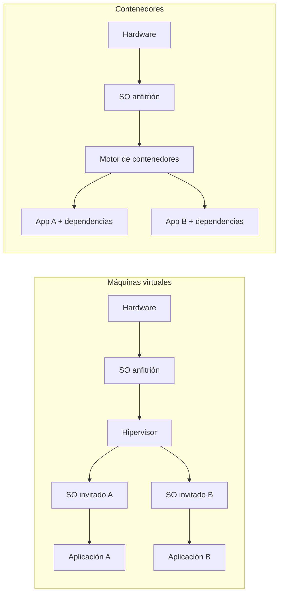

Una VM incluye un sistema operativo invitado completo. Un contenedor comparte el kernel del host y aísla procesos, red y sistema de archivos mediante mecanismos del kernel. Por eso suele iniciar más rápido y consumir menos, pero no es simplemente una “VM ligera”.

### 1.2 Vocabulario esencial

| Concepto | Significado |
|---|---|
| **Dockerfile** | receta declarativa para construir una imagen |
| **Imagen** | plantilla inmutable, compuesta por capas |
| **Contenedor** | proceso en ejecución creado desde una imagen, con una capa escribible propia |
| **Registro** | servicio que almacena y distribuye imágenes, como Docker Hub o un registro privado |
| **Repositorio de imágenes** | colección de versiones de una imagen, por ejemplo `equipo/api` |
| **Tag** | nombre mutable de una versión, por ejemplo `1.4.2` |
| **Digest** | identificador inmutable del contenido, por ejemplo `sha256:...` |
| **Volumen** | almacenamiento persistente administrado por Docker |
| **Compose** | definición y operación de una aplicación con varios contenedores |

---

## 2. Arquitectura y modelo mental

La orden `docker ...` la ejecuta el **cliente**. El cliente habla con el **daemon** (`dockerd`) mediante una API. El daemon construye imágenes, crea redes y volúmenes, y administra contenedores. Un registro externo entrega o recibe imágenes.

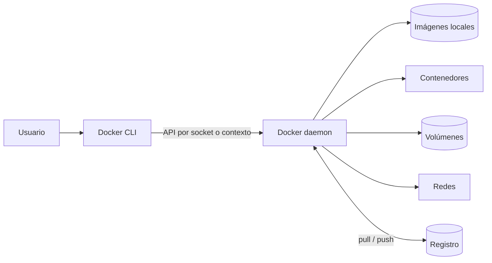

Consecuencias prácticas:

- `docker` puede existir aunque el daemon no esté disponible;
- el contexto determina contra qué daemon opera la CLI;
- dar acceso al socket del daemon concede un poder muy alto sobre el host;
- borrar un contenedor no borra su imagen ni sus volúmenes nombrados;
- una imagen no está “corriendo”: se ejecutan contenedores creados desde ella.

### 2.1 De Dockerfile a proceso

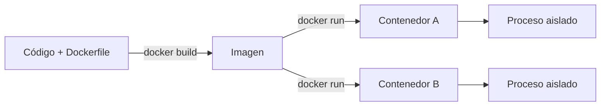

Dos contenedores de una misma imagen comparten las capas de solo lectura, pero tienen identidad, configuración y capa escribible independientes.

### Punto de control 0

Antes de continuar, responde:

1. ¿Qué diferencia hay entre imagen y contenedor?
2. ¿Qué componente recibe realmente `docker run`?
3. ¿Por qué dos contenedores de la misma imagen no comparten automáticamente los archivos que escriben?

---

## 3. Instalación y verificación

Usa la documentación oficial correspondiente a tu plataforma:

- macOS y Windows: Docker Desktop;
- Linux: Docker Engine desde el repositorio oficial de tu distribución, o Docker Desktop si sus funciones te resultan útiles;
- entornos corporativos: valida licencias, proxy, registro privado y políticas de seguridad con tu organización.

Evita copiar instaladores arbitrarios o ejecutar scripts descargados sin revisarlos. La instalación cambia por sistema operativo; esta guía se concentra en verificar el resultado.

```bash
docker version
docker info
docker compose version
docker context ls
```

La guía asume una versión moderna de Docker Engine/Desktop con BuildKit y Compose V2. Si una bandera como `compose up --wait` no existe en tu instalación, actualiza Docker o consulta `docker compose up --help`; no sustituyas silenciosamente una comprobación de salud por una espera de tiempo fija.

`docker version` distingue cliente y servidor. Si muestra el cliente pero falla el servidor, la CLI está instalada, pero el daemon no está iniciado, no es accesible o estás usando el contexto equivocado.

### 3.1 Prueba mínima

```bash
docker run --rm hello-world
```

El flujo es:

1. el cliente solicita ejecutar `hello-world`;
2. el daemon busca la imagen localmente;
3. si falta, la descarga del registro configurado;
4. crea y arranca el contenedor;
5. el proceso imprime un mensaje y termina;
6. `--rm` elimina el contenedor detenido.

### 3.2 Contextos

Un contexto agrupa la dirección y credenciales de un daemon.

```bash
docker context ls
docker context show
docker context use default
```

Antes de borrar o desplegar algo, confirma el contexto. Es fácil creer que operas localmente cuando la CLI apunta a un servidor remoto.

### 3.3 Permisos en Linux

Si eliges añadir tu usuario al grupo `docker`, entiende que ese acceso suele ser equivalente a privilegios elevados sobre el host. **Rootless mode** reduce parte de ese riesgo ejecutando daemon y contenedores dentro de un espacio de usuario, aunque tiene requisitos y diferencias operativas.

No soluciones un error de permisos con `chmod 777` sobre el socket.

---

## 4. Primeros contenedores y ciclo de vida

### 4.1 Ejecutar un proceso efímero

```bash
docker run --rm alpine:3.22 echo "hola desde un contenedor"
```

Descomposición:

- `run`: equivale conceptualmente a `create` seguido de `start`;
- `--rm`: elimina el contenedor cuando termina;
- `alpine:3.22`: imagen y tag;
- `echo ...`: sustituye el comando predeterminado de la imagen.

### 4.2 Modo interactivo y modo separado

```bash
# Terminal interactiva; salir termina el proceso principal.
docker run --rm -it alpine:3.22 sh

# Segundo plano, con un nombre estable.
docker run -d --name web-demo -p 127.0.0.1:8080:80 nginx:1.28-alpine
```

- `-i` conserva la entrada estándar;
- `-t` asigna una terminal;
- `-d` ejecuta en segundo plano;
- `--name` evita depender de un ID o nombre aleatorio;
- `-p HOST:CONTENEDOR` publica un puerto;
- `127.0.0.1:` limita el acceso al propio host, apropiado para un laboratorio local.

Visita `http://localhost:8080` y después inspecciona:

```bash
docker ps
docker ps -a
docker logs web-demo
docker logs -f --tail 50 web-demo
docker exec -it web-demo sh
docker inspect web-demo
docker top web-demo
docker port web-demo
```

`docker exec` inicia **otro proceso** dentro de un contenedor que ya está en ejecución. No “entra” mágicamente al proceso principal y no es una forma de conservar cambios en la imagen.

Para copiar un archivo durante diagnóstico:

```bash
docker cp web-demo:/etc/nginx/nginx.conf ./nginx.conf
docker cp ./archivo-local.txt web-demo:/tmp/archivo-local.txt
```

`docker cp` no modifica la imagen y no es un mecanismo de despliegue. Si el archivo forma parte de la aplicación, agrégalo al contexto y reconstruye la imagen.

### 4.3 Estados y comandos

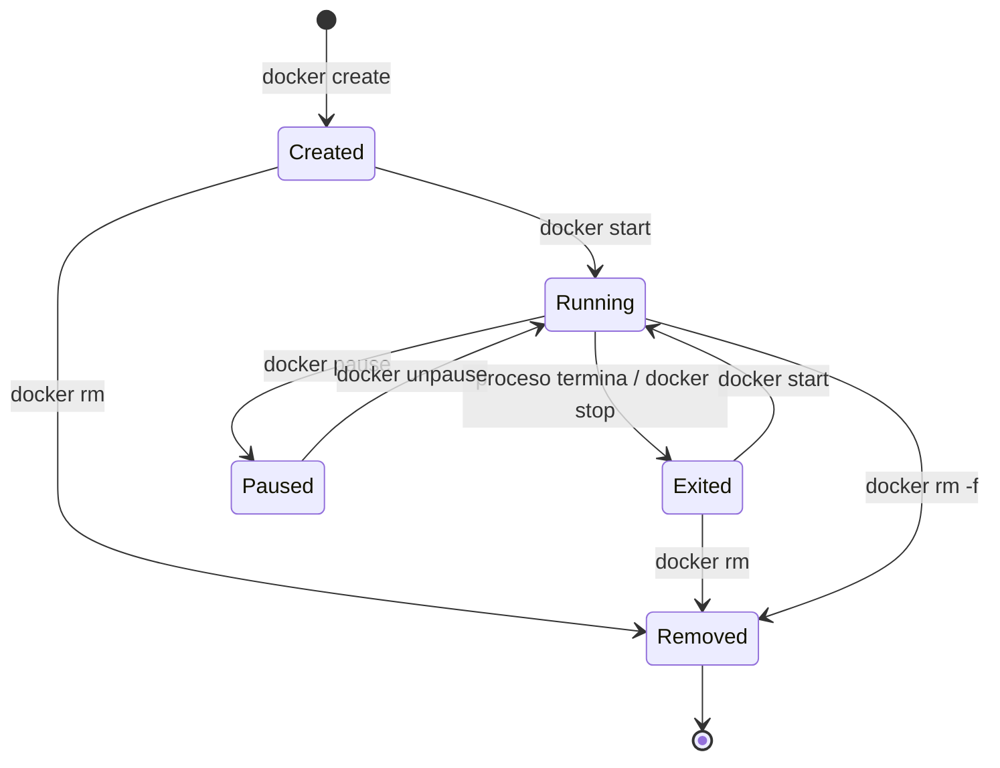

```bash
docker stop web-demo       # solicita terminación y espera
docker start web-demo      # arranca el mismo contenedor
docker restart web-demo
docker rm web-demo         # requiere que esté detenido
```

`docker kill` envía `SIGKILL` por defecto y no permite limpieza ordenada. Úsalo cuando `stop` no funciona, no como rutina.

### 4.4 Variables, nombre de host y directorio de trabajo

```bash
docker run --rm \
  --name variables-demo \
  --hostname demo-host \
  -e APP_ENV=development \
  -w /workspace \
  alpine:3.22 \
  sh -c 'printf "entorno=%s host=%s directorio=%s\n" "$APP_ENV" "$HOSTNAME" "$PWD"'
```

### 4.5 Leer la salida de un contenedor que falla

```bash
docker run --name fallo-demo alpine:3.22 sh -c 'echo preparando; exit 7'
docker ps -a --filter name=fallo-demo
docker logs fallo-demo
docker inspect fallo-demo --format '{{.State.ExitCode}}'
docker rm fallo-demo
```

El código de salida del proceso principal determina el estado del contenedor. Un contenedor detenido no es necesariamente un error: puede representar un trabajo por lotes completado.

### Punto de control 1

Sin consultar la guía:

1. ejecuta Nginx en segundo plano y publícalo solo en `127.0.0.1:8081`;
2. consulta sus logs y lista sus procesos;
3. detenlo, comprueba que aparece con `docker ps -a` y elimínalo;
4. explica por qué eliminar el contenedor no elimina la imagen.

---

## 5. Imágenes, etiquetas y registros

### 5.1 Administrar imágenes locales

```bash
docker image ls
docker pull postgres:17-alpine
docker image inspect postgres:17-alpine
docker image history postgres:17-alpine
docker image rm postgres:17-alpine
```

Un nombre completo puede verse así:

```text
registry.example.com/equipo/catalogo-api:1.4.2
└──── registro ─────┘ └── repositorio ──┘ └tag┘
```

Si omites el registro, Docker usa su registro predeterminado. Si omites el tag, normalmente se interpreta `latest`, pero **`latest` no significa “la versión cronológicamente más nueva”**: es solo un tag mutable con ese nombre.

### 5.2 Tag frente a digest

```bash
docker pull alpine:3.22
docker image inspect alpine:3.22 --format '{{json .RepoDigests}}'
```

- un tag es legible y puede apuntar después a otro contenido;
- un digest identifica contenido inmutable;
- en desarrollo suele bastar una versión concreta;
- en despliegues sensibles, fijar un digest maximiza reproducibilidad, pero obliga a actualizarlo deliberadamente para recibir parches.

### 5.3 Etiquetar no duplica la imagen

```bash
docker tag mi-api:local usuario/mi-api:1.0.0
docker image ls usuario/mi-api
```

Un tag adicional es otra referencia al mismo contenido, no una copia completa.

### 5.4 Transferencia sin registro

```bash
docker image save -o guia-api.tar guia-api:1.0
docker image load -i guia-api.tar
```

`save`/`load` conserva imágenes, tags y capas. No lo confundas con `docker export`/`import`, que opera sobre el filesystem de un contenedor y pierde buena parte de la configuración e historial; para respaldar y distribuir imágenes normales, usa un registro o `image save`.

### 5.5 Elegir una imagen base

Prefiere:

- imágenes oficiales o de publicadores verificados;
- una base compatible con tus dependencias;
- versiones explícitas;
- imágenes pequeñas cuando no sacrifiquen compatibilidad ni capacidad de diagnóstico;
- actualizaciones y reconstrucciones periódicas.

“Más pequeña” no significa automáticamente “más segura”. Una base extremadamente mínima puede complicar certificados, zonas horarias, bibliotecas nativas y depuración.

---

## 6. Crear imágenes con Dockerfile

Construiremos un servidor HTTP con la biblioteca estándar de Python.

### 6.1 Archivos del laboratorio

`app.py`:

```python
import json
import os
from http.server import BaseHTTPRequestHandler, HTTPServer


class Handler(BaseHTTPRequestHandler):
    def do_GET(self):
        body = json.dumps({
            "message": "hola desde Docker",
            "environment": os.getenv("APP_ENV", "development"),
            "path": self.path,
        }).encode()

        self.send_response(200)
        self.send_header("Content-Type", "application/json")
        self.send_header("Content-Length", str(len(body)))
        self.end_headers()
        self.wfile.write(body)


HTTPServer(("0.0.0.0", 8000), Handler).serve_forever()
```

`Dockerfile`:

```dockerfile
# syntax=docker/dockerfile:1
FROM python:3.13-slim

WORKDIR /app

COPY --chown=10001:10001 app.py ./

ENV APP_ENV=production \
    PYTHONUNBUFFERED=1

USER 10001:10001

EXPOSE 8000

CMD ["python", "app.py"]
```

`.dockerignore`:

```dockerignore
.git
.gitignore
__pycache__/
*.pyc
.venv/
.env
tests/
*.md
```

Construye y ejecuta:

```bash
docker build -t guia-api:1.0 .
docker run --rm -d --name guia-api -p 127.0.0.1:8000:8000 guia-api:1.0
curl http://localhost:8000/saludo
docker logs guia-api
docker stop guia-api
```

El punto final `.` es el **contexto de build**. Docker solo puede usar archivos enviados en ese contexto; `.dockerignore` reduce tamaño, evita invalidar caché y ayuda a no enviar archivos sensibles.

### 6.2 Instrucciones esenciales

| Instrucción | Propósito | Nota práctica |
|---|---|---|
| `FROM` | selecciona imagen base e inicia una etapa | cada nuevo `FROM` crea otra etapa |
| `WORKDIR` | fija el directorio para instrucciones posteriores | evita cadenas de `cd` |
| `COPY` | copia archivos del contexto | preferible a `ADD` salvo funciones específicas |
| `RUN` | ejecuta durante el **build** | su resultado forma una capa de imagen |
| `ENV` | fija variables persistentes en imagen/contenedor | no guardar secretos |
| `ARG` | parámetro disponible principalmente durante build | tampoco es un almacén de secretos |
| `USER` | usuario de las instrucciones siguientes y del runtime | evita root si la app no lo necesita |
| `EXPOSE` | documenta el puerto esperado | no publica el puerto |
| `CMD` | comando o argumentos predeterminados | se puede reemplazar en `docker run` |
| `ENTRYPOINT` | ejecutable principal estable | los argumentos de `run` suelen añadirse |
| `HEALTHCHECK` | prueba de salud del contenedor | no reemplaza monitoreo externo |

### 6.3 `RUN`, `CMD` y `ENTRYPOINT`

```dockerfile
RUN python -m compileall app.py
CMD ["python", "app.py"]
```

`RUN` ocurre al construir. `CMD` ocurre cada vez que arranca un contenedor.

Forma shell:

```dockerfile
CMD python app.py
```

Forma exec, recomendada para el proceso principal:

```dockerfile
CMD ["python", "app.py"]
```

La forma exec evita un shell intermedio y suele manejar mejor señales. No expande variables de shell automáticamente.

Combinación útil:

```dockerfile
ENTRYPOINT ["python", "-m", "http.server"]
CMD ["8000", "--directory", "/public"]
```

```bash
# Usa el CMD por defecto.
docker run --rm mi-servidor

# Sustituye los argumentos de CMD, conserva ENTRYPOINT.
docker run --rm mi-servidor 9000 --directory /public

# Sustituye incluso ENTRYPOINT, principalmente para diagnóstico.
docker run --rm --entrypoint sh mi-servidor
```

### 6.4 Sustitución de configuración en runtime

No construyas una imagen distinta por entorno si solo cambia configuración:

```bash
docker run --rm -e APP_ENV=staging guia-api:1.0
```

La misma imagen probada debe poder promoverse entre entornos. Las credenciales, URLs y banderas de entorno se inyectan en runtime.

---

## 7. Capas, caché y builds multi-stage

### 7.1 Cómo funciona la caché

Cada instrucción del Dockerfile produce o afecta una capa. Si una instrucción o sus entradas cambian, Docker reconstruye esa etapa desde allí hacia abajo.

Orden ineficiente para una aplicación con dependencias:

```dockerfile
COPY . .
RUN pip install --no-cache-dir -r requirements.txt
```

Cualquier cambio en el código invalida la instalación.

Orden que aprovecha caché:

```dockerfile
COPY requirements.txt .
RUN pip install --no-cache-dir -r requirements.txt
COPY . .
```

Las dependencias se reinstalan solo cuando cambia su manifiesto.

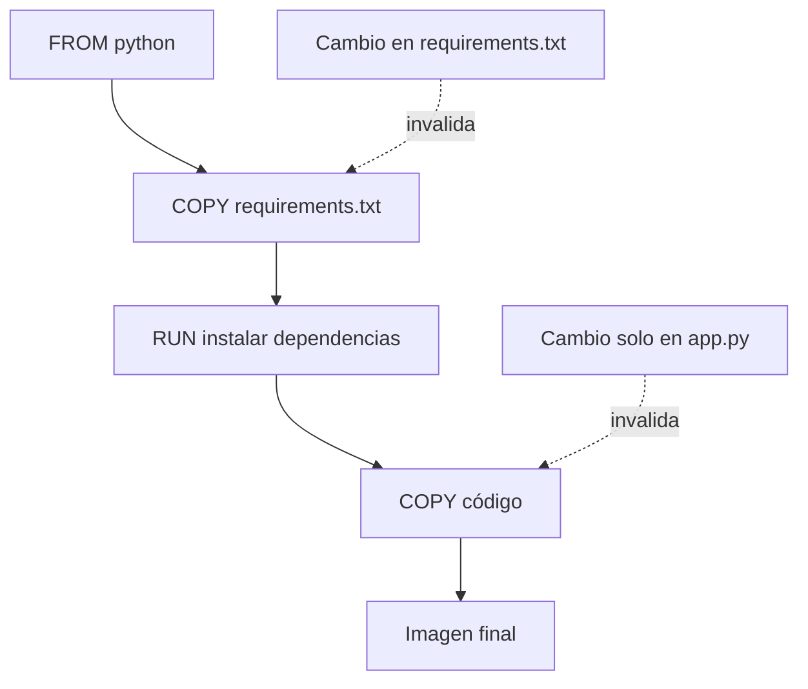

### 7.2 Inspeccionar y controlar el build

```bash
docker build --progress=plain -t guia-api:1.1 .
docker build --no-cache -t guia-api:limpia .
docker build --pull -t guia-api:base-actualizada .
```

- `--no-cache` reejecuta pasos, pero no garantiza descargar una base nueva;
- `--pull` comprueba una versión más reciente de la base;
- reconstruir con frecuencia incorpora actualizaciones que una imagen vieja nunca recibirá.

### 7.3 Multi-stage builds

Separa herramientas de compilación del runtime. Ejemplo con Go:

```dockerfile
# syntax=docker/dockerfile:1
FROM golang:1.25-alpine AS build
WORKDIR /src
COPY go.mod ./
RUN go mod download
COPY . .
RUN CGO_ENABLED=0 go build -o /out/api ./cmd/api

FROM alpine:3.22 AS runtime
RUN addgroup -S app && adduser -S -G app app
COPY --from=build --chown=app:app /out/api /usr/local/bin/api
USER app
EXPOSE 8080
ENTRYPOINT ["/usr/local/bin/api"]
```

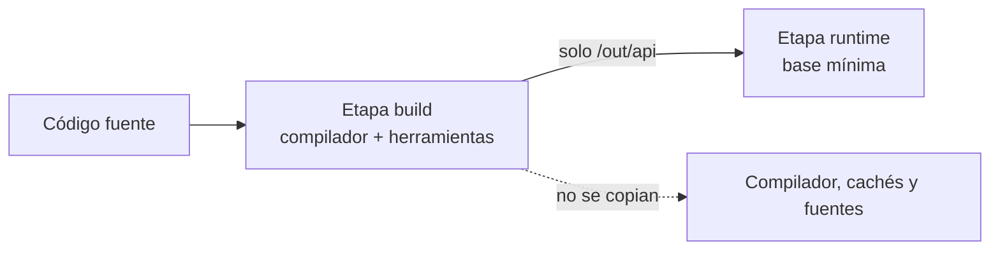

```bash
docker build --target build -t api-build:debug .
docker build -t api:1.0 .
```

### 7.4 Cachés y secretos de BuildKit

```dockerfile
# syntax=docker/dockerfile:1
RUN --mount=type=cache,target=/root/.cache/pip \
    pip install -r requirements.txt

RUN --mount=type=secret,id=pip_config,target=/etc/pip.conf \
    pip install paquete-privado
```

```bash
docker build --secret id=pip_config,src=./pip.conf -t mi-api:1.0 .
```

El secreto existe temporalmente para esa instrucción. No lo copies ni lo imprimas. `ARG TOKEN=...` y `ENV TOKEN=...` no son alternativas seguras porque pueden quedar expuestos en metadatos, capas, cachés o registros.

### Punto de control 2

Construye la aplicación de la sección 6 y demuestra:

1. que `EXPOSE 8000` no hace accesible el servicio sin `-p`;
2. que un cambio en `app.py` reutiliza las capas anteriores;
3. que `docker run ... guia-api:1.0 sh` reemplaza `CMD`;
4. que el proceso corre como UID `10001`, usando `docker exec` o `docker top`.

---

## 8. Persistencia: volúmenes, bind mounts y tmpfs

La capa escribible de un contenedor pertenece a ese contenedor. Sobrevive a `stop`/`start`, pero desaparece cuando el contenedor se elimina. Todo dato importante debe estar en un almacenamiento con ciclo de vida independiente.

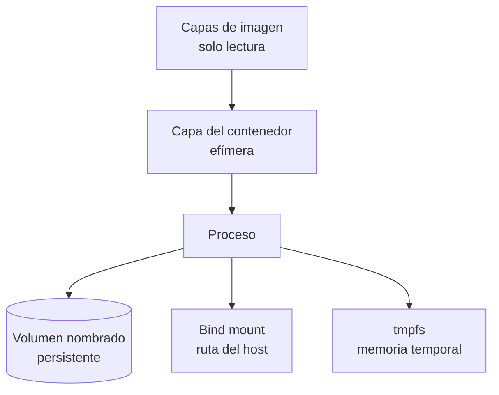

### 8.1 Comparación

| Tipo | Lo administra | Persiste al eliminar el contenedor | Uso típico |
|---|---|---:|---|
| capa escribible | Docker, ligada al contenedor | no | archivos temporales no importantes |
| volumen nombrado | Docker | sí | datos de base de datos, colas, contenido persistente |
| bind mount | usuario y SO host | sí | código/configuración local que debe verse desde host |
| `tmpfs` | memoria del host | no | datos sensibles o temporales que no deben ir a disco |

### 8.2 Volúmenes nombrados

```bash
docker volume create notas-data
docker volume ls
docker volume inspect notas-data

docker run --rm \
  --mount type=volume,source=notas-data,target=/data \
  alpine:3.22 sh -c 'date > /data/creado.txt'

docker run --rm \
  --mount type=volume,source=notas-data,target=/data,readonly \
  alpine:3.22 cat /data/creado.txt
```

Se recomienda `--mount` porque expresa claramente tipo, origen, destino y opciones. La sintaxis corta equivalente es `-v notas-data:/data`.

```bash
docker volume rm notas-data
```

Docker no elimina un volumen en uso. Aun así, revisa su nombre y contenido antes de borrarlo: eliminar un volumen puede destruir datos irrecuperables.

### 8.3 Bind mounts

```bash
docker run --rm \
  --mount type=bind,source="$PWD",target=/workspace,readonly \
  -w /workspace \
  python:3.13-slim \
  python -m compileall .
```

El contenedor ve directamente la ruta del host. Consideraciones:

- las rutas deben existir y son específicas de la máquina;
- permisos y propietarios pueden diferir entre host y contenedor;
- sin `readonly`, el proceso puede modificar o borrar archivos del host;
- en macOS/Windows existe una capa de compartición de archivos y el rendimiento puede diferir;
- no montes el socket Docker ni directorios amplios del sistema salvo que entiendas el impacto.

### 8.4 tmpfs

```bash
docker run --rm \
  --mount type=tmpfs,destination=/run/cache,tmpfs-size=64m \
  alpine:3.22 sh -c 'echo temporal > /run/cache/estado && cat /run/cache/estado'
```

El contenido se pierde al detener el contenedor y no se escribe en el almacenamiento persistente del host. No reemplaza una solución formal de secretos.

### 8.5 Copia y restauración de un volumen

Primero detén o pon la aplicación en un estado consistente. Copiar archivos de una base de datos activa puede producir un respaldo inválido; para bases de datos, prefiere sus herramientas lógicas o snapshots coordinados.

```bash
# Copia de un volumen genérico a la carpeta actual.
docker run --rm \
  --mount type=volume,source=notas-data,target=/source,readonly \
  --mount type=bind,source="$PWD",target=/backup \
  alpine:3.22 tar -czf /backup/notas-data.tar.gz -C /source .

# Restauración a un volumen nuevo.
docker volume create notas-data-restaurado
docker run --rm \
  --mount type=volume,source=notas-data-restaurado,target=/target \
  --mount type=bind,source="$PWD",target=/backup,readonly \
  alpine:3.22 tar -xzf /backup/notas-data.tar.gz -C /target
```

Para PostgreSQL usa normalmente:

```bash
docker exec postgres-demo pg_dump -U app appdb > appdb.sql
docker exec -i postgres-demo psql -U app -d appdb < appdb.sql
```

Los operadores `>` y `<` los procesa el shell del host. El primer comando guarda el dump en el host; el segundo lo lee desde el host.

---

## 9. Redes, DNS y publicación de puertos

Un contenedor tiene su propia interfaz y espacio de red. `localhost` dentro de él significa **ese mismo contenedor**, no el host ni otro servicio.

### 9.1 Comunicación dentro de una red definida por el usuario

```bash
docker network create app-net

docker run -d --name web-interno --network app-net nginx:1.28-alpine

docker run --rm --network app-net curlimages/curl:8.15.0 \
  http://web-interno:80

docker rm -f web-interno
docker network rm app-net
```

En una red definida por el usuario, Docker ofrece resolución DNS por nombre o alias. Usa nombres estables (`db`, `api`), no IP de contenedor: la IP puede cambiar al recrearlo.

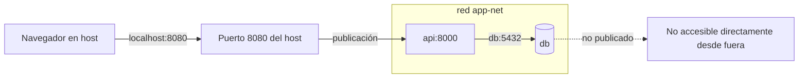

### 9.2 Publicar no es lo mismo que exponer

```bash
# Accesible solo desde el host local.
docker run -d --name web-local -p 127.0.0.1:8080:80 nginx:1.28-alpine

# Puede escuchar en todas las interfaces del host; revisa firewall y entorno.
docker run -d --name web-red -p 8081:80 nginx:1.28-alpine
```

`EXPOSE 80` en un Dockerfile documenta intención. `-p` crea la publicación real. No publiques una base de datos si solo la usa otro contenedor en la misma red.

### 9.3 Conectar al host

El nombre y la estrategia dependen de la plataforma. Docker Desktop suele proporcionar `host.docker.internal`. En Docker Engine para Linux puede añadirse explícitamente:

```bash
docker run --rm \
  --add-host host.docker.internal:host-gateway \
  curlimages/curl:8.15.0 \
  http://host.docker.internal:3000
```

El servicio del host también debe escuchar en una interfaz alcanzable, no únicamente en un loopback inaccesible desde esa red.

### 9.4 Inspección y diagnóstico de red

```bash
docker network ls
docker network inspect app-net
docker inspect contenedor --format '{{json .NetworkSettings.Networks}}'
docker exec contenedor getent hosts db
```

No todas las imágenes incluyen `ping`, `curl`, `ss` o un shell. En producción es normal usar una imagen de diagnóstico temporal conectada a la misma red, en vez de inflar la imagen de la aplicación.

### Punto de control 3

1. crea una red `laboratorio`;
2. ejecuta un Nginx llamado `sitio` sin publicar puertos;
3. desde un contenedor temporal, consulta `http://sitio` por nombre;
4. explica por qué `curl http://localhost` desde el contenedor temporal no consulta Nginx;
5. elimina contenedores y red.

---

## 10. Docker Compose

Compose describe servicios, redes, volúmenes, configuraciones y secretos de una aplicación en YAML. Un **Dockerfile construye una imagen**; un **Compose file configura cómo se ejecutan uno o varios contenedores**.

### 10.1 Primer `compose.yaml`

```yaml
name: guia-web

services:
  web:
    image: nginx:1.28-alpine
    ports:
      - "127.0.0.1:8080:80"
    restart: unless-stopped
```

```bash
docker compose config
docker compose up -d
docker compose ps
docker compose logs -f web
docker compose exec web nginx -T
docker compose stop
docker compose start
docker compose down
```

`docker compose config` resuelve variables, combina archivos y valida la estructura antes de crear recursos. Conviene ejecutarlo en local y CI.

### 10.2 Conceptos y ciclo de vida

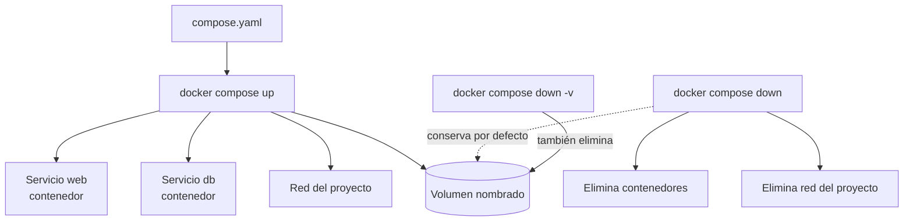

Comandos importantes:

```bash
docker compose up                 # primer plano
docker compose up -d --build      # reconstruye y arranca en segundo plano
docker compose up -d --wait       # espera estado running/healthy si la versión lo admite
docker compose pull               # descarga imágenes definidas, no reinicia por sí solo
docker compose ps -a
docker compose logs --tail 100 -f
docker compose exec servicio sh
docker compose run --rm servicio comando
docker compose restart servicio
docker compose down
```

`exec` usa un contenedor existente. `run` crea un contenedor puntual con la configuración del servicio. `down -v` elimina además volúmenes declarados: no lo ejecutes sobre datos importantes sin confirmar respaldo y contexto.

### 10.3 Variables e interpolación

`.env` para interpolar el Compose file:

```dotenv
APP_PORT=8080
APP_ENV=development
```

```yaml
services:
  api:
    image: guia-api:1.0
    ports:
      - "127.0.0.1:${APP_PORT:-8000}:8000"
    environment:
      APP_ENV: "${APP_ENV:-development}"
```

Comprueba el resultado:

```bash
docker compose config
docker compose config --environment
```

Un `.env` no es automáticamente un mecanismo seguro para secretos. Evita versionarlo si contiene credenciales y proporciona `.env.example` sin valores sensibles.

### 10.4 Volúmenes y redes en Compose

```yaml
services:
  api:
    build: .
    networks: [frontend, backend]
  db:
    image: postgres:17-alpine
    volumes:
      - db-data:/var/lib/postgresql/data
    networks: [backend]

volumes:
  db-data:

networks:
  frontend:
  backend:
    internal: true
```

Cada servicio puede encontrar a otro por su **nombre de servicio**. La red `backend` interna aísla el tráfico externo, pero no reemplaza autenticación ni controles de la aplicación.

### 10.5 Perfiles y archivos adicionales

```yaml
services:
  adminer:
    image: adminer:5
    profiles: [debug]
```

```bash
docker compose --profile debug up -d
```

Para variaciones por entorno puedes combinar archivos:

```bash
docker compose -f compose.yaml -f compose.dev.yaml config
docker compose -f compose.yaml -f compose.dev.yaml up -d
```

Mantén el archivo base portable y usa overrides pequeños. Revisa siempre la configuración fusionada.

---

## 11. Proyecto integrador: aplicación y PostgreSQL

Este laboratorio acumula Dockerfile, red, volumen, variables, salud y Compose. Crea una carpeta vacía con estos archivos.

### 11.1 Aplicación

`requirements.txt`:

```text
psycopg[binary]>=3.2,<3.3
```

`app.py`:

```python
import json
import os
from http.server import BaseHTTPRequestHandler, HTTPServer

import psycopg


def connection():
    return psycopg.connect(
        host=os.environ.get("DB_HOST", "db"),
        dbname=os.environ.get("POSTGRES_DB", "appdb"),
        user=os.environ.get("POSTGRES_USER", "app"),
        password=os.environ["POSTGRES_PASSWORD"],
    )


class Handler(BaseHTTPRequestHandler):
    def reply(self, status, payload):
        body = json.dumps(payload).encode()
        self.send_response(status)
        self.send_header("Content-Type", "application/json")
        self.send_header("Content-Length", str(len(body)))
        self.end_headers()
        self.wfile.write(body)

    def do_GET(self):
        if self.path == "/health/live":
            return self.reply(200, {"status": "alive"})

        if self.path == "/health/ready":
            try:
                with connection() as conn:
                    conn.execute("SELECT 1")
                return self.reply(200, {"status": "ready"})
            except Exception as error:
                return self.reply(503, {"status": "not-ready", "error": str(error)})

        with connection() as conn:
            total = conn.execute("SELECT count(*) FROM visits").fetchone()[0]
            conn.execute("INSERT INTO visits DEFAULT VALUES")
        self.reply(200, {"visits_before_this_request": total})


HTTPServer(("0.0.0.0", 8000), Handler).serve_forever()
```

`init.sql`:

```sql
CREATE TABLE IF NOT EXISTS visits (
    id bigint GENERATED ALWAYS AS IDENTITY PRIMARY KEY,
    visited_at timestamptz NOT NULL DEFAULT now()
);
```

### 11.2 Imagen de la aplicación

`Dockerfile`:

```dockerfile
# syntax=docker/dockerfile:1
FROM python:3.13-slim

ENV PYTHONDONTWRITEBYTECODE=1 \
    PYTHONUNBUFFERED=1

WORKDIR /app

COPY requirements.txt ./
RUN --mount=type=cache,target=/root/.cache/pip \
    pip install -r requirements.txt

COPY --chown=10001:10001 app.py ./
USER 10001:10001

EXPOSE 8000
CMD ["python", "app.py"]
```

`.dockerignore`:

```dockerignore
.git
.env
__pycache__/
*.pyc
compose*.yaml
init.sql
```

### 11.3 Orquestación local

`.env.example`:

```dotenv
POSTGRES_DB=appdb
POSTGRES_USER=app
POSTGRES_PASSWORD=cambia-este-valor
APP_PORT=8000
```

Copia el archivo como `.env` y usa una contraseña solo de laboratorio. No confirmes `.env` en Git.

`compose.yaml`:

```yaml
name: visitas

services:
  api:
    build:
      context: .
    environment:
      DB_HOST: db
      POSTGRES_DB: "${POSTGRES_DB}"
      POSTGRES_USER: "${POSTGRES_USER}"
      POSTGRES_PASSWORD: "${POSTGRES_PASSWORD}"
    ports:
      - "127.0.0.1:${APP_PORT:-8000}:8000"
    depends_on:
      db:
        condition: service_healthy
    restart: unless-stopped
    init: true
    read_only: true
    tmpfs:
      - /tmp
    networks:
      - backend

  db:
    image: postgres:17-alpine
    environment:
      POSTGRES_DB: "${POSTGRES_DB}"
      POSTGRES_USER: "${POSTGRES_USER}"
      POSTGRES_PASSWORD: "${POSTGRES_PASSWORD}"
    volumes:
      - db-data:/var/lib/postgresql/data
      - ./init.sql:/docker-entrypoint-initdb.d/001-init.sql:ro
    healthcheck:
      test: ["CMD-SHELL", "pg_isready -U $$POSTGRES_USER -d $$POSTGRES_DB"]
      interval: 5s
      timeout: 3s
      retries: 10
      start_period: 10s
    restart: unless-stopped
    networks:
      - backend

volumes:
  db-data:

networks:
  backend:
```

En YAML de Compose, `$$` escapa el dólar para que la variable se expanda dentro del contenedor, no al procesar el archivo.

### 11.4 Ejecutar y comprobar

```bash
docker compose config
docker compose up -d --build --wait
docker compose ps
curl http://localhost:8000/
curl http://localhost:8000/
curl http://localhost:8000/health/ready
docker compose logs --tail 100 api db
```

Consulta la base sin publicar `5432`:

```bash
docker compose exec db psql -U app -d appdb -c \
  'SELECT id, visited_at FROM visits ORDER BY id;'
```

Recrea los contenedores y confirma persistencia:

```bash
docker compose down
docker compose up -d --wait
curl http://localhost:8000/
```

`init.sql` se ejecuta cuando PostgreSQL inicializa un directorio de datos vacío. Cambiar ese archivo después no vuelve a aplicarlo al volumen existente; las aplicaciones reales usan una herramienta de migraciones.

Limpieza normal:

```bash
docker compose down
```

Limpieza total del laboratorio, **incluidos los datos**:

```bash
docker compose down -v
```

### Punto de control 4

Explica y demuestra:

1. por qué la API se conecta a `db:5432`, no a `localhost:5432`;
2. qué evita que la API arranque antes de que PostgreSQL esté listo;
3. qué dato sobrevive a `docker compose down` y por qué;
4. qué sucede con los datos tras `docker compose down -v`;
5. por qué `read_only: true` no impide que PostgreSQL reciba escrituras de la API.

---

## 12. Procesos, señales, salud y reinicio

### 12.1 El proceso PID 1

El comando principal se convierte en PID 1 dentro del contenedor. Mientras vive, el contenedor vive. Debe:

- escribir logs en salida estándar/error estándar;
- reaccionar a `SIGTERM` y terminar de forma ordenada;
- no depender de SSH ni de un daemonizador interno;
- recoger procesos hijos, o usar un init mínimo cuando sea necesario.

```bash
docker run --init ...
```

En Compose, `init: true` añade un init mínimo. Es útil si el runtime no maneja bien procesos hijos, pero no corrige una aplicación que ignora señales.

### 12.2 Parada ordenada

```bash
docker stop --time 20 mi-api
```

Docker envía primero la señal de parada y espera. Si el proceso no termina dentro del tiempo, fuerza su salida. Ajusta el periodo a la duración real necesaria para cerrar conexiones y completar trabajo seguro.

### 12.3 Liveness, readiness y healthcheck

- **liveness**: el proceso está vivo;
- **readiness**: puede atender tráfico y sus dependencias necesarias están listas;
- **healthcheck de Docker**: ejecuta una prueba y marca `starting`, `healthy` o `unhealthy`.

Ejemplo en Dockerfile:

```dockerfile
HEALTHCHECK --interval=30s --timeout=3s --start-period=10s --retries=3 \
  CMD ["python", "-c", "import urllib.request; urllib.request.urlopen('http://127.0.0.1:8000/health/ready')"]
```

```bash
docker inspect mi-api --format '{{json .State.Health}}'
```

Docker Engine no reinicia por sí solo un contenedor únicamente por estar `unhealthy`. Un orquestador o sistema externo decide qué acción tomar. En Compose, `depends_on: condition: service_healthy` controla el orden inicial, no la recuperación completa durante toda la vida de la aplicación.

### 12.4 Políticas de reinicio

```bash
docker run -d --restart unless-stopped --name worker mi-worker:1.0
docker update --restart on-failure:5 worker
```

| Política | Comportamiento general |
|---|---|
| `no` | no reinicia automáticamente |
| `on-failure[:N]` | reinicia ante código distinto de cero, opcionalmente hasta N veces |
| `always` | intenta mantenerlo en ejecución |
| `unless-stopped` | similar a `always`, salvo parada explícita |

Un bucle de reinicios no repara una contraseña incorrecta. Primero inspecciona `docker ps -a`, código de salida, estado OOM y logs.

---

## 13. Configuración y secretos

### 13.1 Configuración por entorno

```bash
docker run --rm \
  -e APP_ENV=production \
  -e LOG_LEVEL=info \
  --env-file ./app.env \
  mi-api:1.0
```

No guardes secretos en:

- Dockerfile con `ENV` o `ARG`;
- código o historial Git;
- nombres, tags o labels;
- logs;
- archivos Compose versionados;
- línea de comandos cuando pueda quedar en historial o listado de procesos.

Las variables de entorno son fáciles de usar, pero pueden verse mediante inspección para quien tenga acceso suficiente al daemon.

### 13.2 Secretos como archivos en Compose

```yaml
services:
  api:
    image: mi-api:1.0
    secrets:
      - db_password
    environment:
      DB_PASSWORD_FILE: /run/secrets/db_password

secrets:
  db_password:
    file: ./secrets/db_password.txt
```

La aplicación debe leer el archivo indicado. Protege también el archivo fuente y no lo confirmes en Git. En producción, integra el mecanismo de secretos de tu plataforma; Compose local no convierte por sí solo un archivo del host en una bóveda centralizada.

Ejemplo de lectura en Python:

```python
from pathlib import Path
import os


def secret(name: str) -> str:
    file_var = os.getenv(f"{name}_FILE")
    if file_var:
        return Path(file_var).read_text().strip()
    return os.environ[name]


password = secret("DB_PASSWORD")
```

### 13.3 Secretos durante el build

```dockerfile
RUN --mount=type=secret,id=npmrc,target=/root/.npmrc \
    npm ci
```

```bash
docker build --secret id=npmrc,src="$HOME/.npmrc" -t frontend:1.0 .
```

El build secret solo está montado durante esa instrucción. Revisa que la herramienta no copie credenciales a cachés o artefactos.

### 13.4 Labels y metadatos no sensibles

```dockerfile
LABEL org.opencontainers.image.title="catalogo-api" \
      org.opencontainers.image.version="1.4.2" \
      org.opencontainers.image.source="https://example.com/equipo/catalogo"
```

```bash
docker inspect catalogo-api:1.4.2 --format '{{json .Config.Labels}}'
```

Los labels ayudan con trazabilidad, pero son públicos para quien obtiene la imagen.

---

## 14. Recursos y observabilidad

### 14.1 Límites de CPU y memoria

Por defecto, un contenedor puede competir por los recursos disponibles del host. Define límites según mediciones reales, especialmente en entornos compartidos.

```bash
docker run --rm \
  --cpus 1.0 \
  --memory 512m \
  --pids-limit 200 \
  mi-api:1.0
```

En Compose:

```yaml
services:
  api:
    image: mi-api:1.0
    cpus: 1.0
    mem_limit: 512m
    pids_limit: 200
```

Un límite demasiado bajo provoca latencia, throttling o terminación por falta de memoria. Uno inexistente permite que un servicio afecte al resto del host.

### 14.2 Métricas de operación

```bash
docker stats
docker stats --no-stream
docker top mi-api
docker inspect mi-api --format \
  'estado={{.State.Status}} salida={{.State.ExitCode}} oom={{.State.OOMKilled}}'
docker system df
```

`docker stats` ayuda a detectar consumo; no reemplaza una plataforma histórica de métricas y alertas.

### 14.3 Logs

Una aplicación contenedorizada debería escribir en stdout/stderr. Docker captura esos streams mediante un logging driver.

```bash
docker logs --since 10m --timestamps mi-api
docker logs -f --tail 200 mi-api
docker info --format '{{.LoggingDriver}}'
```

Considera:

- logs estructurados, por ejemplo JSON;
- identificador de solicitud y servicio;
- no imprimir tokens, contraseñas ni datos personales;
- rotación y límites de tamaño;
- envío a un sistema central en producción.

Ejemplo de rotación con el driver `json-file`:

```bash
docker run -d \
  --log-opt max-size=10m \
  --log-opt max-file=3 \
  --name mi-api mi-api:1.0
```

En Compose:

```yaml
services:
  api:
    image: mi-api:1.0
    logging:
      driver: json-file
      options:
        max-size: "10m"
        max-file: "3"
```

### 14.4 Eventos e inspección

```bash
docker events --since 10m
docker inspect mi-api
docker inspect mi-api --format '{{.Config.Image}} {{.Path}} {{json .Args}}'
docker diff mi-api
```

`docker diff` muestra cambios en la capa escribible y ayuda a descubrir aplicaciones que guardan estado donde no corresponde.

---

## 15. Seguridad práctica

Un contenedor es una barrera útil, no una garantía absoluta. Su seguridad depende del kernel, daemon, imagen, configuración y aplicación.

### 15.1 Lista mínima para imágenes

- parte de una fuente confiable y fija una versión compatible;
- reconstruye periódicamente para incorporar parches;
- usa multi-stage y no instales herramientas innecesarias;
- ejecuta como usuario no root;
- no incluyas secretos, `.git`, dumps ni archivos locales en el contexto;
- genera y revisa un SBOM cuando el flujo lo permita;
- escanea vulnerabilidades y evalúa si afectan al código ejecutado;
- conserva trazabilidad de commit, build e imagen.

```bash
docker scout cves mi-api:1.0
docker scout sbom mi-api:1.0
```

Docker Scout puede requerir instalación, autenticación o plan compatible. También existen analizadores independientes; lo esencial es incorporar análisis y una política de actualización.

### 15.2 Lista mínima para runtime

```bash
docker run --rm \
  --read-only \
  --tmpfs /tmp:rw,noexec,nosuid,size=64m \
  --cap-drop ALL \
  --security-opt no-new-privileges=true \
  --user 10001:10001 \
  --memory 512m \
  --cpus 1 \
  mi-api:1.0
```

Añade solo la capacidad que la aplicación demuestre necesitar:

```bash
--cap-add NET_BIND_SERVICE
```

Evita de forma predeterminada:

- `--privileged`;
- montar `/var/run/docker.sock`;
- `--network host`;
- montar `/`, `/etc`, `/proc` o dispositivos del host;
- ejecutar como root;
- publicar puertos innecesarios;
- deshabilitar seccomp, AppArmor o SELinux para “hacer que funcione”.

### 15.3 El socket Docker

Un proceso con acceso al socket puede crear contenedores privilegiados, montar rutas del host y controlar otros contenedores. Trátalo como acceso administrativo. Si una herramienta necesita observar Docker, evalúa un proxy de autorización o una API limitada en vez de montar el socket completo.

### 15.4 Rootless mode

Rootless mode ejecuta daemon y contenedores sin privilegios root del host. Reduce el impacto de ciertas vulnerabilidades, aunque puede cambiar redes, puertos, cgroups o almacenamiento según el sistema.

```bash
docker info | sed -n '/Security Options/,+8p'
docker context show
```

No confundas:

- **usuario no root dentro de la imagen** (`USER`);
- **user namespaces** que remapean identificadores;
- **daemon rootless**.

Son capas distintas y pueden complementarse.

### 15.5 Firma, procedencia y política

En flujos maduros:

1. construye en CI desde una revisión identificable;
2. registra dependencias y SBOM;
3. escanea la imagen;
4. genera attestations/provenance si la plataforma lo soporta;
5. firma artefactos o verifica su procedencia;
6. despliega por digest;
7. aplica políticas que rechacen imágenes desconocidas.

No aceptes una imagen únicamente porque su tag “parece oficial”. Confirma repositorio, editor y digest.

### Punto de control 5

Audita la imagen del proyecto integrador:

1. confirma el usuario configurado;
2. revisa sus capas e historial;
3. comprueba que `.env` no está en la imagen;
4. ejecuta la API con filesystem de solo lectura y `/tmp` temporal;
5. documenta qué puertos, capacidades y escrituras necesita realmente.

---

## 16. Registros, publicación y builds multiplataforma

### 16.1 Autenticación y publicación

```bash
docker login registry.example.com
docker tag mi-api:1.4.2 registry.example.com/equipo/mi-api:1.4.2
docker push registry.example.com/equipo/mi-api:1.4.2
docker pull registry.example.com/equipo/mi-api:1.4.2
docker logout registry.example.com
```

Usa entrada estándar para tokens en automatización cuando el registro lo admita:

```bash
printf '%s' "$REGISTRY_TOKEN" | \
  docker login registry.example.com --username ci --password-stdin
```

No escribas tokens literales en scripts versionados ni los muestres en logs.

### 16.2 Estrategia de tags

Para una versión `1.4.2`, un pipeline podría publicar:

- `1.4.2`: release exacto;
- `1.4`: conveniencia para la última corrección compatible;
- `1`: última versión mayor compatible;
- `sha-a1b2c3d`: trazabilidad al commit.

Los tags son referencias mutables. Conserva el digest resultante:

```bash
docker image inspect registry.example.com/equipo/mi-api:1.4.2 \
  --format '{{json .RepoDigests}}'
```

Evita depender únicamente de `latest`; no dice qué versión contiene ni garantiza que cambie de forma segura.

### 16.3 Buildx y múltiples arquitecturas

```bash
docker buildx ls
docker buildx create --name multiarch --use
docker buildx inspect --bootstrap

docker buildx build \
  --platform linux/amd64,linux/arm64 \
  --tag registry.example.com/equipo/mi-api:1.4.2 \
  --push .
```

El registro recibe un manifiesto que apunta a una imagen por plataforma.

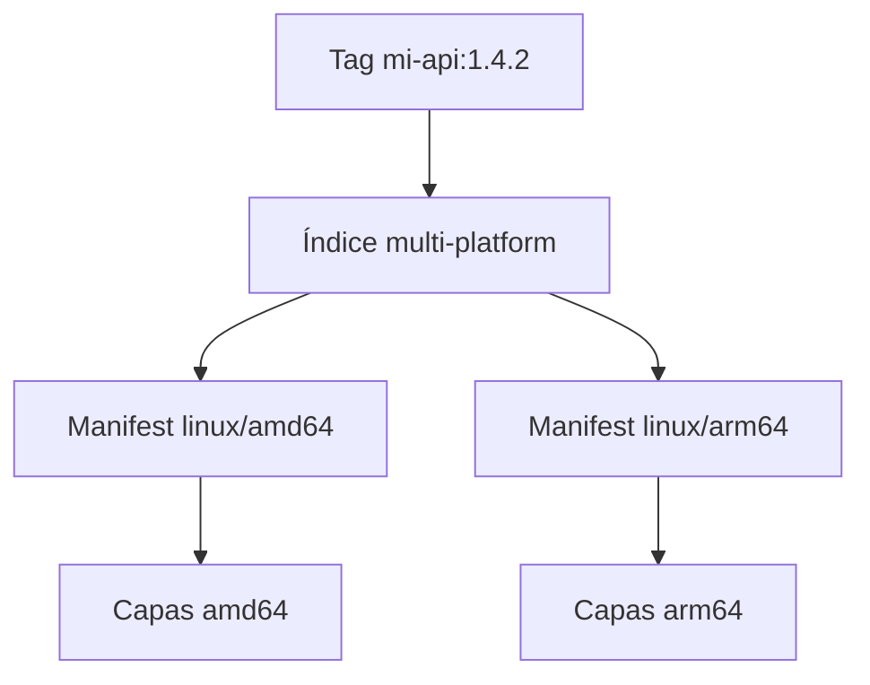

Construir no equivale a probar. Ejecuta pruebas por arquitectura nativa o con emulación consciente de sus límites.

### 16.4 Caché remota de build

En CI, BuildKit puede importar y exportar caché para reducir tiempos. La sintaxis depende del backend:

```bash
docker buildx build \
  --cache-from type=registry,ref=registry.example.com/equipo/mi-api:buildcache \
  --cache-to type=registry,ref=registry.example.com/equipo/mi-api:buildcache,mode=max \
  --tag registry.example.com/equipo/mi-api:sha-a1b2c3d \
  --push .
```

No permitas que secretos terminen en la caché y controla quién puede escribirla.

---

## 17. CI/CD y preparación para producción

### 17.1 Pipeline mínimo

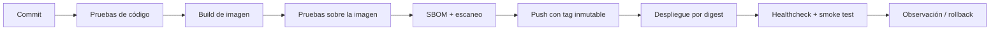

Secuencia genérica:

```bash
IMAGE="registry.example.com/equipo/mi-api:sha-${GIT_COMMIT}"

docker build --pull --tag "$IMAGE" .
docker run --rm "$IMAGE" python -m unittest
docker scout cves --exit-code --only-severity critical,high "$IMAGE"
docker push "$IMAGE"
```

Las variables del ejemplo deben provenir del sistema CI. Ajusta el umbral del escaneo y contempla excepciones documentadas; una lista de CVE sin contexto no sustituye análisis de riesgo.

### 17.2 Reproducibilidad

- fija versiones de dependencias con sus mecanismos de lock;
- evita descargar artefactos sin verificar durante el arranque;
- separa build y runtime;
- conserva la misma imagen entre pruebas y producción;
- registra el digest desplegado;
- no edites un contenedor en ejecución para “parcharlo”: reconstruye y reemplaza.

### 17.3 Migraciones de base de datos

No ejecutes migraciones destructivas de manera implícita en cada réplica. Usa un trabajo controlado, idempotente y observable antes o durante el despliegue. Diseña cambios compatibles hacia delante y atrás cuando haya varias versiones de la app activas.

### 17.4 Backups y restauración

Un volumen no es un backup. Define:

- frecuencia y retención;
- cifrado y ubicación separada;
- consistencia de aplicación/base de datos;
- responsable y alertas;
- pruebas periódicas de restauración;
- objetivos RPO y RTO.

### 17.5 Lo que Compose sí y no resuelve

Compose es excelente para desarrollo local, integración, demos y despliegues sencillos en un solo host. No ofrece por sí solo todo lo necesario para:

- alta disponibilidad entre hosts;
- scheduling y autoscaling distribuidos;
- actualizaciones progresivas complejas;
- gestión central de secretos y políticas;
- service discovery entre múltiples nodos;
- recuperación automática ante pérdida del host.

Cuando esas necesidades aparecen, evalúa una plataforma administrada u orquestador. Los conceptos aprendidos —imagen inmutable, salud, recursos, red, almacenamiento y configuración— siguen siendo aplicables.

### 17.6 Lista de salida a producción

| Área | Pregunta de verificación |
|---|---|
| Imagen | ¿base confiable, versión fijada, usuario no root, sin secretos? |
| Build | ¿reproducible, probado, escaneado y trazable a un commit? |
| Runtime | ¿filesystem, capacidades, recursos y puertos mínimos? |
| Salud | ¿liveness/readiness reales y parada ordenada? |
| Datos | ¿volumen apropiado, migraciones, backup y restauración probada? |
| Configuración | ¿secretos externos y valores por entorno? |
| Red | ¿solo se publican los servicios necesarios y hay TLS/autenticación? |
| Observabilidad | ¿logs, métricas, alertas y correlación? |
| Entrega | ¿tag inmutable/digest, estrategia de rollback y smoke test? |

---

## 18. Diagnóstico sistemático

No empieces borrando todo. Recorre la cadena desde el estado observable hasta la causa.

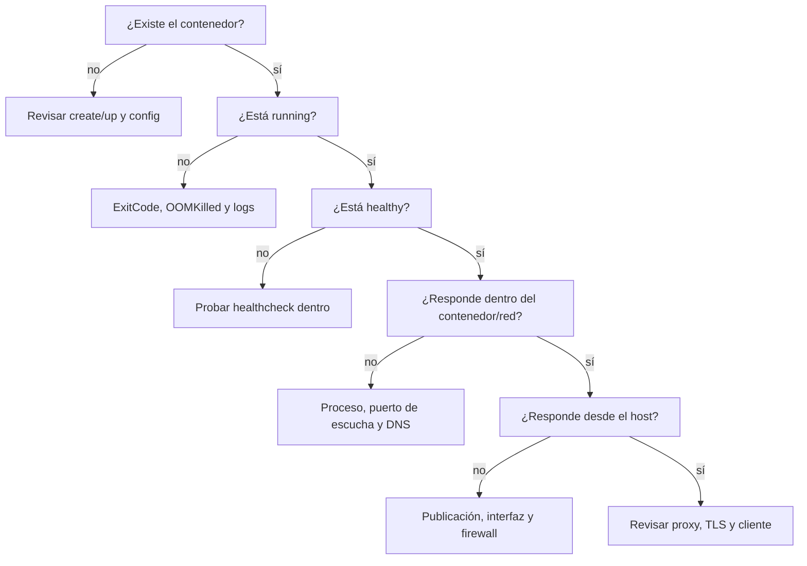

### 18.1 El contenedor sale inmediatamente

```bash
docker ps -a --filter name=mi-api
docker logs --tail 200 mi-api
docker inspect mi-api --format \
  'exit={{.State.ExitCode}} error={{.State.Error}} oom={{.State.OOMKilled}}'
docker inspect mi-api --format 'path={{.Path}} args={{json .Args}}'
```

Causas comunes:

- el proceso principal terminó normalmente;
- comando o argumentos incorrectos;
- archivo ejecutable ausente o sin permisos;
- configuración/secretos faltantes;
- arquitectura incompatible;
- OOM;
- la aplicación escuchó solo en `127.0.0.1` dentro del contenedor.

### 18.2 El puerto no responde

```bash
docker ps --format 'table {{.Names}}\t{{.Status}}\t{{.Ports}}'
docker port mi-api
docker logs mi-api
docker exec mi-api sh -c 'cat /proc/net/tcp /proc/net/tcp6'
```

Verifica en orden:

1. que el proceso esté vivo;
2. que escuche en `0.0.0.0` o `[::]`, no solo en loopback del contenedor;
3. que el puerto interno sea correcto;
4. que exista `-p` con el puerto de host esperado;
5. que no haya conflicto de puerto;
6. que firewall, proxy o VM de Docker permitan la ruta.

### 18.3 Un servicio no encuentra a otro

```bash
docker compose ps
docker compose exec api getent hosts db
docker network inspect visitas_backend
docker compose logs db
```

Comprueba que:

- ambos servicios comparten una red;
- usas el nombre de servicio y el puerto **interno**;
- no usas `localhost` para referirte a otro contenedor;
- la dependencia está saludable;
- credenciales y nombre de base son correctos.

### 18.4 El build ignora cambios o no usa caché

```bash
docker build --progress=plain -t mi-api:debug .
docker build --no-cache -t mi-api:debug .
docker image history mi-api:debug
```

Revisa contexto, `.dockerignore`, orden de `COPY`, generación de archivos, timestamps y argumentos que invaliden capas.

### 18.5 Disco lleno

```bash
docker system df -v
docker container ls -a
docker image ls
docker volume ls
docker builder du
```

Limpia por objetivo, no por reflejo:

```bash
docker container prune
docker image prune
docker builder prune
docker volume prune
docker system prune
```

Estos comandos eliminan recursos no usados según los criterios de Docker. `volume prune` y ciertas variantes de `system prune` pueden borrar datos que esperabas conservar. Revisa la lista, contexto y backups antes de confirmar.

### 18.6 Permisos en un volumen o bind mount

```bash
docker inspect mi-api --format '{{json .Mounts}}'
docker exec mi-api id
docker exec mi-api ls -ld /ruta /ruta/archivo
```

Soluciona la propiedad y UID/GID de forma deliberada. No uses `chmod -R 777`. En una imagen, `COPY --chown` suele ser preferible; en un volumen existente puede requerirse una inicialización controlada.

### 18.7 Compose parece usar configuración vieja

```bash
docker compose config
docker compose images
docker compose up -d --build --force-recreate
```

Distingue:

- reconstruir imagen (`--build`);
- recrear contenedor (`--force-recreate`);
- descargar imagen (`docker compose pull`);
- eliminar datos (`down -v`, normalmente innecesario y destructivo).

---

## 19. Laboratorios incrementales

Realiza cada laboratorio en una carpeta nueva. Usa nombres con prefijo `guia-` para identificar recursos y limpia solo lo que creaste.

### Laboratorio 1 — ciclo de vida

**Objetivo:** ejecutar Nginx como `guia-web`, publicarlo en `127.0.0.1:8080`, consultar la página, detenerlo, iniciarlo de nuevo y eliminarlo sin borrar la imagen.

**Criterio de salida:** puedes predecir qué mostrarán `docker ps`, `docker ps -a` y `docker image ls` después de cada acción.

<details>
<summary>Solución orientativa</summary>

```bash
docker run -d --name guia-web -p 127.0.0.1:8080:80 nginx:1.28-alpine
curl http://localhost:8080
docker stop guia-web
docker ps -a --filter name=guia-web
docker start guia-web
docker rm -f guia-web
docker image ls nginx
```

</details>

### Laboratorio 2 — imagen propia

**Objetivo:** crear la API de la sección 6, construir `guia-api:1.0`, cambiar el mensaje, construir `1.1` e identificar qué capas se reutilizan.

**Criterio de salida:** explicas la diferencia temporal entre `RUN` y `CMD`, y la diferencia entre `EXPOSE` y `-p`.

<details>
<summary>Comprobaciones</summary>

```bash
docker build --progress=plain -t guia-api:1.0 .
docker run --rm -d --name guia-api -p 127.0.0.1:8000:8000 guia-api:1.0
curl http://localhost:8000/
docker inspect guia-api --format '{{.Config.Image}} {{json .Config.Cmd}}'
docker stop guia-api
docker image history guia-api:1.0
```

</details>

### Laboratorio 3 — persistencia

**Objetivo:** escribir un archivo en un volumen desde un contenedor, leerlo desde otro, hacer una copia y restaurarla en un volumen nuevo.

**Criterio de salida:** el primer contenedor ya no existe y el segundo volumen conserva el archivo.

<details>
<summary>Ruta sugerida</summary>

Usa los comandos de la sección 8 con los volúmenes `guia-datos` y `guia-datos-restaurados`. Compara:

```bash
docker volume inspect guia-datos guia-datos-restaurados
```

</details>

### Laboratorio 4 — red privada

**Objetivo:** ejecutar Nginx y un cliente temporal en `guia-net`; consultar Nginx por nombre sin publicar un puerto.

**Criterio de salida:** puedes dibujar la ruta DNS y explicar por qué el host no accede directamente al servicio.

<details>
<summary>Solución orientativa</summary>

```bash
docker network create guia-net
docker run -d --name guia-nginx --network guia-net nginx:1.28-alpine
docker run --rm --network guia-net curlimages/curl:8.15.0 http://guia-nginx
docker rm -f guia-nginx
docker network rm guia-net
```

</details>

### Laboratorio 5 — Compose y base de datos

**Objetivo:** completar la sección 11, hacer tres visitas, recrear el stack y verificar que el contador continúa.

**Criterio de salida:** `docker compose ps` muestra servicios sanos y puedes consultar las filas con `psql`.

**Extensión:** reemplaza la contraseña en variable de entorno por un secreto como archivo y adapta la aplicación para leer `POSTGRES_PASSWORD_FILE`.

### Laboratorio 6 — fallo controlado

**Objetivo:** provoca por separado estos fallos y diagnostícalos sin borrar el volumen:

1. puerto de host ocupado;
2. contraseña de base incorrecta;
3. healthcheck con puerto erróneo;
4. límite de memoria insuficiente;
5. código que escucha en `127.0.0.1` dentro del contenedor.

**Criterio de salida:** para cada fallo registra síntoma, comando de evidencia, causa y corrección.

### Laboratorio 7 — imagen lista para entrega

**Objetivo:** mejora una imagen propia con usuario no root, multi-stage cuando aplique, filesystem de solo lectura, healthcheck, límites y un tag ligado al commit Git.

**Criterio de salida:** otra persona puede construirla, probarla y explicar su superficie de ejecución solo con el repositorio.

### Evaluación final

Puedes considerar que dominas lo necesario para trabajar con Docker cuando puedes, sin ensayo ciego:

- leer un Dockerfile y anticipar build, runtime y caché;
- inspeccionar un contenedor y explicar su comando, usuario, mounts, red y puertos;
- construir un Compose file con aplicación, dependencia, salud y persistencia;
- distinguir recrear un contenedor de eliminar sus datos;
- diagnosticar salida inmediata, DNS, puerto, salud, permisos y OOM;
- publicar una imagen trazable sin incluir secretos;
- revisar una configuración con criterios mínimos de seguridad y producción.

---

## 20. Cheat sheet y siguientes pasos

### Contenedores

```bash
docker run --rm IMAGE COMANDO
docker run -d --name NOMBRE -p 127.0.0.1:8080:80 IMAGE
docker ps | docker ps -a
docker logs -f --tail 100 CONTENEDOR
docker exec -it CONTENEDOR sh
docker inspect CONTENEDOR
docker stop CONTENEDOR
docker start CONTENEDOR
docker rm CONTENEDOR
```

### Imágenes y build

```bash
docker image ls
docker pull IMAGEN:TAG
docker build -t IMAGEN:TAG .
docker build --pull --progress=plain -t IMAGEN:TAG .
docker image history IMAGEN:TAG
docker image inspect IMAGEN:TAG
docker image save -o imagen.tar IMAGEN:TAG
docker image load -i imagen.tar
docker tag ORIGEN:TAG REGISTRO/REPO:TAG
docker push REGISTRO/REPO:TAG
```

### Volúmenes y redes

```bash
docker volume create NOMBRE
docker volume ls | docker volume inspect NOMBRE
docker network create NOMBRE
docker network ls | docker network inspect NOMBRE

docker run --mount type=volume,source=DATOS,target=/data IMAGE
docker run --mount type=bind,source="$PWD",target=/app,readonly IMAGE
docker run --network RED IMAGE
```

### Compose

```bash
docker compose config
docker compose pull
docker compose up -d --build --wait
docker compose ps
docker compose logs -f --tail 100 SERVICIO
docker compose exec SERVICIO COMANDO
docker compose run --rm SERVICIO COMANDO
docker compose restart SERVICIO
docker compose down
docker compose down -v      # también borra volúmenes: destructivo para sus datos
```

### Diagnóstico

```bash
docker version
docker info
docker context show
docker stats
docker events
docker system df -v
docker inspect CONTENEDOR --format \
  'status={{.State.Status}} exit={{.State.ExitCode}} oom={{.State.OOMKilled}}'
```

### Mapa de decisión rápido

| Necesidad | Herramienta |
|---|---|
| empaquetar una aplicación | Dockerfile + `docker build` |
| ejecutar una imagen | `docker run` |
| cambiar configuración sin reconstruir | variables, archivos o secretos en runtime |
| conservar datos | volumen; bind mount si el host debe administrarlos directamente |
| comunicar contenedores | red definida por el usuario y DNS por nombre |
| exponer al host | `-p`, publicando solo lo necesario |
| ejecutar varios servicios | Compose |
| investigar un fallo | `ps -a`, `logs`, `inspect`, salud, red y recursos |
| corregir una imagen | modificar Dockerfile, reconstruir y reemplazar |
| alta disponibilidad multinodo | plataforma administrada u orquestador |

### Fuentes oficiales y temas para profundizar

- [Introducción y conceptos de Docker](https://docs.docker.com/get-started/docker-concepts/)
- [Instalación de Docker Engine](https://docs.docker.com/engine/install/)
- [Referencia de Dockerfile](https://docs.docker.com/reference/dockerfile/)
- [Buenas prácticas de build](https://docs.docker.com/build/building/best-practices/)
- [Almacenamiento](https://docs.docker.com/engine/storage/)
- [Redes](https://docs.docker.com/engine/network/)
- [Modelo y referencia de Compose](https://docs.docker.com/compose/intro/compose-application-model/)
- [Seguridad de Docker Engine](https://docs.docker.com/engine/security/)
- [Límites de recursos](https://docs.docker.com/engine/containers/resource_constraints/)

Después de dominar esta guía, el siguiente paso depende del rol:

- desarrollo: Compose Watch, Dev Containers y depuración desde el IDE;
- plataforma: BuildKit avanzado, registros, firma/provenance, rootless y políticas;
- operaciones: observabilidad, backups, alta disponibilidad y un orquestador;
- datos: consistencia de volúmenes, migraciones y recuperación ante desastres;
- seguridad: modelado de amenazas, escaneo continuo y cadena de suministro.
