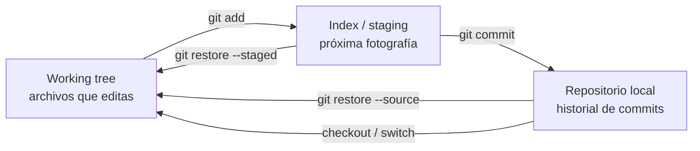
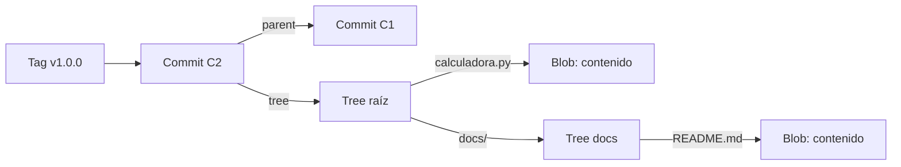
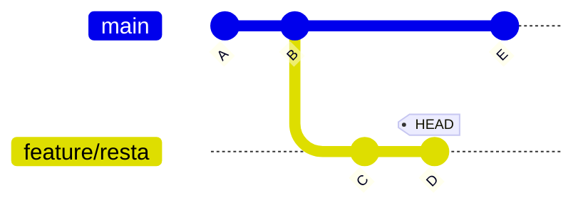
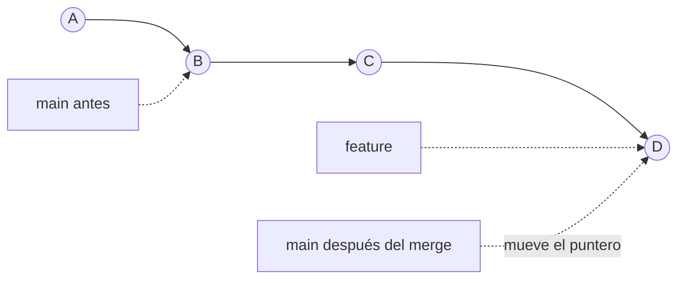
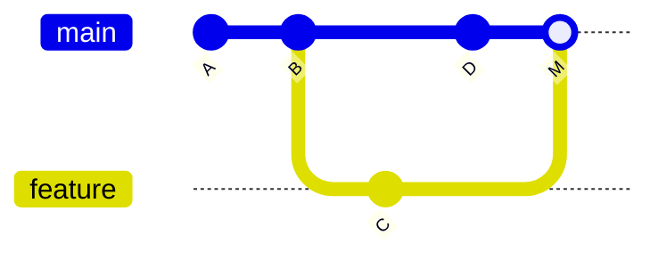
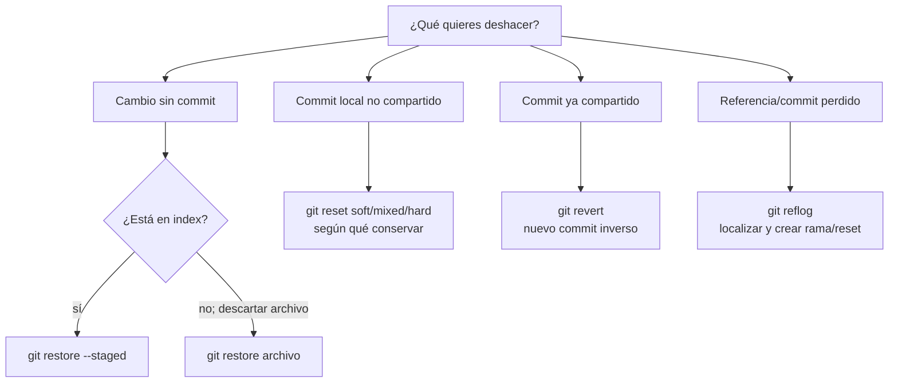
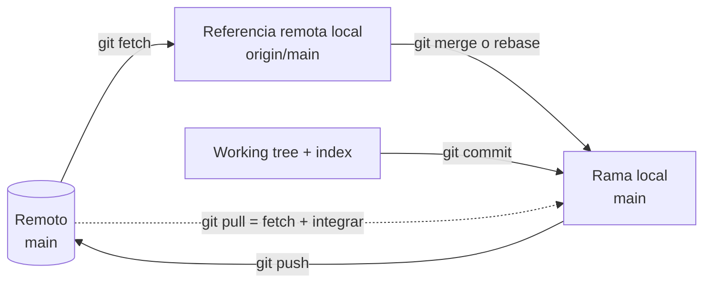
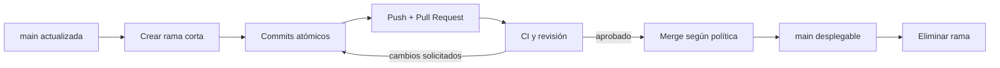
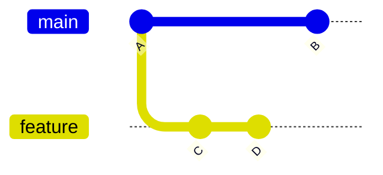
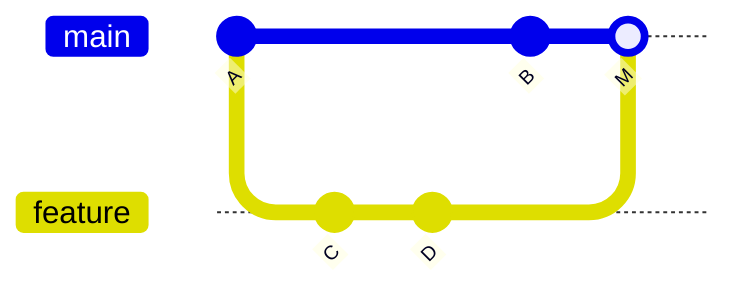

# Guía completa de Git — de principiante a experto

Guía teórico-práctica de Git: qué es, cómo piensa por dentro y cómo trabajar en equipo sin miedo a “romper” el repositorio. Cubre desde `git init` hasta rebase interactivo, resolución de conflictos, flujos colaborativos y las herramientas que salvan el día cuando algo sale mal (`reflog`, `bisect`, `revert`).

Todos los ejemplos usan un mismo proyecto de juguete en Python: una calculadora simple. El laboratorio se crea con los comandos de la propia guía; no depende de scripts ni archivos externos.

> **Cómo usar esta guía:** avanza por etapas la primera vez. Lee el concepto, predice el resultado del comando, ejecútalo y compruébalo con `git status` o `git log`. Los puntos de control indican cuándo conviene pasar a la siguiente etapa.

---

## Ruta incremental

| Etapa | Secciones | Resultado observable |
|---|---:|---|
| 0. Orientación | 1–2 | Distingues Git de una plataforma remota y tienes identidad/configuración listas |
| 1. Modelo local | 3–5 | Mueves cambios entre working tree, index e historial y creas commits atómicos |
| 2. Historial paralelo | 6–7 | Creas ramas, haces merge y resuelves un conflicto sin perder trabajo |
| 3. Recuperación | 8 | Eliges entre `restore`, `reset`, `revert` y `reflog` según el estado del cambio |
| 4. Colaboración | 9–10 | Sincronizas remotos y aplicas un flujo de ramas apropiado |
| 5. Historia avanzada | 11–12 | Usas rebase, cherry-pick, stash y tags con límites claros |
| 6. Diagnóstico | 13 | Encuentras regresiones y trabajas en varias ramas de manera eficiente |
| 7. Autonomía | 14–15 | Resuelves laboratorios acumulativos y consultas la referencia rápida |

### Regla de avance

No memorices una lista de comandos. En cada operación identifica primero:

1. qué referencia, commit, index o archivo cambiará;
2. si la historia ya se compartió;
3. cómo comprobarás el resultado;
4. cómo volverías atrás si la predicción fuera incorrecta.

---

## Índice

1. [Introducción a Git y al control de versiones](#1-introducción-a-git-y-al-control-de-versiones)
2. [Instalación y configuración inicial](#2-instalación-y-configuración-inicial)
3. [El modelo mental de Git: los 3 estados y los objetos internos](#3-el-modelo-mental-de-git-los-3-estados-y-los-objetos-internos)
4. [Primeros pasos: crear, clonar e inspeccionar un repositorio](#4-primeros-pasos-crear-clonar-e-inspeccionar-un-repositorio)
5. [Commits a fondo: anatomía, buenas prácticas y Conventional Commits](#5-commits-a-fondo-anatomía-buenas-prácticas-y-conventional-commits)
6. [Ramas (branching) y merge](#6-ramas-branching-y-merge)
7. [Resolviendo conflictos de merge](#7-resolviendo-conflictos-de-merge)
8. [Deshacer cambios: restore, reset, revert y reflog](#8-deshacer-cambios-restore-reset-revert-y-reflog)
9. [Trabajo con remotos: fetch, pull, push](#9-trabajo-con-remotos-fetch-pull-push)
10. [Flujos de trabajo colaborativos](#10-flujos-de-trabajo-colaborativos)
11. [Rebase interactivo, cherry-pick y stash](#11-rebase-interactivo-cherry-pick-y-stash)
12. [Tags y versionado semántico](#12-tags-y-versionado-semántico)
13. [Herramientas avanzadas: bisect, blame, worktree, hooks](#13-herramientas-avanzadas-bisect-blame-worktree-hooks)
14. [Ejercicios prácticos](#14-ejercicios-prácticos)
15. [Cheat-sheet de referencia rápida](#15-cheat-sheet-de-referencia-rápida)

---

## 1. Introducción a Git y al control de versiones

Un **sistema de control de versiones** (VCS) registra el historial de cambios de un conjunto de archivos, permitiendo volver a cualquier punto anterior, comparar versiones, y que varias personas trabajen sobre el mismo código sin pisarse el trabajo mutuamente.

**Git** es un VCS **distribuido**: a diferencia de sistemas antiguos centralizados (como Subversion/CVS, donde solo el servidor tiene el historial completo), en Git **cada copia local del repositorio contiene el historial completo**. Esto tiene consecuencias enormes:

- Puedes hacer commits, ver el historial, crear ramas, etc. **sin conexión a internet** — solo necesitas red para sincronizar con otros (`push`/`pull`).
- No existe un único "servidor central" obligatorio: cualquier copia puede actuar como referencia.
- Es rápido: casi todas las operaciones son locales (no viajan por red).

### Git no es lo mismo que GitHub/GitLab/Bitbucket

Esta es la primera confusión de todo principiante: **Git es la herramienta** (el programa que corre en tu computadora y gestiona el historial); **GitHub, GitLab y Bitbucket son plataformas** que alojan repositorios Git en la nube y añaden funcionalidades sociales/colaborativas encima (Pull Requests, Issues, CI/CD, revisión de código). Podrías usar Git toda tu carrera sin tocar GitHub jamás (por ejemplo, sincronizando entre dos servidores propios).

### ¿Por qué es tan importante dominarlo?

Git es, junto con el propio lenguaje de programación, la herramienta que más se usa **todos los días** en el trabajo de cualquier programador. La mayoría de los problemas graves ("perdí mi código", "el equipo entero se bloqueó", "no sé cómo deshacer esto") vienen de no entender el **modelo mental** de Git — no de que los comandos sean difíciles de memorizar. Por eso esta guía dedica la sección 3 completa a explicar cómo piensa Git por dentro, antes de correr comandos.

---

## 2. Instalación y configuración inicial

```bash
# Debian/Ubuntu
sudo apt install git

# macOS (Homebrew)
brew install git

# Verificar versión instalada
git --version
```

Los ejemplos asumen Git 2.28 o posterior para poder usar `switch`, `restore` e `init -b`. Si trabajas con una versión anterior, actualízala o consulta las equivalencias con `checkout` y `reset` que se indican en las secciones correspondientes.

### 2.1 Identidad: quién hace los commits

Git graba en cada commit **quién** lo hizo. Esto es obligatorio configurarlo antes de tu primer commit:

```bash
git config --global user.name "Ana Pérez"
git config --global user.email "ana@example.com"
```

### 2.2 Los 3 niveles de configuración

| Nivel | Bandera | Dónde se guarda | Alcance |
|---|---|---|---|
| **System** | `--system` | `/etc/gitconfig` | todos los usuarios de la máquina |
| **Global** | `--global` | `~/.gitconfig` | todos los repositorios de tu usuario |
| **Local** | (sin bandera, o `--local`) | `.git/config` dentro del repo | solo ese repositorio |

Un valor **local** siempre gana sobre uno **global**, que a su vez gana sobre uno de **system**. Esto es útil, por ejemplo, para usar tu email personal por defecto pero un email distinto solo en los repos del trabajo:

**Ejemplo 1 — configurar un email distinto solo para un repositorio específico:**
```bash
cd ~/proyectos/trabajo
git config user.email "miranda@empresa.com"   # sin --global: solo aplica aquí
```

**Ejemplo 2 — ver de dónde viene cada valor de configuración:**
```bash
git config --list --show-origin
```

**Ejemplo 3 — configurar el editor por defecto (el que se abre para mensajes de commit largos, rebase interactivo, etc.):**
```bash
git config --global core.editor "vim"
# Alternativas: "code --wait" (VS Code), "nano"
```

**Ejemplo 4 — la rama por defecto al hacer `git init` (desde Git 2.28+):**
```bash
git config --global init.defaultBranch main
```

### 2.3 Alias — atajos para comandos que escribes constantemente

**Ejemplo 1 — alias básicos que ahorran muchísimo tecleo:**
```bash
git config --global alias.st "status"
git config --global alias.co "checkout"
git config --global alias.br "branch"
git config --global alias.cm "commit -m"
```

**Ejemplo 2 — un `log` legible y compacto como alias:**
```bash
git config --global alias.lg "log --oneline --graph --decorate --all"
# Uso: git lg
```

**Ejemplo 3 — deshacer el último commit sin perder los cambios (ver sección 8):**
```bash
git config --global alias.undo "reset --soft HEAD~1"
```

**Ejemplo 4 — ver los alias configurados:**
```bash
git config --get-regexp alias
```

### 2.4 `.gitignore` — qué archivos NUNCA debe rastrear Git

Un archivo `.gitignore` en la raíz del proyecto le dice a Git qué archivos/carpetas ignorar (no ofrecerlos para `git add`, no avisar que están "sin trackear").

**Ejemplo 1 — `.gitignore` típico de un proyecto Python:**
```gitignore
__pycache__/
*.pyc
.venv/
venv/
.env
*.egg-info/
dist/
build/
.pytest_cache/
```

**Ejemplo 2 — patrones con comodines:**
```gitignore
*.log          # cualquier archivo .log en cualquier carpeta
logs/          # una carpeta completa
!logs/.gitkeep # excepción: SÍ rastrear este archivo específico dentro de logs/
/config.local.yml  # solo el de la raíz, no en subcarpetas
```

**Ejemplo 3 — ignorar un archivo que YA estaba siendo rastreado (agregarlo a `.gitignore` no basta):**
```bash
git rm --cached config.local.yml   # deja de rastrearlo, pero NO borra el archivo del disco
echo "config.local.yml" >> .gitignore
git add .gitignore
git commit -m "chore: dejar de versionar config local"
```

**Ejemplo 4 — plantillas globales de `.gitignore` (para editores/SO, sin ensuciar el repo del proyecto):**
```bash
git config --global core.excludesfile ~/.gitignore_global
echo ".DS_Store" >> ~/.gitignore_global
echo ".vscode/" >> ~/.gitignore_global
```

### 2.5 Laboratorio base autocontenido

Crea una carpeta separada para practicar. No uses un proyecto importante mientras aprendes comandos que reescriben historial.

```bash
mkdir guia-git
cd guia-git
git init -b main

printf '%s\n' \
  'def sumar(a, b):' \
  '    return a + b' > calculadora.py

printf '%s\n' \
  '# Calculadora' \
  '' \
  'Proyecto de práctica para aprender Git.' > README.md

printf '%s\n' '__pycache__/' '*.pyc' '.venv/' > .gitignore

git status
git add README.md calculadora.py .gitignore
git commit -m "feat: crear calculadora inicial"
git log --oneline --decorate
```

Todo el resto de la guía puede practicarse sobre esta carpeta. Si quieres reiniciar el laboratorio, elimina **solo esta carpeta de práctica** y vuelve a ejecutar el bloque.

### Punto de control 0

Antes de avanzar:

1. `git config user.name` y `git config user.email` devuelven la identidad esperada;
2. `git status` indica que no hay cambios pendientes;
3. `git log --oneline` muestra el commit inicial;
4. puedes explicar qué archivo hace que la carpeta sea un repositorio Git.

---

## 3. El modelo mental de Git: los 3 estados y los objetos internos

Esta es, con diferencia, la sección más importante de toda la guía. Entender esto hace que el resto de los comandos dejen de sentirse "mágicos" o arbitrarios.

### 3.1 Los 3 estados de un archivo

Un archivo dentro de un repositorio Git vive en uno de estos 3 lugares (o "áreas"):



| Área | Qué es | Comando para moverse hacia ella |
|---|---|---|
| **Working Directory** | Los archivos tal cual los ves y editas en tu carpeta | (es donde editas normalmente) |
| **Staging Area / Index** | Una "zona de preparación": los cambios que **serán incluidos** en el próximo commit | `git add` |
| **Repositorio (.git)** | El historial permanente de commits ya confirmados | `git commit` |

**Por qué existe el staging area (la pregunta que todo principiante se hace):** te permite construir un commit **a propósito**, incluyendo solo parte de tus cambios. Si modificaste 3 archivos pero solo 2 de esos cambios están relacionados entre sí, puedes hacer `git add` solo de esos 2 y dejar el tercero para otro commit — sin tener que deshacer nada.

**Ejemplo 1 — ver en qué estado está cada archivo:**
```bash
git status
```

**Ejemplo 2 — mover un archivo del working directory al staging area:**
```bash
git add calculadora.py
```

**Ejemplo 3 — mover TODO lo modificado al staging area:**
```bash
git add .
# o, de forma más explícita sobre archivos rastreados + nuevos:
git add -A
```

**Ejemplo 4 — sacar un archivo del staging area SIN perder los cambios (devolverlo a "modified"):**
```bash
git restore --staged calculadora.py
```

**Ejemplo 5 (variante clave) — hacer `add` de solo una PARTE de un archivo (staging parcial):**
```bash
git add -p calculadora.py
# Git te muestra cada "hunk" (bloque de cambios) y te pregunta y/n/s/... si lo quieres agregar
# Esto es lo que hace posible construir commits verdaderamente atómicos.
```

### 3.2 Los objetos internos de Git (lo que hay dentro de `.git/`)

Git, en su núcleo, es una base de datos de objetos **direccionados por contenido**: cada objeto se identifica por el hash SHA-1 (o SHA-256 en repos nuevos) de su propio contenido. Hay 4 tipos de objetos:

| Objeto | Qué guarda |
|---|---|
| **blob** | el contenido de un archivo (sin su nombre ni metadatos) |
| **tree** | una "carpeta": lista de blobs y otros trees, con sus nombres y permisos |
| **commit** | un puntero a un tree (la foto completa del proyecto en ese momento) + puntero(s) al/los commit(s) padre + autor + mensaje |
| **tag** | (tag anotado) un puntero a un commit específico, con metadatos propios |



**La idea clave:** un commit **no guarda un "diff"** — guarda una **foto completa** del árbol de archivos en ese momento (aunque Git es lo bastante inteligente para comprimir y no duplicar contenido idéntico entre commits).

**Ejemplo 1 — inspeccionar el tipo de un objeto por su hash:**
```bash
git cat-file -t <hash>   # devuelve: blob, tree, commit o tag
```

**Ejemplo 2 — ver el contenido de un commit:**
```bash
git cat-file -p <hash_del_commit>
# Muestra: tree <hash>, parent <hash>, author, committer, y el mensaje
```

**Ejemplo 3 — ver el contenido de un blob (el contenido crudo de un archivo versionado):**
```bash
git cat-file -p <hash_del_blob>
```

**Ejemplo 4 — Git como grafo dirigido acíclico (DAG): cada commit apunta a su padre:**
```bash
git log --graph --oneline --all
# Cada línea es un commit; las ramas visualmente son solo "caminos" distintos en ese grafo
```

### 3.3 `HEAD` y las ramas: solo son punteros

Una **rama** en Git no es una copia del código: es una referencia pequeña que contiene el identificador del último commit de esa rama. `HEAD` es, a su vez, un puntero que indica **en qué rama estás parado** (o, en "detached HEAD", directamente a un commit).

> En repositorios que usan SHA-256 la referencia hexadecimal es más larga; lo importante es que una rama es una referencia ligera a un commit, no una copia de los archivos.



En el diagrama, `main` y `feature/resta` son punteros a commits distintos. `HEAD` indica qué rama recibirá el próximo commit.

**Ejemplo 1 — ver a qué rama apunta HEAD:**
```bash
git symbolic-ref --short HEAD
# main
```

**Ejemplo 2 — ver a qué commit apunta una rama:**
```bash
git rev-parse refs/heads/main
# <hash del último commit de main>
```

**Ejemplo 3 — por qué crear una rama es "instantáneo" y "barato": solo crea un archivo nuevo:**
```bash
git branch mi-nueva-rama
git rev-parse mi-nueva-rama          # el mismo hash que main, apenas se crea
```

**Ejemplo 4 — "detached HEAD": pararte directo en un commit, sin ninguna rama:**
```bash
git switch --detach <hash_de_un_commit_viejo>
# Git te avisa: "You are in 'detached HEAD' state"
# Puedes mirar el código de ese momento, pero si haces un commit aquí y luego
# cambias de rama sin haber creado una nueva, ese commit puede quedar "huérfano"
# (recuperable con reflog, ver sección 8.4, pero es una fuente común de sustos)
```

---

## 4. Primeros pasos: crear, clonar e inspeccionar un repositorio

### 4.1 `git init` vs `git clone`

**Ejemplo 1 — iniciar un repositorio nuevo desde cero:**
```bash
mkdir mi-proyecto && cd mi-proyecto
git init
```

**Ejemplo 2 — clonar un repositorio ya existente (trae TODO el historial):**
```bash
git clone https://github.com/usuario/repositorio.git
```

**Ejemplo 3 — clonar solo con el historial reciente (`shallow clone`, útil para repos enormes en CI):**
```bash
git clone --depth 1 https://github.com/usuario/repositorio.git
```

**Ejemplo 4 — clonar y ponerle otro nombre a la carpeta local:**
```bash
git clone https://github.com/usuario/repositorio.git carpeta-local
```

### 4.2 `git status` y `git diff`

**Ejemplo 1 — estado resumido vs detallado:**
```bash
git status              # detallado
git status --short       # compacto: "M archivo.py", "?? nuevo.py", "A agregado.py"
```

**Ejemplo 2 — ver cambios en el working directory que AÚN no están en staging:**
```bash
git diff
```

**Ejemplo 3 — ver cambios que YA están en staging (lo que iría en el próximo commit):**
```bash
git diff --staged
# o, equivalente:
git diff --cached
```

**Ejemplo 4 — comparar dos commits o dos ramas entre sí:**
```bash
git diff main feature/nueva-funcion
git diff HEAD~3 HEAD
```

### 4.3 `git log` — explorar el historial

**Ejemplo 1 — vista compacta, una línea por commit:**
```bash
git log --oneline
```

**Ejemplo 2 — vista gráfica de ramas y merges:**
```bash
git log --oneline --graph --all --decorate
```

**Ejemplo 3 — filtrar por autor, por fecha o por contenido del mensaje:**
```bash
git log --author="Miranda"
git log --since="2 weeks ago" --until="yesterday"
git log --grep="fix:"
```

**Ejemplo 4 — ver qué cambió en el contenido, no solo los mensajes (`-p` de "patch"):**
```bash
git log -p -- calculadora.py    # el diff completo de cada commit que tocó ese archivo
```

**Ejemplo 5 (variante muy usada) — buscar commits que agregaron o quitaron una palabra específica del código ("pickaxe"):**
```bash
git log -S "def dividir" --oneline
# Encuentra los commits donde el NÚMERO de apariciones de ese texto cambió
```

### Punto de control 1 — estados e inspección

Sobre el laboratorio base:

1. modifica `calculadora.py` y comprueba el cambio con `git diff`;
2. llévalo al index y demuestra que ahora aparece en `git diff --staged`;
3. sácalo del index sin perderlo;
4. vuelve a añadirlo, crea un commit y localízalo con `git log` y `git show`.

El objetivo no es recordar banderas: debes poder predecir en cuál de las tres áreas se encuentra el cambio después de cada paso.

---

## 5. Commits a fondo: anatomía, buenas prácticas y Conventional Commits

### 5.1 Anatomía de un commit

Cada commit guarda:

- Un **hash** único (identificador de contenido, no secuencial)
- El **árbol** (tree) completo del proyecto en ese momento
- Uno o más **padres** (0 padres si es el primer commit, 2+ si es un merge commit)
- **Autor** (quién escribió el cambio) y **committer** (quién lo aplicó al historial — pueden diferir, por ejemplo tras un rebase hecho por otra persona)
- Un **mensaje**

**Ejemplo 1 — crear un commit:**
```bash
git add calculadora.py
git commit -m "feat: agregar función de división"
```

**Ejemplo 2 — ver el detalle completo de un commit (autor, fecha, hash, diff):**
```bash
git show <hash>
```

**Ejemplo 3 — commit con mensaje largo (título + cuerpo), abriendo el editor:**
```bash
git commit
# Se abre tu editor configurado (ver 2.2); primera línea = título corto,
# línea en blanco, luego el cuerpo con el detalle/motivación del cambio.
```

**Ejemplo 4 — saltarse el staging area para archivos YA rastreados (`-a`):**
```bash
git commit -a -m "fix: corregir división por cero"
# Equivale a "git add -u" (solo archivos ya rastreados) + commit.
# OJO: NO incluye archivos nuevos sin rastrear todavía.
```

### 5.2 Commits atómicos — la práctica más importante de esta sección

Un commit **atómico** contiene un único cambio lógico y coherente: se puede describir con una sola frase, revertir sin arrastrar cosas no relacionadas, y revisar (`code review`) de forma aislada.

**Por qué importa:** si mezclas en un commit "arreglé el bug X" + "renombré 10 variables" + "agregué una función nueva", ese commit se vuelve imposible de revertir limpiamente si solo el bug fix causó un problema, y muy difícil de revisar.

**Ejemplo 1 — mal (commit "mezcla"):**
```bash
# Cambié el cálculo de impuestos, renombré una variable en otro archivo,
# Y actualicé el README... todo junto:
git add .
git commit -m "cambios varios"
```

**Ejemplo 2 — bien (separado en 3 commits atómicos, usando `git add -p` cuando hace falta):**
```bash
git add calculo_impuestos.py
git commit -m "fix: corregir redondeo en cálculo de impuestos"

git add utilidades.py
git commit -m "refactor: renombrar variable 'x' a 'monto_total'"

git add README.md
git commit -m "docs: actualizar instrucciones de instalación"
```

**Ejemplo 3 — usar `git add -p` para separar cambios que quedaron mezclados en el mismo archivo:**
```bash
git add -p calculadora.py
# y en el prompt: y (sí, agregar este hunk), n (no), s (dividir el hunk en partes más chicas)
```

**Ejemplo 4 — regla práctica para saber si un commit es atómico:** si al escribir el mensaje necesitas la palabra "**y**" o "**además**" para describirlo, probablemente debería ser 2 commits.

### 5.3 Conventional Commits — un formato estándar para mensajes

[Conventional Commits](https://www.conventionalcommits.org/) es una convención (no una regla de Git en sí) muy adoptada en la industria, que estructura el mensaje así:

```
<tipo>[ámbito opcional]: <descripción corta>

[cuerpo opcional, explica el "por qué", no el "qué"]

[footer opcional: BREAKING CHANGE, referencias a issues]
```

| Tipo | Cuándo usarlo |
|---|---|
| `feat` | una nueva funcionalidad para el usuario |
| `fix` | corrección de un bug |
| `docs` | solo cambios de documentación |
| `style` | formato, espacios, punto y coma — sin cambiar lógica |
| `refactor` | reestructurar código sin cambiar comportamiento |
| `test` | agregar o corregir tests |
| `chore` | tareas de mantenimiento (dependencias, configuración, build) |
| `perf` | mejora de rendimiento |
| `ci` | cambios en configuración de integración continua |

**Ejemplo 1 — commits simples:**
```bash
git commit -m "feat: agregar función de multiplicación a la calculadora"
git commit -m "fix: evitar división entre cero"
git commit -m "docs: documentar uso del módulo calculadora"
```

**Ejemplo 2 — con ámbito (`scope`), útil en proyectos grandes con varios módulos:**
```bash
git commit -m "feat(auth): agregar login con Google"
git commit -m "fix(api): corregir timeout en endpoint de pagos"
```

**Ejemplo 3 — un cambio que rompe compatibilidad (`BREAKING CHANGE`), relevante para versionado semántico (ver sección 12):**
```bash
git commit -m "feat(api)!: cambiar formato de respuesta a JSON:API

BREAKING CHANGE: los clientes que parseaban el formato anterior deben actualizarse."
```

**Ejemplo 4 — referenciar un issue/ticket en el footer:**
```bash
git commit -m "fix: corregir cálculo de intereses compuestos

Closes #142"
```

**Por qué vale la pena adoptarlo:** permite generar automáticamente un `CHANGELOG`, decidir automáticamente el siguiente número de versión semántica (`fix` → patch, `feat` → minor, `BREAKING CHANGE` → major), y hace que `git log` sea legible como una bitácora real del proyecto.

### 5.4 `git commit --amend` — corregir el último commit

**Ejemplo 1 — corregir solo el mensaje del último commit:**
```bash
git commit --amend -m "fix: mensaje corregido"
```

**Ejemplo 2 — se te olvidó incluir un archivo en el último commit:**
```bash
git add archivo_olvidado.py
git commit --amend --no-edit    # --no-edit: mantiene el mensaje original
```

**Ejemplo 3 — regla de oro: `--amend` reescribe el hash del commit. Nunca lo hagas sobre un commit que YA empujaste (`push`) y que otros ya descargaron:**
```bash
# Si el commit todavía es solo local, normalmente no afecta a colaboradores.
# Aun así cambia el hash y puede invalidar firmas o referencias externas.
# Si ya hiciste push, --amend + push --force puede "desaparecer" el commit
# original para tus compañeros de equipo, causando conflictos confusos.
```

**Ejemplo 4 — cambiar la fecha de autoría (casos raros, ej. importar historial):**
```bash
git commit --amend --date="2026-07-01T10:00:00"
```

### Punto de control 2 — commits intencionales

Haz dos cambios no relacionados en `calculadora.py`: agrega `restar` y corrige el formato de `sumar`. Usa `git add -p` para crear dos commits atómicos. Comprueba con:

```bash
git log --oneline --decorate -3
git show --stat HEAD
git show --stat HEAD~1
```

Puedes avanzar si cada commit se entiende, prueba y revierte por separado.

---

## 6. Ramas (branching) y merge

### 6.1 Crear, cambiar y borrar ramas

**Ejemplo 1 — crear una rama y moverte a ella (comando moderno):**
```bash
git switch -c feature/multiplicacion
# Equivalente clásico (pre Git 2.23): git checkout -b feature/multiplicacion
```

**Ejemplo 2 — listar ramas (locales, remotas, o ambas):**
```bash
git branch                 # solo locales
git branch -r              # solo remotas
git branch -a               # todas
```

**Ejemplo 3 — cambiar entre ramas ya existentes:**
```bash
git switch main
# Equivalente clásico: git checkout main
```

**Ejemplo 4 — borrar una rama (segura vs forzada):**
```bash
git branch -d feature/multiplicacion   # falla si tiene commits sin mergear a otra rama
git branch -D feature/multiplicacion   # fuerza el borrado, aunque se pierdan commits
```

**Ejemplo 5 (variante) — renombrar una rama:**
```bash
git branch -m nombre-viejo nombre-nuevo
```

### 6.2 Merge: fast-forward vs 3-way (`no-ff`)

Cuando haces `git merge`, Git decide automáticamente qué tipo de merge aplicar:

| Tipo | Cuándo ocurre | Qué hace |
|---|---|---|
| **Fast-forward** | la rama destino no tiene commits nuevos desde que se creó la rama origen | simplemente **mueve el puntero** de la rama destino al último commit de la rama origen — no crea un commit de merge |
| **3-way merge** | ambas ramas avanzaron por separado | crea un **commit de merge** nuevo, con **2 padres**, combinando ambos historiales |

**Fast-forward:**



**Merge de tres vías:**



En el segundo caso, `M` tiene dos padres y conserva la topología de ambas líneas de trabajo.

**Ejemplo 1 — fast-forward (el caso simple):**
```bash
git switch -c feature/resta
echo "def restar(a, b): return a - b" >> calculadora.py
git add calculadora.py && git commit -m "feat: agregar función de resta"

git switch main
git merge feature/resta      # main simplemente "avanza" hasta ese commit, sin commit de merge
```

**Ejemplo 2 — forzar un commit de merge aunque hubiera sido posible fast-forward (`--no-ff`, muy usado en Git Flow para dejar rastro explícito de que existió una feature branch):**
```bash
git switch main
git merge --no-ff feature/resta -m "Merge feature/resta into main"
```

**Ejemplo 3 — 3-way merge real (ambas ramas avanzaron):**
```bash
git switch -c feature/multiplicacion
echo "def multiplicar(a, b): return a * b" >> calculadora.py
git commit -am "feat: agregar función de multiplicación"

git switch main
echo "# Calculadora en Python" >> README.md
git commit -am "docs: agregar título al README"

git merge feature/multiplicacion
# Como main avanzó también, Git crea un commit de merge con 2 padres
```

**Ejemplo 4 — abortar un merge a medio camino (antes de resolver conflictos):**
```bash
git merge --abort
```

**Ejemplo 5 (extra) — squash merge: traer todos los commits de una rama como UN SOLO commit nuevo, sin historial de merge:**
```bash
git merge --squash feature/multiplicacion
git commit -m "feat: agregar función de multiplicación (squash de 3 commits)"
# La rama origen NO queda registrada como "mergeada" (no hay commit de merge con 2 padres);
# es como si hubieras escrito todo ese código en un commit directo sobre main.
```

---

## 7. Resolviendo conflictos de merge

Un conflicto ocurre cuando **ambas ramas modificaron la misma parte del mismo archivo** de forma distinta, y Git no puede decidir automáticamente cuál versión "gana".

### 7.1 Anatomía de un conflicto

Cuando ocurre, Git escribe **marcadores de conflicto** directamente en el archivo:

```python
def dividir(a, b):
<<<<<<< HEAD
    if b == 0:
        raise ValueError("No se puede dividir entre cero")
    return a / b
=======
    if b == 0:
        return None
    return a / b
>>>>>>> feature/manejo-errores
```

- Todo entre `<<<<<<< HEAD` y `=======` es **tu versión actual** (la rama en la que estás parado).
- Todo entre `=======` y `>>>>>>> nombre-rama` es **la versión de la rama que estás mergeando**.

### 7.2 Flujo completo para resolver un conflicto

**Ejemplo 1 — provocar y resolver un conflicto paso a paso:**
```bash
# Rama A cambia una línea
git switch main
echo "VERSION = '0.1'" > version.py
git add version.py
git commit -m "chore: agregar archivo de versión"

git switch -c rama-a
echo "VERSION = '1.0'" > version.py
git commit -am "chore: fijar versión 1.0"

# Rama B (desde main) cambia la MISMA línea de forma distinta
git switch main
git switch -c rama-b
echo "VERSION = '2.0'" > version.py
git commit -am "chore: fijar versión 2.0"

# Al mergear ambas contra main, la segunda producirá conflicto
git switch main
git merge rama-a               # ok, fast-forward
git merge rama-b               # CONFLICTO: ambas tocaron version.py

git status                      # muestra "both modified: version.py"
# Abres version.py, decides qué contenido debe quedar, borras los marcadores <<<< ==== >>>>
git add version.py              # marca el conflicto como resuelto
git commit                      # Git ya prepara un mensaje de merge por defecto
```

**Ejemplo 2 — quedarte con "la versión de ellos" o "la tuya" completa, sin editar a mano:**
```bash
git checkout --ours  version.py    # conserva tu versión (la rama en la que estás parado)
git checkout --theirs version.py   # conserva la versión de la rama que estás mergeando
git add version.py
git commit
```

**Ejemplo 3 — usar una herramienta visual de merge (más cómodo con muchos conflictos):**
```bash
git mergetool
# Abre la herramienta configurada (vimdiff, meld, VS Code, etc.) para cada archivo en conflicto
```

**Ejemplo 4 — ver exactamente qué cambió en cada lado antes de decidir (`diff3` da también el ancestro común):**
```bash
git config --global merge.conflictstyle diff3
# A partir de ahora, los conflictos muestran una tercera sección "||||||| base común"
# con el contenido ANTES de que ninguna rama lo tocara — mucha más contexto para decidir.
```

**Ejemplo 5 (extra) — conflictos en un `rebase` en vez de un `merge` se resuelven casi igual, pero el siguiente paso cambia:**
```bash
# Durante un rebase, tras resolver y hacer "git add":
git rebase --continue    # (NO "git commit" — el rebase re-aplica el commit original ya corregido)
git rebase --abort        # para cancelar todo el rebase y volver al estado previo
```

### Punto de control 3 — ramas y conflictos

1. crea una rama `feature/resta`, haz un commit y fusiónala con fast-forward;
2. crea dos ramas que cambien la misma línea de `calculadora.py`;
3. fusiona la primera y provoca un conflicto con la segunda;
4. usa `git status`, edita los marcadores, añade el archivo y completa el merge;
5. dibuja el grafo resultante y compáralo con `git log --graph --oneline --all`.

Puedes avanzar si sabes abortar el merge antes de resolverlo y completar el merge después de resolverlo.

---

## 8. Deshacer cambios: restore, reset, revert y reflog

Esta es la sección que más ansiedad genera en quien está aprendiendo — y la razón siempre es la misma: **no distinguir en qué de los 3 estados (sección 3.1) está el cambio que quieres deshacer.**



Antes de ejecutar una operación destructiva, guarda los cambios importantes en un commit o rama temporal y revisa `git status`.

### 8.1 `git restore` — deshacer en el working directory o el staging area

**Ejemplo 1 — descartar cambios NO confirmados en el working directory (volver al último commit):**
```bash
git restore calculadora.py
# ¡Irreversible! Los cambios sin commitear en ese archivo se pierden para siempre.
```

**Ejemplo 2 — sacar un archivo del staging area, conservando los cambios en el working directory:**
```bash
git restore --staged calculadora.py
```

**Ejemplo 3 — restaurar un archivo al estado de un commit específico (no solo el último):**
```bash
git restore --source=HEAD~3 calculadora.py
```

**Ejemplo 4 — la sintaxis clásica equivalente (pre Git 2.23, todavía muy común en tutoriales viejos):**
```bash
git checkout -- calculadora.py          # equivalente a "git restore"
git reset HEAD calculadora.py            # equivalente a "git restore --staged"
```

### 8.2 `git reset` — mover el puntero de la rama (con 3 modos)

`git reset` mueve el puntero de la rama actual a otro commit. La diferencia entre sus 3 modos es **qué tan atrás también arrastra los cambios en staging area y working directory**:

| Modo | Mueve el puntero de la rama | Staging area | Working directory |
|---|---|---|---|
| `--soft` | sí | conserva los cambios como "staged" | conserva los cambios tal cual |
| `--mixed` (default) | sí | **descarta** el staging (vuelve a "modified") | conserva los cambios tal cual |
| `--hard` | sí | descarta | **descarta también** — vuelve exactamente al estado de ese commit |

**Ejemplo 1 — `--soft`: deshacer el último commit pero conservar todo listo para volver a comitear (típico para "deshice un commit para dividirlo en 2"):**
```bash
git reset --soft HEAD~1
git status   # los cambios de ese commit ahora aparecen como "staged", listos para re-organizar
```

**Ejemplo 2 — `--mixed` (el default si no pones bandera): deshacer el commit Y el staging, pero conservando los cambios en tus archivos:**
```bash
git reset HEAD~1
git status   # los cambios aparecen como "modified", sin stagear
```

**Ejemplo 3 — `--hard`: descartar COMPLETAMENTE los últimos commits y sus cambios (el modo peligroso):**
```bash
git reset --hard HEAD~1
# ¡Cuidado! Esto borra el commit Y cualquier cambio en tus archivos relacionado con él.
# Antes de un --hard, siempre puedes anotar el hash actual con: git log --oneline -1
```

**Ejemplo 4 — `reset` a un commit específico por hash (no solo relativo con `~`):**
```bash
git reset --hard a1b2c3d
```

**Regla práctica:** si el commit que quieres deshacer **ya fue empujado** (`push`) a un repositorio compartido, **no uses `reset`** — usa `revert` (sección 8.3). `reset` reescribe historia; si otros ya tienen esos commits, se generará un desastre de sincronización.

### 8.3 `git revert` — deshacer de forma segura y compartible

`git revert` no borra ningún commit: crea un **commit nuevo** que aplica el cambio inverso al commit indicado. Por eso es seguro usarlo incluso en historia ya compartida.

**Ejemplo 1 — revertir el último commit:**
```bash
git revert HEAD
# Se abre el editor con un mensaje tipo: "Revert 'feat: agregar función de división'"
```

**Ejemplo 2 — revertir un commit específico en medio del historial (no necesariamente el último):**
```bash
git revert a1b2c3d
```

**Ejemplo 3 — revertir varios commits en un solo commit de reversión (`--no-commit` para acumular cambios antes de comitear):**
```bash
git revert --no-commit HEAD~3..HEAD
git commit -m "revert: deshacer los últimos 3 cambios de la funcionalidad X"
```

**Ejemplo 4 — revertir un commit de MERGE (necesita indicar cuál padre es la "línea principal" con `-m`):**
```bash
git revert -m 1 <hash_del_merge_commit>
# -m 1 indica: conservar la primera línea de padres (normalmente la rama principal)
```

### 8.4 `git reflog` — la red de seguridad definitiva

Git guarda, además del historial visible, un **registro local de los valores anteriores de referencias** como `HEAD` (switches, commits, resets, rebases y merges). Esto suele permitir recuperar un commit que ya no es alcanzable desde ninguna rama y salvarte de un `reset --hard` accidental.

La caducidad es configurable y distingue entradas alcanzables de las que ya no lo son; valores habituales son 90 y 30 días respectivamente. No trates el reflog como backup: la recolección de basura y la configuración del repositorio pueden eliminar objetos antes o después.

**Ejemplo 1 — ver el historial de movimientos de HEAD:**
```bash
git reflog
# a1b2c3d HEAD@{0}: commit: feat: agregar función de división
# 9f8e7d6 HEAD@{1}: reset: moving to HEAD~1
# ...
```

**Ejemplo 2 — recuperar commits "perdidos" tras un `reset --hard` accidental:**
```bash
git reset --hard HEAD@{1}   # vuelve al estado justo antes del reset accidental
```

**Ejemplo 3 — recuperar una rama que borraste por error:**
```bash
git reflog                        # busca el último hash donde esa rama existía
git branch rama-recuperada a1b2c3d
```

**Ejemplo 4 — el reflog es LOCAL, no se comparte por `push`/`pull` — solo te sirve a ti, en tu propia copia:**
```bash
# Por eso siempre puedes experimentar con reset/rebase localmente sin miedo real:
# muchas referencias recientes son recuperables mientras sus objetos sigan presentes,
# pero el reflog es local, caduca y no sustituye un remoto o una copia de seguridad.
```

### Punto de control 4 — recuperación segura

Crea una rama de práctica con un commit, anota su hash y bórrala con `git branch -D`. Recupérala con `git reflog` y `git branch`. Después completa esta tabla con tus propias palabras:

| Situación | Elección |
|---|---|
| sacar cambios del index y conservar archivos | `git restore --staged` |
| descartar cambios sin commit de un archivo | `git restore` |
| rehacer el último commit local conservando cambios en index | `git reset --soft` |
| deshacer un commit compartido | `git revert` |
| encontrar un commit tras mover/borrar una referencia | `git reflog` |

---

## 9. Trabajo con remotos: fetch, pull, push

### 9.1 Configurar remotos

**Ejemplo 1 — agregar un remoto (por convención, el principal se llama `origin`):**
```bash
git remote add origin https://github.com/usuario/repositorio.git
```

**Ejemplo 2 — ver los remotos configurados:**
```bash
git remote -v
```

**Ejemplo 3 — cambiar la URL de un remoto (ej. migrar de HTTPS a SSH):**
```bash
git remote set-url origin git@github.com:usuario/repositorio.git
```

**Ejemplo 4 — trabajar con varios remotos (típico en el flujo de "fork", ver sección 10.5):**
```bash
git remote add upstream https://github.com/proyecto-original/repositorio.git
git remote -v
# origin    -> tu fork
# upstream  -> el repositorio original
```

### 9.2 `fetch` vs `pull` — la diferencia que todo mundo confunde

| Comando | Qué hace |
|---|---|
| `git fetch` | descarga los commits nuevos del remoto, pero **no toca** tu working directory ni tus ramas locales — solo actualiza las ramas de seguimiento remoto (`origin/main`) |
| `git pull` | es literalmente `git fetch` **+** `git merge` (o `rebase`, según configuración) de la rama remota sobre tu rama actual |



`origin/main` no es la rama viva del servidor: es la última referencia remota que tu repositorio local conoce, actualizada por `fetch`/`pull`.

**Ejemplo 1 — `fetch` para "mirar" sin mezclar todavía:**
```bash
git fetch origin
git log main..origin/main --oneline    # ver qué commits nuevos trae el remoto, antes de traerlos de verdad
```

**Ejemplo 2 — `pull` normal (fetch + merge):**
```bash
git pull origin main
```

**Ejemplo 3 — `pull` con rebase en vez de merge (historial más lineal, sin commits de merge extra):**
```bash
git pull --rebase origin main
```

**Ejemplo 4 — configurar `pull --rebase` como comportamiento por defecto del repo/usuario:**
```bash
git config --global pull.rebase true
```

### 9.3 `push` y ramas de seguimiento (tracking branches)

**Ejemplo 1 — primer push de una rama nueva, estableciendo el "upstream" (a qué rama remota le corresponde):**
```bash
git push -u origin feature/multiplicacion
# -u (--set-upstream): a partir de ahora, "git push"/"git pull" sin argumentos ya saben a dónde ir
```

**Ejemplo 2 — push de una rama ya con upstream configurado:**
```bash
git push
```

**Ejemplo 3 — `push --force` vs `push --force-with-lease` (crítico entender la diferencia):**
```bash
git push --force
# Sobrescribe el historial remoto SIN verificar si alguien más ya subió commits nuevos
# desde la última vez que tú los descargaste -> puede BORRAR el trabajo de un compañero.

git push --force-with-lease
# Sobrescribe el historial remoto SOLO SI nadie más empujó cambios desde tu último fetch/pull.
# Si alguien sí subió algo nuevo, el push falla con seguridad, avisándote.
# Regla práctica: usa SIEMPRE --force-with-lease, nunca --force a secas, en ramas compartidas.
```

**Ejemplo 4 — borrar una rama remota:**
```bash
git push origin --delete feature/multiplicacion
```

**Ejemplo 5 (extra) — ver qué ramas locales están "adelante/atrás" de su rama remota:**
```bash
git status                    # menciona "Your branch is ahead of 'origin/main' by 2 commits"
git log origin/main..HEAD     # exactamente cuáles son esos 2 commits
```

### Punto de control 5 — sincronización

Usa un segundo repositorio local como remoto para practicar sin depender de una plataforma:

```bash
cd ..
git init --bare guia-git-remoto.git
cd guia-git
git remote add origin ../guia-git-remoto.git
git push -u origin main
git switch -c feature/remoto
git push -u origin feature/remoto
git branch -vv
git remote show origin
```

Puedes avanzar si distingues la rama local `main`, su referencia de seguimiento `origin/main` y la rama real que existe en el repositorio bare.

---

## 10. Flujos de trabajo colaborativos

Un "flujo de trabajo" (workflow) es una convención de equipo sobre **cómo se usan las ramas** — Git no impone ninguno, pero elegir uno explícitamente evita ambigüedad y conflictos de proceso.

### 10.1 Flujo centralizado simple

Todo el equipo trabaja directo sobre `main`, con `pull` antes de cada `push`. Funciona para equipos muy pequeños o proyectos personales, pero no escala: sin ramas, es fácil romper `main` con código a medias.

### 10.2 Feature Branch Workflow

Cada nueva funcionalidad/bug fix vive en su propia rama, y se integra a `main` mediante un Pull Request (aunque uses Git puro sin plataforma, el concepto de "rama por tarea" es el mismo).

**Ejemplo — ciclo típico:**
```bash
git switch main
git pull
git switch -c feature/calculadora-cientifica
# ... trabajo, varios commits ...
git push -u origin feature/calculadora-cientifica
# -> se abre un Pull Request en GitHub/GitLab, se revisa, se aprueba, se mergea a main
git switch main
git pull                              # traer el merge ya hecho
git branch -d feature/calculadora-cientifica
```

### 10.3 Git Flow — para releases planeadas y versionado formal

Diseñado por Vincent Driessen, usa varias ramas de larga duración con roles fijos:

| Rama | Propósito |
|---|---|
| `main` | siempre refleja el código **en producción** |
| `develop` | integración de features listas para la siguiente release |
| `feature/*` | una funcionalidad en desarrollo, nace de `develop` y vuelve a `develop` |
| `release/*` | estabilización antes de publicar (solo bug fixes), nace de `develop`, se mergea a `main` **y** `develop` |
| `hotfix/*` | arreglo urgente en producción, nace de `main`, se mergea a `main` **y** `develop` |

**Ejemplo 1 — crear una feature:**
```bash
git switch develop
git switch -c feature/reportes-pdf
# ... trabajo ...
git switch develop
git merge --no-ff feature/reportes-pdf
git branch -d feature/reportes-pdf
```

**Ejemplo 2 — preparar una release:**
```bash
git switch develop
git switch -c release/1.2.0
# solo bug fixes menores aquí, nada de features nuevas
git switch main
git merge --no-ff release/1.2.0
git tag -a v1.2.0 -m "Versión 1.2.0"
git switch develop
git merge --no-ff release/1.2.0
git branch -d release/1.2.0
```

**Ejemplo 3 — un hotfix urgente en producción:**
```bash
git switch main
git switch -c hotfix/1.2.1
# ... corregir el bug crítico ...
git switch main
git merge --no-ff hotfix/1.2.1
git tag -a v1.2.1 -m "Hotfix 1.2.1"
git switch develop
git merge --no-ff hotfix/1.2.1
git branch -d hotfix/1.2.1
```

**Cuándo usar Git Flow:** software con versiones formales y ciclos de release (apps de escritorio/móvil, software empresarial on-premise). **Cuándo evitarlo:** productos web con despliegue continuo — Git Flow añade complejidad de ramas que un equipo con CI/CD moderno normalmente no necesita.

### 10.4 GitHub Flow — simple, para despliegue continuo

Un único flujo, pensado para equipos que despliegan a producción constantemente:

1. `main` siempre está lista para desplegarse.
2. Cada cambio nace de una rama con nombre descriptivo (`feature/x`, `fix/y`).
3. Se abre un Pull Request apenas hay algo que mostrar (aunque no esté terminado — para discutir pronto).
4. Tras revisión y CI en verde, se mergea a `main`.
5. `main` se despliega inmediatamente (o casi).

No existe `develop` ni `release/*` — es deliberadamente más simple que Git Flow.

### 10.5 Trunk-Based Development

Todo el equipo integra a `main` (el "trunk") con muchísima frecuencia (al menos una vez al día), usando ramas de vida **muy corta** (horas, no días) o incluso commits directos protegidos por *feature flags* para código incompleto que no debe activarse aún. Requiere una suite de tests sólida y CI estricto, porque casi no hay "colchón" de ramas para atrapar errores antes de llegar a `main`.

### 10.6 Forking Workflow — típico en proyectos open source

En vez de que todos tengan permiso de escritura sobre el mismo repositorio, cada colaborador crea su propio **fork** (una copia completa bajo su cuenta), trabaja ahí, y propone sus cambios de vuelta al proyecto original vía Pull Request.

**Ejemplo — flujo completo:**
```bash
# 1) Fork hecho desde la interfaz web de GitHub (botón "Fork")
# 2) Clonar TU fork
git clone https://github.com/tu-usuario/proyecto.git
cd proyecto

# 3) Agregar el repositorio original como remoto adicional
git remote add upstream https://github.com/proyecto-original/proyecto.git

# 4) Mantener tu fork actualizado con el original
git fetch upstream
git switch main
git merge upstream/main

# 5) Trabajar en una rama y subirla a TU fork (origin), no al original
git switch -c fix/bug-en-parser
git push -u origin fix/bug-en-parser
# -> Pull Request desde tu fork hacia el repositorio original
```

### 10.7 Pull Requests / Merge Requests — buenas prácticas de revisión

Aunque técnicamente son una característica de la plataforma (GitHub/GitLab), no de Git puro, son el punto donde el flujo de ramas se conecta con el trabajo en equipo:

- **PRs pequeños y enfocados** — un PR de 50 líneas se revisa a fondo; uno de 2000 líneas casi nunca se revisa bien de verdad.
- **Descripción clara**: qué cambia y por qué (el "por qué" es lo que no se ve en el diff).
- **CI en verde antes de pedir revisión** — no le hagas perder tiempo a quien revisa con errores que una máquina ya podría haber detectado.
- **Responder a comentarios con commits nuevos**, no con `--amend` + `--force` constante, mientras el PR está en revisión activa (hace más difícil que quien revisa vea qué cambió desde su último comentario).



### 10.8 Elegir el flujo adecuado

| Contexto | Punto de partida recomendado |
|---|---|
| proyecto personal o equipo pequeño | feature branches cortas + revisión |
| producto web con entrega frecuente | GitHub Flow o trunk-based con CI sólido |
| producto con releases mantenidas en paralelo | ramas de release; Git Flow si su coste está justificado |
| contribución sin permiso de escritura | fork + rama + Pull Request |

La complejidad del flujo debe responder a una necesidad real. Más ramas permanentes también implican más sincronización, merges y reglas.

---

## 11. Rebase interactivo, cherry-pick y stash

### 11.1 `git rebase` — reescribir la base de una rama

Rebase toma los commits de tu rama y los **vuelve a aplicar, uno por uno, sobre otro punto base** — como si los hubieras escrito ahí desde el principio. El resultado es un historial **lineal**, sin commits de merge.

**Ejemplo 1 — actualizar tu rama de feature con los últimos cambios de `main`, vía rebase en vez de merge:**
```bash
git switch feature/reportes
git rebase main
# Tus commits de feature/reportes ahora aparecen "después" de los últimos commits de main,
# como si hubieras empezado a trabajar HOY en vez de hace 3 días.
```

**Ejemplo 2 — comparar el resultado con lo que habría hecho un merge:**
Antes de integrar, ambas alternativas parten de un historial divergente:



Con merge, se preservan `C` y `D` y se crea `M` con dos padres:



Con rebase, Git crea commits nuevos `C'` y `D'` sobre `B`; los originales dejan de formar parte de la rama:

```text
A -- B -- C' -- D'  feature
     ↑
    main
```

**Ejemplo 3 — regla de oro: no reescribas commits que otras personas usan sin coordinación explícita:**
```bash
# Rebase CAMBIA el hash de cada commit reescrito (aunque el contenido final sea "el mismo").
# Si ya hiciste push y alguien más bajó esos commits, un rebase + push --force les
# romperá su copia local, generando duplicados y conflictos confusos.
# Regla práctica: rebasea tu rama privada; si debes actualizar una rama publicada,
# coordina y usa --force-with-lease, nunca --force a ciegas.
```

**Ejemplo 4 — continuar o abortar un rebase con conflictos (ya visto en 7.2, aplicado aquí):**
```bash
git rebase --continue
git rebase --abort
git rebase --skip     # omite por completo el commit que está causando conflicto (raro, úsalo con cuidado)
```

### 11.2 Rebase interactivo (`-i`) — reescribir, combinar y reordenar commits

**Ejemplo 1 — limpiar los últimos 3 commits antes de abrir un Pull Request:**
```bash
git rebase -i HEAD~3
```
Se abre el editor con algo así:
```
pick a1b2c3d feat: agregar función de división
pick e4f5g6h fix: typo en mensaje de error
pick i7j8k9l fix: otro typo mas
```

**Ejemplo 2 — combinar (`squash`) varios commits en uno solo (útil para juntar "fix typo" con el commit que corrigen):**
```
pick a1b2c3d feat: agregar función de división
squash e4f5g6h fix: typo en mensaje de error
squash i7j8k9l fix: otro typo mas
```
Al guardar, Git te deja editar el mensaje final combinado.

**Ejemplo 3 — reordenar commits (simplemente cambia el orden de las líneas) y reescribir un mensaje (`reword`):**
```
reword i7j8k9l fix: otro typo mas
pick a1b2c3d feat: agregar función de división
pick e4f5g6h fix: typo en mensaje de error
```

**Ejemplo 4 — eliminar un commit por completo de la historia (`drop`, o simplemente borrar su línea):**
```
pick a1b2c3d feat: agregar función de división
drop e4f5g6h fix: typo en mensaje de error
pick i7j8k9l fix: otro typo mas
```

**Ejemplo 5 (extra) — dividir un commit en varios (`edit`):**
```bash
# En el listado del rebase interactivo, cambia "pick" por "edit" en el commit a dividir.
# Git pausa justo en ese commit:
git reset HEAD~1          # deshace el commit pero conserva los cambios (--mixed)
git add -p                 # arma el primer commit más pequeño
git commit -m "..."
git add .
git commit -m "..."
git rebase --continue       # sigue aplicando el resto de los commits originales
```

### 11.3 `git cherry-pick` — traer un commit específico de otra rama

**Ejemplo 1 — aplicar un solo commit de una rama a otra, sin mergear la rama completa:**
```bash
git switch main
git cherry-pick a1b2c3d
```

**Ejemplo 2 — cherry-pick de varios commits en orden:**
```bash
git cherry-pick a1b2c3d e4f5g6h
```

**Ejemplo 3 — cherry-pick con conflicto (se resuelve exactamente igual que un merge, sección 7):**
```bash
git cherry-pick a1b2c3d
# ... conflicto ...
# editar archivo, resolver marcadores
git add archivo_resuelto.py
git cherry-pick --continue
```

**Ejemplo 4 — caso de uso real: aplicar un hotfix hecho en una rama de release también a `develop`:**
```bash
git switch develop
git cherry-pick <hash_del_hotfix>
```

### 11.4 `git stash` — guardar cambios a medias sin comitearlos

Útil cuando necesitas cambiar de rama urgentemente (por ejemplo, para atender un hotfix) pero tienes cambios sin terminar que no quieres comitear todavía.

**Ejemplo 1 — guardar el trabajo en progreso y dejar el working directory limpio:**
```bash
git stash
# o, con un mensaje descriptivo:
git stash push -m "WIP: cálculo de raíz cuadrada a medias"
```

**Ejemplo 2 — ver la lista de stashes guardados y recuperar el más reciente:**
```bash
git stash list
git stash pop         # aplica el último stash Y lo borra de la lista
```

**Ejemplo 3 — aplicar un stash SIN borrarlo de la lista (por si necesitas aplicarlo en más de una rama):**
```bash
git stash apply stash@{0}
```

**Ejemplo 4 — incluir archivos nuevos sin rastrear en el stash (por defecto, `git stash` los ignora):**
```bash
git stash push --include-untracked
```

**Ejemplo 5 (extra) — convertir un stash en una rama nueva (cuando te diste cuenta de que ese trabajo merecía su propia rama desde el principio):**
```bash
git stash branch feature/raiz-cuadrada stash@{0}
```

### Punto de control 6 — historia avanzada

1. crea una rama privada con tres commits pequeños;
2. usa `git rebase -i` para corregir un mensaje y combinar dos commits;
3. compara hashes antes y después;
4. crea un cambio sin terminar, guárdalo con `stash`, cambia de rama y recupéralo;
5. aplica un commit aislado con `cherry-pick` en otra rama de práctica.

Puedes avanzar si sabes cuáles operaciones crean commits nuevos y cuáles reescriben hashes existentes.

---

## 12. Tags y versionado semántico

Un **tag** marca un commit específico como significativo — típicamente, una versión publicada.

### 12.1 Tags ligeros vs anotados

| Tipo | Qué guarda | Cuándo usarlo |
|---|---|---|
| **Ligero** (`lightweight`) | solo un puntero al commit, sin metadatos propios | marcas rápidas, uso personal |
| **Anotado** (`annotated`) | un objeto propio en la base de datos de Git: autor, fecha, mensaje, y puede firmarse con GPG | **releases reales** — es lo que deberías usar casi siempre |

**Ejemplo 1 — tag ligero:**
```bash
git tag v0.1.0-borrador
```

**Ejemplo 2 — tag anotado (recomendado para releases):**
```bash
git tag -a v1.0.0 -m "Primera versión estable"
```

**Ejemplo 3 — tag sobre un commit específico (no necesariamente el más reciente):**
```bash
git tag -a v0.9.0 -m "Beta" a1b2c3d
```

**Ejemplo 4 — empujar tags al remoto (por defecto, `git push` NO envía tags):**
```bash
git push origin v1.0.0            # un tag específico
git push origin --tags             # todos los tags locales que falten en el remoto
```

**Ejemplo 5 (extra) — borrar un tag local y remoto:**
```bash
git tag -d v0.1.0-borrador
git push origin --delete v0.1.0-borrador
```

### 12.2 Versionado semántico (SemVer) — el estándar que acompaña a los tags

Formato `MAYOR.MENOR.PARCHE` (ej. `2.4.1`):

| Componente | Cuándo se incrementa |
|---|---|
| **MAYOR** | cambios que rompen compatibilidad hacia atrás (`BREAKING CHANGE`) |
| **MENOR** | nueva funcionalidad, compatible con versiones anteriores (`feat`) |
| **PARCHE** | corrección de bugs, compatible (`fix`) |

Esto conecta directamente con Conventional Commits (sección 5.3): herramientas como `semantic-release` leen automáticamente el historial de commits y deciden el siguiente número de versión sin intervención humana.

---

## 13. Herramientas avanzadas: bisect, blame, worktree, hooks

### 13.1 `git bisect` — búsqueda binaria para encontrar el commit que introdujo un bug

Si sabes que "hace 50 commits todo funcionaba" y "ahora está roto", en vez de revisar los 50 uno por uno, `bisect` prueba con búsqueda binaria: máximo ~6 pasos para 50 commits (log₂ 50 ≈ 6).

**Ejemplo — flujo completo:**
```bash
git bisect start
git bisect bad                      # el commit actual (HEAD) tiene el bug
git bisect good v1.0.0               # ese commit viejo SÍ funcionaba bien

# Git se mueve automáticamente al commit "de en medio" entre ambos puntos.
# Pruebas manualmente (corriendo el código o los tests) y le dices a Git el resultado:
git bisect good    # si en este punto el bug NO estaba presente
# o
git bisect bad     # si el bug SÍ estaba presente

# Repites hasta que Git señale exactamente: "a1b2c3d is the first bad commit"
git bisect reset    # vuelve a tu rama original, terminando la sesión de bisect
```

**Automatizado con un script/test que devuelve 0 (bien) o distinto de 0 (mal):**
```bash
git bisect start HEAD v1.0.0
git bisect run pytest tests/test_calculadora.py
# Git ejecuta el comando en cada paso y decide "good"/"bad" solo, sin intervención manual
```

### 13.2 `git blame` — quién escribió cada línea y en qué commit

**Ejemplo 1 — ver autor y commit de cada línea de un archivo:**
```bash
git blame calculadora.py
```

**Ejemplo 2 — ignorar una línea específica (rango):**
```bash
git blame -L 10,20 calculadora.py
```

**Ejemplo 3 — combinar con `show` para ver el commit completo que introdujo una línea sospechosa:**
```bash
git blame calculadora.py | grep "def dividir"
git show <hash_encontrado>
```

**Ejemplo 4 — ignorar commits masivos de reformateo (ej. cuando se aplicó un formateador automático a todo el proyecto), para que `blame` "vea a través" de ellos:**
```bash
git blame --ignore-rev <hash_del_commit_de_reformateo> calculadora.py
```

### 13.3 `git worktree` — varias ramas activas al mismo tiempo, en carpetas distintas

Permite tener **más de una rama despachada físicamente en disco simultáneamente**, sin clonar el repositorio dos veces ni hacer `stash`/`switch` constante.

**Ejemplo 1 — crear un worktree adicional para revisar un Pull Request sin abandonar tu rama actual:**
```bash
git worktree add ../revision-pr-42 origin/feature/reportes-pdf
# Ahora tienes esa rama disponible en ../revision-pr-42, y tu carpeta actual sigue intacta
```

**Ejemplo 2 — listar los worktrees activos:**
```bash
git worktree list
```

**Ejemplo 3 — quitar un worktree que ya no necesitas:**
```bash
git worktree remove ../revision-pr-42
```

### 13.4 Git Hooks — automatizar acciones en momentos clave

Scripts (usualmente en `.git/hooks/`) que Git ejecuta automáticamente en ciertos eventos. **No se comparten vía `git push`/`clone`** por defecto (viven solo localmente, a menos que se gestionen con una herramienta como `pre-commit` o `husky`).

| Hook | Cuándo se dispara |
|---|---|
| `pre-commit` | antes de crear el commit — típico para correr linters/formateo |
| `commit-msg` | tras escribir el mensaje — típico para validar que siga Conventional Commits |
| `pre-push` | antes de un `push` — típico para correr la suite de tests |

**Ejemplo 1 — hook `pre-commit` simple que corre un linter antes de permitir el commit:**
```bash
cat > .git/hooks/pre-commit <<'EOF'
#!/bin/sh
python -m py_compile calculadora.py || exit 1
EOF
chmod +x .git/hooks/pre-commit
```

**Ejemplo 2 — hook `commit-msg` que exige el formato Conventional Commits:**
```bash
cat > .git/hooks/commit-msg <<'EOF'
#!/bin/sh
if ! grep -qE "^(feat|fix|docs|style|refactor|test|chore|perf|ci)(\(.+\))?!?: " "$1"; then
    echo "El mensaje de commit no sigue Conventional Commits (ej: 'feat: agregar X')"
    exit 1
fi
EOF
chmod +x .git/hooks/commit-msg
```

---

## 14. Ejercicios prácticos

Estos ejercicios son acumulativos y autocontenidos. Hazlos sobre una copia del laboratorio base, intenta resolver cada uno antes de desplegar la solución y termina siempre con `git status` y el grafo del historial.

### Ejercicio 1 (básico — commits + ramas + merge)

**Enunciado:** sobre el proyecto `calculadora.py`, crea una rama `feature/raiz-enesima`, agrega una función `raiz_enesima(numero, n)` en un commit con mensaje Conventional Commits, y mergéala de vuelta a `main` con `--no-ff` para dejar rastro explícito del merge en el historial.

**Criterio de salida:** `main` contiene la función, el working tree está limpio y el grafo contiene un commit de merge con dos padres.

<details>
<summary>Solución orientativa</summary>

```bash
git switch main
git switch -c feature/raiz-enesima

printf '%s\n' \
  '' \
  'def raiz_enesima(numero, n):' \
  '    return numero ** (1 / n)' >> calculadora.py

git add calculadora.py
git commit -m "feat: agregar cálculo de raíz enésima"

git switch main
git merge --no-ff feature/raiz-enesima \
  -m "merge: integrar cálculo de raíz enésima"
git branch -d feature/raiz-enesima
git log --graph --oneline --decorate --all
git status
```

</details>

### Ejercicio 2 (intermedio — conflicto + resolución)

**Enunciado:** crea dos ramas desde `main` (`feature/nombres-en-ingles` y `feature/validaciones`) que ambas modifiquen la función `dividir` de formas distintas e incompatibles (una le cambia los nombres de los parámetros a inglés, la otra le agrega validación de tipos). Mergea la primera sin problema, y resuelve manualmente el conflicto al mergear la segunda, conservando lo mejor de ambas versiones (nombres en inglés + validación de tipos).

**Preparación:** confirma primero una versión base de `dividir` en `main`; las dos ramas deben partir exactamente de ese commit.

**Criterio de salida:** la función final usa nombres en inglés y valida tipos/división entre cero; no quedan marcadores `<<<<<<<` y el merge aparece en el grafo.

<details>
<summary>Secuencia y resolución</summary>

```bash
git switch main
printf '%s\n' \
  '' \
  'def dividir(a, b):' \
  '    return a / b' >> calculadora.py
git add calculadora.py
git commit -m "feat: agregar división básica"

git switch -c feature/nombres-en-ingles
# Edita la función para usar dividend y divisor.
git add calculadora.py
git commit -m "refactor: usar nombres de división en inglés"

git switch main
git switch -c feature/validaciones
# Edita la función original para validar tipos y división entre cero.
git add calculadora.py
git commit -m "fix: validar operandos de división"

git switch main
git merge feature/nombres-en-ingles
git merge feature/validaciones
git status
```

Resuelve el archivo con una única función coherente, por ejemplo:

```python
def dividir(dividend, divisor):
    if not isinstance(dividend, (int, float)) or not isinstance(divisor, (int, float)):
        raise TypeError("los operandos deben ser números")
    if divisor == 0:
        raise ValueError("no se puede dividir entre cero")
    return dividend / divisor
```

```bash
git add calculadora.py
git commit
git diff --check
git log --graph --oneline --decorate --all
```

</details>

### Ejercicio 3 (avanzado — reset, revert, rebase interactivo y reflog)

**Enunciado:** en una rama de práctica (`feature/conversion-monedas`), haz 4 commits desordenados/con errores tipográficos en sus mensajes. Usa `rebase -i` para combinar 2 de ellos en uno y corregir el mensaje de otro. Luego, simula un error: borra la rama con `git branch -D` antes de haber mergeado su trabajo a `main`, y recupérala completa usando `git reflog`.

**Criterio de salida:** el historial limpio conserva el contenido deseado, los hashes cambian tras el rebase y la rama recuperada apunta al último commit correcto.

<details>
<summary>Ruta orientativa</summary>

```bash
git switch main
git switch -c feature/conversion-monedas

# Crea cuatro cambios y confirma cada uno. Anota el historial original.
git log --oneline -4

# Marca uno como reword y otro como squash/fixup en el editor.
git rebase -i HEAD~4
git log --oneline -4

# Regresa a main y borra deliberadamente la rama de práctica.
git switch main
git branch -D feature/conversion-monedas

# Localiza el hash final anterior al borrado y restaura una referencia.
git reflog
git branch feature/conversion-monedas <hash_recuperado>
git log --oneline main..feature/conversion-monedas
```

Si el rebase se complica, `git rebase --abort` vuelve al punto inicial. No practiques la reescritura sobre una rama compartida.

</details>

### Ejercicio 4 (colaborativo — fetch, tracking y divergencia)

**Enunciado:** crea un repositorio bare como remoto y dos clones, `ana` y `luis`. Haz que Ana publique un commit; Luis debe descubrirlo con `fetch`, inspeccionarlo antes de integrar y actualizar su rama. Después crea un commit distinto en cada clon y resuelve la divergencia sin `push --force`.

**Criterio de salida:** puedes explicar en cada clon la diferencia entre `main`, `origin/main` y la rama `main` almacenada en el remoto.

<details>
<summary>Preparación mínima</summary>

```bash
mkdir colaboracion-git
cd colaboracion-git
git init --bare --initial-branch=main central.git
git clone central.git ana
git clone central.git luis

cd ana
git config user.name Ana
git config user.email ana@example.com
printf '%s\n' '# Proyecto compartido' > README.md
git add README.md
git commit -m "docs: crear proyecto compartido"
git push -u origin main

cd ../luis
git config user.name Luis
git config user.email luis@example.com
git fetch origin
git log --oneline origin/main
git switch -c main --track origin/main
```

A partir de aquí crea una rama por cambio en cada clon, publica y practica `fetch` + `rebase` o `merge` antes del siguiente `push`.

</details>

### Ejercicio 5 (diagnóstico — bisect automatizado)

**Enunciado:** crea al menos ocho commits sobre una función con pruebas. Introduce un defecto en uno intermedio, añade cambios inocuos después y usa `git bisect run` con la prueba para localizar el primer commit defectuoso.

**Criterio de salida:** Git identifica automáticamente el primer commit malo y `git bisect reset` te devuelve a la rama original.

```bash
git bisect start HEAD <hash_bueno>
git bisect run python -m unittest
git bisect reset
```

### Matriz de dominio

| Nivel | Debes poder hacer sin ensayo ciego |
|---|---|
| básico | inspeccionar, preparar y confirmar cambios atómicos |
| intermedio | crear ramas, fusionar y resolver conflictos |
| recuperación | elegir `restore`, `reset`, `revert` o `reflog` con una razón |
| colaboración | explicar `fetch`, tracking, `pull`, `push` y una política de ramas |
| avanzado | reescribir solo historia segura, usar tags y diagnosticar con `bisect` |

---

## 15. Cheat-sheet de referencia rápida

### Configuración

```bash
git config --global user.name "Nombre"
git config --global user.email "correo@ejemplo.com"
git config --global init.defaultBranch main
git config --global alias.lg "log --oneline --graph --decorate --all"
```

### Flujo básico

```bash
git init | git clone <url>
git status
git add <archivo> | git add -p <archivo> | git add -A
git commit -m "tipo: descripción"
git commit --amend --no-edit
git log --oneline --graph --all
git diff | git diff --staged
```

### Ramas y merge

```bash
git switch -c <rama>        # crear y cambiar
git switch <rama>            # cambiar
git branch -d|-D <rama>      # borrar (segura|forzada)
git merge <rama>              # merge normal (ff o 3-way según el caso)
git merge --no-ff <rama>      # forzar commit de merge
git merge --squash <rama>     # traer todo como un solo commit nuevo
git merge --abort              # cancelar merge en conflicto
```

### Conflictos

```
<<<<<<< HEAD          tu versión
=======
>>>>>>> otra-rama      versión de la otra rama
```
```bash
git checkout --ours|--theirs <archivo>
git add <archivo>; git commit          # tras merge
git add <archivo>; git rebase --continue  # tras rebase
```

### Deshacer

```bash
git restore <archivo>              # descarta cambios no confirmados
git restore --staged <archivo>     # saca del staging, conserva cambios
git reset --soft HEAD~1            # deshace commit, conserva staged
git reset --mixed HEAD~1           # deshace commit y staging, conserva archivos
git reset --hard HEAD~1            # deshace TODO (¡destructivo!)
git revert <hash>                   # deshace con un commit nuevo (seguro en historia compartida)
git reflog                          # red de seguridad: recupera casi cualquier cosa
```

### Remotos

```bash
git remote add origin <url>
git fetch origin
git pull [--rebase] origin main
git push -u origin <rama>
git push --force-with-lease         # nunca --force a secas en ramas compartidas
```

### Rebase, cherry-pick, stash

```bash
git rebase main                      # reescribe tu rama sobre main
git rebase -i HEAD~3                  # squash/reword/drop/reorder
git cherry-pick <hash>
git stash [push -m "msg"]
git stash list | pop | apply stash@{0}
```

### Tags

```bash
git tag -a v1.0.0 -m "mensaje"
git push origin v1.0.0 | --tags
```

### Diagnóstico avanzado

```bash
git bisect start; git bisect bad; git bisect good <hash>
git blame <archivo>
git worktree add ../otra-carpeta <rama>
```

### Fuentes oficiales para profundizar

- [Referencia oficial de Git](https://git-scm.com/docs)
- [Pro Git: fundamentos](https://git-scm.com/book/es/v2/Inicio---Sobre-el-Control-de-Versiones-Fundamentos-de-Git)
- [Pro Git: ramificaciones](https://git-scm.com/book/es/v2/Ramificaciones-en-Git-¿Qué-es-una-rama%3F)
- [`git restore`](https://git-scm.com/docs/git-restore)
- [`git reset`](https://git-scm.com/docs/git-reset)
- [`git revert`](https://git-scm.com/docs/git-revert)
- [`git reflog`](https://git-scm.com/docs/git-reflog)
- [`git rebase`](https://git-scm.com/docs/git-rebase)

Cuando una orden pueda reescribir o descartar trabajo, consulta `git help <comando>` en la versión instalada y prueba primero sobre una rama o repositorio de laboratorio.
