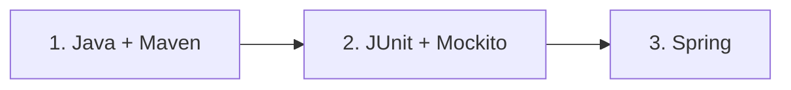

# Rutas de aprendizaje de Java

Este archivo se conserva como índice de compatibilidad. La antigua guía monolítica mezclaba lenguaje Java, JDBC/Hibernate, transacciones, JUnit, Mockito y Spring; ahora el contenido se estudia de forma granular y progresiva:

1. [`README.md`](README.md) — **Java y Maven**: lenguaje, biblioteca estándar, POO, genéricos, excepciones, JVM, memoria, concurrencia, Java 8–25, módulos y construcción con Maven.
2. [`java-testing-guide.md`](java-testing-guide.md) — **Testing en Java**: teoría de pruebas, JUnit, Mockito, dobles, TDD, Surefire/Failsafe y CI.
3. [`spring-guide.md`](spring-guide.md) — **Spring**: IoC/DI, beans, Boot, MVC, datos, transacciones, AOP, Security, testing de Spring, Actuator y WebFlux.

Cada ruta tiene un banco independiente de 100 reactivos: [`java-maven-questions.md`](java-maven-questions.md), [`java-testing-questions.md`](java-testing-questions.md) y [`spring-questions.md`](spring-questions.md).

## Orden recomendado

Empieza por Java aunque ya conozcas Spring: comprender constructores, interfaces, anotaciones, reflexión, concurrencia y proxies hace que las abstracciones del framework dejen de parecer magia. Después estudia testing sin contenedor; finalmente aplica ambos conocimientos en Spring.

## Temas trasladados fuera de estas tres rutas

JDBC, modelado relacional y transacciones como concepto de base de datos pertenecen a las guías SQL del repositorio. JPA/Hibernate se presentan en la guía Spring solo hasta el nivel necesario para trabajar con persistencia en una aplicación Spring; no se mezclan con los fundamentos del lenguaje.
