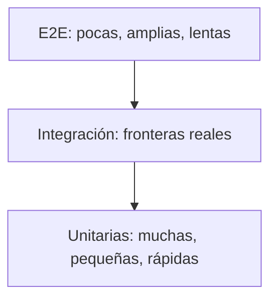
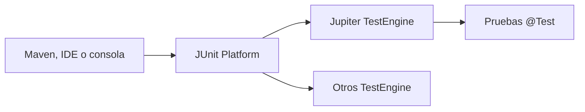
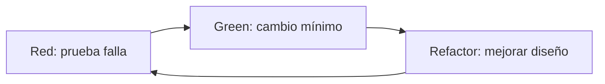

# Guía incremental de testing en Java con JUnit y Mockito

> De la primera prueba unitaria a una suite mantenible, rápida y confiable.

Esta guía estudia un único tema: **pruebas automatizadas de código Java**. JUnit proporciona el modelo de ejecución y las aserciones; Mockito permite sustituir colaboradores cuando una prueba unitaria necesita aislar una clase. Spring no se usa aquí: sus pruebas de contexto, MVC y *slices* se explican en [`spring-guide.md`](spring-guide.md).

**Simulador de certificación:** [`java-testing-questions.md`](java-testing-questions.md) contiene 100 preguntas de estrategia, JUnit, Mockito, diseño y CI con soluciones razonadas.

Los ejemplos usan Java 17, JUnit 6 y Mockito 5. La arquitectura y los paquetes de Jupiter continúan el modelo conocido habitualmente como “JUnit 5”. Si el proyecto permanece en JUnit 5, casi todos los conceptos y ejemplos siguen siendo aplicables.

---

## Contenido y ruta

1. [Qué demuestra una prueba](#1-qué-demuestra-una-prueba)
2. [Niveles de prueba](#2-niveles-de-prueba)
3. [Arquitectura de JUnit](#3-arquitectura-de-junit)
4. [Configurar Maven](#4-configurar-maven)
5. [Primera prueba y patrón AAA](#5-primera-prueba-y-patrón-aaa)
6. [Ciclo de vida y aislamiento](#6-ciclo-de-vida-y-aislamiento)
7. [Aserciones](#7-aserciones)
8. [Excepciones, tiempos y supuestos](#8-excepciones-tiempos-y-supuestos)
9. [Pruebas parametrizadas, repetidas y dinámicas](#9-pruebas-parametrizadas-repetidas-y-dinámicas)
10. [Organización, etiquetas y ejecución](#10-organización-etiquetas-y-ejecución)
11. [Dobles de prueba](#11-dobles-de-prueba)
12. [Mockito: mocks y stubbing](#12-mockito-mocks-y-stubbing)
13. [Mockito: verificación y argumentos](#13-mockito-verificación-y-argumentos)
14. [Spies, respuestas y casos avanzados](#14-spies-respuestas-y-casos-avanzados)
15. [Diseño para testabilidad](#15-diseño-para-testabilidad)
16. [Estrategia, TDD y calidad de la suite](#16-estrategia-tdd-y-calidad-de-la-suite)
17. [Surefire, Failsafe y CI](#17-surefire-failsafe-y-ci)
18. [Migración desde JUnit 4](#18-migración-desde-junit-4)
19. [Proyecto de práctica](#19-proyecto-de-práctica)
20. [Fuentes oficiales](#20-fuentes-oficiales)

Ruta sugerida:

```text
Contrato observable
    ↓
Prueba aislada con JUnit
    ↓
Casos y límites parametrizados
    ↓
Colaboradores sustituidos con dobles
    ↓
Mockito solo donde agrega claridad
    ↓
Suite por niveles ejecutada en CI
```

---

# 1. Qué demuestra una prueba

Una prueba automatizada es código que prepara una situación, ejecuta un comportamiento y compara el resultado observado con una expectativa.

```text
Given: un estado inicial conocido
When:  ocurre una acción
Then:  se observa un resultado verificable
```

Una prueba no demuestra que el programa no tiene errores. Aporta evidencia concreta sobre un caso y protege ese comportamiento frente a cambios futuros.

## 1.1 Propiedades de una buena prueba

Una buena prueba suele ser:

- **determinista**: con las mismas condiciones produce el mismo resultado;
- **aislada**: no depende del orden de otras pruebas;
- **rápida**: puede ejecutarse con frecuencia;
- **legible**: explica la regla mejor que un comentario ambiguo;
- **específica**: cuando falla señala una causa acotada;
- **repetible**: funciona en una laptop y en integración continua.

El nombre debe describir escenario y resultado, no repetir el nombre del método:

```java
@Test
void rejectsTransferWhenBalanceIsInsufficient() { }
```

es más informativo que:

```java
@Test
void testTransfer() { }
```

## 1.2 Estado frente a interacción

Hay dos familias de observaciones:

- **estado o resultado**: valor devuelto, objeto modificado, excepción;
- **interacción**: un colaborador recibió cierto mensaje.

Prefiere verificar estado cuando este expresa el contrato directamente:

```java
assertEquals(Money.of("84.00"), cart.totalAfterDiscount());
```

Verifica interacción cuando la interacción **es** el efecto observable, por ejemplo enviar una notificación o publicar un evento:

```java
verify(emailGateway).sendWelcomeTo(user.email());
```

Verificar cada llamada privada o cada detalle interno vuelve frágil la prueba: una refactorización correcta podría romperla sin cambiar el comportamiento.

---

# 2. Niveles de prueba

No todas las pruebas deben arrancar la aplicación completa. Cada nivel responde una pregunta distinta.

| Nivel | Alcance | Dependencias reales | Velocidad esperada | Pregunta |
|---|---|---|---|---|
| unitaria | una unidad de comportamiento | ninguna externa | milisegundos | ¿la regla local es correcta? |
| componente | varios objetos del módulo | adaptadores controlados | rápida | ¿colaboran bien dentro del componente? |
| integración | límites técnicos | base, archivos o red reales/controlados | media | ¿la integración funciona de verdad? |
| end-to-end | sistema desplegado | casi todas | lenta | ¿el flujo de usuario funciona? |



La pirámide no prescribe porcentajes universales. Enseña un costo: cuanto más amplia sea una prueba, más infraestructura usa, más tarda y más difícil es localizar una falla.

## 2.1 Qué es una unidad

Una unidad no tiene que ser un método. Es una porción de comportamiento que puede comprobarse con una razón clara para fallar. Una clase pequeña suele ser una buena frontera, pero varias clases puramente funcionales pueden probarse juntas sin perder claridad.

## 2.2 Sociable o solitaria

- Una prueba unitaria **sociable** usa colaboradores reales que son rápidos y deterministas.
- Una prueba unitaria **solitaria** sustituye colaboradores para aislar una clase.

No simules `String`, listas, records ni objetos de valor solo para que la prueba parezca más “unitaria”. Usa objetos reales baratos; reserva los dobles para fronteras variables, lentas o difíciles de provocar.

---

# 3. Arquitectura de JUnit

JUnit moderno se divide en tres piezas conceptuales:



- **JUnit Platform** descubre y ejecuta motores de prueba.
- **JUnit Jupiter** aporta el modelo de programación: `@Test`, ciclos de vida, extensiones y aserciones.
- **Vintage** permite ejecutar pruebas JUnit 3/4 durante una migración; está deprecado en JUnit 6 y no es una solución permanente.

JUnit 6 requiere Java 17 para ejecutarse, aunque puede probar código compilado para versiones anteriores. La palabra “JUnit 5” se usó tanto para la generación completa como para Jupiter; conviene nombrar la pieza exacta cuando se configura una herramienta.

Paquetes habituales:

```java
import org.junit.jupiter.api.Test;
import static org.junit.jupiter.api.Assertions.*;
```

La anotación y las aserciones conservan `jupiter` en el paquete; no se importan desde `org.junit.Test`, que corresponde a JUnit 4.

---

# 4. Configurar Maven

La documentación actual de JUnit recomienda alinear sus módulos con un BOM. Las versiones de este ejemplo fueron verificadas en agosto de 2026; actualízalas conscientemente, no con rangos dinámicos.

```xml
<properties>
    <maven.compiler.release>17</maven.compiler.release>
    <junit.version>6.1.3</junit.version>
    <mockito.version>5.23.0</mockito.version>
</properties>

<dependencyManagement>
    <dependencies>
        <dependency>
            <groupId>org.junit</groupId>
            <artifactId>junit-bom</artifactId>
            <version>${junit.version}</version>
            <type>pom</type>
            <scope>import</scope>
        </dependency>
    </dependencies>
</dependencyManagement>

<dependencies>
    <dependency>
        <groupId>org.junit.jupiter</groupId>
        <artifactId>junit-jupiter</artifactId>
        <scope>test</scope>
    </dependency>
    <dependency>
        <groupId>org.mockito</groupId>
        <artifactId>mockito-junit-jupiter</artifactId>
        <version>${mockito.version}</version>
        <scope>test</scope>
    </dependency>
</dependencies>

<build>
    <plugins>
        <plugin>
            <groupId>org.apache.maven.plugins</groupId>
            <artifactId>maven-surefire-plugin</artifactId>
            <version>3.5.5</version>
        </plugin>
    </plugins>
</build>
```

Ejecutar:

```bash
./mvnw test
./mvnw -Dtest=PriceCalculatorTest test
./mvnw -Dtest=PriceCalculatorTest#appliesMemberDiscount test
```

`test` scope impide que JUnit y Mockito lleguen al artefacto de producción.

Estructura:

```text
src/main/java/com/example/pricing/PriceCalculator.java
src/test/java/com/example/pricing/PriceCalculatorTest.java
```

La prueba suele usar el mismo paquete que la clase para poder comprobar miembros con acceso de paquete sin hacerlos `public` únicamente por testing.

---

# 5. Primera prueba y patrón AAA

Clase de producción:

```java
final class PriceCalculator {
    BigDecimal applyDiscount(BigDecimal price, int percentage) {
        if (price.signum() < 0) {
            throw new IllegalArgumentException("price no puede ser negativo");
        }
        if (percentage < 0 || percentage > 100) {
            throw new IllegalArgumentException("percentage debe estar entre 0 y 100");
        }

        BigDecimal factor = BigDecimal.valueOf(100 - percentage)
                .movePointLeft(2);
        return price.multiply(factor).setScale(2, RoundingMode.HALF_UP);
    }
}
```

Prueba:

```java
class PriceCalculatorTest {

    @Test
    void appliesPercentageDiscount() {
        // Arrange
        PriceCalculator calculator = new PriceCalculator();

        // Act
        BigDecimal result = calculator.applyDiscount(
                new BigDecimal("100.00"), 15);

        // Assert
        assertEquals(new BigDecimal("85.00"), result);
    }
}
```

AAA y Given/When/Then expresan la misma estructura:

```text
Arrange / Given → datos y colaboradores
Act / When      → una acción principal
Assert / Then   → consecuencias observables
```

Una separación visual suele bastar; los comentarios son útiles al aprender, pero pueden retirarse cuando la prueba ya se lee con claridad.

## 5.1 Una razón principal para fallar

No significa una única llamada a `assert`. Varias aserciones pueden describir un mismo resultado coherente:

```java
@Test
void createsInvoiceWithInitialState() {
    Invoice invoice = Invoice.create("C-42");

    assertAll(
            () -> assertEquals("C-42", invoice.customerId()),
            () -> assertEquals(InvoiceStatus.DRAFT, invoice.status()),
            () -> assertTrue(invoice.lines().isEmpty())
    );
}
```

---

# 6. Ciclo de vida y aislamiento

Por defecto, Jupiter crea una instancia nueva de la clase por cada método de prueba (`PER_METHOD`). Esto reduce fugas de estado entre casos.

```java
class InventoryTest {
    private Inventory inventory;

    @BeforeEach
    void setUp() {
        inventory = new Inventory();
    }

    @AfterEach
    void tearDown() {
        // liberar algo que no maneje try-with-resources
    }

    @Test
    void startsEmpty() {
        assertTrue(inventory.isEmpty());
    }
}
```

Anotaciones:

| Anotación | Momento | Debe ser `static` con ciclo predeterminado |
|---|---|---:|
| `@BeforeAll` | una vez antes de la clase | sí |
| `@BeforeEach` | antes de cada prueba | no |
| `@AfterEach` | después de cada prueba | no |
| `@AfterAll` | una vez después de la clase | sí |

`@TestInstance(TestInstance.Lifecycle.PER_CLASS)` reutiliza la instancia y permite `@BeforeAll` no estático, pero introduce estado compartido. Úsalo por una razón concreta, no para ahorrar la creación de objetos baratos.

Una prueba no debe depender de la que se ejecutó antes:

```java
// Frágil: el segundo caso supone que el primero creó algo.
@Order(1) @Test void createsUser() { }
@Order(2) @Test void updatesCreatedUser() { }
```

Si ambos pasos forman un solo escenario, pruébalos en un método o prepara el estado de cada caso explícitamente.

---

# 7. Aserciones

## 7.1 Valores y objetos

```java
assertEquals(expected, actual);
assertNotEquals(unexpected, actual);
assertNull(value);
assertNotNull(value);
assertSame(expectedReference, actualReference);
assertNotSame(first, second);
```

`assertEquals` delega en `equals`; `assertSame` compara identidad con `==`. Si un objeto de valor no implementa correctamente `equals`, la solución suele estar en el objeto, no en comparar campo por campo en todas sus pruebas.

Para punto flotante indica tolerancia:

```java
assertEquals(0.3, calculation, 0.000_001);
```

Para dinero, normalmente usa `BigDecimal` y decide si la escala forma parte del contrato.

## 7.2 Colecciones, texto y booleanos

```java
assertIterableEquals(List.of("A", "B"), result);
assertArrayEquals(new int[]{1, 2}, resultArray);
assertTrue(age >= 18, "la edad debe ser adulta");
assertFalse(order.isCancelled());
```

Un mensaje se evalúa perezosamente si se proporciona como `Supplier`:

```java
assertTrue(result.isValid(), () -> "resultado inválido: " + result);
```

No escribas un mensaje que solo repita la aserción. Incluye el dato que ayudaría a diagnosticar.

## 7.3 Agrupar y depender

`assertAll` informa varios fallos independientes del mismo resultado:

```java
assertAll("customer",
        () -> assertEquals("Ada", customer.name()),
        () -> assertEquals("ada@example.org", customer.email()));
```

Si la segunda aserción solo tiene sentido cuando la primera pasa, no las agrupes indiscriminadamente.

---

# 8. Excepciones, tiempos y supuestos

## 8.1 Excepciones esperadas

```java
@Test
void rejectsNegativePrice() {
    PriceCalculator calculator = new PriceCalculator();

    IllegalArgumentException exception = assertThrows(
            IllegalArgumentException.class,
            () -> calculator.applyDiscount(new BigDecimal("-1.00"), 10));

    assertEquals("price no puede ser negativo", exception.getMessage());
}
```

`assertThrows` acepta también subclases. `assertThrowsExactly` exige la clase exacta. Limita la lambda a la acción que debe fallar para no aceptar por accidente una excepción lanzada durante el *arrange*.

Comprobar que no se lanza:

```java
Invoice invoice = assertDoesNotThrow(() -> service.create(command));
```

No es necesario envolver cada llamada normal con `assertDoesNotThrow`; una excepción inesperada ya hace fallar la prueba.

## 8.2 Timeouts

```java
assertTimeout(Duration.ofMillis(100), () -> algorithm.sort(values));
```

`assertTimeout` espera a que termine y después falla. `assertTimeoutPreemptively` ejecuta en otro hilo e intenta abortar al exceder el límite; puede perder `ThreadLocal`, contexto o limpieza del hilo original. Usa tiempos amplios para detectar bloqueos, no para afirmar micro-rendimiento en hardware variable. Para rendimiento usa JMH.

## 8.3 Supuestos

```java
assumeTrue(System.getenv("CI_DATABASE_URL") != null);
```

Un supuesto aborta la prueba cuando el entorno no cumple una precondición; no significa éxito del comportamiento. Si muchas pruebas se omiten silenciosamente, la suite puede dar una confianza falsa. Para condiciones estables son más visibles anotaciones como `@EnabledOnOs` o `@EnabledIfEnvironmentVariable`.

---

# 9. Pruebas parametrizadas, repetidas y dinámicas

## 9.1 Parametrizadas

Una regla con muchos datos no necesita muchos métodos duplicados:

```java
@ParameterizedTest(name = "{0}% de 100 produce {1}")
@CsvSource({
        "0,   100.00",
        "15,   85.00",
        "100,   0.00"
})
void appliesDiscounts(int percentage, String expected) {
    PriceCalculator calculator = new PriceCalculator();
    BigDecimal result = calculator.applyDiscount(
            new BigDecimal("100.00"), percentage);

    assertEquals(new BigDecimal(expected), result);
}
```

Fuentes habituales:

- `@ValueSource` para un argumento simple;
- `@NullSource`, `@EmptySource` y `@NullAndEmptySource`;
- `@EnumSource`;
- `@CsvSource` y `@CsvFileSource`;
- `@MethodSource` para objetos o combinaciones complejas.

```java
static Stream<Arguments> invalidPercentages() {
    return Stream.of(
            Arguments.of(-1, "percentage debe estar entre 0 y 100"),
            Arguments.of(101, "percentage debe estar entre 0 y 100")
    );
}

@ParameterizedTest
@MethodSource("invalidPercentages")
void rejectsInvalidPercentage(int percentage, String message) {
    PriceCalculator calculator = new PriceCalculator();
    var error = assertThrows(IllegalArgumentException.class,
            () -> calculator.applyDiscount(BigDecimal.TEN, percentage));
    assertEquals(message, error.getMessage());
}
```

## 9.2 Repetidas

```java
@RepeatedTest(20)
void generatedTokenHasExpectedLength() {
    assertEquals(32, generator.next().length());
}
```

Repetir no vuelve determinista una prueba de concurrencia o aleatoriedad. Permite inyectar una semilla o usa herramientas especializadas para explorar interleavings.

## 9.3 Dinámicas

```java
@TestFactory
Stream<DynamicTest> normalizesExamples() {
    Map<String, String> cases = Map.of(
            " Ada ", "ada",
            "LINUS", "linus");

    return cases.entrySet().stream()
            .map(entry -> dynamicTest(entry.getKey(),
                    () -> assertEquals(entry.getValue(),
                            normalize(entry.getKey()))));
}
```

Una fábrica produce pruebas durante ejecución. Úsala cuando la estructura de casos se genera de forma natural; para tablas fijas, las parametrizadas suelen ofrecer mejor reporte y ciclo de vida.

---

# 10. Organización, etiquetas y ejecución

## 10.1 Pruebas anidadas

```java
class BankAccountTest {

    @Nested
    class WhenAccountIsEmpty {
        private BankAccount account;

        @BeforeEach
        void createEmptyAccount() {
            account = new BankAccount();
        }

        @Test
        void rejectsWithdrawal() { /* ... */ }
    }
}
```

`@Nested` expresa contextos y comparte preparación legible. No lo uses para crear una jerarquía profunda que esconda de dónde viene el estado.

## 10.2 Nombres visibles

`@DisplayName` permite una frase en el reporte, pero el nombre del método ya debería ser comprensible en el IDE y al buscar texto. Mantén una convención estable en el equipo.

## 10.3 Tags

```java
@Tag("slow")
class ImportPerformanceTest { }
```

```bash
./mvnw test -Dgroups='!slow'
```

Las etiquetas clasifican por propósito o costo, no por persona. No conviertas “slow” en un cementerio que nunca se ejecuta: define cuándo corre en CI.

## 10.4 Paralelismo

JUnit puede ejecutar pruebas en paralelo cuando se configura. Antes de habilitarlo confirma que cada prueba controla:

- archivos y puertos;
- reloj y zona horaria;
- variables globales y propiedades de sistema;
- base de datos y transacciones;
- mocks estáticos;
- capacidad de CPU/memoria de CI.

La ejecución paralela revela aislamiento deficiente; no debe activarse solo para ocultar una suite innecesariamente lenta.

---

# 11. Dobles de prueba

“Mock” se usa informalmente para cualquier sustituto, pero distinguir dobles ayuda a elegir bien:

| Doble | Qué hace | Ejemplo |
|---|---|---|
| dummy | rellena un parámetro que no se usa | usuario irrelevante para el caso |
| stub | devuelve respuestas preparadas | repositorio responde un cliente |
| fake | implementación funcional simplificada | repositorio en memoria |
| spy | observa y quizá delega en un objeto real | envoltorio que cuenta llamadas |
| mock | verifica mensajes esperados | gateway debe recibir un envío |

Ejemplo de *fake* sin Mockito:

```java
final class InMemoryUserRepository implements UserRepository {
    private final Map<String, User> users = new HashMap<>();

    @Override
    public void save(User user) {
        users.put(user.id(), user);
    }

    @Override
    public Optional<User> findByEmail(String email) {
        return users.values().stream()
                .filter(user -> user.email().equals(email))
                .findFirst();
    }
}
```

Un fake puede reutilizarse y modelar estado con naturalidad. Un mock es más pequeño para una interacción concreta. Ninguno demuestra que la base de datos o el servidor SMTP real funcionan; eso requiere una prueba de integración.

## 11.1 Cuándo sustituir

Sustituye un colaborador cuando es:

- remoto, lento o costoso;
- no determinista, como reloj o azar sin control;
- difícil de llevar al error requerido;
- un efecto externo que no debe ocurrir durante la prueba;
- una frontera arquitectónica cuyo protocolo quieres comprobar.

No sustituyas el objeto bajo prueba.

---

# 12. Mockito: mocks y stubbing

## 12.1 Extensión de Jupiter

```java
@ExtendWith(MockitoExtension.class)
class RegistrationServiceTest {

    @Mock
    private UserRepository repository;

    @Mock
    private EmailGateway emailGateway;

    @Mock
    private IdGenerator idGenerator;

    @InjectMocks
    private RegistrationService service;
}
```

La extensión crea mocks, los inyecta y valida *stubbings*. `@InjectMocks` es una comodidad, no un contenedor de inyección general. La construcción explícita sigue siendo clara:

```java
@BeforeEach
void setUp() {
    service = new RegistrationService(repository, emailGateway, idGenerator);
}
```

## 12.2 Preparar respuestas

```java
when(repository.findByEmail("ada@example.org"))
        .thenReturn(Optional.empty());
when(idGenerator.nextId()).thenReturn("U-42");
```

Forma BDD equivalente:

```java
given(repository.findByEmail("ada@example.org"))
        .willReturn(Optional.empty());
```

Para llamadas sucesivas:

```java
when(client.status())
        .thenReturn(Status.PENDING, Status.READY);
```

Para lanzar:

```java
when(repository.findByEmail(anyString()))
        .thenThrow(new RepositoryUnavailableException());
```

Métodos `void` usan la familia `do...when`:

```java
doThrow(new MailUnavailableException())
        .when(emailGateway).sendWelcomeTo(anyString());
```

## 12.3 Valores predeterminados

Un mock devuelve valores vacíos razonables (`false`, `0`, colecciones vacías, `Optional.empty()` o `null`, según el tipo y la configuración). No confundas “no configurado” con comportamiento de producción.

Prepara únicamente lo requerido por el escenario. Un *stubbing* que nunca se usa puede indicar que la prueba configura demasiado o que ya no pasa por el camino esperado; el modo estricto ayuda a detectarlo.

## 12.4 Ejemplo completo

```java
@Test
void registersNewUserAndSendsWelcomeEmail() {
    given(repository.findByEmail("ada@example.org"))
            .willReturn(Optional.empty());
    given(idGenerator.nextId()).willReturn("U-42");

    User result = service.register("Ada", "ada@example.org");

    assertAll(
            () -> assertEquals("U-42", result.id()),
            () -> assertEquals("Ada", result.name())
    );
    then(repository).should().save(result);
    then(emailGateway).should().sendWelcomeTo("ada@example.org");
}
```

El resultado se verifica por estado y los efectos externos por interacción.

---

# 13. Mockito: verificación y argumentos

## 13.1 Cantidad y ausencia

```java
verify(repository).save(user);                 // una vez
verify(repository, times(2)).save(user);
verify(repository, never()).delete(any());
verifyNoInteractions(auditGateway);
```

`verifyNoMoreInteractions` puede ser útil para un protocolo estricto, pero aplicado en todas partes acopla la prueba a detalles sin relevancia. Verifica lo que forma parte del contrato del caso.

## 13.2 Matchers

```java
verify(audit).record(eq("USER_CREATED"), any(Instant.class));
```

Si un argumento usa matcher, los demás argumentos de esa invocación también deben expresarse con matchers (`eq` cuenta como uno):

```java
// Incorrecto:
// verify(audit).record("USER_CREATED", any(Instant.class));
```

`any()` no significa que el método real acepte `null` ni reemplaza validar el contrato. Usa matchers específicos (`anyString`, `argThat`) cuando hagan la intención más clara.

```java
verify(repository).save(argThat(user ->
        user.id().startsWith("U-") && user.active()));
```

## 13.3 `ArgumentCaptor`

Un captor permite inspeccionar el objeto que cruzó la frontera:

```java
@Captor
ArgumentCaptor<User> userCaptor;

@Test
void storesNormalizedEmail() {
    given(repository.findByEmail(anyString())).willReturn(Optional.empty());
    given(idGenerator.nextId()).willReturn("U-1");

    service.register("Ada", " ADA@EXAMPLE.ORG ");

    verify(repository).save(userCaptor.capture());
    assertEquals("ada@example.org", userCaptor.getValue().email());
}
```

La documentación de Mockito recomienda captor principalmente para **verificación**, no para stubbing. Un matcher personalizado suele comunicar mejor una condición que decide la respuesta del mock.

## 13.4 Orden

```java
InOrder order = inOrder(repository, eventPublisher);
order.verify(repository).save(user);
order.verify(eventPublisher).publish(any(UserCreated.class));
```

Verifica orden solo cuando el protocolo lo exige. Si ambos efectos pueden intercambiarse sin cambiar el contrato, la prueba no debería imponerlo.

---

# 14. Spies, respuestas y casos avanzados

## 14.1 Spy

Un spy delega en un objeto real salvo los métodos preparados:

```java
List<String> values = spy(new ArrayList<>());
values.add("A");

verify(values).add("A");
assertEquals(List.of("A"), values);
```

Al preparar un spy, `when(spy.method())` llama al método real durante la preparación. Para evitarlo:

```java
doReturn("fixed").when(spy).get(0);
```

Un spy sobre la clase bajo prueba suele señalar que la clase mezcla responsabilidades. Antes de usar *partial mocking*, considera extraer el colaborador.

## 14.2 Respuestas calculadas

```java
when(cache.get(anyString())).thenAnswer(invocation -> {
    String key = invocation.getArgument(0);
    return "value-for-" + key;
});
```

Una respuesta compleja puede convertirse en una segunda implementación del sistema dentro de la prueba. Si acumula reglas, un fake explícito será más legible.

## 14.3 Métodos estáticos y construcción

Mockito puede interceptar ciertos métodos estáticos o construcciones dentro de un alcance controlado:

```java
try (MockedStatic<ClockProvider> mocked = mockStatic(ClockProvider.class)) {
    mocked.when(ClockProvider::now).thenReturn(fixedInstant);
    // ejecutar y comprobar
}
```

Esto es una herramienta de transición para código difícil de cambiar, no la primera opción. Para tiempo, recibe `java.time.Clock`; para IDs, una interfaz `IdGenerator`; para I/O, un puerto. Las dependencias explícitas mejoran diseño y paralelismo de pruebas.

## 14.4 Mocks profundos

Una cadena como:

```java
when(order.getCustomer().getAddress().getCity()).thenReturn("Puebla");
```

requiere preparar varios objetos o *deep stubs*. Ese acoplamiento replica la estructura interna. Crea objetos reales simples o expón una operación de dominio que represente la intención.

---

# 15. Diseño para testabilidad

El código fácil de probar suele ser código con dependencias y responsabilidades claras.

## 15.1 Inyectar tiempo y azar

```java
final class TokenService {
    private final Clock clock;
    private final Supplier<UUID> ids;

    TokenService(Clock clock, Supplier<UUID> ids) {
        this.clock = clock;
        this.ids = ids;
    }

    Token issue() {
        return new Token(ids.get(), Instant.now(clock));
    }
}
```

Prueba sin mock:

```java
Clock fixed = Clock.fixed(
        Instant.parse("2026-08-12T12:00:00Z"), ZoneOffset.UTC);
UUID id = UUID.fromString("00000000-0000-0000-0000-000000000042");

Token token = new TokenService(fixed, () -> id).issue();

assertEquals(id, token.id());
assertEquals(Instant.parse("2026-08-12T12:00:00Z"), token.createdAt());
```

## 15.2 Núcleo funcional, bordes imperativos

Separa cálculos puros de archivos, red y base de datos:

```text
leer entrada → convertir a valores → calcular → decidir → persistir/enviar
   borde          núcleo puro                  borde
```

El núcleo puede probarse con valores reales. Los bordes tienen pocas pruebas de interacción y pruebas de integración específicas.

## 15.3 Señales de diseño difícil

- constructor con demasiados colaboradores;
- estado global mutable;
- método que lee archivo, calcula y envía red;
- fechas y UUID creados dentro de reglas de negocio;
- uso de `new` para clientes remotos en medio de un método;
- necesidad de simular métodos privados.

No cambies visibilidad privada solo para probar implementación. Prueba el contrato público o extrae una responsabilidad con un contrato propio.

---

# 16. Estrategia, TDD y calidad de la suite

## 16.1 TDD

El ciclo es:



1. **Red**: expresa un comportamiento todavía ausente y observa el fallo correcto.
2. **Green**: implementa lo mínimo para satisfacerlo.
3. **Refactor**: mejora producción y pruebas conservando la suite verde.

TDD no significa escribir todas las pruebas antes de entender el problema. Es un ciclo corto de diseño guiado por ejemplos.

## 16.2 Límites y particiones

Para una entrada con rango `0..100`, prueba clases de equivalencia y límites:

```text
inválido bajo: -1
límite inferior: 0
interior: 50
límite superior: 100
inválido alto: 101
```

Añade casos por riesgo, no todas las combinaciones imaginables. Prioriza reglas de negocio, errores costosos, formatos, nulos cuando se permitan, overflow y concurrencia.

## 16.3 Cobertura

La cobertura responde “qué código se ejecutó”, no “qué comportamiento se comprobó”. Una prueba sin aserciones puede cubrir líneas y no detectar nada.

- cobertura baja revela zonas nunca ejercitadas;
- cobertura alta no garantiza buenos casos;
- un objetivo rígido puede incentivar pruebas triviales;
- revisa especialmente ramas de error y decisiones de negocio.

El *mutation testing* cambia operadores o condiciones y comprueba si alguna prueba lo detecta. Un mutante sobreviviente puede revelar una aserción débil o código irrelevante.

## 16.4 Pruebas inestables

Fuentes comunes de *flakiness*:

- reloj real y `sleep`;
- orden no garantizado de colecciones;
- puertos fijos;
- recursos compartidos entre ejecuciones paralelas;
- asincronía sin espera observable;
- zona horaria o locale del equipo;
- dependencia de Internet.

No soluciones una prueba inestable reintentándola indefinidamente. Primero haz explícito el control del recurso. Un reintento temporal puede evitar bloquear al equipo mientras se investiga, pero debe quedar visible y con responsable.

---

# 17. Surefire, Failsafe y CI

Maven utiliza normalmente dos plugins con semántica distinta:

| Plugin | Fases | Uso |
|---|---|---|
| Surefire | `test` | pruebas unitarias |
| Failsafe | `integration-test` y `verify` | pruebas de integración |

```xml
<plugin>
    <groupId>org.apache.maven.plugins</groupId>
    <artifactId>maven-failsafe-plugin</artifactId>
    <version>3.5.5</version>
    <executions>
        <execution>
            <goals>
                <goal>integration-test</goal>
                <goal>verify</goal>
            </goals>
        </execution>
    </executions>
</plugin>
```

Convenciones comunes:

```text
*Test.java, *Tests.java, *TestCase.java → Surefire
*IT.java, *ITCase.java                 → Failsafe
```

Ejecuta integración con:

```bash
./mvnw verify
```

No uses `mvn integration-test` como comando final habitual: si una prueba de integración falla, la fase `post-integration-test` todavía puede necesitar limpiar recursos y `verify` debe evaluar el resultado.

Una tubería mínima:

```text
checkout → JDK fijado → ./mvnw --batch-mode verify → reportes → artefacto
```

Conserva los reportes XML/TXT de `target/surefire-reports` y `target/failsafe-reports` cuando falle CI. Fija zona horaria, locale y versión de Java cuando influyan en los resultados.

---

# 18. Migración desde JUnit 4

Mapa básico:

| JUnit 4 | Jupiter |
|---|---|
| `org.junit.Test` | `org.junit.jupiter.api.Test` |
| `@Before` / `@After` | `@BeforeEach` / `@AfterEach` |
| `@BeforeClass` / `@AfterClass` | `@BeforeAll` / `@AfterAll` |
| `@Ignore` | `@Disabled` |
| `@RunWith` | `@ExtendWith` |
| `@Category` | `@Tag` |
| `@Test(expected=...)` | `assertThrows` |

Estrategia segura:

1. habilita JUnit Platform en el build;
2. ejecuta temporalmente pruebas antiguas con Vintage si es imprescindible;
3. escribe pruebas nuevas con Jupiter;
4. migra por paquetes o componentes;
5. reemplaza Rules/Runners con extensiones o APIs modernas;
6. elimina Vintage al terminar.

No cambies únicamente imports de forma masiva: revisa semántica de ciclo de vida, orden, timeout y aserciones. Vintage está deprecado en JUnit 6 y existe para transición, no para mantener dos modelos indefinidamente.

---

# 19. Proyecto de práctica

Construye un módulo `registration` sin Spring.

## 19.1 Requisitos

1. Un email debe normalizarse y ser único.
2. El ID lo aporta `IdGenerator`.
3. El usuario se guarda antes de publicar `UserRegistered`.
4. Si el repositorio falla, no se publica el evento.
5. La fecha proviene de `Clock`.

## 19.2 Progresión

1. Prueba el objeto `Email` con casos parametrizados.
2. Prueba la creación de `User` sin Mockito.
3. Prueba `RegistrationService` con mocks de repositorio, ID y eventos.
4. Captura el usuario guardado y verifica email/fecha.
5. Verifica el orden solo para `save → publish`, porque es requisito.
6. Crea un fake de repositorio y compara legibilidad con el mock.
7. Añade una prueba de integración separada para la implementación real del repositorio.

Checklist de revisión:

- [ ] cada prueba puede ejecutarse sola;
- [ ] no usa red ni reloj real en unitarias;
- [ ] nombres describen escenarios;
- [ ] no prepara stubs irrelevantes;
- [ ] verifica resultados antes que detalles internos;
- [ ] los casos de error comprueban que no ocurrieron efectos indebidos;
- [ ] `./mvnw verify` funciona desde una copia limpia.

---

# 20. Fuentes oficiales

- [JUnit 6 User Guide](https://docs.junit.org/6.1.3/overview.html)
- [Escribir pruebas con JUnit](https://docs.junit.org/6.1.1/writing-tests/intro)
- [Aserciones de JUnit](https://docs.junit.org/6.0.3/writing-tests/assertions.html)
- [Pruebas parametrizadas](https://docs.junit.org/6.1.0-M1/writing-tests/parameterized-classes-and-tests.html)
- [Modelo de extensiones](https://docs.junit.org/6.1.1/extensions/overview.html)
- [Soporte de Maven en JUnit](https://docs.junit.org/6.1.3/running-tests/build-support.html)
- [Migración desde JUnit 4](https://docs.junit.org/6.1.3/migrating-from-junit4.html)
- [Sitio oficial de Mockito](https://site.mockito.org/)
- [Javadoc actual de Mockito](https://javadoc.io/doc/org.mockito/mockito-core/latest/org.mockito/org/mockito/Mockito.html)
- [Javadoc de `ArgumentCaptor`](https://javadoc.io/doc/org.mockito/mockito-core/latest/org.mockito/org/mockito/ArgumentCaptor.html)
- [Maven Surefire Plugin](https://maven.apache.org/surefire/maven-surefire-plugin/)
- [Maven Failsafe Plugin](https://maven.apache.org/surefire/maven-failsafe-plugin/)

---

## Resumen de bolsillo

```text
JUnit Platform descubre y ejecuta
Jupiter define @Test, lifecycle, assertions y extensiones
Mockito sustituye colaboradores; no valida integraciones reales

AAA
Arrange → Act → Assert

Preferencia
objetos reales baratos → fakes → stubs/mocks en fronteras

Suite saludable
determinista + aislada + rápida + legible + ejecutada en CI
```
