# Guía de Ingeniería de Software — de lo básico a lo avanzado

> Esta guía complementa a [`README.md`](README.md) (Java y Maven), [`java-testing-guide.md`](java-testing-guide.md) (JUnit y Mockito), [`spring-guide.md`](spring-guide.md) (Spring), [`sql-guide.md`](sql-guide.md) (SQL y diseño de datos) y [`git-guide.md`](git-guide.md) (control de versiones). Aquí el foco es transversal a cualquier lenguaje: cómo se diseña, prueba, asegura y opera software en la práctica profesional.

## Índice

1. [Introducción a la Ingeniería de Software](#1-introducción-a-la-ingeniería-de-software)
2. [POO: herencia a fondo y diagramas UML](#2-poo-herencia-a-fondo-y-diagramas-uml)
3. [Complejidad algorítmica](#3-complejidad-algorítmica)
4. [Estructuras de datos](#4-estructuras-de-datos)
5. [Algoritmos fundamentales](#5-algoritmos-fundamentales)
6. [Testing de software](#6-testing-de-software)
7. [Control de versiones y flujo colaborativo](#7-control-de-versiones-y-flujo-colaborativo)
8. [DevOps: de básico a avanzado](#8-devops-de-básico-a-avanzado)
9. [Paradigmas de procesamiento de datos: OLTP, OLAP, batch y streaming](#9-paradigmas-de-procesamiento-de-datos-oltp-olap-batch-y-streaming)
10. [Arquitectura de software](#10-arquitectura-de-software)
11. [Seguridad en el desarrollo de software](#11-seguridad-en-el-desarrollo-de-software)
12. [Calidad de código y buenas prácticas](#12-calidad-de-código-y-buenas-prácticas)
13. [Ejercicios prácticos](#13-ejercicios-prácticos)
14. [Cheat-sheet de referencia rápida](#14-cheat-sheet-de-referencia-rápida)
15. [Fuentes oficiales](#15-fuentes-oficiales)

---

## 1. Introducción a la Ingeniería de Software

La Ingeniería de Software es la disciplina que aplica principios de ingeniería al diseño, desarrollo, prueba y mantenimiento de software, con el objetivo de producir sistemas confiables dentro de tiempo y presupuesto razonables. A diferencia de "programar", que es escribir código que funcione, la ingeniería de software se ocupa de que ese código siga funcionando **cuando cambian los requisitos, cuando lo mantiene otra persona, y cuando falla algo en producción**.

### 1.1 Ciclo de vida del software (SDLC)

```text
Requisitos → Diseño → Implementación → Pruebas → Despliegue → Mantenimiento
     ↑                                                              │
     └──────────────────────────────────────────────────────────────┘
```

| Fase | Pregunta que responde |
|---|---|
| Requisitos | ¿Qué problema resolvemos y para quién? |
| Diseño | ¿Cómo se estructura la solución? |
| Implementación | Escribir el código |
| Pruebas | ¿Funciona como se esperaba y no rompe lo existente? |
| Despliegue | Llevar el software al entorno donde lo usan los usuarios reales |
| Mantenimiento | Corregir defectos, adaptar a nuevos requisitos, la fase más larga del ciclo de vida |

### 1.2 Modelos de proceso

| Modelo | Idea central | Cuándo tiene sentido |
|---|---|---|
| **Cascada (Waterfall)** | Cada fase termina por completo antes de empezar la siguiente | Requisitos estables y bien conocidos de antemano (ej. software regulado, contratos de alcance fijo) |
| **Iterativo/incremental** | Se construyen versiones parciales que crecen en funcionalidad | Requisitos que se van descubriendo, entregas frecuentes de valor |
| **Ágil (Scrum, Kanban)** | Ciclos cortos, colaboración constante con el negocio, adaptación continua | La mayoría del desarrollo de producto moderno |

### 1.3 Scrum a fondo

**Scrum** es un framework ágil (no una metodología completa: define el "qué", no el "cómo" técnico) para desarrollar y sostener productos complejos mediante ciclos cortos e iterativos llamados **sprints**. Se apoya en tres pilares y cinco valores:

```text
Pilares:  Transparencia (todo es visible) · Inspección (revisar seguido) · Adaptación (ajustar el rumbo)
Valores:  Compromiso · Foco · Apertura · Respeto · Coraje
```

#### Los 3 roles (el "Scrum Team")

| Rol | Responsabilidad |
|---|---|
| **Product Owner (PO)** | Maximiza el valor del producto; decide **qué** se construye y en qué orden, dueño del Product Backlog |
| **Scrum Master** | Facilita el proceso, elimina impedimentos, protege al equipo de interrupciones y asegura que Scrum se aplique bien; no es un "jefe de proyecto" clásico |
| **Development Team** | Equipo multifuncional y autoorganizado que construye el incremento; decide **cómo** se construye |

#### Los 5 eventos (ceremonias)

```text
┌─────────────────────────── Sprint (1-4 semanas) ───────────────────────────┐
│                                                                              │
│  Sprint Planning → [Daily Scrum ×N, uno por día] → Sprint Review → Retro   │
│  (qué se hará)      (sincronización de 15 min)      (demo)      (mejora)   │
└──────────────────────────────────────────────────────────────────────────┘
```

| Evento | Duración típica | Propósito |
|---|---|---|
| **Sprint** | 1-4 semanas | El contenedor de todos los demás eventos; una duración fija ("time-box") |
| **Sprint Planning** | Hasta 8h (sprint de 1 mes) | El equipo decide el **Sprint Goal** y qué elementos del backlog se comprometen |
| **Daily Scrum** | 15 min | El Development Team sincroniza avance e impedimentos, todos los días a la misma hora |
| **Sprint Review** | Hasta 4h | Se inspecciona el incremento con stakeholders; feedback que alimenta el backlog |
| **Sprint Retrospective** | Hasta 3h | El equipo reflexiona sobre su propio proceso (no el producto) y define mejoras concretas |

#### Los 3 artefactos y sus compromisos

| Artefacto | Qué es | Compromiso asociado |
|---|---|---|
| **Product Backlog** | Lista priorizada y viva de todo lo que podría construirse | **Product Goal**: el objetivo a mediano plazo que da coherencia al backlog |
| **Sprint Backlog** | Subconjunto del backlog + el plan para construirlo, comprometido para el sprint actual | **Sprint Goal**: el "por qué" de este sprint, da foco al equipo si el plan cambia |
| **Incremento** | La suma de todo lo terminado en el sprint, más lo de sprints anteriores, integrado y usable | **Definition of Done (DoD)**: criterios objetivos compartidos que definen cuándo algo está realmente "terminado" |

#### Términos que conviene dominar

| Término | Significado |
|---|---|
| **User story** | Requisito descrito desde la perspectiva del usuario: "Como \<rol\>, quiero \<acción\> para \<beneficio\>" |
| **Epic** | Una historia demasiado grande para un sprint; se descompone en varias user stories más pequeñas |
| **Story points** | Estimación relativa de esfuerzo/complejidad/incertidumbre de una historia (a menudo escala de Fibonacci: 1, 2, 3, 5, 8, 13...), no una medida de tiempo directa |
| **Planning poker** | Técnica de estimación grupal donde cada persona vota en simultáneo para evitar el sesgo de anclaje |
| **Velocity** | Cuántos story points completa el equipo en promedio por sprint; útil para pronosticar, no para comparar entre equipos |
| **Burndown chart** | Gráfico que muestra el trabajo restante del sprint día a día; una pendiente sana desciende hacia cero al final |
| **Definition of Ready (DoR)** | Criterios que una historia debe cumplir antes de entrar a un sprint (requisitos claros, sin dependencias bloqueantes) |
| **Backlog refinement / grooming** | Sesión periódica para detallar, estimar y reordenar elementos del backlog antes de que entren a un sprint |
| **Impedimento** | Cualquier obstáculo que bloquea el avance del equipo; el Scrum Master es responsable de ayudar a resolverlo |

```text
Burndown chart (ejemplo):
Trabajo
restante
  │╲
  │ ╲
  │  ╲___
  │      ╲___
  │          ╲___
  │              ╲___
  └──────────────────╲──→ Días del sprint
  Día 1                Día 10 (= 0 restante, sprint sano)
```

### 1.4 Kanban a fondo

**Kanban** (del japonés "tarjeta visual") es un método de gestión de flujo de trabajo originado en manufactura (Sistema de Producción Toyota) y adaptado al desarrollo de software por David J. Anderson. A diferencia de Scrum, **no define roles ni sprints**: parte del proceso que ya existe y lo mejora gradualmente.

#### Las 4 prácticas fundamentales

| Práctica | Idea |
|---|---|
| **Visualizar el flujo de trabajo** | Un tablero con columnas que representan cada etapa real del proceso (ej. `Backlog → Análisis → Desarrollo → Revisión → Listo`) |
| **Limitar el trabajo en curso (WIP)** | Cada columna tiene un número máximo de tarjetas permitidas; obliga a terminar antes de empezar algo nuevo |
| **Gestionar el flujo** | Medir y optimizar cuánto tarda una tarjeta en recorrer el tablero, no cuánto "trabajo" se hizo |
| **Hacer explícitas las políticas** | Reglas claras y visibles de qué significa "terminado" en cada columna, para que todo el equipo las aplique igual |

```text
Tablero Kanban con límites WIP:

  Backlog   │  Análisis (WIP:2) │ Desarrollo (WIP:3) │ Revisión (WIP:2) │  Listo
 ───────────┼────────────────────┼─────────────────────┼───────────────────┼────────
  [Tarea F]  │  [Tarea D]         │  [Tarea A]          │  [Tarea B]        │ [Tarea X]
  [Tarea G]  │  [Tarea E]         │  [Tarea C]          │                   │ [Tarea Y]
  [Tarea H]  │                    │                     │                   │
             │  ← lleno (2/2)     │  ← queda 1 espacio  │  ← queda 1 espacio│

Si "Desarrollo" está en su límite, nadie toma trabajo nuevo hasta liberar espacio:
esto es un sistema PULL (se "jala" trabajo cuando hay capacidad), no PUSH (asignar sin límite).
```

#### Métricas propias de Kanban

| Métrica | Qué mide |
|---|---|
| **Lead time** | Tiempo total desde que una tarjeta entra al backlog hasta que llega a "Listo" |
| **Cycle time** | Tiempo desde que el trabajo *empieza* activamente hasta que termina (subconjunto del lead time) |
| **Throughput** | Cuántas tarjetas se completan por unidad de tiempo (ej. por semana) |
| **Cumulative Flow Diagram (CFD)** | Gráfico de áreas apiladas por columna a lo largo del tiempo; una banda que se ensancha señala un cuello de botella en esa etapa |

### 1.5 Scrum vs. Kanban

| Aspecto | Scrum | Kanban |
|---|---|---|
| Cadencia | Sprints de duración fija | Flujo continuo, sin iteraciones fijas |
| Roles | Definidos (PO, Scrum Master, Dev Team) | No prescribe roles nuevos |
| Cambios a mitad de ciclo | Se evitan durante el sprint (protegen el Sprint Goal) | Se aceptan en cualquier momento si hay espacio WIP |
| Métrica principal | Velocity (story points por sprint) | Lead time / cycle time / throughput |
| Encaja mejor con | Desarrollo de producto con entregas planificadas por lotes | Soporte, operaciones, flujo continuo de tickets impredecibles |

Ni Scrum ni Kanban son "más correctos" que el otro: Scrum encaja mejor con planeación por lotes de trabajo, Kanban con flujo continuo de soporte/operaciones. Muchos equipos usan una mezcla (*Scrumban*): sprints y ceremonias de Scrum, combinados con tablero visual y límites WIP de Kanban.

---

## 2. POO: herencia a fondo y diagramas UML

> Los conceptos de clases, interfaces, sobrecarga/sobrescritura y los cuatro pilares de la POO ya se cubren a fondo (con ejemplos en Java) en el [`README.md`](README.md#4-programación-orientada-a-objetos) de este repositorio. Esta sección se enfoca específicamente en **los distintos tipos de herencia** desde una perspectiva independiente del lenguaje, y en la notación UML para representarlos.

### 2.1 Tipos de herencia

| Tipo | Estructura | Ejemplo |
|---|---|---|
| **Simple (single)** | Una clase hija hereda de una única clase padre | `Dog extends Animal` |
| **Multinivel (multilevel)** | Una cadena de herencia de más de dos niveles | `Puppy extends Dog extends Animal` |
| **Jerárquica (hierarchical)** | Varias clases hijas heredan de la misma clase padre | `Dog` y `Cat` heredan de `Animal` |
| **Múltiple (multiple)** | Una clase hereda de más de una clase padre directamente | `FlyingCar extends Car, Aircraft` (C++) |
| **Híbrida (hybrid)** | Combinación de dos o más de los tipos anteriores | Jerárquica + múltiple a la vez |

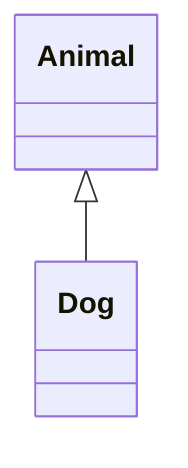
*Herencia simple*

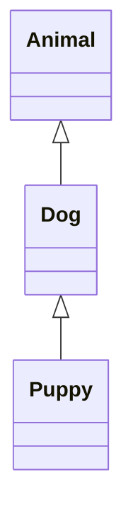
*Herencia multinivel*

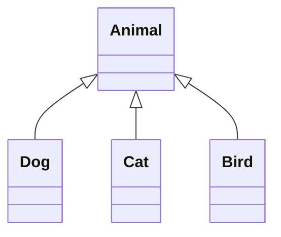
*Herencia jerárquica*

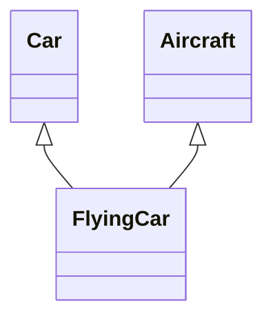
*Herencia múltiple*

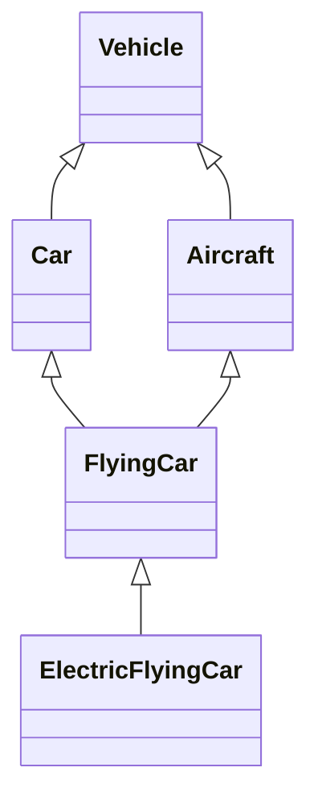
*Herencia híbrida: jerárquica (`Vehicle` → `Car`/`Aircraft`) + múltiple (`FlyingCar`) + multinivel (`ElectricFlyingCar`)*

### 2.2 El problema del diamante

La herencia múltiple real introduce una ambigüedad clásica: si `FlyingCar` hereda de `Car` y `Aircraft`, y ambas heredan de `Vehicle` con un método `Vehicle.start()` que cada una sobrescribe distinto, ¿cuál versión de `start()` usa `FlyingCar`?

```text
        Vehicle
        /      \
      Car    Aircraft
        \      /
      FlyingCar   ← ¿qué start() hereda?
```

### 2.3 Cómo resuelve cada lenguaje la herencia múltiple

| Lenguaje | Estrategia |
|---|---|
| **Java / Kotlin** | No permiten herencia múltiple de *clases*. Sí permiten implementar múltiples *interfaces*; si dos interfaces aportan el mismo método `default`, el compilador obliga a resolver la ambigüedad explícitamente (regla ya vista en el `README.md`: gana la clase, luego la interfaz más específica, si no la clase debe resolverlo a mano) |
| **C++** | Permite herencia múltiple real de clases. El diamante se resuelve con **herencia virtual** (`class Car : virtual public Vehicle`), que garantiza que solo exista una subobjeto compartido de `Vehicle` en vez de dos copias |
| **Python** | Permite herencia múltiple de clases, resuelta mediante el **Method Resolution Order (MRO)**, calculado con el algoritmo **C3 linearization**: un orden lineal determinista que decide qué implementación se usa cuando hay ambigüedad |
| **C#** | Igual que Java: sin herencia múltiple de clases, sí de interfaces (con soporte de métodos `default` desde C# 8) |

```python
class Vehicle:
    def start(self):
        print("Vehicle start")

class Car(Vehicle):
    def start(self):
        print("Car start")

class Aircraft(Vehicle):
    def start(self):
        print("Aircraft start")

class FlyingCar(Car, Aircraft):
    pass

FlyingCar().start()   # "Car start": el MRO prioriza el primer padre listado
print(FlyingCar.__mro__)
# (FlyingCar, Car, Aircraft, Vehicle, object) — el orden que Python realmente usa para buscar el método
```

```cpp
// C++: herencia virtual para evitar duplicar el subobjeto Vehicle
class Vehicle { public: virtual void start() { } };
class Car : virtual public Vehicle { public: void start() override { } };
class Aircraft : virtual public Vehicle { public: void start() override { } };
class FlyingCar : public Car, public Aircraft { };
```

### 2.4 Composición sobre herencia (recordatorio)

La herencia múltiple —real o simulada vía interfaces— tiende a generar jerarquías frágiles a medida que el sistema crece. La alternativa que suele preferirse en diseño moderno es la **composición**: en vez de que `FlyingCar` *sea un* `Car` y un `Aircraft`, que *tenga* un componente `Engine` y un componente `Wings`, combinando comportamiento por delegación en vez de por herencia. Este principio ya se desarrolla con ejemplos en Java en el `README.md`.

### 2.5 Relaciones UML entre clases

Un diagrama de clases UML no solo representa herencia: existen varias relaciones con semánticas distintas. Se suelen ordenar de la más débil (menor acoplamiento, vida más corta) a la más fuerte (mayor acoplamiento, ciclos de vida atados):

```text
Dependencia  <  Asociación  <  Agregación  <  Composición  <  Herencia
(más débil, más temporal)                       (más fuerte, ciclos de vida atados)
```

| Relación | Símbolo UML | Significado | Ejemplo |
|---|---|---|---|
| **Dependencia** | `- - ->` (flecha punteada) | Una clase usa a otra temporalmente (ej. como parámetro o variable local), sin mantener una referencia permanente | `OrderService` recibe un `Logger` como parámetro de un método |
| **Asociación** | `───>` (línea sólida) | Una clase mantiene una referencia a otra de forma duradera (como campo), ambas viven de forma independiente | `Order` conoce a `Customer` |
| **Agregación** | `◇───` (rombo vacío del lado del "todo") | Relación "todo-parte" débil: el todo contiene partes, pero las partes pueden existir sin el todo y pueden compartirse con otros todos | `Team` agrega `Player`s: si el equipo se disuelve, los jugadores siguen existiendo (y podrían fichar por otro equipo) |
| **Composición** | `◆───` (rombo relleno del lado del "todo") | Relación "todo-parte" fuerte: las partes **no tienen sentido ni existencia** fuera del todo, y mueren con él | `House` está compuesta de `Room`s: si la casa se destruye, las habitaciones dejan de existir |
| **Generalización (herencia)** | `───▷` (flecha triangular vacía) | "Es un tipo de"; la subclase hereda estructura y comportamiento | `Dog` generaliza a partir de `Animal` |
| **Realización** | `- - -▷` (flecha triangular punteada) | Una clase se compromete a cumplir el contrato de una interfaz, sin heredar implementación | `Dog` realiza `Comparable` |

#### Dependencia

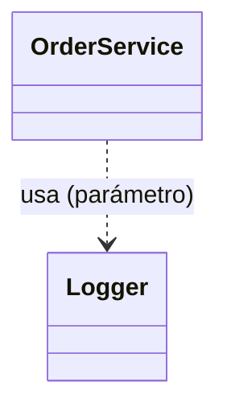

```java
class OrderService {
    void checkout(Order order, Logger logger) { // Logger solo existe durante esta llamada
        logger.info("procesando pedido " + order.id());
    }
}
```

#### Asociación

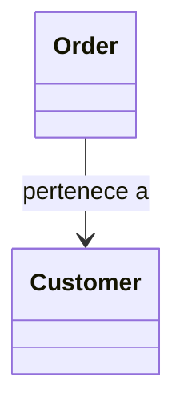

```java
class Order {
    private Customer customer; // referencia duradera, pero Order y Customer viven independientemente
}
```

#### Agregación ("tiene un", partes independientes)

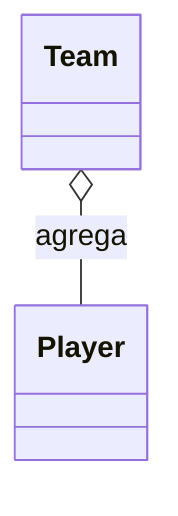

```java
class Team {
    private List<Player> players;

    Team(List<Player> players) { // los jugadores se crean fuera y se pasan ya existentes
        this.players = players;
    }
    // si este Team se destruye, los objetos Player siguen existiendo en otra parte del programa
}
```

#### Composición ("tiene un", partes dependientes)

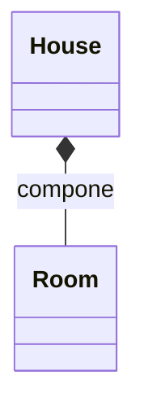

```java
class House {
    private final List<Room> rooms = new ArrayList<>();

    House() {
        rooms.add(new Room("Sala"));  // las Room se crean DENTRO de House, no llegan de afuera
        rooms.add(new Room("Cocina"));
    }
    // si el House se destruye (garbage collected), sus Room no son referenciadas por nadie más y mueren con él
}
```

#### Generalización (herencia) y realización

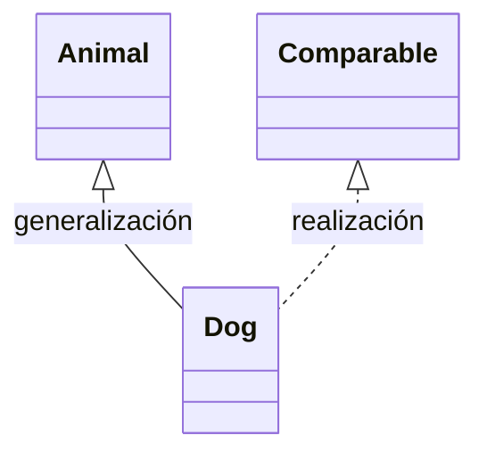

```java
class Animal { }
class Dog extends Animal implements Comparable<Dog> { // extends = generalización, implements = realización
    public int compareTo(Dog other) { return 0; }
}
```

#### Todas las relaciones juntas

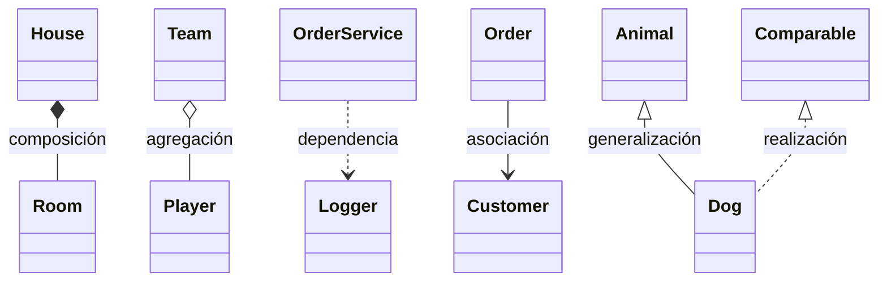

**Cómo distinguir agregación de composición en la práctica**: pregúntate "¿puede la parte existir y tener sentido sin el todo, o se pasa desde afuera ya construida?" Si sí (como un `Player` que existió antes del `Team` y podría seguir jugando en otro equipo), es agregación. Si la parte se crea y muere junto con el todo, y no tiene sentido fuera de él (como una `Room` que no existe como concepto independiente de su `House`), es composición.

### 2.6 Multiplicidad

```text
Customer "1" ── "0..*" Order
```

Se lee: "un `Customer` se asocia con cero o más `Order`; cada `Order` se asocia con exactamente un `Customer`". Esta es exactamente la misma cardinalidad 1:N vista en el modelo Entidad-Relación de [`sql-guide.md`](sql-guide.md#32-cardinalidades-explicadas) — UML y el modelo ER son dos notaciones distintas para la misma idea de relación y cardinalidad.

---

## 3. Complejidad algorítmica

### 3.1 ¿Por qué medir complejidad?

Dos algoritmos pueden resolver el mismo problema con tiempos de ejecución radicalmente distintos a medida que crece la entrada. La complejidad algorítmica describe **cómo crece el costo (tiempo o memoria) en función del tamaño de la entrada**, de forma independiente del hardware concreto.

### 3.2 Notación Big O, Big Omega y Big Theta

| Notación | Describe | Uso habitual |
|---|---|---|
| **O (Big O)** | Cota superior — el peor caso | La más usada en la práctica: "esto no será peor que..." |
| **Ω (Big Omega)** | Cota inferior — el mejor caso | Menos citada en conversación cotidiana |
| **Θ (Big Theta)** | Cota ajustada — cuando el mejor y peor caso coinciden en el orden de crecimiento | Describe el comportamiento "típico" exacto |

En la práctica de la industria, "complejidad" casi siempre se refiere a Big O (peor caso), que es lo que se usa en el resto de esta sección.

### 3.3 Complejidades comunes, de mejor a peor

| Notación | Nombre | Ejemplo |
|---|---|---|
| `O(1)` | Constante | Acceder a `array[i]` |
| `O(log n)` | Logarítmica | Búsqueda binaria |
| `O(n)` | Lineal | Recorrer un array una vez |
| `O(n log n)` | Linearítmica | Merge sort, Quicksort (caso promedio) |
| `O(n²)` | Cuadrática | Bucles anidados sobre la misma entrada (bubble sort) |
| `O(2ⁿ)` | Exponencial | Fuerza bruta recursiva sin memoización (ej. Fibonacci recursivo ingenuo) |
| `O(n!)` | Factorial | Fuerza bruta probando todas las permutaciones (viajante de comercio sin optimizar) |

```text
Crecimiento relativo para n = 20:
O(1)        = 1
O(log n)    ≈ 4.3
O(n)        = 20
O(n log n)  ≈ 86
O(n²)       = 400
O(2ⁿ)       = 1,048,576
O(n!)       = 2,432,902,008,176,640,000
```

### 3.4 Analizando código real

```java
void ejemploLineal(int[] array) {
    for (int i = 0; i < array.length; i++) {   // se ejecuta n veces
        System.out.println(array[i]);
    }
}
// O(n): un bucle simple sobre la entrada

void ejemploCuadratico(int[] array) {
    for (int i = 0; i < array.length; i++) {        // n veces
        for (int j = 0; j < array.length; j++) {    // n veces por cada i
            System.out.println(array[i] + array[j]);
        }
    }
}
// O(n²): bucles anidados, cada uno recorriendo la misma entrada

int busquedaBinaria(int[] array, int objetivo) {
    int izquierda = 0, derecha = array.length - 1;
    while (izquierda <= derecha) {
        int medio = (izquierda + derecha) / 2;
        if (array[medio] == objetivo) return medio;
        if (array[medio] < objetivo) izquierda = medio + 1;
        else derecha = medio - 1;
    }
    return -1;
}
// O(log n): cada iteración descarta la mitad restante del espacio de búsqueda
```

### 3.5 Complejidad de espacio

La misma notación se aplica a la memoria adicional que usa un algoritmo (sin contar la entrada misma).

```java
int[] copiar(int[] original) {
    int[] copia = new int[original.length]; // O(n) de espacio adicional
    System.arraycopy(original, 0, copia, 0, original.length);
    return copia;
}

int sumar(int[] array) {
    int total = 0;                          // O(1) de espacio adicional
    for (int valor : array) total += valor;
    return total;
}
```

### 3.6 Complejidad amortizada

Una operación puede ser costosa ocasionalmente pero barata en promedio a lo largo de muchas invocaciones.

```text
ArrayList.add(elemento):
  - Caso normal: O(1) — hay espacio libre en el arreglo interno.
  - Caso ocasional: O(n) — el arreglo interno está lleno y debe redimensionarse (copiar todo a uno más grande).
  - Complejidad amortizada: O(1) — el costo del redimensionamiento, repartido entre todas las inserciones, es constante en promedio.
```

---

## 4. Estructuras de datos

### 4.1 Arrays

Bloque contiguo de memoria de tamaño fijo con acceso indexado en `O(1)`. Insertar o eliminar en medio requiere desplazar elementos: `O(n)`.

### 4.2 Listas enlazadas

| Variante | Estructura |
|---|---|
| Simple | Cada nodo apunta solo al siguiente |
| Doble | Cada nodo apunta al siguiente y al anterior |
| Circular | El último nodo apunta de vuelta al primero |

```text
Simple:   [A|•]→[B|•]→[C|null]
Doble:    null←[A|•|•]⇄[B|•|•]⇄[C|•|null]
```

Acceso por índice: `O(n)` (hay que recorrer desde el inicio). Insertar/eliminar al inicio o si ya se tiene el nodo: `O(1)`, sin desplazar el resto de elementos (a diferencia de un array).

### 4.3 Pilas y colas

| Estructura | Orden | Operaciones | Ejemplo real |
|---|---|---|---|
| **Pila (Stack)** | LIFO (last in, first out) | `push`, `pop`, `peek` | Historial de "deshacer", pila de llamadas de un programa |
| **Cola (Queue)** | FIFO (first in, first out) | `enqueue`, `dequeue` | Cola de impresión, cola de tareas |
| **Cola doble (Deque)** | Ambos extremos | `addFirst`, `addLast`, `removeFirst`, `removeLast` | Algoritmo de ventana deslizante |

### 4.4 Árboles

```text
Árbol Binario de Búsqueda (BST)
              8
           /     \
          3       10
         / \        \
        1   6        14
           / \       /
          4   7     13
```

Regla de un BST: para cada nodo, todo lo del subárbol izquierdo es menor y todo lo del subárbol derecho es mayor. Búsqueda, inserción y borrado: `O(log n)` si el árbol está balanceado, pero degenera a `O(n)` en el peor caso (ej. insertar datos ya ordenados sin balanceo, formando efectivamente una lista enlazada).

| Tipo de árbol | Se autobalancea | Uso típico |
|---|---|---|
| **BST simple** | No | Educativo; en producción casi siempre se usa una variante balanceada |
| **AVL** | Sí (estrictamente, por altura) | Lecturas muy frecuentes, pocas escrituras |
| **Rojo-Negro** | Sí (menos estrictamente que AVL) | Usado internamente por `TreeMap`/`TreeSet` en Java, `std::map` en C++ |
| **B-tree / B+tree** | Sí | Índices de bases de datos y sistemas de archivos (optimizado para bloques de disco) |
| **Trie** | — (no es de búsqueda por comparación) | Autocompletado, diccionarios de prefijos |

```text
Trie para las palabras "CAT", "CAR", "DOG":
        (raíz)
        /    \
       C      D
       |      |
       A      O
      / \     |
     T   R    G
```

### 4.5 Grafos

| Representación | Espacio | Bueno para |
|---|---|---|
| Matriz de adyacencia | `O(V²)` | Grafos densos, comprobar si existe una arista en `O(1)` |
| Lista de adyacencia | `O(V + E)` | Grafos dispersos (la mayoría de casos reales), recorrer vecinos eficientemente |

```text
Grafo:           Lista de adyacencia:
A ─ B            A: [B, C]
│   │            B: [A, D]
C ─ D            C: [A, D]
                  D: [B, C]
```

| Recorrido | Estructura auxiliar | Uso típico |
|---|---|---|
| **BFS** (Breadth-First Search) | Cola | Camino más corto en grafos no ponderados, recorrido por niveles |
| **DFS** (Depth-First Search) | Pila (o recursión) | Detectar ciclos, ordenamiento topológico, explorar todo un camino antes de retroceder |

### 4.6 Tablas hash

Almacenan pares clave-valor con acceso promedio `O(1)` mediante una **función de hash** que convierte la clave en un índice de un arreglo interno (*buckets*).

```text
hash("Ana") % 16 = 4  →  se guarda en el bucket 4
```

**Colisión**: dos claves distintas producen el mismo índice. Estrategias de resolución:

| Estrategia | Idea |
|---|---|
| **Encadenamiento (chaining)** | Cada bucket guarda una lista enlazada de todas las entradas que colisionaron ahí |
| **Direccionamiento abierto (open addressing)** | Si el bucket está ocupado, se prueba el siguiente según una secuencia (lineal, cuadrática, doble hash) |

Con una buena función de hash y un factor de carga razonable, el promedio se mantiene en `O(1)`; en el peor caso (muchas colisiones), degenera a `O(n)`.

### 4.7 Heaps (colas de prioridad)

Un **min-heap** garantiza que la raíz siempre sea el elemento mínimo; un **max-heap**, que siempre sea el máximo. Insertar y extraer el mínimo/máximo: `O(log n)`. Consultar el mínimo/máximo sin extraerlo: `O(1)`.

```text
Min-heap:
        1
      /   \
     3     5
    / \   /
   4   8 9
```

Uso típico: colas de prioridad (procesar la tarea más urgente primero), algoritmo de Dijkstra, `heapsort`.

### 4.8 Tabla comparativa

| Operación | Array | Lista enlazada | BST balanceado | Tabla hash |
|---|---|---|---|---|
| Acceso por índice | `O(1)` | `O(n)` | — | — |
| Búsqueda por valor | `O(n)` | `O(n)` | `O(log n)` | `O(1)` promedio |
| Inserción al final | `O(1)`* | `O(1)`** | `O(log n)` | `O(1)` promedio |
| Inserción/borrado en medio | `O(n)` | `O(1)`** | `O(log n)` | `O(1)` promedio |
| Mantiene orden | Sí (el de inserción) | Sí (el de inserción) | Sí (ordenado) | No |

\* amortizado, si el array es dinámico (ej. `ArrayList`). \*\* si ya se tiene una referencia al nodo; si hay que buscarlo primero, se suma `O(n)` de búsqueda.

---

## 5. Algoritmos fundamentales

### 5.1 Algoritmos de ordenamiento

| Algoritmo | Complejidad promedio | Peor caso | Estable | Notas |
|---|---|---|---|---|
| Bubble sort | `O(n²)` | `O(n²)` | Sí | Educativo, no usar en producción |
| Selection sort | `O(n²)` | `O(n²)` | No | Educativo |
| Insertion sort | `O(n²)` | `O(n²)` | Sí | Muy eficiente para entradas casi ordenadas o pequeñas |
| Merge sort | `O(n log n)` | `O(n log n)` | Sí | Garantiza `n log n` siempre, usa memoria adicional `O(n)` |
| Quicksort | `O(n log n)` | `O(n²)` | No | Rápido en la práctica; el peor caso es raro con buen pivote |
| Heapsort | `O(n log n)` | `O(n log n)` | No | In-place, no necesita memoria adicional significativa |

```java
// Merge sort: divide y vencerás
int[] mergeSort(int[] array) {
    if (array.length <= 1) return array;

    int mid = array.length / 2;
    int[] left = mergeSort(Arrays.copyOfRange(array, 0, mid));
    int[] right = mergeSort(Arrays.copyOfRange(array, mid, array.length));

    return merge(left, right);
}
```

En la práctica, casi ningún lenguaje moderno pide implementar el ordenamiento a mano: `Arrays.sort()` (Java), `sorted()` (Python) o `std::sort` (C++) usan implementaciones híbridas ya optimizadas (Timsort, Introsort). El valor de conocer estos algoritmos está en el razonamiento de complejidad y en entrevistas técnicas, no en reinventarlos.

### 5.2 Búsqueda

```text
Búsqueda lineal:  O(n)  — funciona en cualquier colección, ordenada o no.
Búsqueda binaria: O(log n) — requiere que la colección esté ordenada.
```

### 5.3 Recursividad, backtracking y programación dinámica

```java
// Recursividad simple: factorial
int factorial(int n) {
    if (n <= 1) return 1;          // caso base
    return n * factorial(n - 1);   // caso recursivo
}
```

**Backtracking**: explorar todas las soluciones posibles, retrocediendo tan pronto una decisión resulta inválida, en vez de generar todas las combinaciones y filtrar después.

```java
// Esqueleto genérico de backtracking
void resolver(Estado estado) {
    if (estado.esSolucionCompleta()) {
        guardarSolucion(estado);
        return;
    }
    for (Opcion opcion : estado.opcionesPosibles()) {
        if (estado.esValida(opcion)) {
            estado.aplicar(opcion);
            resolver(estado);
            estado.deshacer(opcion); // el "back" del backtracking
        }
    }
}
```

**Programación dinámica**: descomponer un problema en subproblemas superpuestos y **memoizar** (guardar) sus resultados para no recalcularlos.

```java
// Fibonacci recursivo ingenuo: O(2^n), recalcula los mismos subproblemas una y otra vez
int fibonacciIngenuo(int n) {
    if (n <= 1) return n;
    return fibonacciIngenuo(n - 1) + fibonacciIngenuo(n - 2);
}

// Fibonacci con memoización: O(n), cada subproblema se calcula una única vez
int fibonacciMemo(int n, Map<Integer, Integer> cache) {
    if (n <= 1) return n;
    if (cache.containsKey(n)) return cache.get(n);

    int resultado = fibonacciMemo(n - 1, cache) + fibonacciMemo(n - 2, cache);
    cache.put(n, resultado);
    return resultado;
}
```

### 5.4 Algoritmos greedy (voraces)

Toman en cada paso la decisión que parece mejor **localmente**, sin reconsiderarla después. Funcionan cuando el problema tiene la propiedad de que una secuencia de óptimos locales produce el óptimo global (no siempre es el caso).

```text
Ejemplo clásico: dar cambio con el menor número de monedas posible,
usando denominaciones 1, 5, 10, 25 — tomar siempre la moneda más grande que quepa.
Funciona con estas denominaciones; NO funciona de forma óptima con denominaciones arbitrarias.
```

### 5.5 Algoritmos sobre grafos

```text
BFS: encontrar el camino más corto en aristas en un grafo NO ponderado.
DFS: explorar completamente una rama antes de retroceder; detectar ciclos.
Dijkstra: camino más corto en un grafo ponderado con pesos no negativos.
```

```java
// Dijkstra, esqueleto conceptual
Map<Nodo, Integer> dijkstra(Grafo grafo, Nodo origen) {
    Map<Nodo, Integer> distancias = new HashMap<>();
    PriorityQueue<Nodo> cola = new PriorityQueue<>(Comparator.comparingInt(distancias::get));

    distancias.put(origen, 0);
    cola.add(origen);

    while (!cola.isEmpty()) {
        Nodo actual = cola.poll();
        for (Arista arista : grafo.vecinos(actual)) {
            int nuevaDistancia = distancias.get(actual) + arista.peso();
            if (nuevaDistancia < distancias.getOrDefault(arista.destino(), Integer.MAX_VALUE)) {
                distancias.put(arista.destino(), nuevaDistancia);
                cola.add(arista.destino());
            }
        }
    }
    return distancias;
}
```

La cola de prioridad (heap, sección 4.7) es lo que hace que Dijkstra procese siempre el nodo con menor distancia acumulada conocida hasta el momento.

---

## 6. Testing de software

### 6.1 La pirámide de testing

```text
        ▲
       /E2E\          pocas, lentas, frágiles, alta confianza end-to-end
      /------\
     /Integra-\       moderadas, verifican que las piezas se conectan bien
    /  ción    \
   /------------\
  /   Unitarias   \   muchas, rápidas, aisladas, base de la pirámide
 /------------------\
```

La idea central: la mayoría de las pruebas deberían ser unitarias (rápidas de ejecutar, fáciles de mantener, feedback inmediato), un número moderado de integración, y solo unas pocas end-to-end (lentas y costosas de mantener, pero necesarias para validar el flujo completo real).

### 6.2 Tipos de pruebas

#### Funcionales (verifican qué hace el sistema)

| Tipo | Qué valida | Quién la escribe típicamente |
|---|---|---|
| **Unitaria** | Una unidad aislada (una función, un método, una clase) sin dependencias externas reales | Desarrolladores |
| **Integración** | Que varios componentes reales colaboren correctamente (ej. servicio + base de datos real) | Desarrolladores |
| **Sistema** | La aplicación completa como una caja, contra sus requisitos | QA |
| **Aceptación** | Que el sistema cumple los criterios de negocio acordados (a menudo en formato Gherkin) | QA / negocio |
| **Regresión** | Que un cambio nuevo no rompió funcionalidad que ya funcionaba | Automatizada, se ejecuta en cada cambio |
| **Smoke test** | Un chequeo mínimo y rápido de que "lo básico funciona" tras un despliegue | Automatizada, primera línea de defensa |
| **Sanity test** | Verificación rápida y específica tras un cambio puntual, más acotada que un smoke test | Manual o automatizada |

#### No funcionales (verifican cómo se comporta el sistema)

| Tipo | Qué valida |
|---|---|
| **Rendimiento / carga** | Tiempos de respuesta bajo una carga esperada |
| **Estrés** | Comportamiento en el límite o más allá de la capacidad esperada |
| **Seguridad** | Resistencia a ataques y vulnerabilidades conocidas (ver sección 11) |
| **Usabilidad** | Qué tan fácil es de usar para una persona real |
| **Compatibilidad** | Funciona correctamente en distintos navegadores, sistemas operativos, dispositivos |

### 6.3 TDD y BDD

**TDD (Test-Driven Development)**: escribir la prueba antes que el código de producción.

```text
1. Red:    escribe una prueba que falla (el comportamiento todavía no existe).
2. Green:  escribe el código mínimo para que la prueba pase.
3. Refactor: mejora el código manteniendo la prueba en verde.
```

**BDD (Behavior-Driven Development)**: describir el comportamiento esperado en lenguaje natural estructurado, compartido entre negocio y desarrollo.

```gherkin
Feature: Descuento por volumen

  Scenario: Cliente frecuente recibe descuento
    Given un cliente con más de 10 pedidos previos
    When realiza un nuevo pedido de $100
    Then el sistema aplica un 10% de descuento
    And el total final es $90
```

### 6.4 Dobles de prueba: mock, stub, fake, spy

| Doble | Qué hace | Ejemplo de uso |
|---|---|---|
| **Dummy** | Objeto que solo llena un parámetro requerido, nunca se usa realmente | Un objeto pasado porque el constructor lo exige, sin efecto en la prueba |
| **Stub** | Devuelve respuestas predefinidas, sin lógica real | Un `PaymentGatewayStub` que siempre devuelve "pago exitoso" |
| **Mock** | Como el stub, pero además **verifica** que se le llamó correctamente (qué método, con qué argumentos, cuántas veces) | Verificar que `emailSender.send(...)` fue invocado exactamente una vez |
| **Fake** | Una implementación real pero simplificada, no apta para producción | Una base de datos en memoria en vez de una real |
| **Spy** | Envuelve un objeto real y registra cómo se le llamó, sin reemplazar su comportamiento | Confirmar que un método real se invocó, mientras se ejecuta de verdad |

```java
// Ejemplo con Mockito (Java): mock que verifica interacción
PaymentGateway gateway = mock(PaymentGateway.class);
when(gateway.charge(any())).thenReturn(true);

orderService.checkout(order, gateway);

verify(gateway, times(1)).charge(order.total());
```

### 6.5 Cobertura de código

```text
Line coverage:   % de líneas ejecutadas al menos una vez por las pruebas.
Branch coverage: % de ramas (if/else, cada caso de un switch) ejercitadas.
```

Un 100 % de cobertura **no garantiza ausencia de bugs**: cobertura mide si una línea se ejecutó, no si el resultado se verificó correctamente con una aserción significativa. Es una métrica útil para encontrar código completamente no probado, no un objetivo a maximizar ciegamente.

### 6.6 Herramientas por ecosistema

| Categoría | Herramientas |
|---|---|
| Unit testing | JUnit 5 + Mockito (Java), pytest (Python), Jest (JavaScript/TypeScript), xUnit/NUnit (.NET) |
| End-to-end / UI | Selenium, Cypress, Playwright |
| Pruebas de API | Postman, REST Assured, Insomnia |
| Rendimiento / carga | JMeter, k6, Gatling |
| Análisis de cobertura | JaCoCo (Java), coverage.py (Python), Istanbul/nyc (JS) |
| BDD | Cucumber, SpecFlow |

### 6.7 Ejemplo concreto: unitaria vs. integración

```java
// Prueba UNITARIA: aísla OrderService de su dependencia real con un mock
@Test
void aplicaDescuentoDelDiezPorcientoAClienteFrecuente() {
    Cliente cliente = new Cliente(11); // 11 pedidos previos
    PaymentGateway gatewayMock = mock(PaymentGateway.class);
    OrderService service = new OrderService(gatewayMock);

    double total = service.calcularTotal(cliente, 100.0);

    assertEquals(90.0, total);
}

// Prueba de INTEGRACIÓN: usa una base de datos real (o de pruebas) de verdad
@Test
void guardaElPedidoEnLaBaseDeDatosReal() {
    OrderRepository repository = new JdbcOrderRepository(testDataSource);

    repository.save(new Order(1, 100.0));

    assertTrue(repository.findById(1).isPresent());
}
```

### 6.8 Caja blanca, caja negra y caja gris

Otro eje para clasificar pruebas, ortogonal a "unitaria/integración/E2E": **cuánto conoce del código interno quien diseña la prueba**.

| Enfoque | Qué conoce quien prueba | Ejemplo |
|---|---|---|
| **Caja blanca (white-box)** | La estructura interna: ramas, rutas, lógica del código | Un desarrollador escribe un unit test viendo directamente el código fuente del método |
| **Caja negra (black-box)** | Solo entradas y salidas esperadas, sin ver el código | QA prueba un formulario web a través de la UI, sin conocer la implementación |
| **Caja gris (gray-box)** | Conocimiento parcial (ej. el esquema de la base de datos, pero no la lógica del servicio) | Probar una API REST conociendo el modelo de datos pero no el código del backend |

En la práctica: las pruebas unitarias suelen ser caja blanca (quien las escribe ve el código), y las de aceptación/sistema suelen ser caja negra (validan comportamiento observable, no implementación).

### 6.9 Pruebas de contrato (contract testing)

En arquitecturas de microservicios (sección 10), probar la integración real entre dos servicios desplegando ambos completos es lento y frágil. El **contract testing** resuelve esto: el consumidor de una API define un contrato con las peticiones y respuestas que espera, y tanto el consumidor como el proveedor verifican ese contrato **por separado**, sin necesitar el otro servicio corriendo.

```text
Consumidor (ej. frontend)                    Proveedor (ej. servicio de pedidos)
        │                                              │
        │── define el contrato esperado ──────────────>│
        │   "espero POST /pedidos → 201 + {id, total}" │
        │                                              │
   verifica contra                              verifica contra
   un mock generado                              el contrato,
   del contrato                                  sin el consumidor real
```

Herramienta de referencia: **Pact** (consumer-driven contracts). Evita el dilema de "para probar la integración necesito el otro equipo desplegado" en sistemas distribuidos.

### 6.10 Mutation testing (pruebas de mutación)

La cobertura de código (sección 6.5) mide si una línea se *ejecutó*, no si su resultado se *verificó* correctamente. El **mutation testing** ataca justo ese punto ciego: introduce automáticamente pequeños cambios ("mutantes") al código de producción — invertir una condición, cambiar `<` por `<=`, quitar una línea — y vuelve a correr la suite de pruebas.

```text
Código original:        if (edad >= 18) { permitirAcceso(); }
Mutante generado:        if (edad > 18)  { permitirAcceso(); }

Si ninguna prueba falla con el mutante, el mutante "sobrevive":
señal de que ese comportamiento (el caso borde edad == 18) no está realmente verificado,
aunque la línea sí esté "cubierta" según coverage tradicional.
```

Herramientas: `PIT` (Java), `Stryker` (JavaScript/.NET), `mutmut` (Python).

### 6.11 Property-based testing

En vez de escribir casos puntuales ("con la entrada X espero la salida Y"), se describen **propiedades** que deben cumplirse para *cualquier* entrada válida, y la herramienta genera automáticamente cientos de casos —incluyendo casos límite que un humano no pensaría— buscando refutarlas.

```java
// jqwik (Java): la propiedad debe cumplirse para cualquier lista de enteros generada
@Property
void invertirDosVecesDaLaListaOriginal(@ForAll List<Integer> lista) {
    assertEquals(lista, invertir(invertir(lista)));
}
```

Herramientas: `QuickCheck` (Haskell, origen del concepto), `Hypothesis` (Python), `jqwik` (Java), `fast-check` (JavaScript/TypeScript).

### 6.12 Tests flaky y el anti-patrón "copa de helado"

**Test flaky**: una prueba que a veces pasa y a veces falla sin que el código haya cambiado, típicamente por depender de tiempo real, orden de ejecución entre pruebas, red, o estado compartido no aislado. Son peligrosos porque erosionan la confianza en el pipeline de CI: el equipo empieza a "reintentar hasta que pase" en vez de investigar la causa real.

```text
Pirámide sana (sección 6.1):          Anti-patrón "copa de helado" (ice-cream cone):
      ▲                                       ▲
     /E2E\  pocas                            /  E2E  \  MUCHAS, lentas, frágiles
    /-----\                                 /---------\
   /Integ. \                               /Integración\
  /---------\                             /--------------\
 /Unitarias  \  MUCHAS, rápidas          /   Unitarias    \  pocas (invertido: mala señal)
/-------------\                         /-------------------\
```

Cuando la mayoría de las pruebas de un proyecto son E2E manuales o lentas, y hay pocas unitarias en la base, el feedback se vuelve lento, frágil y caro de mantener: exactamente lo opuesto de lo que busca la pirámide de testing.

---

## 7. Control de versiones y flujo colaborativo

> El uso de Git en sí (comandos, ramas, merge vs. rebase) se cubre en detalle en [`git-guide.md`](git-guide.md). Esta sección cubre solo el **flujo de trabajo colaborativo** alrededor de Git, que es una decisión de proceso, no de comandos.

| Estrategia | Idea | Trade-off |
|---|---|---|
| **Git-flow** | Ramas de larga vida (`develop`, `release`, `feature/*`, `hotfix/*`) con un proceso formal de fusión | Buena trazabilidad y control de releases; más pesado para equipos con despliegue continuo |
| **Trunk-based development** | Todo el mundo integra a la rama principal frecuentemente (al menos una vez al día), con ramas de vida muy corta | Encaja mejor con CI/CD continuo; exige buena cobertura de pruebas automáticas y feature flags para ocultar trabajo incompleto |
| **GitHub flow** | Una rama principal desplegable siempre + ramas cortas de feature con pull request | Punto intermedio, muy común en proyectos open source y equipos pequeños/medianos |

### 7.1 Qué se revisa en un code review

- ¿El cambio resuelve el problema descrito, ni más ni menos?
- ¿Hay pruebas que cubran el comportamiento nuevo o corregido?
- ¿El nombre de variables/métodos comunica la intención sin necesitar el comentario de al lado?
- ¿Se introduce complejidad o abstracción no justificada por el problema actual?
- ¿Rompe alguna convención de estilo o arquitectura ya establecida en el proyecto?

---

## 8. DevOps: de básico a avanzado

### 8.1 Nivel básico: ¿qué es DevOps?

DevOps es una cultura y un conjunto de prácticas que busca acortar el ciclo entre escribir código y tenerlo funcionando de forma confiable en producción, integrando las responsabilidades de desarrollo (Dev) y operaciones (Ops) en vez de tratarlas como equipos separados con un traspaso manual.

```text
Antes de DevOps:  Dev escribe código → "lo tiro por encima del muro" → Ops lo despliega y sufre
Con DevOps:       Dev y Ops comparten responsabilidad sobre todo el ciclo, con automatización de por medio
```

#### Los pilares de DevOps (CALMS)

| Letra | Pilar | Idea |
|---|---|---|
| **C** | Cultura | Responsabilidad compartida entre Dev y Ops, sin "lanzar el problema por encima del muro" |
| **A** | Automatización | Todo lo repetible (build, pruebas, despliegue, provisión de infraestructura) se automatiza |
| **L** | Lean | Entregar en lotes pequeños, eliminar desperdicio, optimizar el flujo de valor de punta a punta |
| **M** | Medición | Si no se mide (métricas de pipeline, de sistema, de negocio), no se puede mejorar con datos |
| **S** | Compartir (Sharing) | Conocimiento, herramientas y responsabilidad de incidentes compartidos entre equipos |

#### Integración Continua (CI)

```text
Pipeline típico de CI:
commit → build → pruebas unitarias → análisis estático → empaquetado → artefacto listo
```

Cada cambio se integra frecuentemente a la rama principal (idealmente varias veces al día, ver *trunk-based development* en la sección 7) y dispara automáticamente este pipeline, detectando problemas de integración lo antes posible: cuanto más tiempo pasa una rama sin integrarse, más caro es resolver los conflictos y las incompatibilidades.

| Etapa del pipeline | Qué hace | Qué detecta |
|---|---|---|
| **Build/Compile** | Compila el código fuente | Errores de sintaxis o de tipos |
| **Pruebas unitarias** | Ejecuta la base de la pirámide de testing (sección 6.1) | Regresiones de lógica de negocio |
| **Análisis estático (lint/SAST)** | Revisa el código sin ejecutarlo (estilo, code smells, vulnerabilidades conocidas) | Problemas de calidad y seguridad antes de llegar a producción |
| **Pruebas de integración** | Verifica que los componentes colaboran correctamente | Problemas de contrato entre módulos/servicios |
| **Empaquetado** | Genera el artefacto desplegable (`.jar`, imagen Docker, etc.) y lo publica en un repositorio de artefactos | — |

#### Entrega y despliegue continuo (CD)

| Término | Significado |
|---|---|
| **Continuous Delivery** | El software está siempre en un estado desplegable; el despliegue a producción sigue siendo una decisión manual |
| **Continuous Deployment** | Cada cambio que pasa el pipeline se despliega a producción automáticamente, sin intervención manual |

```yaml
# Ejemplo genérico de pipeline (sintaxis estilo GitHub Actions/GitLab CI)
pipeline:
  build:
    script: mvn compile
  test:
    script: mvn test
  package:
    script: mvn package
  deploy:
    script: ./deploy.sh
    when: manual   # Delivery si es manual; se vuelve Deployment si se quita esta línea
```

```text
Promoción típica de un cambio a través de entornos:
Desarrollo (dev) → Pruebas/Staging (QA) → Producción (prod)

Cada entorno es una réplica cada vez más fiel de producción; el mismo artefacto
construido una sola vez ("build once, deploy many") avanza sin recompilarse,
para garantizar que lo que se probó es exactamente lo que se despliega.
```

#### Conceptos que todo ingeniero de software debería manejar

| Concepto | Idea |
|---|---|
| **Feature flags (feature toggles)** | Interruptores en código que activan/desactivan funcionalidad sin desplegar de nuevo; permiten integrar código incompleto a la rama principal sin exponerlo a usuarios (clave para trunk-based development) |
| **Versionado semántico (SemVer)** | Esquema `MAJOR.MINOR.PATCH`: `MAJOR` rompe compatibilidad, `MINOR` añade funcionalidad compatible, `PATCH` corrige bugs sin romper nada |
| **Repositorio de artefactos** | Almacén versionado de los binarios ya construidos (ej. Nexus, Artifactory, GitHub Packages, Docker Registry), distinto del repositorio de código fuente |
| **Infraestructura inmutable** | En vez de modificar un servidor en caliente, se reemplaza por una instancia nueva construida desde cero con la configuración deseada; elimina el "configuration drift" |
| **Shift-left** | Mover la detección de problemas (bugs, vulnerabilidades, problemas de diseño) lo más temprano posible en el ciclo, en vez de descubrirlos en producción |
| **Rollback** | Revertir un despliegue a la versión anterior conocida como buena, típicamente automatizado y disparado por métricas de salud |

#### Métricas DORA

El equipo de *DevOps Research and Assessment* (DORA) identificó cuatro métricas que correlacionan con equipos de alto desempeño:

| Métrica | Qué mide | Un equipo de alto desempeño... |
|---|---|---|
| **Deployment frequency** | Con qué frecuencia se despliega a producción | Despliega bajo demanda, múltiples veces al día |
| **Lead time for changes** | Tiempo desde que se hace un commit hasta que corre en producción | Lo mide en horas, no en semanas |
| **Change failure rate** | % de despliegues que causan un fallo en producción | Lo mantiene bajo (0-15 %) |
| **Time to restore service (MTTR)** | Cuánto tarda en recuperarse de un fallo en producción | Lo mide en minutos u horas, no en días |

### 8.2 Nivel intermedio: contenedores y orquestación

#### Docker

```text
Imagen:      plantilla inmutable con todo lo necesario para correr la app (código, runtime, dependencias)
Contenedor:  una instancia en ejecución de una imagen
Capas:       cada instrucción del Dockerfile crea una capa, cacheada y reutilizable entre builds
```

```dockerfile
FROM eclipse-temurin:21-jre
WORKDIR /app
COPY target/app.jar app.jar
EXPOSE 8080
ENTRYPOINT ["java", "-jar", "app.jar"]
```

```bash
docker build -t mi-app:1.0 .
docker run -p 8080:8080 mi-app:1.0
```

Los contenedores resuelven el clásico "en mi máquina funciona": empaquetan la aplicación junto con su entorno exacto de ejecución.

#### Kubernetes (orquestación)

| Concepto | Qué es |
|---|---|
| **Pod** | La unidad mínima desplegable; uno o más contenedores que comparten red y almacenamiento |
| **Deployment** | Declara cuántas réplicas de un Pod deben existir y gestiona actualizaciones progresivas |
| **Service** | Punto de acceso estable (IP/DNS) hacia un conjunto de Pods que pueden cambiar dinámicamente |
| **ConfigMap / Secret** | Configuración y credenciales desacopladas de la imagen del contenedor |

```yaml
apiVersion: apps/v1
kind: Deployment
metadata:
  name: mi-app
spec:
  replicas: 3
  selector:
    matchLabels: { app: mi-app }
  template:
    metadata:
      labels: { app: mi-app }
    spec:
      containers:
        - name: mi-app
          image: mi-app:1.0
          ports: [{ containerPort: 8080 }]
```

#### Infraestructura como código (IaC)

```text
En vez de crear servidores/redes a mano en una consola web,
se declara la infraestructura deseada en archivos versionados en Git.
```

| Herramienta | Enfoque |
|---|---|
| **Terraform** | Declarativo, multi-proveedor (AWS, Azure, GCP...) |
| **Ansible** | Basado en tareas (playbooks), agentless vía SSH |
| **Pulumi** | Declarativo pero usando lenguajes de programación de propósito general |

```hcl
# Terraform: declara el estado deseado, la herramienta calcula cómo llegar a él
resource "aws_instance" "servidor_web" {
  ami           = "ami-0abcdef1234567890"
  instance_type = "t3.micro"
}
```

### 8.3 Nivel avanzado: observabilidad y estrategias de despliegue

#### Los tres pilares de la observabilidad

| Pilar | Responde |
|---|---|
| **Logs** | ¿Qué eventos discretos ocurrieron? |
| **Métricas** | ¿Cómo se comporta el sistema numéricamente a lo largo del tiempo? (latencia, tasa de error, uso de CPU) |
| **Trazas (tracing)** | ¿Por qué camino exacto viajó una solicitud a través de varios servicios? |

| Herramienta | Pilar principal |
|---|---|
| Prometheus | Métricas |
| Grafana | Visualización (de métricas, logs y trazas) |
| ELK / OpenSearch | Logs |
| Jaeger / Zipkin | Trazas distribuidas |

#### Estrategias de despliegue

| Estrategia | Idea | Riesgo |
|---|---|---|
| **Rolling update** | Reemplaza instancias viejas por nuevas de forma gradual | Ambas versiones coexisten brevemente |
| **Blue-green** | Dos entornos idénticos (blue = actual, green = nuevo); se cambia el tráfico de golpe cuando green está validado | Requiere el doble de infraestructura durante el cambio |
| **Canary** | El tráfico nuevo se dirige primero a un pequeño porcentaje de usuarios antes de expandirse a todos | Necesita buena observabilidad para decidir si expandir o revertir |

#### GitOps

```text
El estado deseado de la infraestructura y las aplicaciones vive en un repositorio Git.
Un controlador (ej. ArgoCD, Flux) reconcilia continuamente el estado real del clúster
con lo declarado en Git, en vez de que alguien ejecute comandos de despliegue manualmente.
```

### 8.4 Herramientas por categoría (resumen)

| Categoría | Herramientas |
|---|---|
| CI/CD | Jenkins, GitHub Actions, GitLab CI, CircleCI |
| Contenedores | Docker, Podman |
| Orquestación | Kubernetes, Docker Swarm |
| IaC | Terraform, Ansible, Pulumi, CloudFormation |
| Observabilidad | Prometheus, Grafana, ELK/OpenSearch, Jaeger |
| GitOps | ArgoCD, Flux |

---

## 9. Paradigmas de procesamiento de datos: OLTP, OLAP, batch y streaming

Todo sistema que mueve datos encaja, casi siempre, en alguna combinación de estos ejes: si procesa **transacciones o análisis**, y si procesa datos **en el momento o por lotes**. Reconocer en cuál está parado un sistema ayuda a elegir la base de datos, el patrón de acceso y la arquitectura correctos.

### 9.1 OLTP vs. OLAP

| | **OLTP** (Online Transaction Processing) | **OLAP** (Online Analytical Processing) |
|---|---|---|
| Propósito | Operar el negocio día a día | Analizar el negocio para tomar decisiones |
| Operación típica | Insertar/actualizar un pedido, un pago, un registro de usuario | Agregar millones de filas: ventas totales por región y mes |
| Consultas | Muchas, cortas, tocan pocas filas | Pocas, complejas, tocan muchísimas filas |
| Modelo de datos | Normalizado (evita duplicación, ver `sql-guide.md`) | Desnormalizado — esquema estrella/copo de nieve, optimizado para lectura agregada |
| Usuarios típicos | La aplicación misma, en tiempo real | Analistas de negocio, dashboards, reportes |
| Ejemplo de motor | PostgreSQL, MySQL para el sistema transaccional | Snowflake, BigQuery, Redshift para el data warehouse |

```sql
-- Consulta OLTP: rápida, toca una fila puntual
SELECT * FROM pedidos WHERE id = 48213;

-- Consulta OLAP: agrega sobre millones de filas históricas
SELECT region, DATE_TRUNC('month', fecha) AS mes, SUM(total) AS ventas
FROM pedidos
GROUP BY region, mes
ORDER BY mes;
```

```text
Flujo habitual: los datos NACEN en un sistema OLTP (la app de producción)
y se COPIAN, ya transformados, a un sistema OLAP (el data warehouse) para análisis,
precisamente para no competir por recursos con las consultas transaccionales del negocio en vivo.

  [App] → OLTP (Postgres) ──ETL/ELT──→ OLAP (data warehouse) → [Dashboards / BI]
```

### 9.2 Procesamiento Online (en tiempo real) vs. Batch (por lotes)

| | **Online / Streaming** | **Batch** |
|---|---|---|
| Cuándo procesa | Evento por evento, apenas llega | Un conjunto grande de datos acumulados, en un momento programado |
| Latencia | Milisegundos a segundos | Minutos a horas (ej. un job nocturno) |
| Ejemplo | Detección de fraude mientras ocurre una transacción, feed de notificaciones | Generar el reporte de ventas del día anterior a las 2am |
| Complejidad operativa | Mayor: hay que manejar orden, reintentos, backpressure de forma continua | Menor: se puede reintentar el job completo si falla |
| Herramientas típicas | Kafka, Flink, Kinesis, Spark Streaming | Spark, Hadoop/MapReduce, Airflow orquestando jobs programados |

```text
Batch:                                    Streaming:
[datos acumulados todo el día]            evento → evento → evento → ...
        │  (job a las 2am)                   │        │        │
        ▼                                    ▼        ▼        ▼
   [procesa TODO de una vez]            [se procesa cada uno al llegar,
                                          con resultados casi inmediatos]
```

Existe un punto intermedio muy usado en la práctica: **micro-batching** (ej. Spark Streaming procesa "mini lotes" cada pocos segundos), que da un balance entre la simplicidad del batch y la latencia baja del streaming puro.

### 9.3 ETL vs. ELT

Ambos son el proceso de mover datos desde sistemas de origen (típicamente OLTP) hacia un destino analítico (típicamente OLAP), pero difieren en **cuándo** ocurre la transformación.

```text
ETL (Extract → Transform → Load):
  Origen ──extraer──→ [Zona intermedia: transformar/limpiar/agregar] ──cargar──→ Destino
  La transformación ocurre ANTES de cargar; el destino solo recibe datos ya listos.

ELT (Extract → Load → Transform):
  Origen ──extraer──→ Destino (datos crudos) ──transformar (con el poder del propio destino)──→ Datos listos
  La transformación ocurre DESPUÉS de cargar, aprovechando el poder de cómputo del data warehouse moderno.
```

| | ETL | ELT |
|---|---|---|
| Dónde se transforma | En un motor de procesamiento intermedio, fuera del destino | Dentro del propio data warehouse, con SQL |
| Cuándo se popularizó | Cuando el almacenamiento/cómputo analítico era caro y limitado | Con warehouses cloud modernos (Snowflake, BigQuery) donde escalar cómputo es barato |
| Herramientas típicas | Informatica, Talend, Apache NiFi, Airflow + Spark | Fivetran/Airbyte (extract+load) + dbt (transform) |
| Ventaja principal | Los datos crudos nunca tocan el destino (útil si hay restricciones de datos sensibles) | Más simple y flexible: se puede re-transformar sin volver a extraer del origen |

```text
Términos relacionados:
Data warehouse: almacén de datos estructurados y modelados, optimizado para OLAP.
Data lake:      almacén de datos crudos (estructurados o no), barato, en su formato original.
Data lakehouse: combina ambos — almacenamiento barato de data lake + capacidades
                de gestión/consulta estructurada de un data warehouse.
```

---

## 10. Arquitectura de software

| Estilo | Idea | Ventaja principal | Desventaja principal |
|---|---|---|---|
| **Monolito** | Toda la aplicación se despliega como una única unidad | Simple de desarrollar, probar y desplegar al inicio | Difícil de escalar partes específicas; un cambio pequeño requiere redesplegar todo |
| **Microservicios** | La aplicación se divide en servicios pequeños, independientes, con su propia base de datos | Cada servicio se escala y despliega de forma independiente | Complejidad operativa alta: red, consistencia entre servicios, observabilidad distribuida |
| **Serverless (FaaS)** | El código se ejecuta en funciones gestionadas por un proveedor, sin administrar servidores | Escala automáticamente, se paga solo por uso real | Cold starts, límites de tiempo de ejecución, mayor acoplamiento al proveedor |

### 10.1 Arquitectura en capas (layered)

```text
┌─────────────────────────┐
│ Presentación (UI/API)    │
├─────────────────────────┤
│ Lógica de negocio        │
├─────────────────────────┤
│ Acceso a datos           │
├─────────────────────────┤
│ Base de datos            │
└─────────────────────────┘
```

Cada capa solo depende de la capa inmediatamente inferior. Es el estilo más común y el más fácil de entender, pero puede llevar a que la lógica de negocio termine acoplada a detalles de la capa de datos si no se disciplina el diseño.

### 10.2 Arquitectura hexagonal / Clean Architecture

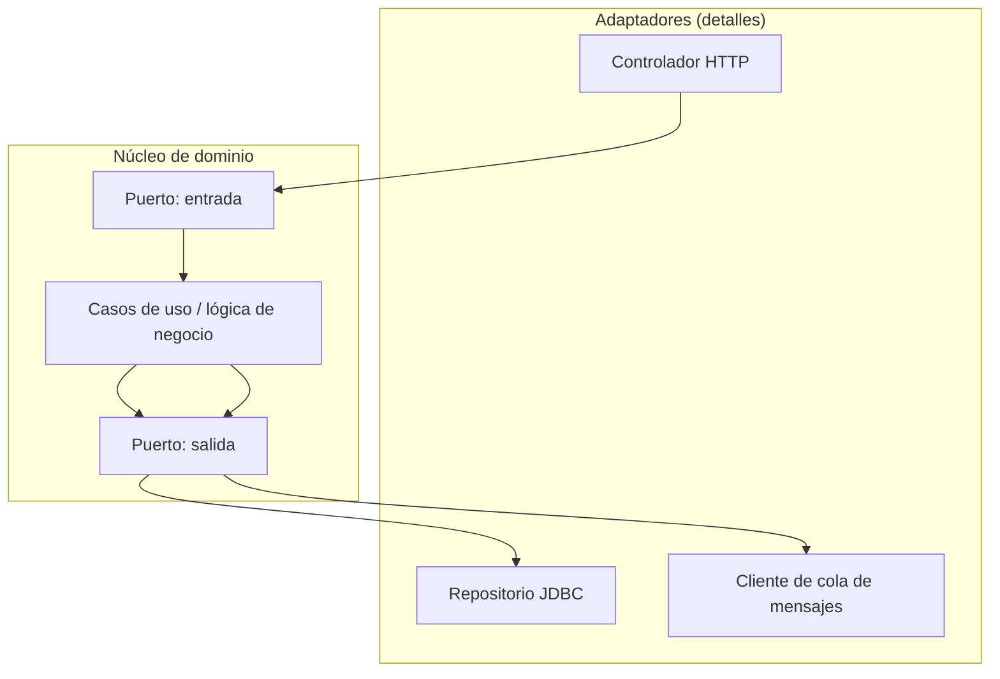

La idea central (compartida por Hexagonal, Clean Architecture y Onion Architecture, con distintos nombres): el **núcleo de negocio no depende de detalles técnicos** (framework web, base de datos concreta, proveedor de mensajería). Esos detalles son "adaptadores" reemplazables que dependen del núcleo, nunca al revés. Esto permite, por ejemplo, sustituir la base de datos o el framework web sin tocar la lógica de negocio, y facilita enormemente el testing (se puede probar el núcleo con dobles de prueba en vez de infraestructura real).

---

## 11. Seguridad en el desarrollo de software

### 11.1 OWASP Top 10 (resumen con ejemplo)

| # | Categoría | Ejemplo de la vulnerabilidad |
|---|---|---|
| 1 | **Broken Access Control** | Un usuario normal accede a `/admin/usuarios` cambiando la URL, sin que el servidor verifique su rol |
| 2 | **Cryptographic Failures** | Contraseñas guardadas en texto plano o con MD5 (sin salt, sin función lenta) |
| 3 | **Injection** (SQL, comandos, etc.) | `"SELECT * FROM users WHERE name = '" + input + "'"` permite inyectar SQL arbitrario |
| 4 | **Insecure Design** | Un flujo de "recuperar contraseña" que no limita intentos, permitiendo fuerza bruta |
| 5 | **Security Misconfiguration** | Un servidor expone el stack trace completo (con rutas internas y versiones) al usuario final en un error |
| 6 | **Vulnerable and Outdated Components** | Una dependencia con un CVE público conocido, nunca actualizada |
| 7 | **Identification and Authentication Failures** | Sesiones que nunca expiran, o contraseñas sin política mínima de complejidad |
| 8 | **Software and Data Integrity Failures** | Instalar dependencias desde un origen no verificado, o deserializar datos no confiables sin validación |
| 9 | **Security Logging and Monitoring Failures** | Un ataque exitoso pasa desapercibido durante meses porque no se registran ni alertan intentos de acceso anómalos |
| 10 | **Server-Side Request Forgery (SSRF)** | El servidor acepta una URL del usuario y la solicita él mismo, permitiendo alcanzar recursos internos no expuestos |

```java
// Vulnerable a inyección SQL
String sql = "SELECT * FROM users WHERE name = '" + nombreUsuario + "'";

// Seguro: consulta parametrizada
PreparedStatement stmt = connection.prepareStatement(
        "SELECT * FROM users WHERE name = ?");
stmt.setString(1, nombreUsuario);
```

### 11.2 Principios generales

| Principio | Idea |
|---|---|
| **Defensa en profundidad** | Varias capas de control independientes; si una falla, las demás siguen protegiendo |
| **Menor privilegio** | Cada componente/usuario tiene solo los permisos estrictamente necesarios |
| **Fail securely** | Si algo falla, el sistema debe caer hacia el estado más restrictivo, nunca hacia el más permisivo |
| **No confíes en la entrada del cliente** | Toda validación de seguridad debe repetirse en el servidor, sin importar lo que ya valide el frontend |

### 11.3 Autenticación vs. autorización

```text
Autenticación: ¿quién eres?             (login, verificar credenciales)
Autorización:  ¿qué tienes permitido hacer?  (roles, permisos)
```

**OAuth2** es un protocolo de **autorización delegada** (permite que una aplicación acceda a recursos en nombre de un usuario sin conocer su contraseña); **OIDC (OpenID Connect)** se construye sobre OAuth2 para añadir **autenticación** estandarizada (identificar quién es el usuario mediante un *ID Token*).

### 11.4 Criptografía aplicada básica

| Necesidad | Herramienta correcta | Herramienta incorrecta |
|---|---|---|
| Guardar contraseñas | `bcrypt`, `Argon2`, `scrypt` (funciones lentas diseñadas para esto) | `MD5`, `SHA-1` sin salt (rápidas, diseñadas para integridad, no para contraseñas) |
| Cifrar datos en tránsito | TLS/HTTPS | Texto plano sobre HTTP |
| Verificar integridad de un archivo | `SHA-256` | `MD5` (roto criptográficamente) |
| Firmar/verificar tokens | JWT firmado con `RS256`/`ES256`, o `HS256` con secreto robusto | Tokens sin firma o con secretos débiles |

```java
// Guardar una contraseña correctamente (BCrypt)
String hash = BCrypt.hashpw(passwordEnTextoPlano, BCrypt.gensalt());
boolean coincide = BCrypt.checkpw(passwordIntento, hash);
```

### 11.5 Gestión de secretos

Nunca hardcodear contraseñas, claves de API o tokens en el código fuente ni en el control de versiones. Alternativas: variables de entorno inyectadas en tiempo de despliegue, o gestores dedicados (`HashiCorp Vault`, `AWS Secrets Manager`, `Azure Key Vault`).

### 11.6 Seguridad en dependencias (supply chain)

```text
SCA (Software Composition Analysis): escanear automáticamente las dependencias
del proyecto contra bases de datos de vulnerabilidades conocidas (CVE).
```

Herramientas: `Dependabot`/`Renovate` (actualizaciones automáticas), `Snyk`, `OWASP Dependency-Check`. Una aplicación puede tener código propio impecable y seguir siendo vulnerable por una dependencia transitiva desactualizada.

---

## 12. Calidad de código y buenas prácticas

### 12.1 Code smells comunes

| Smell | Señal |
|---|---|
| Método largo | Un método hace demasiadas cosas distintas; difícil de nombrar con precisión |
| Clase Dios (God Class) | Una clase que concentra demasiadas responsabilidades no relacionadas |
| Duplicación | La misma lógica copiada en varios lugares (viola DRY, ver `README.md`) |
| Envidia de características (Feature Envy) | Un método usa más los datos de otra clase que los propios |
| Number de parámetros excesivo | Un método con muchos parámetros suele esconder que debería recibir un objeto |

### 12.2 Deuda técnica

> Metáfora financiera: tomar un atajo de diseño ahora (como pedir un préstamo) acelera la entrega inmediata, pero genera "intereses" en forma de mayor costo de mantenimiento futuro, hasta que se "paga" con refactorización.

No toda deuda técnica es mala: tomarla conscientemente para cumplir una fecha crítica, documentándola y planeando pagarla, es una decisión de ingeniería legítima. El problema es la deuda **inconsciente** o nunca reconocida.

### 12.3 Refactorización

Cambiar la estructura interna del código **sin alterar su comportamiento observable**. Requiere una red de pruebas confiable: sin pruebas, "refactorizar" es indistinguible de "romper cosas y esperar que nadie note".

---

## 13. Ejercicios prácticos

### Ejercicio 1 (básico — complejidad)

Analiza la complejidad Big O de este fragmento y explica por qué:

```java
void imprimirPares(int[] array) {
    for (int i = 0; i < array.length; i++) {
        for (int j = i; j < array.length; j++) {
            if (array[i] + array[j] == 0) {
                System.out.println(array[i] + ", " + array[j]);
            }
        }
    }
}
```

### Ejercicio 2 (intermedio — estructuras de datos)

Diseña la estructura de datos más adecuada para implementar el historial de "deshacer" de un editor de texto, y justifica la elección frente a al menos otra alternativa descartada.

### Ejercicio 3 (intermedio — testing)

Escribe, en pseudocódigo o en Java con JUnit, una prueba unitaria y una de integración para un método `aplicarCupon(pedido, codigoCupon)`, explicando qué se aísla con un mock en la primera y qué se mantiene real en la segunda.

### Ejercicio 4 (avanzado — arquitectura)

Dado un monolito que empieza a tener problemas de escalado en un único módulo (por ejemplo, el procesamiento de pagos), diseña un plan de migración incremental hacia extraer ese módulo como un microservicio, sin una reescritura completa "big bang".

### Ejercicio 5 (avanzado — seguridad)

Identifica al menos tres vulnerabilidades del OWASP Top 10 en este fragmento y corrígelas:

```java
String query = "SELECT * FROM users WHERE username='" + user + "' AND password='" + pass + "'";
Statement stmt = connection.createStatement();
ResultSet rs = stmt.executeQuery(query);
if (rs.next()) {
    response.addCookie(new Cookie("session", user)); // sin expiración, sin firma
}
```

---

## 14. Cheat-sheet de referencia rápida

```text
Scrum:
Roles: Product Owner, Scrum Master, Development Team
Eventos: Sprint, Planning, Daily Scrum, Review, Retrospectiva
Artefactos: Product Backlog (+Product Goal), Sprint Backlog (+Sprint Goal), Incremento (+DoD)

Kanban:
Visualizar flujo + limitar WIP + gestionar flujo + políticas explícitas
Métricas: lead time, cycle time, throughput

Complejidades (mejor a peor):
O(1) < O(log n) < O(n) < O(n log n) < O(n²) < O(2ⁿ) < O(n!)

Herencia:
Simple, multinivel, jerárquica, múltiple, híbrida
Java/Kotlin/C#: sin herencia múltiple de clases, sí de interfaces
C++: herencia múltiple real (virtual para el diamante)
Python: MRO / C3 linearization

Relaciones UML (débil → fuerte):
Dependencia → Asociación → Agregación → Composición → Herencia

Pirámide de testing:
Unitarias (muchas) → Integración (moderadas) → E2E (pocas)
Anti-patrón: "copa de helado" (muchas E2E, pocas unitarias)

Dobles de prueba:
Dummy, Stub, Mock (verifica interacción), Fake, Spy

Testing avanzado:
Caja blanca (ve el código) / negra (solo entradas-salidas) / gris (parcial)
Contract testing (Pact): consumidor y proveedor verifican un contrato por separado
Mutation testing: mide si las pruebas detectan cambios ("mutantes") en el código
Property-based testing: se generan casos automáticamente a partir de propiedades

DevOps:
CI (build+test) → CD (delivery=manual / deployment=automático)
Docker (imagen→contenedor) → Kubernetes (Pod→Deployment→Service)
Observabilidad: logs + métricas + trazas
DORA: deployment frequency, lead time for changes, change failure rate, MTTR

Datos: OLTP vs OLAP / batch vs streaming:
OLTP = transacciones (normalizado) | OLAP = análisis (desnormalizado, agregaciones)
Batch = procesa por lotes programados | Streaming = procesa evento por evento
ETL = transforma antes de cargar | ELT = transforma dentro del destino

Arquitectura:
Monolito → Microservicios → Serverless
Capas → Hexagonal/Clean (el dominio no depende de detalles técnicos)

Seguridad:
Autenticación = quién eres | Autorización = qué puedes hacer
bcrypt/Argon2 para contraseñas, nunca MD5/SHA-1 solos
```

---

## 15. Fuentes oficiales

- [OWASP Top 10](https://owasp.org/www-project-top-ten/)
- [The Twelve-Factor App](https://12factor.net/)
- [Scrum Guide](https://scrumguides.org/)
- [Kanban Guide (Kanban University)](https://kanbanguides.org/)
- [DORA — DevOps Research and Assessment (Google Cloud)](https://dora.dev/)
- [Refactoring.Guru — patrones y arquitectura](https://refactoring.guru/)
- [Kubernetes Documentation](https://kubernetes.io/docs/home/)
- [Docker Documentation](https://docs.docker.com/)
- [Terraform Documentation](https://developer.hashicorp.com/terraform/docs)
- [Python Data Model — MRO / C3 linearization](https://docs.python.org/3/glossary.html#term-method-resolution-order)
- [Google Testing Blog](https://testing.googleblog.com/)

---

## Licencia y uso

Este material puede utilizarse como guía personal de estudio. Las prácticas de seguridad, DevOps y arquitectura evolucionan rápidamente: contrasta siempre con la documentación oficial y el contexto específico de cada proyecto antes de aplicar algo a producción.
