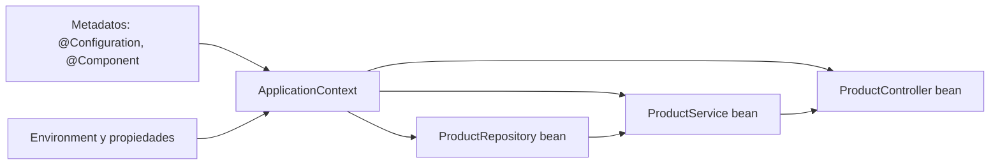
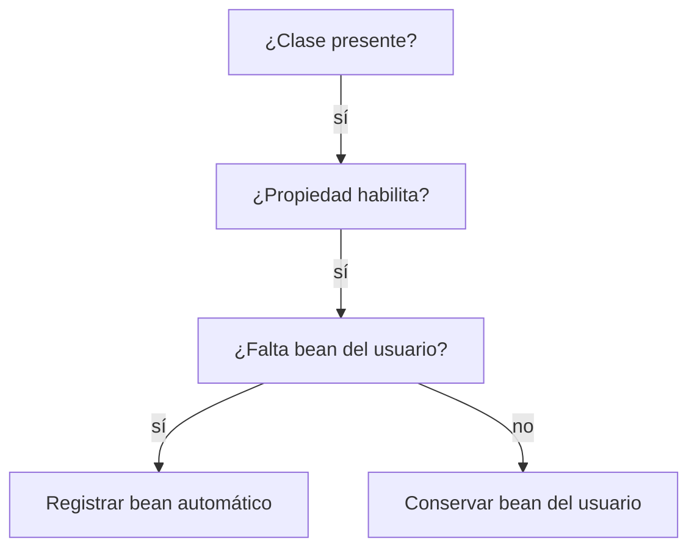
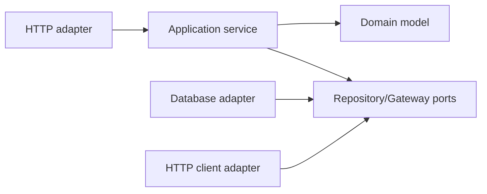
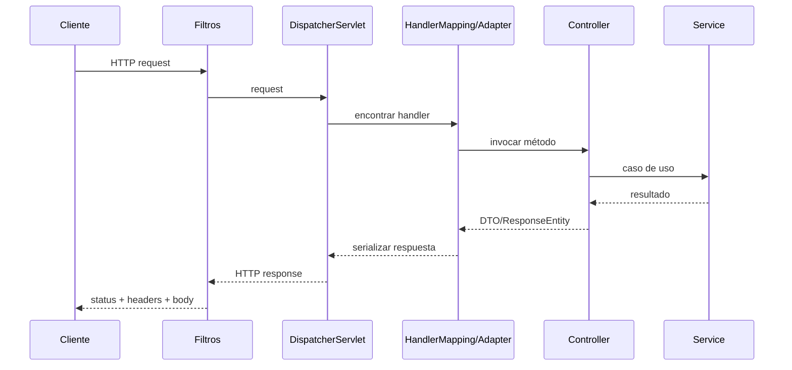
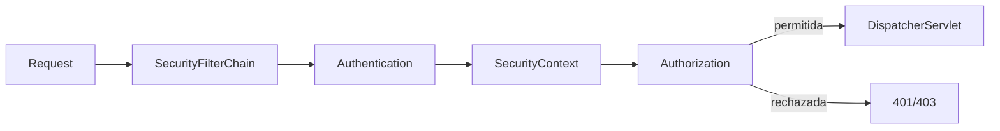
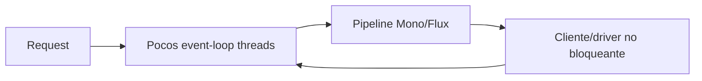
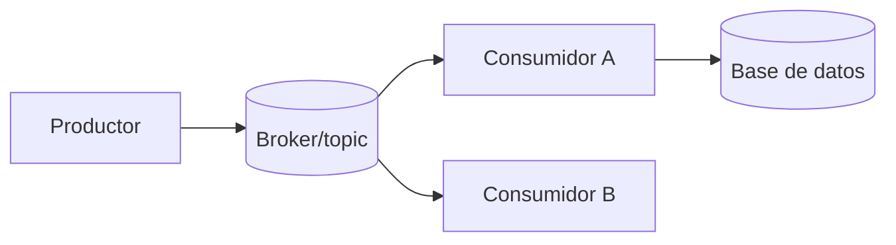

# Guía incremental de Spring: de IoC a aplicaciones de producción

> Spring Framework, Spring Boot, MVC, datos, transacciones, seguridad, pruebas y operación explicados desde el modelo mental.

Esta guía estudia un único ecosistema: **Spring**. No vuelve a enseñar el lenguaje Java ni la teoría general de JUnit/Mockito; esos fundamentos viven en [`README.md`](README.md) y [`java-testing-guide.md`](java-testing-guide.md).

**Simulador de certificación:** [`spring-questions.md`](spring-questions.md) contiene 100 preguntas de Framework, Boot, MVC, datos, transacciones, Security, testing y operación.

Los ejemplos se basan en Java 17 o superior, Spring Framework 7 y Spring Boot 4. Muchos conceptos son iguales en Framework 6/Boot 3, pero las versiones modernas usan paquetes `jakarta.*`. Las versiones cambian con frecuencia: usa la documentación correspondiente al BOM o parent real de tu proyecto.

---

## Contenido y ruta

1. [Qué problema resuelve Spring](#1-qué-problema-resuelve-spring)
2. [IoC, DI, beans y ApplicationContext](#2-ioc-di-beans-y-applicationcontext)
3. [Definir y descubrir beans](#3-definir-y-descubrir-beans)
4. [Inyección, ambigüedades y diseño](#4-inyección-ambigüedades-y-diseño)
5. [Ciclo de vida y scopes](#5-ciclo-de-vida-y-scopes)
6. [Spring Boot y auto-configuración](#6-spring-boot-y-auto-configuración)
7. [Configuración externa y perfiles](#7-configuración-externa-y-perfiles)
8. [Arquitectura de una aplicación](#8-arquitectura-de-una-aplicación)
9. [Spring MVC y el ciclo HTTP](#9-spring-mvc-y-el-ciclo-http)
10. [REST, validación y errores](#10-rest-validación-y-errores)
11. [Acceso a datos](#11-acceso-a-datos)
12. [Transacciones](#12-transacciones)
13. [AOP y proxies](#13-aop-y-proxies)
14. [Clientes HTTP, eventos, caché y tareas](#14-clientes-http-eventos-caché-y-tareas)
15. [Spring Security](#15-spring-security)
16. [Pruebas de aplicaciones Spring](#16-pruebas-de-aplicaciones-spring)
17. [Actuator, observabilidad y operación](#17-actuator-observabilidad-y-operación)
18. [Spring WebFlux y programación reactiva](#18-spring-webflux-y-programación-reactiva)
19. [Ecosistema avanzado de Spring](#19-ecosistema-avanzado-de-spring)
20. [Producción, AOT y decisiones](#20-producción-aot-y-decisiones)
21. [Proyecto incremental](#21-proyecto-incremental)
22. [Fuentes oficiales](#22-fuentes-oficiales)

```text
Java y Maven
    ↓
IoC y dependencias explícitas
    ↓
Spring Boot y configuración
    ↓
MVC + validación + errores
    ↓
datos + transacciones
    ↓
seguridad + pruebas
    ↓
observabilidad + producción
```

---

# 1. Qué problema resuelve Spring

Una aplicación real está formada por objetos que colaboran: servicios, repositorios, clientes HTTP, validadores y controladores. Sin un contenedor, el punto de entrada tendría que construir y conectar manualmente todo el grafo:

```java
DataSource dataSource = createDataSource(configuration);
ProductRepository repository = new JdbcProductRepository(dataSource);
Clock clock = Clock.systemUTC();
ProductService service = new ProductService(repository, clock);
ProductController controller = new ProductController(service);
```

Eso es válido y conviene entenderlo. Spring automatiza ese ensamblaje y ofrece infraestructura transversal.

## 1.1 El ecosistema no es una sola cosa

| Proyecto | Responsabilidad principal |
|---|---|
| Spring Framework | IoC/DI, AOP, transacciones, MVC, WebFlux, testing e integración base |
| Spring Boot | configuración convencional, starters, auto-configuración, servidor embebido y operación |
| Spring Data | abstracciones de repositorio para tecnologías de datos |
| Spring Security | autenticación, autorización y protección ante ataques comunes |
| Spring Integration | patrones de mensajería e integración empresarial |
| Spring Batch | procesamiento por lotes reiniciable y trazable |
| Spring Cloud | patrones para sistemas distribuidos y plataformas cloud |

Spring Boot **usa** Spring Framework; no lo reemplaza. Spring Data JPA **usa** JPA y un proveedor como Hibernate; no convierte la base relacional en un detalle irrelevante.

## 1.2 Qué no hace Spring

Spring no corrige automáticamente:

- un dominio mal modelado;
- consultas lentas o índices ausentes;
- transacciones demasiado amplias;
- secretos publicados en el repositorio;
- pruebas acopladas a implementación;
- una red no confiable;
- módulos sin fronteras.

El framework reduce código de infraestructura y ofrece contratos; el diseño continúa siendo responsabilidad del equipo.

---

# 2. IoC, DI, beans y ApplicationContext

## 2.1 Inversión de control

En código tradicional, una clase decide cómo construir sus dependencias:

```java
final class ProductService {
    private final ProductRepository repository = new JdbcProductRepository();
}
```

La clase queda acoplada a una implementación y a su configuración. Con **Dependency Injection**, declara lo que necesita y otro participante lo proporciona:

```java
final class ProductService {
    private final ProductRepository repository;

    ProductService(ProductRepository repository) {
        this.repository = repository;
    }
}
```

La inversión consiste en que la aplicación ya no controla directamente todo el ensamblaje: el contenedor interpreta metadatos, crea objetos y conecta dependencias.

## 2.2 Bean

Un **bean** es un objeto instanciado, ensamblado y administrado por el contenedor Spring. No toda instancia Java es un bean:

```java
Product product = new Product(); // objeto normal, no administrado
```

Que un objeto sea bean permite que Spring participe en su construcción, ciclo de vida y, cuando aplica, lo envuelva con proxies.

## 2.3 `BeanFactory` y `ApplicationContext`

`BeanFactory` define las capacidades básicas del contenedor. `ApplicationContext` es su superconjunto usado normalmente en aplicaciones: añade eventos, resolución de recursos, internacionalización, integración con el entorno y registro automático de postprocesadores.



El contexto construye un grafo dirigido. Una dependencia circular impide que ese grafo tenga un orden limpio y suele revelar responsabilidades mezcladas.

## 2.4 Dependencias de constructor

La inyección por constructor es la opción predeterminada porque:

- expresa dependencias obligatorias;
- permite campos `final`;
- conserva el objeto válido después de construirlo;
- funciona en pruebas sin arrancar Spring;
- hace visible un constructor excesivo.

```java
@Service
public class ProductService {
    private final ProductRepository repository;
    private final Clock clock;

    public ProductService(ProductRepository repository, Clock clock) {
        this.repository = repository;
        this.clock = clock;
    }
}
```

Si solo existe un constructor, no necesita `@Autowired`.

---

# 3. Definir y descubrir beans

Spring necesita metadatos que indiquen qué debe crear.

## 3.1 Estereotipos y component scanning

```java
@Repository
class JdbcProductRepository implements ProductRepository { }

@Service
class ProductService { }

@RestController
class ProductController { }
```

`@Component` es el estereotipo general. `@Service`, `@Repository` y `@Controller` son especializaciones que comunican función; algunas habilitan tratamiento adicional, como traducción de excepciones de persistencia para repositorios.

El escaneo debe comenzar desde un paquete raíz controlado:

```java
@SpringBootApplication
public class CatalogApplication {
    public static void main(String[] args) {
        SpringApplication.run(CatalogApplication.class, args);
    }
}
```

Si la clase vive en `com.example.catalog`, Boot escanea normalmente ese paquete y sus descendientes. Colocarla en un subpaquete demasiado profundo hace que componentes hermanos no se descubran.

## 3.2 Configuración Java con `@Bean`

Para clases de terceros o construcción explícita usa métodos factory:

```java
@Configuration
class TimeConfiguration {

    @Bean
    Clock clock() {
        return Clock.systemUTC();
    }
}
```

El nombre predeterminado del bean es el nombre del método. Los parámetros también se resuelven desde el contexto:

```java
@Bean
TaxClient taxClient(RestClient.Builder builder, TaxProperties properties) {
    return new TaxClient(builder.baseUrl(properties.baseUrl().toString()).build());
}
```

`@Configuration` indica que la clase declara beans. En modo completo Spring puede interceptar llamadas entre métodos `@Bean` para respetar semántica del contenedor; evita depender de llamadas manuales y prefiere parámetros explícitos.

## 3.3 Registro explícito frente a escaneo

- estereotipos: cómodos para clases propias con rol estable;
- `@Bean`: visible y flexible para infraestructura o terceros;
- `@Import`: compone configuraciones explícitas;
- auto-configuración: una biblioteca registra beans bajo condiciones.

No conviertas todas las clases de dominio en beans. Entidades, records y objetos de valor normalmente se crean por la lógica de la aplicación y no necesitan ciclo de vida singleton.

---

# 4. Inyección, ambigüedades y diseño

## 4.1 Varios candidatos

Si dos beans implementan la misma interfaz, Spring no puede adivinar:

```java
interface NotificationSender { void send(Message message); }

@Component("emailSender")
class EmailSender implements NotificationSender { }

@Component("smsSender")
class SmsSender implements NotificationSender { }
```

Selecciona de forma explícita:

```java
OrderService(@Qualifier("emailSender") NotificationSender sender) {
    this.sender = sender;
}
```

`@Primary` marca una opción predeterminada:

```java
@Primary
@Component
class EmailSender implements NotificationSender { }
```

Usa `@Qualifier` cuando la diferencia tiene significado de negocio. `@Primary` es apropiado cuando realmente existe una implementación predeterminada.

## 4.2 Colecciones de estrategias

Spring puede inyectar todos los beans de un tipo:

```java
final class NotificationRouter {
    private final Map<String, NotificationSender> senders;

    NotificationRouter(Map<String, NotificationSender> senders) {
        this.senders = Map.copyOf(senders);
    }
}
```

Esto implementa un registro de estrategias, pero usar nombres de bean como protocolo de negocio crea acoplamiento. Para reglas complejas, cada estrategia puede exponer un enum o predicado tipado.

## 4.3 Dependencias opcionales y perezosas

`Optional<T>`, `ObjectProvider<T>` o `@Lazy` permiten resolución opcional/diferida. Antes de usarlos pregunta si la dependencia es realmente opcional o si la aplicación debería fallar al iniciar.

```java
ReportService(ObjectProvider<AuditExporter> exporterProvider) {
    this.exporterProvider = exporterProvider;
}
```

`@Lazy` puede ocultar ciclos y trasladar fallos de configuración a la primera petición. No es una reparación arquitectónica.

## 4.4 Inyección de campo

```java
@Autowired
private ProductRepository repository;
```

Aunque funciona, oculta dependencias, dificulta construir la clase sin contenedor y evita `final`. Prefiere constructor. La inyección por setter se reserva para una dependencia genuinamente opcional o reconfigurable.

## 4.5 Ciclos

```text
OrderService → PaymentService → OrderService
```

Un ciclo indica que ninguno de los dos límites está completo. Opciones:

- extraer una tercera responsabilidad;
- invertir una dependencia con un evento o puerto;
- mover una regla al agregado correcto;
- revisar si una llamada es realmente bidireccional.

No adoptes `@Lazy` como solución automática.

---

# 5. Ciclo de vida y scopes

## 5.1 Creación de un bean

Versión conceptual simplificada:

```text
leer definición
  → instanciar
  → inyectar dependencias
  → postprocesar antes de inicialización
  → @PostConstruct / init
  → postprocesar después (posible proxy)
  → bean disponible
  → @PreDestroy / destroy al cerrar contexto
```

```java
@Component
class LocalIndex {

    @PostConstruct
    void load() {
        // inicialización breve; si falla, el contexto no debe arrancar
    }

    @PreDestroy
    void close() {
        // liberar recursos propios
    }
}
```

Las anotaciones pertenecen a `jakarta.annotation` en Spring moderno. Para recursos como pools o clientes, muchas librerías ya proporcionan beans con cierre; no dupliques su ciclo.

## 5.2 Scopes

| Scope | Instancias | Uso |
|---|---|---|
| `singleton` | una por `ApplicationContext` y definición | servicios sin estado mutable por petición |
| `prototype` | una por solicitud al contenedor | objetos administrados que deben recrearse |
| `request` | una por petición HTTP | datos realmente ligados a una petición |
| `session` | una por sesión HTTP | estado de sesión consciente |
| `application` | una por `ServletContext` | estado web compartido |
| `websocket` | una por sesión WebSocket | conversación WebSocket |

El singleton de Spring no significa una instancia global en toda la JVM. Significa una instancia por bean dentro de un contexto.

## 5.3 Thread safety

Los servicios singleton reciben peticiones concurrentes. No guardes datos variables de una petición en campos:

```java
@Service
class UnsafeSearchService {
    private String currentUser; // carrera entre peticiones
}
```

Mantén beans singleton sin estado mutable o protege explícitamente un estado compartido necesario.

Inyectar un `prototype` directamente en un singleton resuelve el prototype una sola vez durante construcción. Si se necesita uno nuevo por uso, recibe `ObjectProvider<T>` o una fábrica.

---

# 6. Spring Boot y auto-configuración

Spring Framework permite ensamblar todo; Boot establece convenciones para hacerlo rápido y operable.

## 6.1 Proyecto Maven mínimo

```xml
<parent>
    <groupId>org.springframework.boot</groupId>
    <artifactId>spring-boot-starter-parent</artifactId>
    <version>4.1.0</version>
    <relativePath/>
</parent>

<properties>
    <java.version>17</java.version>
</properties>

<dependencies>
    <dependency>
        <groupId>org.springframework.boot</groupId>
        <artifactId>spring-boot-starter-webmvc</artifactId>
    </dependency>
    <dependency>
        <groupId>org.springframework.boot</groupId>
        <artifactId>spring-boot-starter-validation</artifactId>
    </dependency>
    <dependency>
        <groupId>org.springframework.boot</groupId>
        <artifactId>spring-boot-starter-test</artifactId>
        <scope>test</scope>
    </dependency>
</dependencies>

<build>
    <plugins>
        <plugin>
            <groupId>org.springframework.boot</groupId>
            <artifactId>spring-boot-maven-plugin</artifactId>
        </plugin>
    </plugins>
</build>
```

El parent administra un conjunto compatible de versiones. No fijes individualmente versiones que ya administra sin entender por qué. Si la organización usa otro parent, importa el BOM de Boot desde `dependencyManagement`.

## 6.2 Starter

Un starter es un descriptor de dependencias curado. En Boot 4, `spring-boot-starter-webmvc` incorpora lo necesario para una aplicación MVC típica; el antiguo `spring-boot-starter-web` está deprecado. Ninguno genera controladores ni reglas de negocio.

## 6.3 `@SpringBootApplication`

Combina conceptualmente:

```text
@SpringBootConfiguration
@EnableAutoConfiguration
@ComponentScan
```

```java
@SpringBootApplication
public class CatalogApplication {
    public static void main(String[] args) {
        SpringApplication.run(CatalogApplication.class, args);
    }
}
```

`SpringApplication.run` prepara el entorno, crea el contexto apropiado, registra beans, arranca el servidor embebido si corresponde y publica eventos de inicio.

## 6.4 Auto-configuración condicional

La auto-configuración observa classpath, propiedades y beans existentes:



La característica central es **back off**: si declaras tu propio bean del tipo esperado, la configuración automática suele retirarse. No es magia; son clases `@Configuration` con condiciones como `@ConditionalOnClass`, `@ConditionalOnMissingBean` y `@ConditionalOnProperty`.

Diagnóstico:

```bash
./mvnw spring-boot:run -Dspring-boot.run.arguments=--debug
```

El reporte de condiciones explica qué configuración coincidió y por qué. No empieces a excluir auto-configuraciones al azar.

---

# 7. Configuración externa y perfiles

La misma aplicación debe ejecutarse en varios entornos sin recompilarse.

## 7.1 Fuentes y precedencia

Boot puede leer archivos `.properties`/YAML, variables de entorno, propiedades de sistema y argumentos. Las fuentes posteriores de mayor precedencia pueden sobrescribir valores anteriores.

```yaml
catalog:
  tax-base-url: https://tax.example.org
  request-timeout: 2s
  page-size: 50
```

Una variable como `CATALOG_REQUEST_TIMEOUT=5s` puede sobrescribir el valor de archivo según las reglas de *relaxed binding*.

## 7.2 `@ConfigurationProperties`

Para un grupo cohesivo, prefiere un objeto tipado:

```java
@ConfigurationProperties("catalog")
@Validated
public record CatalogProperties(
        @NotNull URI taxBaseUrl,
        @NotNull Duration requestTimeout,
        @Min(1) @Max(500) int pageSize) { }
```

Habilitación explícita:

```java
@Configuration
@EnableConfigurationProperties(CatalogProperties.class)
class CatalogConfiguration { }
```

O escaneo controlado con `@ConfigurationPropertiesScan`.

Ventajas sobre varios `@Value`:

- estructura y nombres coherentes;
- conversión a `Duration`, `DataSize`, URI y enums;
- validación al iniciar;
- metadatos para el IDE;
- fácil uso en pruebas.

`@Value` sigue siendo útil para un valor aislado:

```java
@Value("${catalog.banner:Catalog}") String banner
```

## 7.3 Perfiles

```java
@Bean
@Profile("dev")
PaymentGateway fakePaymentGateway() {
    return new FakePaymentGateway();
}
```

```yaml
# application-prod.yaml
catalog:
  request-timeout: 1s
```

Activación:

```bash
java -jar app.jar --spring.profiles.active=prod
```

Un perfil agrupa diferencias ambientales relevantes. No crees un perfil por cada opción de negocio; usa propiedades. Evita activar `prod` en `application-prod.yaml`: las propiedades que activan perfiles deben decidirse fuera del propio documento condicionado.

## 7.4 Secretos

No guardes contraseñas o tokens reales en Git. Suminístralos desde el entorno o un almacén de secretos. Boot soporta árboles de configuración, útiles cuando una plataforma monta cada secreto como archivo:

```properties
spring.config.import=optional:configtree:/run/secrets/
```

Los endpoints de Actuator que muestran entorno/configuración deben protegerse y sanitizarse.

---

# 8. Arquitectura de una aplicación

Una separación simple por responsabilidades:



Ejemplo por característica:

```text
com.example.catalog.product/
├── api/
│   ├── ProductController.java
│   └── ProductResponse.java
├── application/
│   └── ProductService.java
├── domain/
│   ├── Product.java
│   └── ProductRepository.java
└── infrastructure/
    └── JpaProductRepositoryAdapter.java
```

“Controller → Service → Repository” es un inicio, no una arquitectura completa. Las dependencias deben apuntar hacia las reglas estables. El dominio no necesita importar Spring si anotaciones de infraestructura no le aportan valor.

## 8.1 DTO, entidad y dominio

- DTO HTTP: contrato externo y validación de forma.
- objeto de dominio: invariantes y comportamiento.
- entidad JPA: modelo de persistencia, a veces coincide con dominio y a veces no.

No devuelvas entidades JPA directamente desde controladores: expones estructura interna, relaciones perezosas y campos que quizá no pertenecen al contrato.

```java
record ProductResponse(UUID id, String name, BigDecimal price) {
    static ProductResponse from(Product product) {
        return new ProductResponse(product.id(), product.name(), product.price());
    }
}
```

## 8.2 Dónde vive una regla

- formato HTTP → controller/DTO;
- orquestación de caso de uso → application service;
- invariantes del negocio → dominio;
- SQL/mapeo → adaptador de persistencia;
- autenticación/autorización → límite de seguridad y servicio cuando sea regla de dominio.

Una capa no es solo un paquete; debe tener una razón clara para cambiar.

---

# 9. Spring MVC y el ciclo HTTP

Spring MVC usa el modelo servlet, normalmente con una petición atendida por un hilo durante su procesamiento.



`DispatcherServlet` es el *front controller*. Delega en estrategias para localizar el handler, resolver argumentos, convertir datos, negociar contenido, manejar excepciones y escribir la respuesta.

## 9.1 Mapeo

```java
@RestController
@RequestMapping("/api/products")
class ProductController {
    private final ProductService service;

    ProductController(ProductService service) {
        this.service = service;
    }

    @GetMapping("/{id}")
    ProductResponse findById(@PathVariable UUID id) {
        return ProductResponse.from(service.findById(id));
    }

    @GetMapping
    List<ProductResponse> search(
            @RequestParam(defaultValue = "") String query) {
        return service.search(query).stream()
                .map(ProductResponse::from)
                .toList();
    }
}
```

- `@PathVariable`: identidad jerárquica de la ruta;
- `@RequestParam`: filtros, paginación u opciones;
- `@RequestHeader`: metadatos del protocolo;
- `@RequestBody`: cuerpo convertido por un `HttpMessageConverter`.

## 9.2 Contenido y serialización

```java
@PostMapping(
        consumes = MediaType.APPLICATION_JSON_VALUE,
        produces = MediaType.APPLICATION_JSON_VALUE)
```

La negociación usa `Accept` y `Content-Type`. En Boot web, Jackson suele convertir JSON. Un error de serialización no se resuelve abriendo campos indiscriminadamente; define DTOs estables y comprende constructores, getters y módulos de tipos.

## 9.3 Filtros, interceptores y advice

| Mecanismo | Nivel | Uso típico |
|---|---|---|
| Servlet Filter | antes de Spring MVC | seguridad, correlación, compresión |
| HandlerInterceptor | alrededor de controller MVC | métricas o precondiciones MVC |
| `@ControllerAdvice` | transversal a controllers | errores y binding común |
| AOP advice | llamadas a beans | transacciones, cache, concern de método |

Elige el nivel que realmente observa el problema. Un interceptor MVC no protege automáticamente un canal WebFlux o mensajería.

---

# 10. REST, validación y errores

## 10.1 Entrada validada

```java
public record CreateProductRequest(
        @NotBlank @Size(max = 120) String name,
        @NotNull @Positive BigDecimal price) { }
```

```java
@PostMapping
ResponseEntity<ProductResponse> create(
        @Valid @RequestBody CreateProductRequest request) {
    Product product = service.create(request.name(), request.price());
    URI location = URI.create("/api/products/" + product.id());
    return ResponseEntity.created(location)
            .body(ProductResponse.from(product));
}
```

Bean Validation comprueba restricciones declarativas de forma. Reglas que requieren estado de negocio —por ejemplo SKU único— pertenecen al caso de uso/dominio y además necesitan una restricción real en la base para concurrencia.

Para validar parámetros de método en componentes:

```java
@Validated
@Service
class ProductService {
    List<Product> search(@Size(max = 100) String query) {
        return List.of(); // delegaría en el repositorio
    }
}
```

## 10.2 Códigos HTTP

| Situación | Estado típico |
|---|---:|
| creado | `201 Created` con `Location` |
| lectura correcta | `200 OK` |
| operación sin body | `204 No Content` |
| JSON/parametro inválido | `400 Bad Request` |
| no autenticado | `401 Unauthorized` |
| autenticado sin permiso | `403 Forbidden` |
| recurso ausente | `404 Not Found` |
| conflicto de estado/unicidad | `409 Conflict` |

No conviertas todos los errores en `200` con un campo `success=false`: se pierde semántica del protocolo, cachés, clientes y observabilidad.

## 10.3 `ProblemDetail`

Spring MVC soporta respuestas de error basadas en RFC 9457:

```java
@RestControllerAdvice
class ApiExceptionHandler {

    @ExceptionHandler(ProductNotFoundException.class)
    ProblemDetail handleNotFound(ProductNotFoundException exception) {
        ProblemDetail problem = ProblemDetail.forStatus(HttpStatus.NOT_FOUND);
        problem.setTitle("Producto no encontrado");
        problem.setDetail(exception.getMessage());
        problem.setProperty("code", "PRODUCT_NOT_FOUND");
        return problem;
    }
}
```

No expongas stack traces, SQL, tokens ni detalles internos. Un error público necesita un código estable, un mensaje seguro y un identificador de correlación; los detalles técnicos viven en logs protegidos.

## 10.4 Idempotencia

GET, PUT y DELETE tienen expectativas de idempotencia en HTTP; el resultado visible de repetir una misma operación debe ser compatible con el contrato. Para POST de pagos o pedidos, un `Idempotency-Key` persistido puede impedir duplicados por reintentos. Esto es diseño de aplicación, no una anotación automática de Spring.

---

# 11. Acceso a datos

Spring ofrece varias capas; elegir la más alta no elimina el comportamiento inferior.

Para JDBC añade `spring-boot-starter-jdbc`; para JPA con repositorios añade `spring-boot-starter-data-jpa` y el driver del motor con alcance `runtime`. No declares versiones individuales si el BOM de Boot ya las administra.

```text
Spring Data Repository
        ↓
JPA EntityManager
        ↓
Hibernate u otro proveedor
        ↓
JDBC
        ↓
driver y base de datos
```

## 11.1 JDBC

`JdbcTemplate` administra apertura/cierre y traduce `SQLException`, pero tú escribes SQL:

```java
@Repository
class JdbcProductRepository {
    private final JdbcTemplate jdbc;

    JdbcProductRepository(JdbcTemplate jdbc) {
        this.jdbc = jdbc;
    }

    Optional<Product> findById(UUID id) {
        return jdbc.query(
                "select id, name, price from product where id = ?",
                (rs, row) -> new Product(
                        rs.getObject("id", UUID.class),
                        rs.getString("name"),
                        rs.getBigDecimal("price")),
                id).stream().findFirst();
    }
}
```

Ventajas: SQL visible, control de consultas, mapeo directo. Costo: más mapeo manual y gestión explícita de relaciones.

## 11.2 JPA

```java
@Entity
@Table(name = "product")
class ProductEntity {
    @Id
    private UUID id;

    @Column(nullable = false, length = 120)
    private String name;

    @Column(nullable = false, precision = 19, scale = 2)
    private BigDecimal price;

    protected ProductEntity() { }

    // constructor de dominio y getters
}
```

Estados conceptuales de una entidad:

```text
transient → managed/persistent → detached → removed
```

Dentro de una unidad de persistencia, el contexto detecta cambios en entidades administradas (*dirty checking*) y los sincroniza al hacer flush/commit. `save` no es “hacer SQL inmediatamente” en todos los casos.

## 11.3 Spring Data JPA

```java
interface ProductJpaRepository
        extends JpaRepository<ProductEntity, UUID> {

    Page<ProductEntity> findByNameContainingIgnoreCase(
            String name, Pageable pageable);
}
```

Las consultas derivadas son útiles si el nombre sigue siendo legible. Para consultas complejas usa `@Query`, Specifications, Query by Example o un repositorio personalizado; no escribas un nombre de método de veinte condiciones.

## 11.4 Relaciones y N+1

Una asociación `LAZY` puede disparar una consulta al recorrer cada elemento:

```text
1 consulta de órdenes
+ N consultas de líneas
= N+1
```

Soluciones según caso:

- `join fetch` en una consulta específica;
- `@EntityGraph`;
- proyección DTO;
- consulta agregada;
- batch fetching medido.

Cambiar todo a `EAGER` suele trasladar el problema y cargar datos innecesarios. Diseña cada consulta para el caso de uso y mide SQL real.

## 11.5 Migraciones y esquema

En producción, el esquema debe evolucionar con migraciones versionadas (Flyway o Liquibase, por ejemplo). `ddl-auto=create` puede ser útil en aprendizaje, pero no es una estrategia segura para preservar datos. Una migración debe ser revisable, repetible en ambientes limpios y compatible con el despliegue de la aplicación.

---

# 12. Transacciones

Una transacción agrupa operaciones bajo garantías del recurso transaccional. Spring ofrece una abstracción consistente y demarcación declarativa; la base de datos implementa atomicidad, aislamiento y durabilidad.

## 12.1 Límite en el caso de uso

```java
@Service
class OrderService {
    private final OrderRepository orders;
    private final InventoryRepository inventory;

    @Transactional
    public Order place(PlaceOrder command) {
        inventory.reserve(command.items());
        Order order = Order.place(command);
        return orders.save(order);
    }
}
```

El límite suele estar en un método público de aplicación que representa una unidad de negocio, no en cada llamada de repositorio.

## 12.2 Qué hace el proxy

Conceptualmente:

```text
llamador → proxy transaccional → begin → método real
                              → commit si termina
                              → rollback si aplica
```

Por defecto, una `RuntimeException` o `Error` provoca rollback; una checked exception no necesariamente. Si el contrato exige otra regla, exprésala:

```java
@Transactional(rollbackFor = ImportException.class)
public void importCatalog(Path file) throws ImportException { }
```

No uses `rollbackFor = Exception.class` de forma global sin revisar consecuencias.

## 12.3 Propagación

| Propagación | Idea |
|---|---|
| `REQUIRED` | usa la existente o crea una; predeterminada |
| `REQUIRES_NEW` | suspende la existente y crea otra |
| `SUPPORTS` | participa si existe |
| `MANDATORY` | exige una existente |
| `NOT_SUPPORTED` | ejecuta sin transacción |
| `NEVER` | falla si existe una |
| `NESTED` | savepoint si el gestor/recurso lo soporta |

`REQUIRES_NEW` necesita otra conexión y puede agotar el pool si se usa en ciclos o alta concurrencia. No equivale a “hacer más segura” una operación.

## 12.4 Aislamiento

El aislamiento controla qué anomalías concurrentes pueden observarse. Los nombres `READ_COMMITTED`, `REPEATABLE_READ` y `SERIALIZABLE` no tienen exactamente el mismo costo/comportamiento en cada motor. Decide con documentación de la base y pruebas concurrentes, no solo con la anotación.

```java
@Transactional(
        isolation = Isolation.SERIALIZABLE,
        timeout = 5)
public void allocateLimitedStock() { }
```

Bloqueos optimistas con `@Version`, constraints únicas y actualizaciones condicionales suelen ser parte de la solución.

## 12.5 `readOnly`

```java
@Transactional(readOnly = true)
public Product findById(UUID id) { }
```

Es una pista de optimización y una declaración de intención; no debe tratarse como una barrera universal que físicamente impide toda escritura en cualquier combinación de driver, proveedor y motor.

## 12.6 Errores frecuentes

- llamar un método `@Transactional` desde otro método del mismo objeto;
- anotar métodos privados esperando interceptación;
- mantener una transacción abierta durante una llamada HTTP lenta;
- capturar una excepción y no volver a lanzarla, permitiendo commit;
- usar entidades lazy fuera del contexto;
- asumir que una transacción de base incluye automáticamente Kafka, email o un API externo.

Para coordinar base y mensajería considera patrones como *transactional outbox*, idempotencia y compensación; una transacción local no se extiende mágicamente por la red.

---

# 13. AOP y proxies

Aspect-Oriented Programming aplica comportamiento transversal en puntos de ejecución seleccionados.

Conceptos:

| Término | Significado |
|---|---|
| aspect | módulo de comportamiento transversal |
| advice | código ejecutado antes/después/alrededor |
| pointcut | expresión que selecciona puntos |
| join point | ejecución interceptable; en Spring AOP, llamada a método |
| proxy | objeto que recibe la llamada y delega con advice |

Spring AOP usa proxies. Si el bean implementa interfaz puede usar proxy JDK; un proxy basado en clase usa CGLIB. Métodos `final` no pueden sobrescribirse, métodos `private` no pueden interceptarse y la visibilidad puede imponer límites.

## 13.1 Auto-invocación

```java
@Service
class BillingService {
    public void process() {
        charge(); // llamada sobre this, no cruza el proxy
    }

    @Transactional
    public void charge() { }
}
```

La llamada interna no pasa por el proxy y el advice puede no ejecutarse. Soluciones preferidas:

- mover `charge` a otro bean que represente la responsabilidad;
- colocar la anotación en el límite público correcto;
- usar programáticamente `TransactionTemplate` cuando el control explícito sea mejor.

Evita “autoinyectar” el mismo bean o usar `AopContext.currentProxy()` salvo casos muy justificados: el diseño queda acoplado al mecanismo.

## 13.2 Aspecto personalizado

```java
@Aspect
@Component
class TimingAspect {

    @Around("@annotation(Measured)")
    Object measure(ProceedingJoinPoint point) throws Throwable {
        long start = System.nanoTime();
        try {
            return point.proceed();
        } finally {
            long elapsed = System.nanoTime() - start;
            // registrar mediante un sistema de métricas
        }
    }
}
```

AOP es adecuado para infraestructura uniforme, no para esconder reglas centrales del negocio. Un pointcut amplio puede interceptar más de lo esperado y añade una ruta de ejecución invisible; mantenlo pequeño y probado.

---

# 14. Clientes HTTP, eventos, caché y tareas

## 14.1 `RestClient`

Cliente síncrono fluido:

```xml
<dependency>
    <groupId>org.springframework.boot</groupId>
    <artifactId>spring-boot-starter-restclient</artifactId>
</dependency>
```

```java
@Component
class TaxClient {
    private final RestClient client;

    TaxClient(RestClient.Builder builder, CatalogProperties properties) {
        this.client = builder
                .baseUrl(properties.taxBaseUrl().toString())
                .build();
    }

    TaxQuote quote(UUID productId) {
        return client.get()
                .uri("/tax/{id}", productId)
                .retrieve()
                .body(TaxQuote.class);
    }
}
```

Una integración necesita además timeouts, autenticación, límites, traducción de errores y observabilidad. Reintenta solo fallos transitorios y operaciones idempotentes; usa backoff y un límite.

## 14.2 Eventos del contexto

```java
public record ProductCreated(UUID productId) { }

publisher.publishEvent(new ProductCreated(product.id()));

@EventListener
void updateIndex(ProductCreated event) { }
```

Los eventos de aplicación por defecto se ejecutan en el mismo proceso y normalmente en el hilo publicador. Desacoplan tipos, pero no garantizan durabilidad. `@TransactionalEventListener` sincroniza con una fase de transacción; tampoco crea por sí solo mensajería durable.

## 14.3 Caché

```java
@EnableCaching
@Configuration
class CacheConfiguration { }

@Cacheable(cacheNames = "products", key = "#id")
public Product findById(UUID id) { }

@CacheEvict(cacheNames = "products", key = "#result.id")
public Product update(UpdateProduct command) { }
```

Define TTL, tamaño, estrategia de invalidez y comportamiento ante fallo. Una caché no debe ser la única copia de información que necesita durabilidad. Las mismas limitaciones de proxy y auto-invocación aplican.

## 14.4 Scheduling y asincronía

```java
@EnableScheduling
@Configuration
class SchedulingConfiguration { }

@Scheduled(cron = "0 0 * * * *", zone = "UTC")
void refreshCatalog() { }
```

En varias réplicas, cada instancia puede ejecutar la tarea. Si debe ocurrir una sola vez, usa coordinación distribuida o una plataforma de jobs.

```java
@EnableAsync
@Configuration
class AsyncConfiguration { }

@Async
public CompletableFuture<Report> generateReport() { }
```

Configura executor, cola, rechazo, propagación de contexto y manejo de excepciones. `@Async` tampoco intercepta auto-invocación. No lo uses para responder antes mientras una tarea crítica queda sin persistencia ni supervisión.

---

# 15. Spring Security

Spring Security protege mediante una cadena de filtros antes de que la petición alcance MVC.

```xml
<dependency>
    <groupId>org.springframework.boot</groupId>
    <artifactId>spring-boot-starter-security</artifactId>
</dependency>
```



- **autenticación**: quién es el principal;
- **autorización**: qué puede hacer;
- **SecurityContext**: autenticación asociada a la ejecución;
- **filter chain**: filtros seleccionados para la petición.

## 15.1 Configuración explícita

```java
@Bean
SecurityFilterChain apiSecurity(HttpSecurity http) throws Exception {
    return http
            .authorizeHttpRequests(authorize -> authorize
                    .requestMatchers("/actuator/health").permitAll()
                    .requestMatchers(HttpMethod.GET, "/api/products/**").permitAll()
                    .requestMatchers("/api/admin/**").hasRole("ADMIN")
                    .anyRequest().authenticated())
            .httpBasic(Customizer.withDefaults())
            .build();
}
```

No uses HTTP Basic sin TLS. En una aplicación real se configura el mecanismo apropiado: sesión, OAuth 2.0/OIDC, resource server con JWT u otro.

## 15.2 Contraseñas

```java
@Bean
PasswordEncoder passwordEncoder() {
    return PasswordEncoderFactories.createDelegatingPasswordEncoder();
}
```

No almacenes contraseñas en texto ni cifrado reversible. Usa un hash adaptativo con salt y política de actualización. No compares manualmente strings de contraseña.

## 15.3 CSRF y CORS

- CSRF importa especialmente cuando el navegador envía credenciales automáticamente, como cookies de sesión.
- Deshabilitar CSRF puede ser razonable para una API genuinamente stateless con bearer tokens, no como arreglo universal.
- CORS es una política del navegador sobre orígenes; no sustituye autenticación.

Configura orígenes, métodos y headers de forma mínima. `*` con credenciales no es una política segura.

## 15.4 Seguridad a nivel de método

```java
@EnableMethodSecurity
@Configuration
class MethodSecurityConfiguration { }

@PreAuthorize("hasRole('ADMIN') or #ownerId == authentication.name")
public Report findPrivateReport(String ownerId) { }
```

La seguridad de método protege llamadas que cruzan el proxy. Mantén expresiones comprensibles; para reglas complejas delega en un bean de autorización probado.

## 15.5 Reglas básicas

- deniega por defecto;
- da mínimo privilegio;
- protege endpoints de operación;
- rota secretos y claves;
- valida issuer, audience, expiración y firma de tokens;
- actualiza dependencias por vulnerabilidades;
- registra decisiones relevantes sin guardar credenciales ni tokens completos.

---

# 16. Pruebas de aplicaciones Spring

Primero aplica la [guía de testing Java](java-testing-guide.md): una clase con dependencias de constructor puede probarse sin contexto.

```java
class ProductServiceTest {
    private final ProductRepository repository = new InMemoryProductRepository();
    private final ProductService service = new ProductService(repository, Clock.systemUTC());

    @Test
    void createsProduct() { /* sin Spring */ }
}
```

Arrancar el contexto solo tiene sentido cuando se prueba configuración o infraestructura Spring.

## 16.1 Pirámide Spring

| Tipo | Contexto | Uso |
|---|---|---|
| unitario | ninguno | dominio y servicios |
| slice | parte seleccionada | MVC, JPA, JSON, cliente |
| integración | contexto completo | wiring, configuración, transacciones |
| servidor real | puerto aleatorio/definido | protocolo HTTP completo |

## 16.2 MVC con MockMvc

```java
@WebMvcTest(ProductController.class)
class ProductControllerTest {

    @Autowired MockMvc mvc;
    @MockitoBean ProductService service;

    @Test
    void returnsProduct() throws Exception {
        given(service.findById(PRODUCT_ID)).willReturn(PRODUCT);

        mvc.perform(get("/api/products/{id}", PRODUCT_ID))
                .andExpect(status().isOk())
                .andExpect(jsonPath("$.name").value("Keyboard"));
    }
}
```

MockMvc ejecuta el pipeline MVC sin servidor real. La anotación de reemplazo de bean depende de la generación de Spring; en versiones anteriores se encuentra `@MockBean`. Consulta la documentación exacta del proyecto.

## 16.3 Persistencia

```java
@DataJpaTest
class ProductJpaRepositoryTest {
    @Autowired ProductJpaRepository repository;

    @Test
    void searchesIgnoringCase() { /* ... */ }
}
```

Una base embebida puede comportarse distinto a PostgreSQL u Oracle. Para SQL, tipos, constraints y aislamiento relevantes usa una instancia real controlada, frecuentemente mediante contenedores de prueba.

## 16.4 Contexto completo

```java
@SpringBootTest
class CatalogApplicationTest {
    @Test
    void contextLoads() { }
}
```

Un `contextLoads` descubre wiring roto, pero no prueba reglas. Añade escenarios observables. `@SpringBootTest(webEnvironment = RANDOM_PORT)` inicia un servidor para pruebas HTTP de extremo a extremo del proceso.

## 16.5 Caché del contexto

Spring Test reutiliza contextos con la misma configuración. Propiedades o mocks distintos pueden multiplicar contextos y volver lenta la suite. `@DirtiesContext` fuerza descarte y debe reservarse para pruebas que realmente alteran el contexto de manera irreparable.

---

# 17. Actuator, observabilidad y operación

Dependencia:

```xml
<dependency>
    <groupId>org.springframework.boot</groupId>
    <artifactId>spring-boot-starter-actuator</artifactId>
</dependency>
```

Actuator expone capacidades de producción como salud, métricas, información, loggers y diagnósticos según configuración.

```yaml
management:
  endpoints:
    web:
      exposure:
        include: health,info,metrics,prometheus
  endpoint:
    health:
      probes:
        enabled: true
```

No expongas `env`, `beans`, `heapdump`, `threaddump` o todos los endpoints a Internet sin autenticación y una necesidad concreta.

## 17.1 Tres señales

```text
logs    → qué ocurrió, con contexto
metrics → cuánto y con qué tendencia
traces  → por dónde pasó una operación distribuida
```

Usa IDs de correlación y logging estructurado. No registres cuerpos completos por defecto: pueden contener datos personales o secretos.

Micrometer ofrece la fachada de observación/métricas; el backend puede ser Prometheus, OTLP u otro. Nombra métricas por comportamiento estable, no por IDs de usuario que creen cardinalidad ilimitada.

## 17.2 Salud y disponibilidad

- **liveness**: el proceso debe reiniciarse porque no puede progresar;
- **readiness**: temporalmente no debe recibir tráfico.

No hagas que liveness dependa de cada servicio remoto: una caída externa podría provocar reinicios masivos sin resolverla. Readiness también debe diseñarse con cuidado para no retirar todas las instancias simultáneamente.

## 17.3 Apagado y despliegue

Configura cierre ordenado, timeouts coherentes y señales de la plataforma. Durante despliegue:

1. dejar de recibir tráfico nuevo;
2. permitir terminar peticiones dentro de un límite;
3. cerrar consumidores/recursos;
4. terminar el proceso.

La compatibilidad entre versión de aplicación y migración de esquema debe permitir despliegues graduales.

---

# 18. Spring WebFlux y programación reactiva

WebFlux es el stack web no bloqueante de Spring. No es “MVC pero más rápido” ni una solución necesaria para toda aplicación.

```xml
<dependency>
    <groupId>org.springframework.boot</groupId>
    <artifactId>spring-boot-starter-webflux</artifactId>
</dependency>
```



- `Mono<T>` representa cero o un elemento asincrónico;
- `Flux<T>` representa cero a muchos;
- backpressure permite que el consumidor controle ritmo;
- un pipeline es perezoso hasta la suscripción.

```java
@RestController
class ReactiveProductController {
    private final ReactiveProductService service;

    @GetMapping("/reactive/products/{id}")
    Mono<ProductResponse> find(@PathVariable UUID id) {
        return service.find(id).map(ProductResponse::from);
    }
}
```

## 18.1 Regla de no bloqueo

Llamar JDBC tradicional o `Thread.sleep` dentro del event loop bloquea el hilo que atiende muchas conexiones:

```java
// Antipatrón dentro de pipeline reactivo:
return Mono.just(jdbcTemplate.queryForObject(...));
```

Un sistema reactivo necesita que la cadena de I/O sea no bloqueante o que el trabajo bloqueante se aísle conscientemente en un scheduler limitado. Envolver todo con `Mono.just` no lo vuelve reactivo.

## 18.2 MVC + virtual threads o WebFlux

| Contexto | Opción razonable |
|---|---|
| equipo y librerías imperativas, I/O bloqueante | MVC; virtual threads pueden simplificar alta concurrencia |
| streaming/backpressure, drivers reactivos de extremo a extremo | WebFlux |
| cálculo CPU intensivo | ninguno crea más CPU; limita paralelismo |
| pocas conexiones y CRUD convencional | MVC suele ser más simple |

No mezcles stacks por moda. Mide carga, latencia, memoria y complejidad operativa.

---

# 19. Ecosistema avanzado de Spring

El núcleo anterior basta para muchas aplicaciones. Los siguientes proyectos responden a problemas específicos; no son capas obligatorias de toda arquitectura.

## 19.1 Spring Data más allá de JPA

Spring Data comparte conceptos como repositorios, mapping y plantillas, pero cada almacén conserva su propio modelo:

| Módulo | Modelo dominante | No debes asumir |
|---|---|---|
| Spring Data JDBC | agregados relacionales simples | dirty checking o lazy loading de JPA |
| Spring Data R2DBC | SQL reactivo | compatibilidad con drivers JDBC bloqueantes |
| Spring Data Redis | clave-valor, estructuras y TTL | joins relacionales |
| Spring Data MongoDB | documentos | las mismas transacciones/constraints de SQL |
| Spring Data Elasticsearch | búsqueda e índices invertidos | que sea la fuente transaccional primaria |
| Spring Data Neo4j | grafos, nodos y relaciones | modelado tabular |

Que varias tecnologías implementen `Repository` no vuelve intercambiables su consistencia, consultas, transacciones o rendimiento. Diseña el agregado y la API según las garantías reales del almacén.

## 19.2 Mensajería y Spring for Apache Kafka

Un broker desacopla tiempo y disponibilidad entre productor y consumidor:



Ejemplo de consumidor:

```java
@Component
class ProductEventsListener {

    @KafkaListener(topics = "product-events", groupId = "search-index")
    void on(ProductChanged event) {
        updateSearchIndex(event);
    }
}
```

La anotación no resuelve por sí sola:

- entrega al menos una vez y mensajes duplicados;
- orden por partición, no necesariamente global;
- compatibilidad/evolución del esquema;
- reintentos, backoff y *dead-letter topics*;
- idempotencia del consumidor;
- observabilidad de lag;
- atomicidad entre base y publicación.

Diseña el consumidor para procesar de nuevo un mensaje sin corromper estado. Para publicar cambios de base con durabilidad, un outbox transaccional y CDC suele ser más seguro que “guardar y después enviar” sin coordinación.

`ApplicationEvent` es comunicación dentro de un proceso; Kafka, RabbitMQ o Pulsar son infraestructuras externas con persistencia y protocolos. No los presentes como equivalentes.

## 19.3 Spring Batch

Spring Batch sirve para trabajo finito, trazable y reiniciable sobre volúmenes de datos: importaciones, cierres, conciliaciones o generación masiva de reportes.

```text
Job
├── Step 1: validar archivo
├── Step 2: leer → procesar → escribir por chunks
└── Step 3: publicar resumen
```

Conceptos:

- `Job`: definición del proceso;
- `JobInstance`: job + parámetros identificadores;
- `JobExecution`: un intento de ejecución;
- `Step`: fase independiente;
- `ItemReader` / `ItemProcessor` / `ItemWriter`: pipeline por elementos;
- `JobRepository`: metadatos para estado y reinicio.

Configuración conceptual de un step por chunks:

```java
@Bean
Step importProducts(
        JobRepository jobRepository,
        PlatformTransactionManager transactionManager,
        ItemReader<ProductRow> reader,
        ItemProcessor<ProductRow, Product> processor,
        ItemWriter<Product> writer) {
    return new StepBuilder("importProducts", jobRepository)
            .<ProductRow, Product>chunk(100, transactionManager)
            .reader(reader)
            .processor(processor)
            .writer(writer)
            .build();
}
```

Cada chunk delimita lectura/procesamiento/escritura y normalmente una transacción. El tamaño equilibra throughput, memoria y costo de rollback. Configura skip/retry solo para fallos clasificados; saltar datos inválidos sin reporte convierte una ejecución verde en pérdida silenciosa.

Un `@Scheduled` que recorre millones de filas no obtiene automáticamente reinicio, metadatos ni particionamiento. Usa Batch cuando esas garantías forman parte del requisito.

## 19.4 Spring Integration

Spring Integration implementa patrones de integración empresarial mediante mensajes y canales:

```text
inbound adapter → filter → transformer → router → service activator → outbound adapter
```

- adapter: conecta un protocolo/sistema con el flujo;
- channel: transporta mensajes dentro del flujo;
- filter: descarta o rechaza;
- transformer: cambia representación;
- router: elige destino;
- splitter/aggregator: divide y reúne;
- gateway: presenta una interfaz de aplicación.

Es útil cuando existen flujos con varios protocolos y patrones. Para una única llamada HTTP, un `RestClient` explícito suele ser más sencillo.

## 19.5 Spring for GraphQL

GraphQL permite que el cliente seleccione campos sobre un esquema tipado:

```java
@Controller
class ProductGraphqlController {
    private final ProductService service;
    private final ReviewRepository reviewRepository;

    ProductGraphqlController(
            ProductService service,
            ReviewRepository reviewRepository) {
        this.service = service;
        this.reviewRepository = reviewRepository;
    }

    @QueryMapping
    Product product(@Argument UUID id) {
        return service.findById(id);
    }

    @SchemaMapping(typeName = "Product", field = "reviews")
    List<Review> reviews(Product product) {
        return reviewRepository.findByProduct(product.id());
    }
}
```

El riesgo N+1 también existe: resolver `reviews` para cada producto puede disparar muchas consultas. Usa `DataLoader`, batching y límites de complejidad/profundidad. Autorización, paginación y evolución del esquema siguen siendo decisiones explícitas.

GraphQL no sustituye REST universalmente; cambia quién selecciona la forma de la respuesta y añade un runtime de esquema.

## 19.6 Spring Modulith

Spring Modulith ayuda a construir un monolito modular orientado por dominios. Puede verificar dependencias entre módulos, documentarlos, probarlos aisladamente y apoyar eventos de aplicación.

```text
catalog
├── product      ← API pública + implementación interna
├── inventory
└── ordering
```

Una frontera lógica dentro de un despliegue conserva transacciones y operación sencillas. No empieces con microservicios solo para obtener separación; primero demuestra límites en un monolito modular.

## 19.7 Spring Cloud

Spring Cloud agrupa patrones de sistemas distribuidos:

- configuración distribuida/versionada;
- service discovery y load balancing;
- API gateway y routing;
- circuit breakers;
- mensajería y funciones;
- integración con Kubernetes, Consul o Vault;
- pruebas de contratos.

Cada dependencia distribuida agrega timeouts, fallos parciales y operación. Una plataforma como Kubernetes ya aporta descubrimiento, configuración y balanceo; evita duplicar capacidades sin una necesidad.

Spring Cloud se publica como **release train** compatible con ciertas versiones de Boot. Importa su BOM y comprueba la matriz oficial; no combines la versión “más nueva” de cada proyecto al azar.

Un circuit breaker no evita fallos: limita llamadas a un destino enfermo y permite recuperación controlada. Debe trabajar con timeout, límite de concurrencia y métricas; un fallback no debe devolver datos falsos como si fueran actuales.

## 19.8 Spring AI

Spring AI ofrece abstracciones para modelos, prompts, tool calling, embeddings, vector stores y observabilidad. Es opcional y cambia con mayor rapidez que el núcleo.

```text
entrada → plantilla/política → modelo
                         ↘ tools / retrieval
respuesta ← validación ← salida estructurada
```

Un modelo es no determinista y una respuesta puede ser incorrecta. Aplica validación, límites de costo/tokens, protección de datos, defensa ante prompt injection, evaluaciones y autorización separada para cada herramienta. El framework facilita integración; no garantiza veracidad ni seguridad.

---

# 20. Producción, AOT y decisiones

## 20.1 Empaquetado

```bash
./mvnw clean verify
./mvnw spring-boot:run
java -jar target/catalog-1.0.0.jar
```

El plugin de Boot crea un archivo ejecutable con dependencias organizadas. Usa el mismo artefacto inmutable en todos los entornos y cambia configuración externamente.

## 20.2 AOT e imágenes nativas

Spring puede procesar anticipadamente el contexto y generar *hints* para entornos cerrados como imágenes nativas. Beneficios posibles: inicio rápido y menor memoria residente. Costos: build más lento, restricciones de reflexión/proxies/recursos y necesidad de pruebas específicas.

No elijas una imagen nativa solo por moda. Para procesos de larga vida, una JVM con JIT puede ofrecer mejor throughput. Define objetivo: startup, densidad, costo o latencia.

## 20.3 Checklist de producción

- [ ] versión Java/Spring fijada y soportada;
- [ ] BOM/parent sin overrides accidentales;
- [ ] configuración validada al iniciar;
- [ ] secretos fuera del artefacto;
- [ ] timeouts en cada llamada remota;
- [ ] pools dimensionados y medidos;
- [ ] migraciones de esquema versionadas;
- [ ] endpoints de Actuator protegidos;
- [ ] logs, métricas y traces correlacionados;
- [ ] readiness/liveness probados;
- [ ] apagado ordenado;
- [ ] pruebas de recuperación y degradación;
- [ ] actualizaciones de seguridad periódicas.

## 20.4 Árbol de decisión

```text
¿Necesitas ensamblaje y transacciones sin Boot?
  → Spring Framework

¿Aplicación nueva con convenciones y operación integrada?
  → Spring Boot

¿CRUD/HTTP imperativo?
  → Spring MVC

¿Pipeline no bloqueante de extremo a extremo y backpressure?
  → WebFlux

¿Consulta SQL crítica y compleja?
  → JDBC/JdbcClient o consulta explícita

¿Modelo relacional con unidad de trabajo y asociaciones controladas?
  → JPA/Spring Data JPA
```

---

# 21. Proyecto incremental

Construye una API de catálogo sin intentar incorporar todo el ecosistema en el primer paso.

## Etapa 1: núcleo Java

- `Product` con invariantes;
- `ProductRepository` como interfaz;
- `ProductService` con constructor explícito;
- pruebas unitarias sin Spring.

## Etapa 2: contexto mínimo

- registra repositorio en memoria y `Clock` como beans;
- inicia un `ApplicationContext`;
- observa el grafo y elimina ciclos.

## Etapa 3: Boot y configuración

- añade `@SpringBootApplication`;
- configura `CatalogProperties` validado;
- crea perfiles `dev` y `prod` solo para diferencias reales.

## Etapa 4: HTTP

- GET por ID y búsqueda paginada;
- POST validado;
- DTOs separados;
- errores con `ProblemDetail`;
- pruebas `@WebMvcTest`.

## Etapa 5: persistencia

- implementa primero con JDBC o JPA conscientemente;
- agrega migración de esquema;
- constraint única;
- prueba con el motor real;
- identifica y elimina un N+1.

## Etapa 6: transacciones e integración

- coloca `@Transactional` en el caso de uso;
- simula fallo entre dos escrituras y comprueba rollback;
- evita llamada remota dentro de la transacción;
- publica evento mediante outbox si requiere durabilidad.

## Etapa 7: seguridad y operación

- lectura pública, escritura autenticada, administración por rol;
- Actuator con exposición mínima;
- métrica de creación y latencia;
- readiness/liveness;
- timeouts del cliente externo.

## Etapa 8: decisión avanzada

Ejecuta una carga representativa y compara solo si el caso lo exige:

- MVC con platform threads;
- MVC con virtual threads;
- WebFlux con cadena realmente reactiva.

Documenta la decisión con datos y complejidad, no con preferencia personal.

---

# 22. Fuentes oficiales

## Spring Framework

- [Spring Framework Reference](https://docs.spring.io/spring-framework/reference/)
- [Introducción al contenedor IoC](https://docs.spring.io/spring-framework/reference/core/beans/introduction.html)
- [Configuración basada en anotaciones](https://docs.spring.io/spring-framework/reference/core/beans/annotation-config.html)
- [`@Bean`](https://docs.spring.io/spring-framework/reference/core/beans/java/bean-annotation.html)
- [Component scanning](https://docs.spring.io/spring-framework/reference/core/beans/classpath-scanning.html)
- [Scopes de beans](https://docs.spring.io/spring-framework/reference/core/beans/factory-scopes.html)
- [Spring AOP y proxies](https://docs.spring.io/spring-framework/reference/core/aop/proxying.html)
- [Acceso a datos y transacciones](https://docs.spring.io/spring-framework/reference/data-access.html)
- [`@Transactional`](https://docs.spring.io/spring-framework/reference/data-access/transaction/declarative/annotations.html)
- [`DispatcherServlet`](https://docs.spring.io/spring-framework/reference/web/webmvc/mvc-servlet.html)
- [Errores REST y `ProblemDetail`](https://docs.spring.io/spring-framework/reference/web/webmvc/mvc-ann-rest-exceptions.html)
- [Spring testing](https://docs.spring.io/spring-framework/reference/testing.html)
- [MockMvc](https://docs.spring.io/spring-framework/reference/testing/mockmvc/overview.html)
- [Spring WebFlux](https://docs.spring.io/spring-framework/reference/web/webflux.html)

## Spring Boot y Security

- [Spring Boot Reference](https://docs.spring.io/spring-boot/reference/index.html)
- [Primera aplicación](https://docs.spring.io/spring-boot/tutorial/first-application/index.html)
- [Auto-configuración](https://docs.spring.io/spring-boot/reference/using/auto-configuration.html)
- [Configuración externa](https://docs.spring.io/spring-boot/reference/features/external-config.html)
- [Perfiles](https://docs.spring.io/spring-boot/reference/features/profiles.html)
- [Bases de datos SQL](https://docs.spring.io/spring-boot/reference/data/sql.html)
- [Testing en Spring Boot](https://docs.spring.io/spring-boot/reference/testing/index.html)
- [Actuator](https://docs.spring.io/spring-boot/reference/actuator/index.html)
- [Arquitectura servlet de Spring Security](https://docs.spring.io/spring-security/reference/servlet/architecture.html)
- [Spring Batch Reference](https://docs.spring.io/spring-batch/reference/index.html)
- [Spring Integration Reference](https://docs.spring.io/spring-integration/reference/index.html)
- [Spring for Apache Kafka](https://docs.spring.io/spring-kafka/reference/)
- [Spring for GraphQL](https://docs.spring.io/spring-graphql/reference/)
- [Spring Modulith](https://docs.spring.io/spring-modulith/reference/)
- [Spring Cloud](https://spring.io/projects/spring-cloud)
- [Spring AI Reference](https://docs.spring.io/spring-ai/reference/)

---

## Resumen de bolsillo

```text
Spring Framework
IoC + DI + AOP + transacciones + web + testing

Spring Boot
starters + condiciones + auto-configuración + servidor + Actuator

Petición MVC
filters → DispatcherServlet → controller → service → repository

Proxy
la llamada debe cruzarlo para @Transactional, @Async, @Cacheable o AOP

Producción
config externa + seguridad + timeouts + migraciones + observabilidad
```
