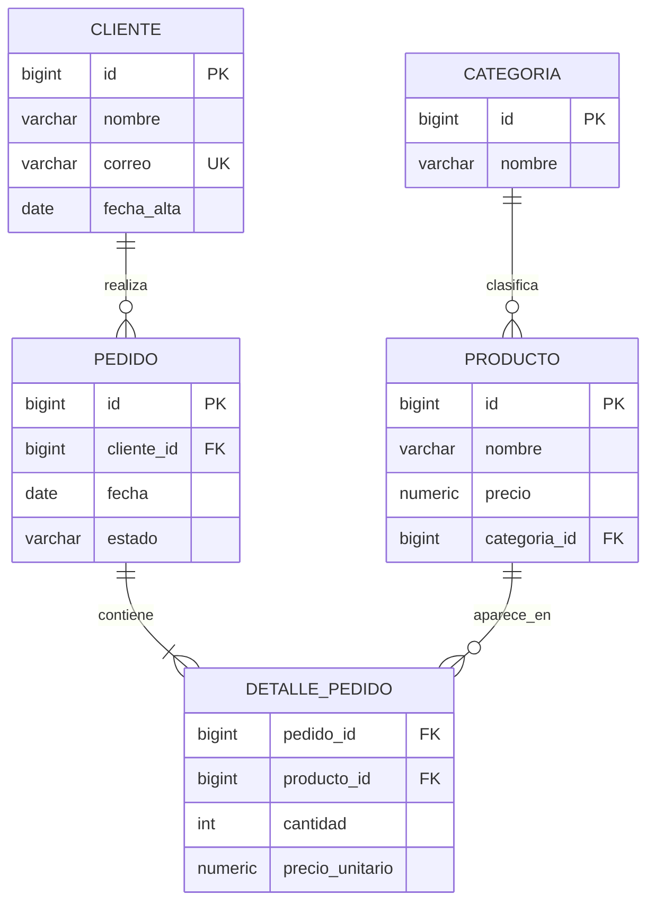
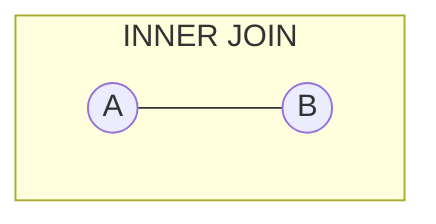

# Guía general de SQL y diseño de bases de datos — de principiante a avanzado

> Esta guía es el complemento vendor-neutral de [`sql-oracle-guide.md`](sql-oracle-guide.md). Aquí el foco está en el estándar SQL, el diseño de bases de datos relacionales y la normalización; el detalle específico de Oracle (PL/SQL, diccionario de datos, `CONNECT BY`, etc.) vive en esa otra guía.

## Índice

1. [Introducción: SQL y sus distintos motores](#1-introducción-sql-y-sus-distintos-motores)
2. [El modelo relacional](#2-el-modelo-relacional)
3. [Diseño de bases de datos: del mundo real al modelo](#3-diseño-de-bases-de-datos-del-mundo-real-al-modelo)
4. [Normalización paso a paso](#4-normalización-paso-a-paso)
5. [Tipos de datos en SQL](#5-tipos-de-datos-en-sql)
6. [DDL — Data Definition Language](#6-ddl--data-definition-language)
7. [DML — Data Manipulation Language](#7-dml--data-manipulation-language)
8. [DQL — Data Query Language](#8-dql--data-query-language)
9. [DCL — Data Control Language](#9-dcl--data-control-language)
10. [TCL — Transaction Control Language](#10-tcl--transaction-control-language)
11. [Vistas, procedimientos, funciones y triggers](#11-vistas-procedimientos-funciones-y-triggers)
12. [Rendimiento e índices](#12-rendimiento-e-índices)
13. [Diseño para OLTP vs. OLAP](#13-diseño-para-oltp-vs-olap)
14. [Buenas prácticas y errores comunes](#14-buenas-prácticas-y-errores-comunes)
15. [Ejercicios prácticos](#15-ejercicios-prácticos)
16. [Cheat-sheet de referencia rápida](#16-cheat-sheet-de-referencia-rápida)
17. [Fuentes oficiales](#17-fuentes-oficiales)

---

## 1. Introducción: SQL y sus distintos motores

**SQL** (*Structured Query Language*) es un lenguaje declarativo estandarizado por ANSI/ISO (el estándar actual es **SQL:2023**) para definir, manipular y controlar el acceso a datos organizados en tablas relacionales. "Declarativo" significa que describes **qué** datos quieres, no **cómo** obtenerlos paso a paso; el motor de base de datos decide el plan de ejecución.

Ningún motor implementa el estándar al 100 % ni de forma idéntica. En la práctica, SQL es una familia de dialectos que comparten un núcleo común (`SELECT`, `WHERE`, `JOIN`, `GROUP BY`...) y difieren en detalles de sintaxis, funciones propietarias y extensiones.

### 1.1 Comparativa entre motores

| Motor | Licencia | Paginación | Autoincremento | Concatenar texto | Fecha actual |
|---|---|---|---|---|---|
| **Oracle Database** | Comercial | `FETCH FIRST n ROWS ONLY` / `ROWNUM` | `IDENTITY` / `SEQUENCE` | `\|\|` | `SYSDATE`, `SYSTIMESTAMP` |
| **PostgreSQL** | Open source | `LIMIT n OFFSET m` | `GENERATED ALWAYS AS IDENTITY` / `SERIAL` | `\|\|` | `NOW()`, `CURRENT_TIMESTAMP` |
| **MySQL / MariaDB** | Open source (dual) | `LIMIT n OFFSET m` | `AUTO_INCREMENT` | `CONCAT(a, b)` | `NOW()` |
| **SQL Server** | Comercial | `OFFSET m ROWS FETCH NEXT n ROWS ONLY` | `IDENTITY(1,1)` | `+` o `CONCAT()` | `GETDATE()`, `SYSDATETIME()` |
| **SQLite** | Open source | `LIMIT n OFFSET m` | `AUTOINCREMENT` (raro de necesitar) | `\|\|` | `DATE('now')` |

Esta guía usa sintaxis lo más estándar posible (cercana a PostgreSQL, que es históricamente el motor que más de cerca sigue el estándar ANSI) y señala explícitamente cuándo algo es específico de un motor.

### 1.2 Los sublenguajes de SQL

SQL no es un único lenguaje monolítico: se subdivide por responsabilidad. Esta subdivisión es la columna vertebral de esta guía.

| Sublenguaje | Sigla | Responsabilidad | Comandos principales |
|---|---|---|---|
| Data Definition Language | DDL | Definir la estructura de los objetos | `CREATE`, `ALTER`, `DROP`, `TRUNCATE` |
| Data Manipulation Language | DML | Modificar los datos dentro de las tablas | `INSERT`, `UPDATE`, `DELETE`, `MERGE` |
| Data Query Language | DQL | Consultar datos | `SELECT` |
| Data Control Language | DCL | Gestionar permisos de acceso | `GRANT`, `REVOKE` |
| Transaction Control Language | TCL | Agrupar operaciones en unidades atómicas | `COMMIT`, `ROLLBACK`, `SAVEPOINT` |

Algunos autores añaden un sexto grupo, **DQL** separado de DML (como aquí) o fusionado con él; y ocasionalmente se menciona **TCL** como parte de DCL. La clasificación de cinco grupos de la tabla es la más citada y la que se usa en el resto de la guía.

### 1.3 Relacional vs. NoSQL (contexto, no competencia)

| | Relacional (SQL) | NoSQL |
|---|---|---|
| Esquema | Fijo y validado por el motor | Flexible o inexistente |
| Consistencia | Fuerte (ACID) por defecto | A menudo eventual (modelo BASE) |
| Relaciones | Nativas vía claves foráneas y `JOIN` | Se modelan a mano (referencias o documentos anidados) |
| Escalado típico | Vertical, con réplicas de lectura | Horizontal (sharding nativo) |
| Ejemplos | PostgreSQL, MySQL, Oracle, SQL Server | MongoDB (documentos), Redis (clave-valor), Cassandra (columnas anchas), Neo4j (grafos) |

No son sustitutos uno del otro: un sistema real de tamaño medio suele combinar ambos (por ejemplo, PostgreSQL como fuente de verdad transaccional y Redis como caché). Esta guía se enfoca en el mundo relacional.

---

## 2. El modelo relacional

### 2.1 Tablas, filas, columnas y dominios

Una **tabla** (o *relación*, en la terminología formal de Codd) es un conjunto de **filas** (*tuplas*) que comparten la misma estructura de **columnas** (*atributos*). Cada columna tiene un **dominio**: el conjunto de valores válidos que puede tomar (por ejemplo, el dominio de `edad` podría restringirse a enteros entre 0 y 150).

```text
Tabla: Cliente
┌────┬──────────────┬───────────────────┬────────────┐
│ id │ nombre       │ correo             │ fecha_alta │
├────┼──────────────┼───────────────────┼────────────┤
│ 1  │ Ana Torres   │ ana@example.com    │ 2024-01-10 │
│ 2  │ Luis Peña    │ luis@example.com   │ 2024-02-03 │
└────┴──────────────┴───────────────────┴────────────┘
```

### 2.2 Claves

| Tipo de clave | Definición | Ejemplo |
|---|---|---|
| **Clave candidata** | Cualquier columna (o conjunto de columnas) que identifica de forma única cada fila | `correo`, `id` |
| **Clave primaria (PK)** | La clave candidata elegida para identificar la fila; no admite `NULL` y es única | `id` |
| **Clave alterna** | Las claves candidatas que no se eligieron como primaria | `correo` (con restricción `UNIQUE`) |
| **Clave foránea (FK)** | Columna que referencia la clave primaria de otra tabla, materializando una relación | `Pedido.cliente_id → Cliente.id` |
| **Clave compuesta** | Clave primaria formada por más de una columna | `DetallePedido(pedido_id, producto_id)` |
| **Clave sustituta (surrogate key)** | Identificador artificial sin significado de negocio (autoincremental o UUID), usado en vez de una clave natural | `id BIGINT GENERATED ALWAYS AS IDENTITY` |
| **Clave natural** | Identificador que ya existe en el mundo real | RFC/DNI, ISBN, código de producto |

> Regla práctica: prefiere claves sustitutas como PK técnica y conserva la clave natural como columna `UNIQUE` aparte. Las claves naturales a veces cambian (un correo, un número de documento reemitido) y una PK no debería cambiar nunca.

### 2.3 Integridad

| Tipo de integridad | Qué garantiza | Mecanismo |
|---|---|---|
| **De entidad** | Cada fila es identificable de forma única | `PRIMARY KEY` |
| **Referencial** | Una FK siempre apunta a una fila que existe (o a `NULL`) | `FOREIGN KEY ... REFERENCES` |
| **De dominio** | Los valores de una columna respetan su tipo y reglas de negocio | Tipo de dato, `CHECK`, `NOT NULL` |

```sql
ALTER TABLE pedido
    ADD CONSTRAINT fk_pedido_cliente
    FOREIGN KEY (cliente_id) REFERENCES cliente(id)
    ON DELETE RESTRICT;
```

`ON DELETE RESTRICT` impide borrar un cliente que todavía tiene pedidos; `ON DELETE CASCADE` borraría también sus pedidos; `ON DELETE SET NULL` dejaría el pedido huérfano con `cliente_id = NULL`. La opción correcta depende de la regla de negocio, no de la sintaxis.

### 2.4 `NULL` y la lógica de tres valores

`NULL` no significa "cero" ni "cadena vacía": significa **ausencia de valor conocido**. Esto tiene consecuencias lógicas importantes.

```sql
SELECT NULL = NULL;      -- NULL (no es TRUE)
SELECT NULL <> NULL;     -- NULL (tampoco es TRUE)
SELECT 5 + NULL;         -- NULL
SELECT NULL IS NULL;     -- TRUE  (única comparación segura)
```

Cualquier operación aritmética o de comparación con `NULL` produce `NULL` (que en un `WHERE` se trata como "no cumple la condición"). Esto es lo que se conoce como **lógica de tres valores**: `TRUE`, `FALSE`, `UNKNOWN` (`NULL`).

```sql
-- Trampa clásica: esto NO devuelve las filas con correo ausente
SELECT * FROM cliente WHERE correo <> 'ana@example.com';

-- Correcto:
SELECT * FROM cliente
WHERE correo IS DISTINCT FROM 'ana@example.com'; -- PostgreSQL
-- o, portable:
SELECT * FROM cliente
WHERE correo <> 'ana@example.com' OR correo IS NULL;
```

`COUNT(columna)` ignora los `NULL`; `COUNT(*)` cuenta todas las filas. `AVG`, `SUM`, `MAX`, `MIN` también ignoran `NULL` en su cálculo.

---

## 3. Diseño de bases de datos: del mundo real al modelo

Diseñar una base de datos es un proceso, no un paso único. Saltarse las primeras etapas y escribir `CREATE TABLE` directamente es la causa más común de esquemas difíciles de mantener.

```text
Requisitos del negocio
        ↓
Modelo conceptual (Entidad-Relación, independiente de cualquier motor)
        ↓
Modelo lógico (tablas, columnas, claves, todavía independiente del motor)
        ↓
Modelo físico (tipos de datos concretos, índices, particionado — ya en un motor específico)
```

### 3.1 Modelo Entidad-Relación (ER)

| Elemento | Qué representa | Ejemplo |
|---|---|---|
| **Entidad** | Un objeto o concepto del negocio sobre el que se guarda información | `Cliente`, `Producto`, `Pedido` |
| **Atributo** | Una propiedad de una entidad | `Cliente.nombre`, `Producto.precio` |
| **Atributo clave** | El atributo (o conjunto) que identifica de forma única a la entidad | `Cliente.id` |
| **Relación** | Una asociación entre dos o más entidades | `Cliente` *realiza* `Pedido` |
| **Cardinalidad** | Cuántas instancias de una entidad se asocian con cuántas de otra | 1:1, 1:N, N:M |
| **Participación** | Si toda instancia de la entidad debe participar en la relación (total) o no (parcial) | Todo `Pedido` requiere un `Cliente` (total); no todo `Cliente` tiene un `Pedido` (parcial) |

### 3.2 Cardinalidades explicadas

```text
1:1  Un Empleado tiene un único Escritorio asignado, y viceversa.
     Empleado ──────── Escritorio

1:N  Un Cliente puede tener muchos Pedidos, pero cada Pedido es de un único Cliente.
     Cliente ───────<  Pedido

N:M  Un Pedido puede incluir muchos Productos, y un Producto puede estar en muchos Pedidos.
     Pedido  >──────<  Producto
```

Una relación **N:M** no puede representarse directamente como una columna de clave foránea (una columna solo puede apuntar a un valor). Se resuelve creando una **tabla intermedia** (también llamada *tabla de unión* o *asociativa*) que convierte la relación N:M en dos relaciones 1:N.

### 3.3 Diagrama ER de ejemplo

Este es el esquema recurrente que se usa en el resto de la guía: una tienda simple con clientes, pedidos, productos y categorías.



`DETALLE_PEDIDO` es exactamente la tabla intermedia que resuelve la relación N:M entre `PEDIDO` y `PRODUCTO`: su clave primaria es la combinación `(pedido_id, producto_id)`.

### 3.4 Del modelo ER al modelo relacional: reglas de mapeo

| Regla | Descripción |
|---|---|
| Toda entidad → una tabla | Sus atributos se vuelven columnas; el atributo clave se vuelve `PRIMARY KEY` |
| Relación 1:N | La FK se coloca en el lado "N" apuntando al lado "1" (`Pedido.cliente_id → Cliente.id`) |
| Relación 1:1 | La FK puede ir en cualquiera de los dos lados; normalmente en el que tiene participación parcial |
| Relación N:M | Se crea una tabla intermedia con dos FK, una a cada entidad; su PK suele ser la combinación de ambas FK |
| Atributo multivaluado | Se extrae a una tabla propia (viola la Primera Forma Normal si se deja como está — ver sección 4) |
| Entidad débil (depende de otra para existir) | Su PK incluye la PK de la entidad de la que depende |

```sql
CREATE TABLE cliente (
    id           BIGINT GENERATED ALWAYS AS IDENTITY PRIMARY KEY,
    nombre       VARCHAR(100)  NOT NULL,
    correo       VARCHAR(150)  NOT NULL UNIQUE,
    fecha_alta   DATE          NOT NULL DEFAULT CURRENT_DATE
);

CREATE TABLE categoria (
    id     BIGINT GENERATED ALWAYS AS IDENTITY PRIMARY KEY,
    nombre VARCHAR(80) NOT NULL UNIQUE
);

CREATE TABLE producto (
    id            BIGINT GENERATED ALWAYS AS IDENTITY PRIMARY KEY,
    nombre        VARCHAR(120)   NOT NULL,
    precio        NUMERIC(10,2)  NOT NULL CHECK (precio >= 0),
    categoria_id  BIGINT REFERENCES categoria(id)
);

CREATE TABLE pedido (
    id          BIGINT GENERATED ALWAYS AS IDENTITY PRIMARY KEY,
    cliente_id  BIGINT NOT NULL REFERENCES cliente(id),
    fecha       DATE   NOT NULL DEFAULT CURRENT_DATE,
    estado      VARCHAR(20) NOT NULL DEFAULT 'PENDIENTE'
);

CREATE TABLE detalle_pedido (
    pedido_id       BIGINT REFERENCES pedido(id),
    producto_id     BIGINT REFERENCES producto(id),
    cantidad        INT NOT NULL CHECK (cantidad > 0),
    precio_unitario NUMERIC(10,2) NOT NULL,
    PRIMARY KEY (pedido_id, producto_id)
);
```

---

## 4. Normalización paso a paso

### 4.1 Por qué normalizar

Un esquema mal diseñado, aunque "funcione", sufre **anomalías**:

| Anomalía | Ejemplo del problema |
|---|---|
| **De inserción** | No puedes registrar un producto nuevo sin que ya exista un pedido que lo incluya, porque el producto solo vive dentro de la fila del pedido |
| **De actualización** | El nombre de un cliente está repetido en 50 filas de pedidos; cambiarlo obliga a actualizar las 50, y si se olvida una, los datos quedan inconsistentes |
| **De borrado** | Al borrar el único pedido de un cliente, se pierde también la única copia de los datos de ese cliente |

Normalizar es el proceso de organizar columnas y tablas para eliminar estas anomalías, guiado por las **dependencias funcionales**.

### 4.2 Dependencia funcional

> `A → B` ("A determina funcionalmente a B") significa que, para cada valor de A, existe exactamente un valor de B asociado.

```text
pedido_id → fecha, cliente_id            (cada pedido tiene una única fecha y cliente)
cliente_id → nombre_cliente, correo      (cada cliente tiene un único nombre y correo)
(pedido_id, producto_id) → cantidad      (dependencia sobre una clave compuesta)
```

Las formas normales se definen formalmente en términos de qué dependencias funcionales están permitidas dado un conjunto de claves.

### 4.3 Ejemplo de partida: una tabla sin normalizar (0FN)

```text
PedidoCompleto
┌────────────┬────────────────┬───────────────────┬─────────────────────────────┬──────────┐
│ pedido_id  │ cliente_nombre │ cliente_correo     │ productos                   │ fecha    │
├────────────┼────────────────┼───────────────────┼─────────────────────────────┼──────────┤
│ 1001       │ Ana Torres     │ ana@example.com    │ Teclado x1, Mouse x2         │ 2024-03-01│
│ 1002       │ Ana Torres     │ ana@example.com    │ Monitor x1                   │ 2024-03-05│
└────────────┴────────────────┴───────────────────┴─────────────────────────────┴──────────┘
```

Problemas evidentes: la columna `productos` guarda varios valores en un solo campo (grupo repetitivo), y los datos del cliente se repiten en cada pedido.

### 4.4 Primera Forma Normal (1FN)

**Regla:** cada columna debe contener un único valor atómico (no listas, no estructuras anidadas), y no debe haber grupos de columnas repetidas.

```text
PedidoProducto (1FN)
┌────────────┬────────────────┬───────────────────┬───────────┬──────────┬──────────┐
│ pedido_id  │ cliente_nombre │ cliente_correo     │ producto  │ cantidad │ fecha    │
├────────────┼────────────────┼───────────────────┼───────────┼──────────┼──────────┤
│ 1001       │ Ana Torres     │ ana@example.com    │ Teclado   │ 1        │ 2024-03-01│
│ 1001       │ Ana Torres     │ ana@example.com    │ Mouse     │ 2        │ 2024-03-01│
│ 1002       │ Ana Torres     │ ana@example.com    │ Monitor   │ 1        │ 2024-03-05│
└────────────┴────────────────┴───────────────────┴───────────┴──────────┴──────────┘
```

Ya cumple 1FN, pero la clave primaria ahora es compuesta (`pedido_id`, `producto`), y aparecen nuevas dependencias parciales.

### 4.5 Segunda Forma Normal (2FN)

**Regla:** debe estar en 1FN, y **todo atributo no clave debe depender de la clave primaria completa**, no solo de una parte de ella (aplica cuando la PK es compuesta).

En la tabla anterior, con PK `(pedido_id, producto)`:

```text
cliente_nombre  depende solo de pedido_id       → dependencia PARCIAL (viola 2FN)
cliente_correo  depende solo de pedido_id       → dependencia PARCIAL (viola 2FN)
fecha           depende solo de pedido_id       → dependencia PARCIAL (viola 2FN)
cantidad        depende de (pedido_id, producto) → dependencia completa, correcta
```

Se separa en dos tablas:

```text
Pedido (2FN)                              DetallePedido (2FN)
┌───────────┬────────────────┬──────────┬──────────┐    ┌───────────┬───────────┬──────────┐
│ pedido_id │ cliente_nombre │ correo   │ fecha    │    │ pedido_id │ producto  │ cantidad │
├───────────┼────────────────┼──────────┼──────────┤    ├───────────┼───────────┼──────────┤
│ 1001      │ Ana Torres     │ ana@...  │2024-03-01│    │ 1001      │ Teclado   │ 1        │
│ 1002      │ Ana Torres     │ ana@...  │2024-03-05│    │ 1001      │ Mouse     │ 2        │
└───────────┴────────────────┴──────────┴──────────┘    │ 1002      │ Monitor   │ 1        │
                                                          └───────────┴───────────┴──────────┘
```

### 4.6 Tercera Forma Normal (3FN)

**Regla:** debe estar en 2FN, y **ningún atributo no clave puede depender de otro atributo no clave** (eliminar dependencias transitivas).

En `Pedido`, `cliente_nombre` y `correo` no dependen directamente de `pedido_id`: dependen de `cliente_id`, que a su vez depende de `pedido_id`. Es una dependencia transitiva: `pedido_id → cliente_id → cliente_nombre`.

```text
Cliente (3FN)                          Pedido (3FN)
┌────────────┬────────────┬──────────┐  ┌───────────┬────────────┬──────────┐
│ cliente_id │ nombre     │ correo   │  │ pedido_id │ cliente_id │ fecha    │
├────────────┼────────────┼──────────┤  ├───────────┼────────────┼──────────┤
│ 1          │ Ana Torres │ ana@...  │  │ 1001      │ 1          │2024-03-01│
└────────────┴────────────┴──────────┘  │ 1002      │ 1          │2024-03-05│
                                          └───────────┴────────────┴──────────┘
```

Este resultado final —`Cliente`, `Pedido`, `Producto`, `DetallePedido`, `Categoria`— es exactamente el esquema del diagrama ER de la sección 3.3. La mayoría de los sistemas transaccionales del mundo real se diseñan hasta **3FN**; es el punto de equilibrio estándar entre integridad y simplicidad de consultas.

### 4.7 Forma Normal de Boyce-Codd (BCNF)

**Regla:** una versión más estricta de 3FN. Para toda dependencia funcional `A → B`, `A` debe ser una **superclave** (un identificador único de la fila).

3FN permite una excepción sutil que BCNF no permite: si un atributo no clave determina parte de una clave candidata. Ejemplo clásico:

```text
Asignacion(profesor, asignatura, aula)
Reglas del negocio:
- Un profesor imparte una única asignatura en un aula dada.
- Cada aula solo puede alojar una asignatura a la vez.

(profesor, aula) → asignatura     -- clave candidata
asignatura → aula                 -- viola BCNF: "asignatura" no es superclave
```

Se descompone en:

```text
Asignatura_Aula(asignatura, aula)
Profesor_Asignatura(profesor, asignatura)
```

BCNF es poco frecuente en la práctica cotidiana porque este tipo de solapamiento de claves candidatas es raro, pero aparece en preguntas de examen y en esquemas con múltiples claves candidatas que interactúan.

### 4.8 4FN y 5FN (mención conceptual)

| Forma | Elimina | Ejemplo típico |
|---|---|---|
| **4FN** | Dependencias multivaluadas independientes | Una tabla `Empleado(empleado, hijo, habilidad)` donde hijos y habilidades son independientes entre sí genera combinaciones espurias; se separa en `Empleado_Hijo` y `Empleado_Habilidad` |
| **5FN** (o *Project-Join Normal Form*) | Dependencias de unión que no se derivan de las claves | Casos muy específicos donde una tabla debe descomponerse en tres o más partes para reconstruirse sin filas espurias al hacer `JOIN` |

En la práctica profesional, más allá de 3FN/BCNF, rara vez se justifica seguir normalizando salvo en dominios con requisitos de integridad muy estrictos (ej. sistemas financieros o de investigación).

### 4.9 Desnormalización: cuándo y por qué

Normalizar reduce redundancia pero **aumenta la cantidad de `JOIN`** necesarios para reconstruir la información. La desnormalización es la decisión deliberada de introducir redundancia controlada a cambio de rendimiento de lectura.

| Escenario | Técnica |
|---|---|
| Reporting/analítica con lecturas masivas | Tablas planas o esquema estrella (ver sección 13) |
| Columna calculada costosa de recomputar (ej. `total_pedido`) | Columna redundante mantenida por trigger o en la capa de aplicación |
| Datos históricos que no deben cambiar aunque el original cambie | Copiar el valor en el momento de la transacción (ej. `precio_unitario` en `detalle_pedido`, que no debe seguir el precio actual del producto) |

`detalle_pedido.precio_unitario` en el esquema de esta guía es, de hecho, desnormalización intencional: si el precio del producto cambia mañana, los pedidos ya facturados no deben verse afectados.

---

## 5. Tipos de datos en SQL

| Categoría | Estándar SQL | PostgreSQL | MySQL | SQL Server | Oracle |
|---|---|---|---|---|---|
| Entero pequeño | `SMALLINT` | `SMALLINT` | `SMALLINT` | `SMALLINT` | `NUMBER(5)` |
| Entero | `INTEGER` | `INTEGER` | `INT` | `INT` | `NUMBER(10)` |
| Entero grande | `BIGINT` | `BIGINT` | `BIGINT` | `BIGINT` | `NUMBER(19)` |
| Decimal exacto | `DECIMAL(p,s)` | `NUMERIC(p,s)` | `DECIMAL(p,s)` | `DECIMAL(p,s)` | `NUMBER(p,s)` |
| Texto de longitud fija | `CHAR(n)` | `CHAR(n)` | `CHAR(n)` | `CHAR(n)` | `CHAR(n)` |
| Texto variable | `VARCHAR(n)` | `VARCHAR(n)` | `VARCHAR(n)` | `VARCHAR(n)` | `VARCHAR2(n)` |
| Texto largo | `CLOB`/`TEXT` | `TEXT` | `TEXT`/`LONGTEXT` | `VARCHAR(MAX)` | `CLOB` |
| Fecha | `DATE` | `DATE` | `DATE` | `DATE` | `DATE` (incluye hora) |
| Fecha y hora | `TIMESTAMP` | `TIMESTAMP` | `DATETIME` | `DATETIME2` | `TIMESTAMP` |
| Booleano | `BOOLEAN` | `BOOLEAN` | `TINYINT(1)` (no nativo) | `BIT` | `NUMBER(1)` (no nativo) |
| Binario grande | `BLOB` | `BYTEA` | `BLOB` | `VARBINARY(MAX)` | `BLOB` |
| JSON | `JSON` (SQL:2016) | `JSON` / `JSONB` | `JSON` | `NVARCHAR` + funciones `JSON_*` | `JSON` (21c+) |
| UUID | — (no estándar) | `UUID` | `CHAR(36)` (no nativo) | `UNIQUEIDENTIFIER` | `RAW(16)` |

Notas importantes:

- `DECIMAL`/`NUMERIC` almacenan el valor **exacto**; úsalos siempre para dinero. `FLOAT`/`DOUBLE` son de coma flotante binaria y pueden introducir errores de redondeo (`0.1 + 0.2 ≠ 0.3` también en SQL).
- `VARCHAR` sin longitud definida es válido en algunos motores (PostgreSQL) pero no en otros; siempre es más portable especificarla.
- MySQL y Oracle no tienen un tipo `BOOLEAN` nativo tradicionalmente; se modela con `TINYINT(1)`/`NUMBER(1)` y una convención de `0`/`1`.

---

## 6. DDL — Data Definition Language

### 6.1 `CREATE TABLE`

```sql
CREATE TABLE producto (
    id            BIGINT GENERATED ALWAYS AS IDENTITY PRIMARY KEY,
    nombre        VARCHAR(120)  NOT NULL,
    precio        NUMERIC(10,2) NOT NULL CHECK (precio >= 0),
    categoria_id  BIGINT REFERENCES categoria(id),
    creado_en     TIMESTAMP     NOT NULL DEFAULT CURRENT_TIMESTAMP
);
```

### 6.2 `ALTER TABLE`

```sql
ALTER TABLE producto ADD COLUMN descripcion TEXT;
ALTER TABLE producto ALTER COLUMN precio SET NOT NULL;
ALTER TABLE producto DROP COLUMN descripcion;
ALTER TABLE producto RENAME COLUMN nombre TO nombre_producto;
```

### 6.3 `DROP` y `TRUNCATE`

```sql
DROP TABLE producto;        -- elimina la tabla y su definición
TRUNCATE TABLE producto;    -- vacía las filas, conserva la estructura; no es transaccional en la mayoría de motores
```

`TRUNCATE` es normalmente mucho más rápido que `DELETE FROM producto` sin `WHERE` porque no genera un registro de deshecho fila por fila, pero por eso mismo no puede revertirse con `ROLLBACK` en la mayoría de los motores (PostgreSQL es una excepción notable: sí es transaccional).

### 6.4 Restricciones (constraints)

| Restricción | Qué garantiza | Ejemplo |
|---|---|---|
| `NOT NULL` | La columna no admite ausencia de valor | `nombre VARCHAR(100) NOT NULL` |
| `UNIQUE` | No hay dos filas con el mismo valor en esa columna | `correo VARCHAR(150) UNIQUE` |
| `PRIMARY KEY` | `NOT NULL` + `UNIQUE`, identifica la fila | `id BIGINT PRIMARY KEY` |
| `FOREIGN KEY` | El valor debe existir en la tabla referenciada | `cliente_id REFERENCES cliente(id)` |
| `CHECK` | El valor debe cumplir una expresión booleana | `CHECK (precio >= 0)` |
| `DEFAULT` | Valor asignado si no se especifica uno | `DEFAULT CURRENT_DATE` |

```sql
ALTER TABLE producto
    ADD CONSTRAINT chk_producto_precio CHECK (precio >= 0);
```

### 6.5 Índices (introducción)

```sql
CREATE INDEX idx_pedido_cliente ON pedido (cliente_id);
CREATE UNIQUE INDEX idx_cliente_correo ON cliente (correo);
```

Un índice acelera búsquedas y `JOIN`s sobre la columna indexada a costa de espacio adicional y de ralentizar ligeramente `INSERT`/`UPDATE`/`DELETE` (el índice también debe mantenerse). El detalle de cuándo indexar se cubre en la sección 12.

---

## 7. DML — Data Manipulation Language

### 7.1 `INSERT`

```sql
INSERT INTO cliente (nombre, correo) VALUES ('Ana Torres', 'ana@example.com');

INSERT INTO cliente (nombre, correo) VALUES
    ('Luis Peña', 'luis@example.com'),
    ('Marta Ruiz', 'marta@example.com');

INSERT INTO cliente (nombre, correo)
SELECT nombre, correo FROM cliente_legado WHERE activo = TRUE;
```

### 7.2 `UPDATE`

```sql
UPDATE producto
SET precio = precio * 1.10
WHERE categoria_id = 3;
```

Un `UPDATE` sin `WHERE` afecta a **todas** las filas de la tabla; es uno de los errores más costosos y comunes en producción.

### 7.3 `DELETE`

```sql
DELETE FROM pedido
WHERE estado = 'CANCELADO' AND fecha < CURRENT_DATE - INTERVAL '1 year';
```

### 7.4 `MERGE` (UPSERT)

Inserta si la fila no existe, actualiza si ya existe. La sintaxis estándar es `MERGE`; PostgreSQL y SQLite ofrecen la alternativa más concisa `INSERT ... ON CONFLICT`.

```sql
-- Estándar SQL / Oracle / SQL Server
MERGE INTO inventario AS destino
USING (SELECT 42 AS producto_id, 100 AS cantidad) AS origen
ON (destino.producto_id = origen.producto_id)
WHEN MATCHED THEN
    UPDATE SET cantidad = destino.cantidad + origen.cantidad
WHEN NOT MATCHED THEN
    INSERT (producto_id, cantidad) VALUES (origen.producto_id, origen.cantidad);
```

```sql
-- PostgreSQL / SQLite
INSERT INTO inventario (producto_id, cantidad) VALUES (42, 100)
ON CONFLICT (producto_id)
DO UPDATE SET cantidad = inventario.cantidad + EXCLUDED.cantidad;
```

```sql
-- MySQL
INSERT INTO inventario (producto_id, cantidad) VALUES (42, 100)
ON DUPLICATE KEY UPDATE cantidad = cantidad + VALUES(cantidad);
```

---

## 8. DQL — Data Query Language

### 8.1 Orden lógico de ejecución de `SELECT`

Este es el detalle que más confusión genera en quien aprende SQL: el orden en que **escribes** las cláusulas no es el orden en que el motor las **evalúa**.

```text
Orden de escritura:      Orden lógico de evaluación:
SELECT                    1. FROM
FROM                      2. JOIN
JOIN                      3. WHERE
WHERE                     4. GROUP BY
GROUP BY                  5. HAVING
HAVING                    6. SELECT (incluye alias)
ORDER BY                  7. DISTINCT
LIMIT                     8. ORDER BY
                          9. LIMIT / OFFSET
```

Consecuencias prácticas:

```sql
-- Esto falla en la mayoría de los motores: WHERE se evalúa ANTES que SELECT,
-- así que el alias "total" todavía no existe cuando se evalúa WHERE.
SELECT precio * cantidad AS total
FROM detalle_pedido
WHERE total > 100; -- error: columna "total" no existe

-- Correcto: repetir la expresión, o usar HAVING si es tras un GROUP BY
SELECT precio * cantidad AS total
FROM detalle_pedido
WHERE precio * cantidad > 100;
```

```sql
-- En cambio, ORDER BY sí puede usar el alias, porque se evalúa DESPUÉS de SELECT
SELECT precio * cantidad AS total
FROM detalle_pedido
ORDER BY total DESC;
```

### 8.2 Filtrado con `WHERE`

```sql
SELECT * FROM producto WHERE precio BETWEEN 10 AND 50;
SELECT * FROM cliente WHERE nombre LIKE 'A%';        -- empieza con A
SELECT * FROM producto WHERE categoria_id IN (1, 2, 3);
SELECT * FROM cliente WHERE correo IS NOT NULL;
```

### 8.3 Joins



| Tipo | Devuelve | Diagrama conceptual |
|---|---|---|
| `INNER JOIN` | Solo filas con coincidencia en ambas tablas | Intersección |
| `LEFT JOIN` | Todas las filas de la izquierda + coincidencias de la derecha (`NULL` si no hay) | Izquierda completa |
| `RIGHT JOIN` | Todas las filas de la derecha + coincidencias de la izquierda | Derecha completa |
| `FULL JOIN` | Todas las filas de ambas tablas, coincidan o no | Unión completa |
| `CROSS JOIN` | Producto cartesiano: todas las combinaciones posibles | N × M filas |
| Self-join | Una tabla unida consigo misma (ej. jerarquías empleado-jefe) | — |

```sql
-- INNER JOIN: pedidos con su cliente (solo si existe)
SELECT p.id, c.nombre
FROM pedido p
INNER JOIN cliente c ON c.id = p.cliente_id;

-- LEFT JOIN: todos los clientes, tengan o no pedidos
SELECT c.nombre, p.id AS pedido_id
FROM cliente c
LEFT JOIN pedido p ON p.cliente_id = c.id;

-- Self-join: empleados con el nombre de su jefe
SELECT e.nombre AS empleado, j.nombre AS jefe
FROM empleado e
LEFT JOIN empleado j ON e.jefe_id = j.id;
```

### 8.4 Semi-joins y anti-joins

```sql
-- Semi-join: clientes que tienen al menos un pedido (sin duplicar filas por múltiples pedidos)
SELECT * FROM cliente c
WHERE EXISTS (SELECT 1 FROM pedido p WHERE p.cliente_id = c.id);

-- Anti-join: clientes que NUNCA han hecho un pedido
SELECT * FROM cliente c
WHERE NOT EXISTS (SELECT 1 FROM pedido p WHERE p.cliente_id = c.id);
```

`NOT IN` con una subconsulta que puede devolver `NULL` es una trampa clásica: si la subconsulta devuelve aunque sea un `NULL`, `NOT IN` deja de coincidir con **cualquier** fila, por la lógica de tres valores de la sección 2.4. `NOT EXISTS` no tiene ese problema y es la forma recomendada.

### 8.5 Agregaciones: `GROUP BY` y `HAVING`

```sql
SELECT categoria_id, COUNT(*) AS total_productos, AVG(precio) AS precio_promedio
FROM producto
GROUP BY categoria_id
HAVING COUNT(*) > 5
ORDER BY total_productos DESC;
```

`WHERE` filtra filas **antes** de agrupar; `HAVING` filtra grupos **después** de agrupar. Un error común es intentar usar una función agregada (`COUNT`, `SUM`) dentro de `WHERE`: no es posible, porque en el orden lógico de evaluación `WHERE` ocurre antes que `GROUP BY`.

### 8.6 Subconsultas

```sql
-- Subconsulta no correlacionada (se ejecuta una sola vez)
SELECT nombre FROM producto
WHERE precio > (SELECT AVG(precio) FROM producto);

-- Subconsulta correlacionada (se ejecuta una vez por cada fila externa)
SELECT nombre FROM producto p1
WHERE precio > (
    SELECT AVG(precio) FROM producto p2
    WHERE p2.categoria_id = p1.categoria_id
);
```

### 8.7 Common Table Expressions (CTE)

```sql
WITH ventas_por_cliente AS (
    SELECT p.cliente_id, SUM(dp.cantidad * dp.precio_unitario) AS total
    FROM pedido p
    JOIN detalle_pedido dp ON dp.pedido_id = p.id
    GROUP BY p.cliente_id
)
SELECT c.nombre, v.total
FROM ventas_por_cliente v
JOIN cliente c ON c.id = v.cliente_id
ORDER BY v.total DESC;
```

Una CTE es, conceptualmente, una tabla temporal con nombre que solo vive durante esa consulta. Mejora la legibilidad al descomponer una consulta compleja en pasos nombrados.

#### CTE recursiva

```sql
WITH RECURSIVE jerarquia AS (
    -- caso base: el empleado raíz
    SELECT id, nombre, jefe_id, 1 AS nivel
    FROM empleado
    WHERE jefe_id IS NULL

    UNION ALL

    -- caso recursivo: los subordinados del nivel anterior
    SELECT e.id, e.nombre, e.jefe_id, j.nivel + 1
    FROM empleado e
    JOIN jerarquia j ON e.jefe_id = j.id
)
SELECT * FROM jerarquia ORDER BY nivel;
```

Útil para árboles y jerarquías (organigramas, categorías anidadas, listas de materiales).

### 8.8 Funciones de ventana (window functions)

A diferencia de `GROUP BY`, una función de ventana **no colapsa las filas**: calcula un valor agregado por fila, manteniendo el detalle.

```sql
SELECT
    nombre,
    categoria_id,
    precio,
    ROW_NUMBER() OVER (PARTITION BY categoria_id ORDER BY precio DESC) AS ranking,
    AVG(precio) OVER (PARTITION BY categoria_id) AS precio_promedio_categoria,
    LAG(precio) OVER (PARTITION BY categoria_id ORDER BY precio) AS precio_anterior
FROM producto;
```

| Función | Uso típico |
|---|---|
| `ROW_NUMBER()` | Numerar filas únicamente (sin empates) |
| `RANK()` / `DENSE_RANK()` | Ranking con empates (`RANK` deja huecos, `DENSE_RANK` no) |
| `LAG()` / `LEAD()` | Acceder al valor de la fila anterior/siguiente sin un self-join |
| `SUM()`/`AVG() OVER (...)` | Totales acumulados o promedios sin colapsar filas |

```sql
-- Total acumulado de ventas por fecha
SELECT fecha, monto,
    SUM(monto) OVER (ORDER BY fecha) AS acumulado
FROM ventas;
```

### 8.9 Operadores de conjuntos

```sql
SELECT ciudad FROM cliente
UNION
SELECT ciudad FROM proveedor;      -- combina y elimina duplicados

SELECT ciudad FROM cliente
UNION ALL
SELECT ciudad FROM proveedor;      -- combina y CONSERVA duplicados (más rápido)

SELECT ciudad FROM cliente
INTERSECT
SELECT ciudad FROM proveedor;      -- solo ciudades presentes en ambas

SELECT ciudad FROM cliente
EXCEPT                              -- MINUS en Oracle
SELECT ciudad FROM proveedor;      -- ciudades de cliente que no están en proveedor
```

Requisito para todos estos operadores: ambas consultas deben devolver el mismo número de columnas con tipos compatibles.

---

## 9. DCL — Data Control Language

```sql
GRANT SELECT, INSERT ON producto TO analista;
GRANT ALL PRIVILEGES ON SCHEMA tienda TO admin_tienda;
REVOKE INSERT ON producto FROM analista;

CREATE ROLE solo_lectura;
GRANT SELECT ON ALL TABLES IN SCHEMA tienda TO solo_lectura;
GRANT solo_lectura TO usuario_reporte;
```

| Concepto | Descripción |
|---|---|
| Privilegio de objeto | Acción permitida sobre un objeto concreto (`SELECT` en `producto`) |
| Privilegio de sistema | Acción a nivel de instancia/base (`CREATE TABLE`, `CREATE USER`) |
| Rol | Conjunto de privilegios agrupados y asignables en bloque a varios usuarios |
| Principio de menor privilegio | Conceder solo lo estrictamente necesario para la tarea, nunca `ALL PRIVILEGES` por comodidad |

---

## 10. TCL — Transaction Control Language

### 10.1 ACID

| Propiedad | Garantiza |
|---|---|
| **Atomicity** | La transacción se aplica completa o no se aplica |
| **Consistency** | Lleva la base de un estado válido a otro estado válido |
| **Isolation** | Transacciones concurrentes no interfieren como si fueran secuenciales |
| **Durability** | Una vez confirmada, la transacción sobrevive a fallos posteriores |

```sql
BEGIN;

UPDATE cuenta SET saldo = saldo - 100 WHERE id = 1;
UPDATE cuenta SET saldo = saldo + 100 WHERE id = 2;

COMMIT;
-- si algo falla antes del COMMIT: ROLLBACK;
```

### 10.2 `SAVEPOINT`

```sql
BEGIN;
UPDATE cuenta SET saldo = saldo - 100 WHERE id = 1;
SAVEPOINT antes_de_credito;
UPDATE cuenta SET saldo = saldo + 100 WHERE id = 999; -- id inexistente, falla la regla de negocio
ROLLBACK TO SAVEPOINT antes_de_credito;
COMMIT; -- el débito se conserva, el crédito fallido se descarta
```

### 10.3 Niveles de aislamiento

| Nivel | Evita | Permite |
|---|---|---|
| `READ UNCOMMITTED` | Nada | Dirty reads, non-repeatable reads, phantom reads |
| `READ COMMITTED` | Dirty reads | Non-repeatable reads, phantom reads |
| `REPEATABLE READ` | Dirty + non-repeatable reads | Phantom reads (en algunos motores) |
| `SERIALIZABLE` | Todo lo anterior | Máximo aislamiento, menor concurrencia |

```sql
SET TRANSACTION ISOLATION LEVEL REPEATABLE READ;
```

| Anomalía | Definición |
|---|---|
| **Dirty read** | Leer datos de una transacción de otra que aún no ha hecho `COMMIT` |
| **Non-repeatable read** | Leer la misma fila dos veces en la misma transacción y obtener valores distintos porque otra transacción la modificó y confirmó entre medio |
| **Phantom read** | Repetir la misma consulta con `WHERE` y obtener un conjunto de filas distinto porque otra transacción insertó/borró filas que cumplen la condición |

A mayor aislamiento, menor concurrencia posible; es un trade-off explícito, no una configuración que deba maximizarse siempre.

---

## 11. Vistas, procedimientos, funciones y triggers

### 11.1 Vistas (`VIEW`)

```sql
CREATE VIEW resumen_ventas AS
SELECT c.nombre AS cliente, SUM(dp.cantidad * dp.precio_unitario) AS total
FROM pedido p
JOIN cliente c ON c.id = p.cliente_id
JOIN detalle_pedido dp ON dp.pedido_id = p.id
GROUP BY c.nombre;

SELECT * FROM resumen_ventas WHERE total > 1000;
```

Una vista es una consulta almacenada con nombre: no duplica datos, se re-ejecuta cada vez que se consulta (salvo que sea una **vista materializada**, que sí almacena físicamente el resultado y debe refrescarse).

```sql
CREATE MATERIALIZED VIEW resumen_ventas_mensual AS
SELECT DATE_TRUNC('month', fecha) AS mes, SUM(cantidad * precio_unitario) AS total
FROM pedido p JOIN detalle_pedido dp ON dp.pedido_id = p.id
GROUP BY 1;

REFRESH MATERIALIZED VIEW resumen_ventas_mensual;
```

### 11.2 Procedimientos y funciones (sintaxis genérica)

La sintaxis exacta varía mucho entre motores (PL/pgSQL en PostgreSQL, PL/SQL en Oracle, T-SQL en SQL Server). El concepto es el mismo: lógica procedimental (variables, condicionales, bucles) empaquetada dentro de la base de datos.

```sql
-- PostgreSQL (PL/pgSQL)
CREATE FUNCTION calcular_total_pedido(p_pedido_id BIGINT)
RETURNS NUMERIC AS $$
DECLARE
    v_total NUMERIC;
BEGIN
    SELECT SUM(cantidad * precio_unitario) INTO v_total
    FROM detalle_pedido WHERE pedido_id = p_pedido_id;

    RETURN COALESCE(v_total, 0);
END;
$$ LANGUAGE plpgsql;
```

| Cuándo usar lógica en la base de datos | Cuándo evitarlo |
|---|---|
| Reglas de integridad que deben cumplirse sin importar qué aplicación escriba | Lógica de negocio que cambia frecuentemente (más difícil de versionar/testear que código de aplicación) |
| Operaciones que deben ejecutarse cerca de los datos por rendimiento (evitar mover millones de filas a la aplicación) | Lógica que necesita llamar a servicios externos (HTTP, colas) |

### 11.3 Triggers

```sql
CREATE FUNCTION actualizar_stock() RETURNS TRIGGER AS $$
BEGIN
    UPDATE producto SET stock = stock - NEW.cantidad WHERE id = NEW.producto_id;
    RETURN NEW;
END;
$$ LANGUAGE plpgsql;

CREATE TRIGGER trg_actualizar_stock
AFTER INSERT ON detalle_pedido
FOR EACH ROW EXECUTE FUNCTION actualizar_stock();
```

Los triggers son potentes pero peligrosos si se abusa de ellos: lógica "invisible" que se dispara automáticamente puede sorprender a quien depura un problema en producción sin saber que existe. Úsalos para invariantes estrictas (auditoría, mantenimiento de columnas derivadas), no para reglas de negocio complejas.

---

## 12. Rendimiento e índices

### 12.1 Cómo piensa un optimizador de consultas

Antes de ejecutar una consulta, el motor genera un **plan de ejecución**: decide en qué orden acceder a las tablas, qué índices usar (si los hay) y qué algoritmo de `JOIN` aplicar, basándose en estadísticas sobre el tamaño y la distribución de los datos.

```sql
EXPLAIN ANALYZE
SELECT * FROM pedido WHERE cliente_id = 42;
```

`EXPLAIN` muestra el plan sin ejecutar la consulta; `EXPLAIN ANALYZE` la ejecuta y añade tiempos reales. Buscar en la salida: si dice *Seq Scan* (recorrido completo de la tabla) donde esperabas *Index Scan*, algo no está usando el índice que crees que debería usarse.

### 12.2 Cuándo indexar

| Indexar cuando... | No indexar (o revisar) cuando... |
|---|---|
| La columna se usa frecuentemente en `WHERE`, `JOIN` o `ORDER BY` | La tabla es pequeña (el motor puede preferir un recorrido completo, más rápido que usar el índice) |
| La columna tiene alta cardinalidad (muchos valores distintos) | La columna tiene baja cardinalidad (ej. un booleano) — el índice aporta poco |
| Las lecturas superan ampliamente a las escrituras | La tabla recibe escrituras masivas constantes (cada índice ralentiza cada `INSERT`/`UPDATE`) |

### 12.3 Tipos de índice (concepto general)

| Tipo | Idea | Bueno para |
|---|---|---|
| **B-tree** (por defecto en casi todos los motores) | Árbol balanceado ordenado | Igualdad, rangos (`<`, `>`, `BETWEEN`), `ORDER BY` |
| **Hash** | Tabla hash del valor | Solo igualdad exacta (`=`), no rangos |
| **Bitmap** | Un bitmap por valor distinto | Columnas de baja cardinalidad en cargas analíticas (Oracle, data warehouses) |
| **Full-text / GIN/GiST** (PostgreSQL) | Estructuras especializadas | Búsqueda de texto, JSON, datos geoespaciales |

### 12.4 Errores comunes de rendimiento

```sql
-- Mal: función sobre la columna indexada impide usar el índice
SELECT * FROM cliente WHERE UPPER(nombre) = 'ANA TORRES';

-- Mejor: normalizar el dato al guardarlo, o usar un índice funcional/expresión
CREATE INDEX idx_cliente_nombre_upper ON cliente (UPPER(nombre));
```

```sql
-- Mal: SELECT * trae columnas innecesarias (más I/O, más memoria, rompe si cambia el esquema)
SELECT * FROM producto;

-- Mejor: pedir solo lo que se necesita
SELECT id, nombre, precio FROM producto;
```

```text
Problema N+1: ejecutar 1 consulta para traer N pedidos y luego, por cada uno,
otra consulta para traer sus detalles (N consultas adicionales).
Solución: un único JOIN, o una consulta con IN (...) que traiga todos los detalles de una vez.
```

---

## 13. Diseño para OLTP vs. OLAP

| | OLTP (transaccional) | OLAP (analítico) |
|---|---|---|
| Objetivo | Procesar muchas transacciones cortas | Consultas agregadas sobre grandes volúmenes |
| Ejemplo | Sistema de pedidos de una tienda en vivo | Dashboard de ventas históricas |
| Normalización | Alta (3FN) — minimiza redundancia e inconsistencia | Baja (desnormalizado) — minimiza número de `JOIN`s |
| Esquema típico | Entidad-relación normalizado | Estrella o copo de nieve |
| Escrituras | Frecuentes, pequeñas | Cargas por lotes (ETL), poco frecuentes |

### 13.1 Esquema estrella (star schema)

```mermaid
erDiagram
    HECHOS_VENTA }o--|| DIM_PRODUCTO : referencia
    HECHOS_VENTA }o--|| DIM_CLIENTE : referencia
    HECHOS_VENTA }o--|| DIM_TIEMPO : referencia

    HECHOS_VENTA {
        bigint producto_id FK
        bigint cliente_id FK
        int tiempo_id FK
        numeric monto
        int cantidad
    }
    DIM_PRODUCTO { bigint id PK, varchar nombre, varchar categoria }
    DIM_CLIENTE { bigint id PK, varchar nombre, varchar ciudad }
    DIM_TIEMPO { int id PK, date fecha, int mes, int anio }
```

Una **tabla de hechos** (medibles: montos, cantidades) rodeada de **tablas de dimensión** (contexto descriptivo: quién, qué, cuándo). El **copo de nieve** (*snowflake*) es la misma idea con las dimensiones normalizadas en subtablas adicionales (ej. `DIM_PRODUCTO` separada de `DIM_CATEGORIA`), a cambio de más `JOIN`s.

---

## 14. Buenas prácticas y errores comunes

- Define siempre una clave primaria explícita; nunca dependas del orden físico de las filas.
- Usa `NOT NULL` por defecto; permite `NULL` solo cuando la ausencia de valor es un estado de negocio válido.
- Nombra las restricciones explícitamente (`CONSTRAINT fk_pedido_cliente ...`) en vez de dejar que el motor genere un nombre automático difícil de referenciar después.
- Evita guardar datos calculados que puedas derivar con una consulta, salvo que el rendimiento lo justifique (desnormalización deliberada, no accidental).
- Nunca ejecutes `UPDATE`/`DELETE` sin `WHERE` en producción sin antes verificar con un `SELECT` equivalente.
- Usa transacciones explícitas para cualquier operación que combine varios `INSERT`/`UPDATE`/`DELETE` relacionados.
- No uses `SELECT *` en código de aplicación ni en vistas que otros consumirán.
- Prefiere `EXISTS`/`NOT EXISTS` sobre `IN`/`NOT IN` con subconsultas quesan puedan devolver `NULL`.

---

## 15. Ejercicios prácticos

Usa el esquema de la sección 3.4 (`cliente`, `categoria`, `producto`, `pedido`, `detalle_pedido`) para resolver los siguientes ejercicios.

### Ejercicio 1 (básico)

Inserta un cliente nuevo, un producto nuevo y un pedido de ese cliente con dos líneas de detalle. Luego consulta el total de ese pedido.

### Ejercicio 2 (intermedio)

Escribe una consulta que devuelva, por cada cliente, su nombre y el total gastado en pedidos, incluyendo a los clientes sin pedidos (deben aparecer con total `0`). Usa `LEFT JOIN` y `COALESCE`.

### Ejercicio 3 (avanzado)

Usando una función de ventana, calcula el ranking de productos más vendidos (por cantidad total) dentro de cada categoría, y muestra solo el top 3 de cada una.

### Ejercicio 4 (diseño)

Toma esta tabla sin normalizar y llévala paso a paso hasta 3FN, identificando las dependencias funcionales en cada paso:

```text
Matricula(alumno_id, alumno_nombre, curso_id, curso_nombre, profesor_id, profesor_nombre, calificacion)
```

---

## 16. Cheat-sheet de referencia rápida

```text
DDL:  CREATE, ALTER, DROP, TRUNCATE
DML:  INSERT, UPDATE, DELETE, MERGE
DQL:  SELECT ... FROM ... WHERE ... GROUP BY ... HAVING ... ORDER BY ... LIMIT
DCL:  GRANT, REVOKE
TCL:  BEGIN, COMMIT, ROLLBACK, SAVEPOINT

Orden lógico de SELECT:
FROM → JOIN → WHERE → GROUP BY → HAVING → SELECT → DISTINCT → ORDER BY → LIMIT

Joins:
INNER  = intersección
LEFT   = izquierda completa + coincidencias
RIGHT  = derecha completa + coincidencias
FULL   = todo, coincida o no
CROSS  = producto cartesiano

Formas normales:
1FN → valores atómicos, sin grupos repetitivos
2FN → 1FN + sin dependencias parciales de la PK compuesta
3FN → 2FN + sin dependencias transitivas
BCNF → 3FN + toda determinante es superclave

ACID:
Atomicity, Consistency, Isolation, Durability

Claves:
PK = identifica la fila
FK = referencia a otra tabla
UK = candidata no elegida como PK
```

---

## 17. Fuentes oficiales

- [ISO/IEC 9075 (SQL Standard)](https://www.iso.org/standard/76583.html)
- [PostgreSQL Documentation](https://www.postgresql.org/docs/current/)
- [MySQL Reference Manual](https://dev.mysql.com/doc/refman/8.0/en/)
- [Microsoft SQL Server Documentation](https://learn.microsoft.com/sql/sql-server/)
- [SQLite Documentation](https://www.sqlite.org/docs.html)
- [Codd, E.F. — "A Relational Model of Data for Large Shared Data Banks" (1970)](https://dl.acm.org/doi/10.1145/362384.362685)
- [Use the Index, Luke — guía de rendimiento e índices](https://use-the-index-luke.com/)

---

## Licencia y uso

Este material puede utilizarse como guía personal de estudio. Para decisiones de producción, verifica siempre la documentación oficial del motor de base de datos exacto que estés usando.
